# Hardware e firmware hacking

> Quando il software è hardened ma il dispositivo finisce in mano altrui, le superfici si moltiplicano: interfacce di debug lasciate aperte, chip flash leggibili dall'esterno, glitch di clock che skippano un'istruzione di check. Bentornati al "fisico".

## Mindset

Tre fasi tipiche:
1. **Tear-down**: aprire il dispositivo senza romperlo. Cercare chip, test point, header.
2. **Identificare interfacce**: UART (serial), SPI (flash), I²C (sensori), JTAG/SWD (debug), USB, Ethernet.
3. **Estrarre / interagire**: dump firmware, debug, esecuzione comandi, fault injection.

Workshop bench tipico:
- Multimetro digitale.
- Saldatore (es. Hakko, Pinecil).
- Oscilloscopio o Logic Analyzer (Saleae Logic 8/16 o cheap clone con Sigrok).
- Bus Pirate o FT232H per SPI/I²C/UART USB→TTL.
- Adattatore SOIC-8 / SOIC-16 clip per chip flash.
- Programmer CH341A (5€) per SPI flash.
- JTAG/SWD probe (J-Link / ST-Link / OpenOCD compatibile).

## UART — il jolly

Interfaccia seriale asincrona. 3 pin: TX, RX, GND (e VCC). Velocità standard: 9600, 19200, 38400, 57600, 115200 bps. Voltage: 3.3V o 5V — verifica con multimetro **prima** di collegare.

Spesso i produttori lasciano UART attivo in produzione con shell root (uboot, busybox login, ash).

### Trovare UART su una PCB
- Header a 4 pin (TX/RX/GND/VCC) o test point.
- Multimetro: GND (massa, prova rispetto allo shield del case); TX (3.3V idle); RX (3.3V idle).
- Logic analyzer su pin sospetti durante boot → riconosci pattern UART (start bit + 8 data + stop).
- Tool: **JTAGulator** (Joe Grand) — prova combinazioni di pin auto.

### Connessione

```mermaid
flowchart LR
    subgraph DEV [Device target]
        TX[TX pin]
        RX[RX pin]
        GND[GND pin]
        VCC[VCC pin · non collegare]
    end
    subgraph ADP [USB-TTL adapter · FT232/CP2102]
        ARX[RX pin]
        ATX[TX pin]
        AGND[GND pin]
    end
    TX -.->|3.3V signal| ARX
    ATX -.->|3.3V signal| RX
    GND --- AGND
    ADP --> PC[PC<br/>screen / minicom / picocom]
    style VCC fill:#3a0b0b,stroke:#ff4d4d
```



```bash
# Linux
ls /dev/ttyUSB*
screen /dev/ttyUSB0 115200
# o
minicom -D /dev/ttyUSB0 -b 115200
# o picocom, tio
```

Output tipico: boot log del kernel Linux (printk), uboot prompt → **break** con tasto se attivo → `printenv`, `setenv`, `boot`. Se boot completa → busybox login.

## SPI flash dumping

Le piccole memorie sui device (boot, root fs su SoC) sono spesso SPI NOR flash da 4/8/16 MB in package SOIC-8 / WSON-8. Datasheet (es. Winbond W25Q64) standardizza pinout e comandi (READ 0x03, FAST_READ 0x0B, etc.).

### Setup
- **In-circuit (clip)**: clip SOIC su chip + CH341A. Funziona se gli altri componenti del board non interferiscono (a volte serve "isolare" Vcc o tener il CPU in reset).
- **Off-board**: dissalda il chip (hot air), monta su adattatore, dump.

```bash
# flashrom con CH341A
flashrom -p ch341a_spi -r dump.bin -V
# Identifica chip
flashrom -p ch341a_spi
```

Dump = file binario. Pronto per analisi.

## Analisi del firmware dumped

```bash
binwalk -e dump.bin
# Cerca filesystem (squashfs, jffs2, cramfs, ubi) e li estrae
ls _dump.bin.extracted/

# Filesystem trovato → mount loop o ricerca diretta
sudo mount -o loop squashfs-root.img /mnt
# Spesso binwalk -e ha già fatto unpack

# Cerca credenziali
grep -rEi "password|admin" mnt/etc/
strings dump.bin | less

# Cerca chiavi/cert
find . -name "*.pem" -o -name "*.key" -o -name "*.crt"
```

In firmware tipici trovi:
- `/etc/passwd` + `/etc/shadow` con hash root.
- Web admin CGI (lighttpd, micro_httpd) → CGI binari da reversare.
- Chiavi SSH host.
- Hardcoded API token.
- URL update server (potenziale supply chain).

### Emulazione del firmware
- **QEMU user-mode** se è ELF Linux ARM/MIPS.
- **QEMU system-mode** per emulare boot completo (più complesso).
- **firmadyne**, **FAT**, **EMUX** automatizzano.

```bash
sudo apt install qemu-user qemu-user-static
cp $(which qemu-mipsel-static) ./squashfs-root/usr/bin/
sudo chroot squashfs-root /usr/bin/qemu-mipsel-static /bin/busybox sh
```

In emulazione puoi anche eseguire i binari web admin per fuzzing locale.

## JTAG / SWD

Standard di debug embedded. JTAG (IEEE 1149.1) — 5 segnali (TCK, TMS, TDI, TDO, TRST). SWD (ARM) — solo 2 (SWDIO, SWCLK).

Tool:
- **JTAGulator** per auto-detect pinout.
- **OpenOCD** per generic JTAG.
- **J-Link Commander / RTT** (Segger, commerciale).
- **ST-Link** per STM32 (economico).

```bash
openocd -f interface/stlink.cfg -f target/stm32f4x.cfg
# in altro terminale
telnet localhost 4444
> halt
> dump_image flash.bin 0x08000000 0x100000
> reg
> step
```

Con JTAG attivo + chip non protetto = dump completo flash + RAM + esecuzione passo-passo. **Solo per device tuoi o autorizzati.**

### Mitigation lato vendor
- **JTAG fuse**: brucia un fuse OTP per disabilitare debug. Spesso non bruciato in produzione (cost-saving).
- **Readout protection** (RDP) STM32, IAP/IRoT su altre famiglie.
- **Secure Boot** + signature.

## Glitching / Fault injection

Iniezione di disturbi (voltage drop, clock glitch, EM pulse, laser) durante una operazione critica → la CPU "salta" un'istruzione → bypass check.

Esempi noti:
- **Voltage glitch** su PS3 / Xbox per bypass firmware verify.
- **Trezor wallet glitch** estraendo seed (Kraken Security Labs).
- **Tesla key fob** + glitch.

Tool: **ChipWhisperer** (NewAE) — board open source per training e attacchi reali. ~250–800€.

```text
# Concept
1. Boot fuses → check signature → branch to "OK" o "ERROR".
2. Glitch su quella branch.
3. Se calibri offset + ampiezza + durata corretti → la CPU skippa "test" e va in OK.
```

## Side channel — DPA, SPA, EM, timing

Power analysis: la corrente assorbita da un chip dipende dai dati elaborati. Misurando con shunt resistor + oscilloscopio durante AES, dopo ~10–100k tracce, statistical analysis (DPA, CPA) recupera la chiave bit per bit.

ChipWhisperer + tutorials di NewAE sono il modo standard di imparare.

EM (electromagnetic) — probe vicino al chip cattura emissioni → simile a power.

Timing — già visto: confronto memcmp non a tempo costante → leak byte per byte.

## Hardware Trojan e supply chain

- Chip modificati alla fabbricazione (caso "Big Hack" Bloomberg, contestato).
- **Reseller compromessi**.
- Modifica software firmware update server.

Difesa: zero-trust supply chain (Sigstore-like for firmware), in-toto attestation, **roots of trust** in TPM/HSM.

## Microcontrollers tipici

Quando smonti un device commerciale:
- **STM32** — Cortex-M, comuni in IoT e industria.
- **ESP32 / ESP8266** — Wi-Fi/BLE SoC popolarissimi (Espressif).
- **NXP LPC/Kinetis**.
- **Nordic nRF52/nRF5340** — Bluetooth LE.
- **Atmel AVR/SAM** (Arduino style).
- **Microchip PIC**.
- **MediaTek MT76xx, Realtek RTLxxxx, Marvell, Broadcom** — router consumer.

Per ognuno: datasheet pubblico (~500–1500 pagine), reference manual, errata.

## Bus Pirate / FT232H

Universal serial bus translator. Parla SPI, I²C, UART, 1-wire, raw bitbang. Comodissimo per esplorare.

```text
# Bus Pirate menu
> m              # mode select
> a              # AUX action
> r              # read
> 0x9F r:3       # send 9F (JEDEC ID), read 3 byte
```

## Esercizi

### Esercizio 21.1 — Router teardown safe
Procura un router consumer vecchio (~10-15€ usato). Apri:
- Identifica SoC, RAM, flash (numeri stampati → datasheet).
- Test point/header non popolati: 4 pin in fila → probabile UART.
- Multimetro: misura voltage VCC, identifica GND.

### Esercizio 21.2 — Cattura boot UART
Collega adapter USB-TTL. `screen /dev/ttyUSB0 115200`. Riaccendi il router. Cosa vedi? Quale bootloader (uboot, redboot)? Quale kernel? Cerca tasto/comando per fermare boot.

### Esercizio 21.3 — Dump flash con CH341A
**Solo su tuo device.** Clip SOIC-8 sul chip flash. `flashrom -p ch341a_spi -r dump.bin`. Dimensione dump?

### Esercizio 21.4 — Analyze firmware
`binwalk -e dump.bin`. Estratto rootfs? `etc/passwd`? Crack hash root? Web binary? Reverse e cerca vuln (command injection in CGI è classico — `system("ping " + parm)` non sanitizzato).

### Esercizio 21.5 — Emulate web binary
Estrai un binary CGI MIPS. Lo emuli con `qemu-mips-static`. Verifica risposta a request. Fai fuzzing dei param.

### Esercizio 21.6 — JTAG hunting
Su un microcontroller dev board (STM32 Discovery, Nucleo, Pine64 RISC-V):
- Identifica SWD pinout dal datasheet.
- OpenOCD + ST-Link/J-Link.
- `dump_image flash.bin 0x08000000 0x40000`.
- Reverse il dump in Ghidra (ARM Cortex-M).

### Esercizio 21.7 — ChipWhisperer (avanzato)
Se hai/usi noleggio CW. Tutorial AES single trace SCA. Capisci differenza SPA vs DPA vs CPA.

### Esercizio 21.8 — IoT challenge online
- [embedded CTF MIT](https://2024.ectf.mitre.org).
- DEF CON / DEFCON Hardware Hacking Village writeups.
- [Damn Vulnerable Router Firmware](https://github.com/praetorian-inc/DVRF).
- [OWASP IoTGoat](https://github.com/OWASP/IoTGoat).

### Esercizio 21.9 — Read
- "The Hardware Hacker" (Bunnie Huang).
- "The Hacker Hardware Handbook".
- "Practical IoT Hacking" (Chantzis et al.).
- Joe Grand (@kingpin) talks on YouTube.

## Concetti chiave

1. **UART aperto in produzione = often root shell**.
2. **Dump SPI flash con CH341A** è economicissimo e potente.
3. **JTAG/SWD** = controllo totale se non protetto.
4. **Glitching** non è solo per top hackers — ChipWhisperer democratizza.
5. **Firmware emulation** ti permette fuzzing offline.
6. **Side channel** è il livello "matematicamente sicuro ma fisicamente leakante".
7. **Hardening lato vendor**: secure boot + readout protection + fuses + signed update.

Avanti: forensics e DFIR — dal lato difensivo.
