# Forensics e DFIR

> **Digital Forensics & Incident Response.** Quando l'attacco è in corso o appena accaduto, tu sei la persona che ricostruisce cosa è successo, contiene il danno, rimuove l'avversario, scrive il report che finirà in un'aula di tribunale o di SOC.

## Il processo IR (NIST 800-61r2)

```mermaid
flowchart LR
    P([1. Preparation<br/>playbook · contatti · tool]) --> D([2. Detection &<br/>Analysis<br/>triage · scope])
    D --> C([3. Containment<br/>Eradication<br/>Recovery])
    C --> L([4. Post-Incident<br/>lessons learned<br/>fix detection gap])
    L -.->|feedback| P
    style D fill:#3a2a00,stroke:#ffe066
    style C fill:#3a0b0b,stroke:#ff4d4d
```



1. **Preparation** — playbook, contatti, tool, autorizzazioni.
2. **Detection & Analysis** — l'incidente è davvero un incidente?
3. **Containment, Eradication, Recovery** — fermare, rimuovere, recuperare.
4. **Post-Incident Activity** — lessons learned, miglioramenti.

In parallelo: comunicazione (cliente, legale, regulator), preservazione evidenze.

## SANS Investigative Process (modello PICERL)

Preparation → Identification → Containment → Eradication → Recovery → Lessons learned.

## Chain of custody

Ogni evidenza ha:
- Da dove proviene (host, hash dell'immagine).
- Chi l'ha presa e quando.
- Chi l'ha avuta in mano dopo.
- Cosa è stato fatto.

In IR aziendale spesso il rigore è minore di un'inchiesta penale. Ma se l'incidente "scala" a procura, **avresti dovuto** essere rigoroso fin dall'inizio.

Tool: log delle attività in append-only, fotografie del setup, witness, signed disk image (SHA-256), evidenza in cassaforte/digitale con crittografia.

## Acquisizione

### Disk imaging
- **Bit-stream image** = copia esatta del dispositivo (settori). `dd`, `dcfldd`, `ewfacquire`, **FTK Imager**.
- **Write blocker** hardware per non modificare il source.

```bash
sudo dd if=/dev/sda of=evidence.img bs=4M status=progress conv=noerror,sync
sha256sum evidence.img > evidence.sha256

# alternativi
ewfacquire /dev/sda             # crea .E01 (EnCase compressed)
```

### Memory dump (live)
Per Windows:
- **DumpIt** (MoonSols / Comae).
- **WinPmem** (Velociraptor).
- **FTK Imager** "Capture Memory".

Linux:
- **LiME** (Linux Memory Extractor) — kernel module.
- **avml** (Microsoft AVML).
- `/proc/kcore` ha limiti.

```bash
sudo insmod lime-$(uname -r).ko "path=/tmp/mem.lime format=lime"
```

### Triage rapido (Velociraptor / KAPE)
Quando devi raccogliere "tante cose ma non tutto":
- **KAPE** (Eric Zimmerman): targets configurabili, collezioni di artefatti.
- **Velociraptor**: live response remote, gpl, query VQL.

```bash
# KAPE — esempio
.\kape.exe --tsource C: --target !BasicCollection --tdest C:\evidence
```

## Memory forensics con Volatility 3

Volatility 3 (Python 3) analizza dump RAM. Profile auto-detect.

```bash
vol -f mem.dmp windows.info
vol -f mem.dmp windows.pslist
vol -f mem.dmp windows.pstree
vol -f mem.dmp windows.psscan          # anche "hidden"
vol -f mem.dmp windows.cmdline
vol -f mem.dmp windows.netstat
vol -f mem.dmp windows.netscan
vol -f mem.dmp windows.malfind         # injected code
vol -f mem.dmp windows.dlllist --pid 1234
vol -f mem.dmp windows.handles --pid 1234
vol -f mem.dmp windows.registry.userassist
vol -f mem.dmp windows.registry.printkey --key 'Microsoft\Windows\CurrentVersion\Run'
vol -f mem.dmp windows.dumpfiles --pid 1234
vol -f mem.dmp windows.svcscan
vol -f mem.dmp windows.callbacks       # kernel callbacks (rootkit)
```

Linux:
```bash
vol -f mem.lime linux.pslist
vol -f mem.lime linux.bash             # cmdline da history bash
vol -f mem.lime linux.netstat
vol -f mem.lime linux.lsmod
vol -f mem.lime linux.malfind
```

**Cosa cercare:** processo senza parent legittimo, cmdline con base64/encoded, network outbound a IP sospetti, code injection (RWX in heap di processo non aspettato), service installati di recente.

## Artefatti Windows (must-know)

### Registry hive
- `HKLM\Software` → app installate, settings (auto-mounted).
- `HKLM\System` → servizi, USB device storia.
- `HKLM\Sam` → SAM user database (offline crack con `samdump2`/`secretsdump`).
- `HKU\<SID>` → preferenze utente, MRU.

Tool: **Registry Explorer** (Zimmerman), **RegRipper** (Carvey), **Volatility windows.registry.\***.

Chiavi calde:
- `Software\Microsoft\Windows\CurrentVersion\Run` (autostart).
- `Software\Microsoft\Windows\CurrentVersion\Explorer\UserAssist` (programmi eseguiti).
- `System\CurrentControlSet\Services` (servizi, persistence).
- `System\MountedDevices`, `Enum\USBSTOR` (USB connessi).
- `Software\Microsoft\Windows\CurrentVersion\Explorer\TypedPaths` (Explorer history).

### File system
- **$MFT** (Master File Table NTFS): ogni record = un file. Timestamps SI/$FILE_NAME (4 vs 4 → timestomping). Tool: **MFTECmd** (Zimmerman), `analyzeMFT.py`.
- **$LogFile, $UsnJrnl** — journal di modifiche.
- **$Recycle.Bin\<SID>\** — file cancellati: `$I` (metadati) + `$R` (contenuto).
- **Prefetch** (`C:\Windows\Prefetch\*.pf`): tracce di eseguibili lanciati (storia esecuzione).
- **Amcache.hve** (`C:\Windows\AppCompat\Programs\Amcache.hve`): file eseguiti + hash SHA-1.
- **ShimCache** (AppCompatCache, dentro SYSTEM hive): file eseguibili visti dall'OS.
- **SRUM** (System Resource Usage Monitor, `SRUDB.dat`): utilizzo risorse per processo per utente.
- **Jump Lists** (`%AppData%\Microsoft\Windows\Recent\AutomaticDestinations\`).
- **LNK files** (Recent, Start Menu, Desktop) — link a file con path, timestamps.
- **Hibernation file** (`hiberfil.sys`), **pagefile.sys** — memoria.

### Event Log
`%SystemRoot%\System32\winevt\Logs\*.evtx`. Categorie chiave:
- **Security.evtx**: 4624 (login success), 4625 (login failure), 4634 (logoff), 4672 (privileged login), 4688 (process create with audit on), 4720 (account created), 5140 (file share access).
- **System.evtx**: services, drivers.
- **Application.evtx**.
- **Microsoft-Windows-Sysmon%4Operational.evtx**: Sysmon (vedi sezione 06).
- **Microsoft-Windows-PowerShell%4Operational.evtx**: 4104 (scriptblock logging).
- **Microsoft-Windows-WMI-Activity%4Operational.evtx**.

Tool: **EvtxECmd** (Zimmerman) → CSV / SOF-ELK; **Chainsaw** (F-Secure) → hunt event con Sigma rule.

### Browser
- Chrome / Edge SQLite: `History`, `Cookies`, `Login Data`, `Web Data` in `%LocalAppData%\Google\Chrome\User Data\Default\`.
- Firefox: `places.sqlite`, `cookies.sqlite`, `formhistory.sqlite` in `%AppData%\Mozilla\Firefox\Profiles\...`.
- IE/Edge legacy: `WebCacheV01.dat` (ESE DB).

## Artefatti Linux

- `/var/log/auth.log` (Debian/Ubuntu) / `/var/log/secure` (RHEL): login/sudo.
- `/var/log/syslog` / `/var/log/messages`: generale.
- `journalctl` (systemd-journald) binary. `journalctl -u sshd`.
- `~/.bash_history`, `~/.zsh_history` (occhio a `HISTFILE=`, `unset HISTFILE`, history -c).
- `/var/log/wtmp`, `utmp`, `btmp`: login/logout. `last`, `lastb`.
- `/etc/crontab`, `/etc/cron.*`, `/etc/systemd/system/*.{service,timer}`.
- `/var/log/audit/audit.log` (auditd).
- `~/.ssh/authorized_keys` (persistenza tipica).
- `/etc/passwd`, `/etc/shadow` (verifica integrità).
- Inode / mtime / ctime — confronta con baseline.

## Timeline analysis con plaso / log2timeline

Costruisci una **super-timeline** da decine di fonti.

```bash
log2timeline.py --storage_file evidence.plaso /mnt/evidence/C/
psort.py -o l2tcsv -w timeline.csv evidence.plaso
# Carica in Timesketch (web GUI) per query interattiva
```

## Network forensics

- **PCAP** completi quando disponibili (rolling buffer).
- **Zeek** logs (conn.log, http.log, dns.log, ssl.log) — pre-parsed, leggibili.
- **NetFlow / IPFIX** per visibilità lunga retention.
- **Wireshark** per analisi profonda.

## Anti-forensics

- **Timestomping**: modificare timestamp. $FILE_NAME e $STANDARD_INFO non coincidenti = red flag.
- **Wiping**: `shred`, `sdelete`, Bitlocker rotation.
- **Encryption**: Bitlocker, LUKS (richiede chiave / TPM dump).
- **Slack space**: dati nelle aree non allocate.
- **Stenografia**, **alternate data streams (ADS)** in NTFS (`type secret.txt > visible.txt:hidden.txt`).
- **In-memory only** malware (no disk artifact).
- **Log deletion / rotation forced**.

DFIR moderna combatte questi con telemetria continua e log centralizzati (l'attaccante non può deletare ciò che è già in SIEM remoto).

## Frameworks moderni

### Velociraptor
Endpoint live response massive. Linguaggio VQL. Client su endpoint (binary), server centrale.

```vql
SELECT * FROM Artifact.Windows.System.PsList()
SELECT FullPath FROM glob(globs="C:/Users/**/AppData/Roaming/**/*.exe")
```

Lo userai in IR aziendale moderno per **hunt at scale**.

### TheHive + Cortex + MISP
- **TheHive**: case management IR.
- **Cortex**: analyzer (VT lookup, sandbox, hash analysis) — esecuzione observable.
- **MISP**: threat intel sharing (vedi sezione 24).

### YARA in IR
Avere set di YARA rule "malware noto" da girare su disk image e dump RAM.

## Esempio: IR completo (workflow)

Scenario: alert SIEM per "PsExec lanciato da utente non admin".

1. **Verify**: prevista è esecuzione del L1 SOC? In maintenance window? No → escalation.
2. **Initial triage**: nome host, utente, ora. Da Velociraptor: `Generic.System.PsList`, `Windows.Network.Netstat`, `Windows.Events.PowerShell` per quel host.
3. **Contain**: isolate via EDR network containment.
4. **Snapshot**: memory dump + KAPE basic collection.
5. **Identify entry**: backward in time. Last 24h. Process tree, parent.
6. **Identify spread**: laterale? Cerca altri host con stesso TTL/process pattern.
7. **Identify data theft**: outbound large traffic? File access pattern? VSS shadow copy?
8. **Eradicate**: rimuovi persistence, force credential reset, patch vuln entry.
9. **Recover**: re-image se necessario, restore from clean backup.
10. **Lessons**: scrivi report (executive summary + technical timeline). Aggiorna detection rule, playbook.

## Esercizi

### Esercizio 22.1 — Setup forensics workstation
- Una VM dedicata (SIFT Workstation o REMnux per Linux, oppure Win10 con tools installati).
- Volatility 3, Autopsy, Sleuthkit, RegRipper, Zimmerman Tools, plaso, KAPE.

### Esercizio 22.2 — Analisi memoria
Scarica un dump di training (es. da [DFIR.training](https://dfir.training), MemLabs, [Volatility samples](https://github.com/volatilityfoundation/volatility/wiki/Memory-Samples)). Pratica:
- `pslist`, `pstree`.
- `cmdline` su processi sospetti.
- `malfind` → injected memory.
- `netstat`/`netscan`.

### Esercizio 22.3 — Crack hash di SAM
Estrai SAM + SYSTEM hive da una VM Windows (offline, `reg save HKLM\SAM sam.hive`, `reg save HKLM\SYSTEM system.hive`). `samdump2` → hash. `hashcat -m 1000 hashes.txt rockyou.txt`.

### Esercizio 22.4 — Timeline con plaso
Su una directory dump Windows (KAPE collection o disk image montata):
```bash
log2timeline.py --storage_file out.plaso /mnt/evidence
psort.py -o l2tcsv out.plaso > timeline.csv
```

Apri in Excel. Cerca attività compresse nel tempo, file creati in dir di sistema, autorun nuovi.

### Esercizio 22.5 — Sigma + Chainsaw
[Chainsaw](https://github.com/WithSecureLabs/chainsaw):
```bash
chainsaw hunt /path/to/evtx --sigma-rules /path/to/sigma --mapping mapping.yml
```

Cosa esce?

### Esercizio 22.6 — IR-style challenge
- TryHackMe path "**Cyber Defense**" — molte room IR + forensics.
- **DFIR Madness** (https://dfirmadness.com): scenari completi disk+RAM con domande.
- **CyberDefenders blue.team labs** — eccellenti.

### Esercizio 22.7 — Memoria CTF
Scarica una challenge memory analysis (es. **MemLabs** by stuxnet999 — github). Risolvile in ordine.

### Esercizio 22.8 — Velociraptor lab
Setup server Velociraptor + client su VM. Esegui hunt:
- Processi con cmdline contenente "powershell" + "encode".
- File modificati nelle ultime 24h in `%TEMP%`.
- Registry Run keys.

## Concetti chiave

1. **Acquisisci prima di toccare**: imaging RAM e disk.
2. **Volatility per memoria, plaso per disk timeline.**
3. **Artefatti Windows da memorizzare:** registry, MFT, prefetch, amcache, shimcache, jump list, evtx.
4. **Linux:** auth.log, journal, bash_history (con cautela), audit.log, cron.
5. **Anti-forensics** moderno (in-memory, log deletion) si batte con telemetria remota continua.
6. **Velociraptor + Sigma + YARA** = stack DFIR moderno.
7. **Chain of custody anche se IR aziendale**: potrebbe scalare a legale.

Avanti: il SOC e detection in continuo.
