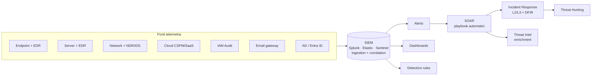

# Blue team: SOC, SIEM, EDR, hunting

> Difendere richiede sapere tutto quello che gli attaccanti sanno **più** capire come trasformare quella conoscenza in detection sostenibile, scalabile, low-false-positive.

## L'architettura di un SOC



- **EDR** (Endpoint Detection and Response): agent sull'endpoint che logga eventi (Sysmon-like) + risponde (kill processo, isolate). CrowdStrike Falcon, SentinelOne, Microsoft Defender for Endpoint, Cybereason, Sophos.
- **NDR** (Network Detection and Response): sniff/Zeek/ML su traffico. ExtraHop, Vectra, Darktrace.
- **SIEM** (Security Information and Event Management): aggregate log, query, correlate, alert. Splunk, Elastic Security, Microsoft Sentinel, IBM QRadar, Chronicle.
- **XDR**: combinazione vendor di tutti i sopra in piattaforma unica.
- **SOAR**: playbook di response automatici. Tines, Splunk SOAR, XSOAR.

## I "tier" del SOC

| Tier | Skill | Cosa fa |
|---|---|---|
| **L1** Analyst | Junior | Triage alert, escalation, doc playbook |
| **L2** Analyst | Mid | Investigazione, contestualizzazione, basic hunt |
| **L3** Analyst | Senior | Threat hunting, detection engineering, IR lead |
| **Detection Engineer** | | Scrivere rule SIEM, tuning, telemetria |
| **Threat Intelligence** | | TI / report / TTP mapping |
| **SOC Manager** | | gestione, metriche, escalation business |

## SIEM 101

Un SIEM ha:
- **Collectors / Forwarders** (es. Splunk Universal Forwarder, Filebeat, Winlogbeat, Logstash agents).
- **Parsing & Enrichment**: timestamp parse, GeoIP, threat feeds.
- **Index/Storage**.
- **Search language**: SPL (Splunk), KQL (Sentinel/Defender), EQL (Elastic), LogQL (Loki).
- **Detection rules**: scheduled saved searches → alert.

### Esempio SPL (Splunk)
```spl
index=windows EventCode=4624 LogonType=3
| stats count by user, src
| where count > 50
```

Login type 3 (network) > 50 in fascia. Anomalia / lateral movement.

### Esempio KQL (Sentinel/Defender)
```kql
DeviceProcessEvents
| where Timestamp > ago(1d)
| where FileName == "powershell.exe"
| where ProcessCommandLine has_any ("-EncodedCommand", "-enc", "FromBase64")
| project Timestamp, DeviceName, AccountName, ProcessCommandLine, InitiatingProcessFileName
```

### Esempio EQL (Elastic)
```eql
process where process.name == "powershell.exe" and process.command_line : "*EncodedCommand*"
```

## Sigma — scrivere una volta, deploy ovunque

Sigma è il formato YAML neutro. Converti per il tuo SIEM via `sigma convert`.

```yaml
title: Suspicious WMIC LOLBin
id: ...
status: experimental
logsource:
    category: process_creation
    product: windows
detection:
    selection:
        Image|endswith: '\wmic.exe'
        CommandLine|contains|all:
            - 'process'
            - 'call create'
    condition: selection
level: high
tags:
    - attack.execution
    - attack.t1047
```

Repo: [SigmaHQ/sigma](https://github.com/SigmaHQ/sigma) ha migliaia di rule community.

## Telemetria che ti serve

**Su Windows endpoint:**
- Sysmon con config decente (SwiftOnSecurity, Olaf Hartong sysmon-modular).
- PowerShell ScriptBlock logging (event 4104).
- Process Command Line auditing (4688 con cmdline).
- WMI Activity log.
- Defender event log.

**Su Linux endpoint:**
- auditd o Sysmon for Linux.
- Falco / Tetragon (eBPF).
- journald.

**Server / cloud:**
- Auth / IAM events.
- DNS query (Pi-hole, Cloudflare logpush, Azure DNS analytics).
- Network: Zeek / Suricata IDS / firewall logs.
- Email: O365 audit log (Mailbox audit), Gmail Workspace events.
- Identity: Azure AD sign-in logs, Okta, Auth0.

## Detection engineering — pratica

Il ciclo:
1. **Threat modeling**: quali TTP rilevanti per il mio business? (es. ransomware, BEC, supply chain).
2. **Hunting hypothesis**: "Se l'attaccante facesse X, vedrei Y in log Z".
3. **Telemetria**: ho Z? log abilitato? retention sufficient?
4. **Query**: scrivi e testa.
5. **False positive tuning**: niente alert su attività legittima.
6. **Alert + playbook**: cosa fa il L1 quando scatta?
7. **Atomic Red Team**: test simulato per validate detection.
8. **Document**: tag MITRE, runbook, owner.

### Atomic Red Team
Suite di "atomic test" di MITRE ATT&CK techniques. Esegui un test → la tua detection lo vede?

```powershell
git clone https://github.com/redcanaryco/atomic-red-team
Import-Module .\invoke-atomicredteam\Invoke-AtomicRedTeam.psd1 -Force
Invoke-AtomicTest T1059.001 -ShowDetails
Invoke-AtomicTest T1059.001-1                # esegue test 1
```

## Threat hunting

Hunt = ricerca proactive di TTP che il SIEM non sta ancora alertando.

### Hunt ipotesi (Esempi)
- "C'è un beacon Cobalt Strike camuffato in HTTPS in uscita?" → cerca jitter regolare, JA3 fingerprint specifici, URI noti.
- "Qualcuno ha fatto AS-REP roasting nelle ultime 30g?" → Sysmon event 4768 con encryption RC4 + flag UF_DONT_REQUIRE_PREAUTH.
- "Esecuzioni da Word con macro?" → process create cmdline `winword.exe` → child `cmd.exe`/`powershell.exe`.
- "Service account che logga interattivo?" → 4624 LogonType=10 (RemoteInteractive) con account di servizio.

### Tecniche di hunt
- **Stack counting**: aggregati di valori rari (es. parent-child rari).
- **Outliers** (UEBA): comportamento utente vs baseline.
- **Time-series anomaly**: spike inattesi.
- **Threat intel matching**: IOC vs dato locale.
- **Beacon detection**: regular interval connection.

## Deception

Honeypot e honey-token: oggetti finti che non dovrebbero mai essere toccati. Quando lo sono → alert ad alta confidenza.

- **Canary file** in posizione strategica (es. `passwords.xlsx` in share).
- **Canary token** ([canarytokens.org](https://canarytokens.org)) gratuito: file/URL/DNS che notificano quando aperti.
- **Honeyusers** in AD (con SPN appositamente per essere Kerberoasted).
- **Honeypots completi** (T-Pot di DLR — distributing).

Deception ha rapporto signal-to-noise altissimo.

## EDR — cosa fa davvero

EDR moderno:
1. Hook kernel-mode o user-mode per intercettare eventi (process create, image load, file write, network).
2. Telemetria upstream a cloud.
3. Detection in-cloud con ML e regole.
4. Response: kill, quarantine, isolate, rollback (alcuni hanno).

Bypass red team:
- **BYOVD** (driver vulnerabile firmato per disable EDR).
- **DLL unhooking** ripristina ntdll fresh.
- **Direct syscall** per evitare user-mode hook.
- **Process injection esoterico** (Process Doppelgänging, Threadless Inject, Notification Phantom).
- **DKOM**, **token swap kernel**.

Blue team: l'EDR è "uno" strato. Senza Sysmon/audit affidamento totale = SPOF.

## SOAR — automatizzare la risposta

Playbook:
- **Alert phishing**: estrai email, sandbox link, sandbox attachment, lookup TI, se malicious → quarantena + ban sender + email utente.
- **Alert credenza compromessa**: revoca token, force password reset, isolate device, notifica IT.

Tool: Tines, XSOAR, Splunk SOAR, Sentinel Logic Apps, Shuffle (open source).

## Metriche del SOC

- **MTTD** (Mean Time to Detect).
- **MTTR** (Mean Time to Respond).
- **Alert volume**, false positive ratio.
- **Coverage MITRE ATT&CK** (matrix-based reporting).
- **Detection efficacy**: rule che hanno catturato vero positivo / totale.

Per non far morire i L1: tuning continuo, focus su quality > quantity.

## Esercizi

### Esercizio 23.1 — Detection Lab
[Detection Lab](https://github.com/clong/DetectionLab) di Chris Long: stack pre-configurato Splunk + Sysmon + GPO Velociraptor + Caldera. Vagrant + VirtualBox o cloud. Setup local.

### Esercizio 23.2 — Sysmon config + first detection
Installa Sysmon con sysmon-modular su una Win10. Lancia `whoami` da `cmd.exe`. Verifica event 1 in Event Viewer. Scrivi SPL/KQL/EQL che cattura l'esecuzione.

### Esercizio 23.3 — Atomic Red Team + detection
Esegui Atomic test T1059.001-1 (PowerShell base64 decoded). Verifica:
- Defender lo blocca? (se sì → disable per test).
- Sysmon evento 1 / 4104 esiste?
- La tua Sigma rule scatta?

### Esercizio 23.4 — Sigma → Splunk
Pick una rule dal repo SigmaHQ. Convert con sigma-cli a SPL. Falla girare in lab. Risultato?

### Esercizio 23.5 — Hunt: Cobalt Strike beacon
Cerca su risorse pubbliche (DFIR Report) come si manifesta un beacon CS:
- Default named pipe `\\.\pipe\msagent_*`.
- JARM fingerprint.
- Default URI pattern.

Scrivi 1 query Sigma/Splunk/KQL per ognuno.

### Esercizio 23.6 — Canary token
Crea token DNS+URL su canarytokens.org. Mettilo in una share/file. Aspetta che qualcuno lo apra (o aprilo tu da altra macchina). Quanto tempo passa? Email arriva?

### Esercizio 23.7 — TryHackMe Cyber Defense / SOC Level 1
TryHackMe ha intero path **SOC Level 1**. Eccellente per L1 prep.

### Esercizio 23.8 — Build a SIEM (mini)
Installa Wazuh (ELK-based, open source) o ELK stack:
- Ingestion logs da una Linux VM.
- Index pattern.
- Una rule semplice (failed login > N).

### Esercizio 23.9 — MITRE ATT&CK Navigator
Vai su [mitre-attack.github.io/attack-navigator](https://mitre-attack.github.io/attack-navigator/). Mappa la coverage delle tue rule (se hai un set reale). Quale tactic ha più gap?

## Concetti chiave

1. **Senza telemetria niente detection.**
2. **Sysmon + PowerShell ScriptBlock + auditd + EDR + cloud audit** = baseline.
3. **Sigma** è il linguaggio comune di detection.
4. **Atomic Red Team** valida le tue regole.
5. **Hunt è ipotesi-driven**, non tool-driven.
6. **Deception** ha signal:noise eccezionale.
7. **MITRE ATT&CK Navigator** ti dà la mappa.

Avanti: threat intelligence.
