# GRC, normative e standard

> Governance, Risk, Compliance. Non scriverai exploit, ma deciderai cosa proteggere, quanto investire, come dimostrarlo. È la parte che paga gli stipendi degli altri (security manager, CISO, audit).

## Governance, Risk, Compliance — cosa significano

- **Governance**: chi decide cosa fa l'organizzazione in security? Struttura, policy, ruoli, board responsibility.
- **Risk management**: identifica, valuta, tratta rischi. ISO 31000.
- **Compliance**: rispetto di leggi (GDPR, NIS2), standard contrattuali (PCI), certificazioni (ISO 27001).

I tre si toccano: governance imposta il framework di risk, che produce decisioni che devono essere compliant.

## Risk management 101

### Vocabolario
- **Asset**: ciò che ha valore (dati, sistema, persone).
- **Threat**: ciò che potrebbe causare danno (attaccante, errore, natura).
- **Vulnerability**: una debolezza nell'asset.
- **Impact**: danno potenziale (CIA — Confidentiality, Integrity, Availability).
- **Likelihood**: probabilità.
- **Risk = Likelihood × Impact**.

### Trattamento
- **Mitigate**: ridurre likelihood/impact (controlli tecnici/organizzativi).
- **Transfer**: assicurazione, outsourcing.
- **Accept**: rischio residuo accettato, documentato e firmato.
- **Avoid**: non fare l'attività rischiosa.

### Risk register
Tabella: ID, asset, threat, vuln, impact, likelihood, score, owner, mitigation, status.

## ISO/IEC 27001 + 27002

**ISO 27001** è la **norma certificabile** per gestione della sicurezza delle informazioni (ISMS — Information Security Management System).

- Approccio basato su rischio.
- Plan-Do-Check-Act (PDCA).
- Certificazione tramite audit di organo accreditato (ogni 3 anni con sorveglianza annuale).

**Struttura ISO 27001:2022:**
- Sezioni 4-10 (clausole obbligatorie): contesto, leadership, planning, support, operations, performance evaluation, improvement.
- Annex A: 93 controlli (in 4 macro-temi: Organizational, People, Physical, Technological).

**ISO 27002:2022** è il "manuale" che spiega in dettaglio ognuno dei 93 controlli.

Esempi di controlli:
- 5.1 Policies for information security.
- 5.7 Threat intelligence.
- 5.23 Information security for use of cloud services.
- 8.7 Protection against malware.
- 8.16 Monitoring activities.
- 8.28 Secure coding.

Aziende che gestiscono dati di clienti (B2B) spesso lo richiedono come pre-requisito.

## NIST Cybersecurity Framework (CSF) 2.0

US NIST. Open, gratuito. Volume di adozione anche fuori USA.

CSF 2.0 (Feb 2024) — sei funzioni:

```mermaid
flowchart LR
    GV([GOVERN<br/>leadership · ruoli · policy<br/>strategic risk]) --> ID([IDENTIFY<br/>asset · threat · vuln])
    ID --> PR([PROTECT<br/>controlli<br/>preventivi])
    PR --> DE([DETECT<br/>monitoraggio<br/>continuo])
    DE --> RS([RESPOND<br/>incident response<br/>contenimento])
    RS --> RC([RECOVER<br/>business continuity<br/>lessons learned])
    RC -.-> ID
    style GV fill:#3a2a00,stroke:#ffe066,stroke-width:3px
    style PR fill:#0b3a1a,stroke:#00ff9c
    style DE fill:#11171a,stroke:#00e6ff
    style RS fill:#3a0b0b,stroke:#ff4d4d
    style RC fill:#0b0f10,stroke:#ff3da6
```

1. **Govern** (nuova in 2.0): leadership, role, risk.
2. **Identify**: asset, threat, vulnerability.
3. **Protect**: controlli preventivi.
4. **Detect**: monitoraggio.
5. **Respond**: incident response.
6. **Recover**: business continuity, lessons learned.

Per ognuna: categorie e subcategorie con outcome ("PR.AC-01: Identities and credentials are issued, managed...").

CSF mappa a ISO 27001/2, CIS Controls, NIST 800-53. Usato come "lingua franca" per allineare program.

## NIST 800-53 (USA federal)

Catalogo di **1100+ controlli** per US federal information systems. Highly granular. Famiglie: AC (access control), AU (audit), CM (config management), ...

US gov + contractor.

**Profile Low/Moderate/High** basati su FIPS 199 categorizzazione.

## CIS Controls v8.1

Center for Internet Security. **18 controlli prioritizzati** per "fare le cose importanti per prime". Pragmatico.

Top 5 ("Basic"):
1. Inventory of Enterprise Assets.
2. Inventory of Software Assets.
3. Data Protection.
4. Secure Configuration of Enterprise Assets and Software.
5. Account Management.

CIS Benchmarks (config baseline per OS/app) sono separati ma complementari (es. CIS for Ubuntu, Windows, Kubernetes, AWS).

## NIS2 (UE)

**Direttiva (UE) 2022/2555**, recepita in IT con D.Lgs. 138/2024. In vigore.

- Estende NIS (2016) a molti più settori (cresciuti da 5 a 18, "essential" e "important entities").
- Pillars: governance, risk management, incident reporting (24h early warning, 72h notification), supply chain security, vulnerability disclosure.
- Obblighi specifici: MFA, crittografia, incident reporting, training.
- Sanzioni: fino a 10M€ o 2% turnover (essential), 7M€/1.4% (important).
- ACN (Agenzia per la Cybersicurezza Nazionale) è autority IT.

**Entrare nel perimetro NIS2 in IT**: registrazione tramite portale ACN. Obbligo già dal 2024.

## GDPR (Regolamento (UE) 2016/679)

Già visto come legge privacy. Per security:
- **Art. 32**: misure tecniche e organizzative adeguate al rischio (pseudonimizzazione, cifratura, capacità di ripristino).
- **Art. 33**: notifica violazione al Garante entro 72h.
- **Art. 34**: notifica agli interessati se alto rischio.
- **DPO** (Data Protection Officer) in alcuni casi obbligatorio.
- **DPIA** (Data Protection Impact Assessment) per trattamenti ad alto rischio.

Sanzioni: 20M€ o 4% fatturato globale (greater of).

## DORA (Digital Operational Resilience Act)

**Regolamento (UE) 2022/2554**. Applicazione dal **17 gennaio 2025** per il settore **finanziario** UE.

5 pillars:
1. ICT Risk Management.
2. ICT incident classification & reporting.
3. Digital operational resilience testing (incluso TLPT — Threat-Led Penetration Testing).
4. Third-party risk management.
5. Information sharing.

Obblighi su contratti con fornitori cloud / IT, TLPT triennale per "significant" institutions, registrazione contratti.

## PCI-DSS 4.0

Payment Card Industry Data Security Standard. Per chi processa/store/trasmette dati di carte. **Contrattuale** (non legge), ma le banche/network (Visa, Mastercard) lo impongono.

12 requirements alti livello, ~300 sub-requirements:
- segmentazione rete (CDE — Cardholder Data Environment).
- vulnerability management.
- access control restrictivi (need-to-know, MFA su admin).
- monitoring (Req 10).
- pen test annuale, ASV scan trimestrale.

Versione 4.0 (effective March 2024) ha "future-dated" requirements (target 2025+) molto più restrittivi (MFA ovunque sul CDE, anti-phishing technical control, ...).

## SOC 2 (AICPA)

Standard americano per service organization. **5 Trust Service Criteria** (TSC):
- Security (mandatory).
- Availability.
- Processing Integrity.
- Confidentiality.
- Privacy.

Type I = punto nel tempo. Type II = effectiveness su periodo (3-12 mesi).

Audit da CPA accreditati. Tipico requisito B2B in USA.

## HIPAA (USA, healthcare)

Health Insurance Portability and Accountability Act. Settore sanitario USA. Security Rule + Privacy Rule. PHI (Protected Health Information).

## Altri da conoscere
- **ISO 22301** business continuity.
- **ISO 27017/27018** cloud / cloud privacy.
- **ISO 27701** privacy info management.
- **OWASP ASVS / MASVS** application/mobile security verification standard.
- **NIST SP 800-171** controlled unclassified info (per US gov contractor).
- **CCPA / CPRA** (California).
- **LGPD** (Brasile).
- **PIPL** (Cina).
- **Common Criteria** (ISO 15408) per evaluation prodotti.
- **NIS2-correlati**: per IT Tlc → AGCom; per energia → ARERA.
- **Cyber Resilience Act** (UE, 2024) — product safety per prodotti con elementi digitali.

## Threat modeling — STRIDE

Approccio di Microsoft. Per ogni componente di un sistema:

| Lettera | Categoria | Esempio |
|---|---|---|
| **S**poofing | Identità falsa | Login altrui con cookie rubato |
| **T**ampering | Modifica dati | Bit flip in transito |
| **R**epudiation | Negazione di azione | Manca log |
| **I**nformation Disclosure | Leak | Dati nei response |
| **D**enial of Service | Inaccessibilità | Resource exhaustion |
| **E**levation of Privilege | Privesc | User → admin |

Approccio:
1. Disegna il system con DFD (data flow diagram), trust boundaries.
2. Per ogni componente/flow, applica STRIDE.
3. Identifica threats, mitigation, residual risk.

Tool: **Microsoft Threat Modeling Tool**, **OWASP Threat Dragon**, **pytm**.

Altri framework: **PASTA** (process-oriented), **OCTAVE**, **VAST** (agile-friendly), **Trike**.

## DevSecOps — building security in

- **Shift left**: security in design (threat model) + coding (SAST + IDE plugin) + build (SCA, SBOM) + test (DAST) + deploy (signed artefact) + run (RASP, EDR, runtime detection).
- **Pipeline gates**: niente merge se SAST high. Niente deploy se signature mancante.
- **Policy as Code**: OPA / Kyverno / Sentinel.
- **Infrastructure as Code** security: Terraform scanner (tfsec, Checkov).
- **Production monitoring**: feature flag rollout, security canaries.

## Costruire un programma di security (in piccolo)

Per chi parte da zero (es. SMB):

1. **Asset inventory** — non puoi proteggere ciò che non sai di avere.
2. **Identity** — MFA ovunque, SSO se possibile.
3. **Endpoint** — EDR + patch.
4. **Email** — gateway anti-phishing + DMARC, DKIM, SPF.
5. **Backup 3-2-1-1-0** (3 copie, 2 media, 1 offsite, 1 offline, 0 errori).
6. **Network segmentation** baseline.
7. **Logging centralizzato** (anche piccolo SIEM Wazuh/ELK).
8. **Awareness training** annuale + phishing simulation.
9. **Incident response plan** anche di 5 pagine.
10. **Cyber insurance** (se appropriato).

CIS Controls v8 implementation group 1 (IG1) è il "minimum" — 56 safeguard.

## Esercizi

### Esercizio 25.1 — Risk register fittizio
Per una piccola società di e-commerce: identifica 10 rischi (asset / threat / vuln) e proponi mitigation. Score 1-5 likelihood/impact.

### Esercizio 25.2 — Mappa CSF
Sulla tua organizzazione (o ipotetica), mappa le funzioni CSF 2.0 (Govern → Recover) e identifica gap.

### Esercizio 25.3 — STRIDE su web app
Disegna DFD di una webapp con: utenti, app server, DB, S3 storage. Applica STRIDE per ogni flusso. Per 3 minacce, propone controlli.

### Esercizio 25.4 — Leggi e riassumi
Scegli **uno**: NIS2 (D.Lgs. 138/2024), GDPR Art. 32-34, DORA pillars. Riassumi in 1 pagina cosa significa per security team.

### Esercizio 25.5 — Audit CIS Controls
Scarica CIS Controls v8.1 (gratuito). Per la tua org / lab, fai self-assessment IG1: quanti safeguard hai? Quanti mancano?

### Esercizio 25.6 — Pen test report — la prospettiva GRC
Trova un report pen test pubblico (es. di [Foxglove Security](https://foxglovesecurity.com), [PenTestPartners](https://www.pentestpartners.com)). Identifica:
- Executive summary.
- Methodology.
- Findings con CVSS.
- Recommendations.
- Re-test plan.

Quanti finding sono "tecnici" vs "governance"?

### Esercizio 25.7 — Awareness budget exercise
Hai 50k€/anno budget security per una società di 100 dipendenti zero strumenti pre-esistenti. Allocali. Giustifica.

## Concetti chiave

1. **Risk = Likelihood × Impact**; tratta, non sopprime.
2. **ISO 27001** = framework certificabile; **NIST CSF** = framework strategico.
3. **NIS2 + GDPR + DORA** sono il backbone normativo UE 2025.
4. **PCI-DSS, SOC 2, HIPAA** = settoriali / contrattuali.
5. **CIS Controls** = "fai prima queste cose" — pragmatico.
6. **STRIDE** = entry-level threat modeling.
7. **DevSecOps**: la security build-in nel ciclo, non un controllo finale.

Avanti: red team e adversary emulation.
