# Red team e adversary emulation

> Red team non è "pen test più lungo". È **emulazione di una minaccia reale** contro l'intera organizzazione, **inclusi processi e blue team**, con scopo di misurare la difesa end-to-end.

## Pen test vs red team vs purple team

| | Pen test | Red team | Purple team |
|---|---|---|---|
| **Obiettivo** | Trovare vuln tecniche | Misurare difesa contro avversario | Migliorare iterativamente detection |
| **Scope** | Sistema/applicazione | Intera org | Specifico scenario |
| **Awareness blue team** | Spesso a conoscenza | Non a conoscenza | Coordinato |
| **OPSEC** | Limitata | Massima | Trasparente |
| **Output** | Lista vuln + remediation | TTP + dwell time + crown jewel reach | Detection gap + fix |
| **Durata** | 1-3 settimane | 1-3+ mesi | Continuous / sprint-based |

In molte org, "red team" è un team interno che fa esercizi periodici. In altre, ingaggi un vendor specializzato (Mandiant, Bishop Fox, NCC Group, F-Secure/WithSecure, MDSec).

## Engagement lifecycle

```mermaid
flowchart TB
    SC[1. Scoping<br/>business objective] --> ROE[2. Rules of Engagement<br/>contratto · IP · timing]
    ROE --> TM[3. Threat modeling<br/>quale APT emulare?]
    TM --> INF[4. Infrastructure<br/>C2 · redirector · payload]
    INF --> REC[5. Recon esterno<br/>OSINT + active]
    REC --> INI[6. Initial Access<br/>phish · vuln · supply chain]
    INI --> FOO[7. Foothold<br/>persistence iniziale]
    FOO --> INT[8. Recon interno<br/>BloodHound · manual]
    INT --> LAT[9. Privesc + Lateral<br/>AD attacks · pivoting]
    LAT --> AOO[10. Action on Objective<br/>raggiungere crown jewel]
    AOO --> MUL[11. Multi-channel persistence]
    MUL --> REP[12. Reporting<br/>timeline · ATT&CK Nav · biz impact]
    style INI fill:#11171a,stroke:#00e6ff
    style LAT fill:#3a2a00,stroke:#ffe066
    style AOO fill:#3a0b0b,stroke:#ff4d4d
    style REP fill:#0b3a1a,stroke:#00ff9c
```



1. **Scoping**: business objective ("possiamo violare dati X?"), constraints (host/segmenti off-limits, ore lavorative, comunicazione).
2. **Rules of Engagement (RoE)**: documento contrattuale firmato. Include white card escalation, contatti emergency, IP whitelist se necessari, modalità di disclosure.
3. **Threat modeling**: quale gruppo emulare? TTP mappati ad ATT&CK.
4. **Infrastructure prep**: C2, redirector, payload, social engineering pretext.
5. **Recon**: OSINT + active recon (sezioni 8/9).
6. **Initial access**: phishing, exposed vuln, supply chain simulation.
7. **Foothold**: persistenza, opsec.
8. **Recon interno**: BloodHound, manual, low-noise.
9. **Privilege escalation, lateral movement**: AD attacks, pivoting.
10. **Action on objective**: raggiungere obiettivo (file, transfer, IP, …) **senza** esfiltrare davvero.
11. **Persistence multi-canale**.
12. **Reporting**: timeline, TTPs vs detection (cosa ha visto il blue team), business impact, recommendations.

## OPSEC operativa

Pensa come un APT realistico:

- **Infrastruttura**: domini con storia (aged), categorize, registrati con email pulite, cert validi (LE), hosting "innocuo" (DigitalOcean, AWS).
- **Redirector chain**: traffico passa per Nginx/Apache reverse proxy → CDN → tea server C2. Se redirector è burnt, il C2 sopravvive.
- **Malleable C2 profile**: configura beacon traffic per somigliare a profile innocui (Microsoft Teams API, Slack, Office 365).
- **Domain fronting** (limitato) o **High-Reputation Domains**.
- **Payload delivery**: phishing realistic; sostituisce macro storico con LNK + side-loading, HTML smuggling, ISO/IMG containing LNK+DLL, OneNote, ClickOnce.
- **Sleep + jitter**: beacon ogni 1-4 ore con jitter 30%. Bassa frequenza = bassa visibilità.
- **Daytime traffic only**: matcha orari lavorativi della vittima.
- **No backup C2** = no good. Pianifica failover.

### EDR evasion (cenni)

- **Indirect / direct syscall**: Hell's Gate, Halo's Gate, FreshyCalls, Tartarus.
- **Unhooking**: ricaricare ntdll fresh, system call number resolution.
- **AMSI bypass**: patch `AmsiScanBuffer`.
- **ETW bypass**: patch `EtwEventWrite` o disabilitare provider.
- **Process injection moderno**: APC, Threadless inject (vedi MDsec), DLL sideloading via signed binary.
- **BYOVD** (es. Lazarus' FudModule, Avoslocker' aswSnx).
- **Stealth execution** in legitimate process (notepad), reflective DLL.

Combinato con uffici di settore (Maldev Academy, OST courses).

> **Etica**: tutto questo solo in red team autorizzato, con ROE firmato.

## C2 framework

### Open source

- **Sliver** (BishopFox): Go, multi-stage, mTLS o WireGuard, scriptable Python. **Default top scelta open source nel 2026**.
- **Mythic**: modulare, multi-implant (Apollo C#, Athena, Poseidon Go), C2 profile pluggable. Eccellente per teaming.
- **Havoc** (C5pider): C++/Go, demone reflective, focus su evasion moderna.
- **Empire / Starkiller**: PowerShell-heavy (e.g. legacy), morto e rianimato.
- **Covenant**: .NET focused.

### Commerciale

- **Cobalt Strike** (Fortra): standard industria. Profili Malleable C2. Costoso (~6k$/anno).
- **Brute Ratel C4** (Chetan Nayak): EDR-aware, focus su evasione.
- **Nighthawk** (MDSec): commercial, premium.
- **PowerShell Empire** (deprecato).

### Stage del payload
1. **Stager** (piccolo, scarica stage successivo).
2. **Stage** (beacon completo, persistente).
3. **In-memory only**: niente disk artifact.
4. **Reflective loading**: DLL caricata senza `LoadLibrary`.

Tool di obfuscation/packing per payload: **Donut** (PIC shellcode da .NET/EXE), **SGN** (Shikata Ga Nai polymorphic encoder), **Bunkr**, **NimGuardKit**, custom packer.

## Initial access pattern moderni

### Phishing
- **Microsoft 365 Adversary in the Middle** (Evilginx, Modlishka): proxy phishing che ruba session token bypassando MFA.
- **Browser-in-the-Browser** (BITB) UI phishing.
- **OAuth illicit consent**: app malevola con scope intrusivi → "consent" social engineering.
- **Device code phishing** (Entra ID).

### Phishing payload trends (2024-2026)
- **HTML smuggling**: HTML allegato a email → JS in pagina ricostruisce file (ISO/ZIP) localmente, bypass mail filter.
- **LNK / SVG / OneNote** con script.
- **ContainerFile (ISO/IMG/VHD)**: mount-of-Windows-bypassa MOTW (mark of the web). Microsoft ha mitigato.
- **Bitbucket/Github/Cloud abuse**: payload hosted in trusted CDN.

### Email config
- **DMARC, DKIM, SPF** dell'avversario impostati correttamente.
- **Lookalike domain** (`example-eu.com`).
- **VOIP callback** (callback phishing).

## Post-exploit moderna

- **Stealthy AD recon**: SharpHound `--CollectionMethods DCOnly` (no SMB session, no LDAP heavy query).
- **Print Spooler avoidance**: trigger forced auth via WebDAV, MS-EFSRPC (PetitPotam), MS-FSRVP.
- **NTDS dump remoto**: `secretsdump.py -dc-ip ... -just-dc admin@dc`.
- **Token impersonation**: Rubeus, SharpRoast.
- **Lateral movement low-noise**: WMI, DCOM, WinRM (5985) preferiti a PsExec (più noisy).
- **AD-CS abuse** (vedi sezione 13).

## Reporting executive

Output finale di red team include:

- **Executive summary** (1-2 pagine, NO jargon).
- **Engagement narrative** (storia chronological).
- **TTPs mapped to ATT&CK + Navigator layer**.
- **Detection gaps**: cosa hanno visto / non visto.
- **Crown jewels reached**: oggetti raggiunti, prova.
- **Recommendations**: tattiche (detection rule), strategiche (architettura).
- **Timeline detection** (heatmap): per ogni stage, blue team ha detect/respond/contain?

## Purple team

Esercizi coordinati red+blue. Si simula un TTP, si verifica se la rule scatta, si tuna. Process iterativo.

Tool: **Caldera** (MITRE) automation, **Atomic Red Team** test atomici, **Vectr** tracking platform.

## Tradecraft contemporaneo

Trend visibili nel 2024-2026 attacchi reali:
- **Identity-centric attacks** (Snowflake, M365): credential stuffing + MFA fatigue + token theft → cloud breach senza endpoint malware.
- **Living off the cloud** (LOC): solo cloud-native tool nell'attacco, niente binari custom su endpoint.
- **Supply chain ramificato** (3CX, SolarWinds, MOVEit, XZ-utils backdoor 2024).
- **Ransomware-as-a-Service** (RaaS) ecosystem: affiliate program (LockBit before takedown, BlackCat, Akira).
- **Initial Access Broker (IAB)** market separato dal ransomware affiliate.
- **OT/IoT targeting** (Volt Typhoon US infrastructure).
- **AI-augmented social engineering**: voice cloning, deepfake CEO call.
- **AI red teaming** sui prodotti dei vendor (vedi sezione 27).

## Esercizi

### Esercizio 26.1 — Setup Sliver lab
```bash
# Server
curl https://sliver.sh/install | sudo bash
sliver-server
> generate --mtls --save .
# Client
> implants
# Trigger su VM Windows controllata
```

### Esercizio 26.2 — Caldera adversary emulation
[Caldera](https://github.com/mitre/caldera). Setup. Esegui un piano pre-fatto (es. APT29). Vedi cosa cattura il tuo Sysmon/SIEM.

### Esercizio 26.3 — Phishing simulation (in lab)
**Solo su tua identità o lab.**
- GoPhish o King Phisher.
- Template clone di login Microsoft / Google.
- Lancia self-phishing. Quanto è convincente? Quanto è facile rilevarlo (DMARC, SPF, header)?

### Esercizio 26.4 — Malleable C2 profile
Per Sliver/Mythic/CobaltStrike (se hai accesso), profila C2 traffic per somigliare a:
- Microsoft Teams polling.
- Slack webhook.
- O365 outlook sync.

Setup Wireshark + analisi. Quale signature potrebbe distinguerlo?

### Esercizio 26.5 — Purple exercise
Sul tuo lab AD:
1. Lancia AS-REP Roast (Rubeus).
2. Vedi event 4768/4769 nel DC.
3. Scrivi Sigma rule per detection.
4. Riguardia con `--enctype rc4` vs `--enctype aes256` — differenza?
5. Re-test.

### Esercizio 26.6 — Read & emulate
Pick uno dei [Adversary Emulation Plans](https://github.com/center-for-threat-informed-defense/adversary_emulation_library):
- FIN6, FIN7, OilRig, APT29, Wizard Spider.

Esegui step-by-step in lab. Quanti step il blue team detect?

### Esercizio 26.7 — Read books / OSEP
- **Red Team Field Manual** (Clark) — pocket reference.
- **Operator Handbook** (Netmux).
- "Red Team Operations" course (Zero-Point Security CRTO 1 e 2).
- OSEP (Offensive Security Experienced Penetration Tester) cert.

## Concetti chiave

1. **Red team ≠ pen test**: scope full org, OPSEC alta, misura **detection** e **response**.
2. **ROE firmate sempre**.
3. **C2 framework + redirector + malleable** = infrastruttura realistica.
4. **EDR evasion** è un'arte, ma su engagement reale spesso non serve LOLBins/identity attack bastano.
5. **Purple team accelera** il miglioramento di detection.
6. **ATT&CK Navigator** è output naturale.
7. **Reporting executive**: pochi numeri, storie, raccomandazioni.

Avanti: AI e ML security — il futuro / presente.
