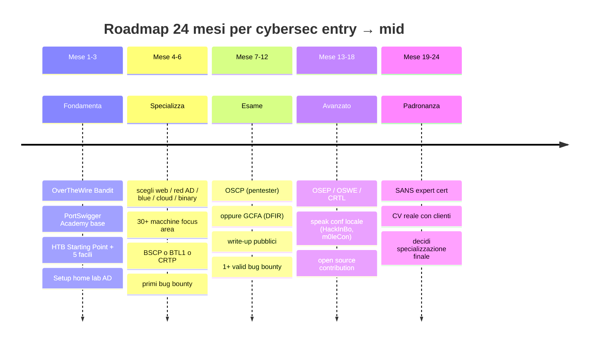

# Capstone: CTF roadmap, home lab, certificazioni

## Dove sei e dove andare

Hai letto 27 sezioni. **In teoria** sai cosa esiste in cybersecurity. **In pratica** sei un principiante competente che ha letto un'enciclopedia. Per diventare esperto serve **fare**: ore di esercizio, prove, fallimenti, ripetizione.

Questa sezione ti dice come strutturare i prossimi 6, 12, 24 mesi.

## La roadmap suggerita (12-24 mesi)



### Mese 1-3 — Fondamenta solide
- Completa **OverTheWire Bandit** (livelli 1-30).
- Completa **PortSwigger Web Security Academy** (passa per tutti i moduli base).
- 10 macchine **HackTheBox Starting Point** + 5 facili.
- Setup **home lab AD** (vedi sezione 13).
- Comincia a scrivere **write-up**. Tuo, anche se sintetici. Su Notion / blog / Git.

### Mese 4-6 — Specializzazione iniziale
Scegli **una** strada (non tre). Web, Red AD, Blue/SOC, Cloud, Mobile, Binary.

Per **Web**:
- 30+ macchine HTB / TryHackMe focus web.
- Completa **PortSwigger** anche moduli avanzati.
- Burp Suite Certified Practitioner (**BSCP**): cert pratica, esame stile real-world. 200€.
- Bug bounty: scegli 1 programma, leggi tutti i write-up degli ultimi 6 mesi sulla piattaforma, prova.

Per **AD / Internal pentest**:
- TryHackMe path "Offensive Pentest" e "Wreath".
- HTB Pro Lab "Dante" o "Offshore".
- Studio **CRTO** (Zero-Point Security, ~360€) o **CRTP** (Pentester Academy).

Per **Blue team**:
- TryHackMe path "SOC Level 1".
- Detection Lab + Atomic Red Team.
- **Blue Team Level 1** (BTL1, Security Blue Team).
- **Splunk Power User** o Microsoft SC-200.

Per **Binary / Reversing**:
- pwn.college tutti i moduli base.
- Cryptopals Sets 1-3.
- Picoctf "Reverse" e "Pwn".
- Libro Yurichev "Reverse Engineering for Beginners".

Per **Cloud**:
- flaws.cloud, flaws2.cloud.
- HTB Pro Labs "Hephaestus" (cloud-focus).
- AWS SCS-C02 cert (Security Specialty).

### Mese 7-12 — Esame di settore + bug bounty
- **OSCP** (Offensive Security Certified Professional) — il "rite of passage". 1500€ + 90 giorni lab. Esame 24h pratico + report.
- Bug bounty: target dedicato, almeno 1 valid report.
- Continua write-up pubblici.

### Mese 13-18 — Avanzato
- Per offensive: **OSEP** (evasion + AD complex) o **OSWE** (web).
- Per AD: **CRTL** (Pentester Academy expert).
- Per reverse: **OSED** (exploit dev).
- Per cloud: vendor cert avanzate.
- Per blue: **GIAC** (GCFA, GNFA, GREM).

### Mese 19-24 — Padronanza
- Tier "expert" cert (SANS pricey).
- Conferenze come speaker.
- Open source contribution.
- CV reale con clienti / lavoro pagato.

## CTF — tipologie e formati

CTF = Capture The Flag. Sfida con "flag" (stringa) da trovare risolvendo problemi.

### Categorie classiche
- **Web** — vuln applicazioni web.
- **Pwn / Binary exploit** — buffer overflow, ROP.
- **Reverse Engineering** — disassembly crackme.
- **Crypto** — primitive deboli, padding oracle, math attack.
- **Forensics** — analisi pcap, memory, disk.
- **Stego** — info nascoste in file.
- **OSINT** — investigation pubblica.
- **Misc / Networking / Mobile / Hardware**.

### Formati
- **Jeopardy** (puntate per categoria, classifica per punti). Online, decine di player.
- **Attack & Defense** (A&D): ogni team ha servizi vulnerabili da difendere mentre attacca quelli altrui. Live (RuCTF/iCTF).
- **King of the Hill**: tutti contro tutti su una box.
- **Boot2root** (HTB / proving grounds): macchine intere, gain root.

### Piattaforme essenziali

| Piattaforma | Cosa offre |
|---|---|
| **HackTheBox** | macchine boot2root, fortresses, pro labs, prolab cloud, sherlocks (DFIR) |
| **TryHackMe** | room guidate, path strutturati, ottimo per iniziare |
| **PortSwigger Academy** | gratis, web focus, lab eccellenti |
| **picoCTF** | gratis, CMU/CTF junior, multi-cat |
| **OverTheWire** | wargame Bandit (Linux), Narnia, Leviathan |
| **root-me** | francese, vasta varietà |
| **pwn.college** | corso ASU, gratuito, esercizi profondi |
| **CryptoHack** | crypto-focused |
| **Hacker101** (HackerOne) | bug bounty oriented |
| **Vulnhub** | VM scaricabili in lab locale |
| **CTFtime** | calendario CTF mondiali, team ranking |

### Esempi di CTF live noti
- **DEF CON CTF** (Las Vegas, agosto).
- **PlaidCTF, Google CTF, Hack-A-Sat, Pwn2Own**.
- **m0leCon** (Torino, IT) — italiana ben fatta.
- **N3rdctf**, **ENOWARS**, **CSAW** (NYU).

## Bug bounty — come iniziare seriamente

### Piattaforme
- **HackerOne** — la più grande. Programmi pubblici e privati.
- **Bugcrowd** — alternativa.
- **Intigriti** — EU strong.
- **YesWeHack** — FR.
- **Open Bug Bounty** — per piccoli siti.

### Modalità realistiche per iniziare
1. **Studia 50+ write-up pubblici** sul tipo di bug che cerchi. Capisci pattern.
2. **Scegli un programma** con scope ampio e signal-to-noise alto (es. Atlassian, GitHub, GitLab, Shopify hanno report storici noti).
3. **Specializzati**: chi va a caccia di IDOR su API REST batte chi prova "tutto".
4. **Recon profondo** prima di toccare.
5. **Quality > quantity**: report scritti male = ban.

### Pagamenti tipici (2026)
- Low/Info: 0 (spesso non pagato).
- Medium: 100-500$.
- High: 500-3000$.
- Critical: 2000-20000$ (top programmi: 50k+).

Vivere di solo bug bounty è raro e duro. Spesso lo si combina con consulting / impiego.

## Costruire un home lab serio (resume)

Tre tier di lab:

**Tier base (gratuito, leggero):**
- VirtualBox + Kali + 1-2 target.
- DVWA / Juice Shop in Docker.

**Tier intermedio (qualche €):**
- Proxmox su un mini-PC vecchio.
- 5-10 VM (Kali + AD + 2 workstation + 1 Linux + 1 IoT lab).
- pfSense come router con regole.

**Tier avanzato (qualche centinaio €):**
- Server homelab (Dell R720 usato 200€ ebay).
- VLAN-aware switch.
- Wireless AP modificabile (OpenWRT).
- USB SDR + JTAG/CH341A kit.

**Pre-built**:
- **GOAD** (Game of Active Directory) — lab AD scriptabile.
- **DetectionLab** — Splunk + sysmon ready.
- **Vulhub** — Docker compose per CVE specifiche.

## Comunità e risorse continua

- **Twitter / Mastodon / Bluesky**: profili tipo Bishop Fox, SpecterOps, Mandiant, Trend Micro Research, Daniel Miessler, Tavis Ormandy, John Hammond, Tib3rius, ippsec.
- **Discord / Slack** ufficiali: HackTheBox, TryHackMe, Pentester Lab, Bug Bounty Hunters.
- **Reddit**: r/netsec (qualità alta), r/AskNetSec.
- **Conferenze IT**: m0leCon (Torino), HackInBo (Bologna), No Hat (Bergamo), HackInTheBox (vari), Code Blue, OffensiveCon.
- **Online lectures**: ippsec YouTube (HTB walkthrough), LiveOverflow, John Hammond, PwnFunction.
- **Newsletter**: Risky Business, tl;dr sec, Bleeping Computer, This Week in Security.
- **Podcast**: Risky Business (Patrick Gray), Darknet Diaries (Jack Rhysider), CyberWire.

## Carriera in Italia — pratica

### Stipendi reali 2026 (orientativi gross)
- **Junior SOC L1**: 24-32k.
- **Junior Pentester / SOC L2**: 30-42k.
- **Mid Pentester (3-5y)**: 40-55k.
- **Senior Pentester / Red Team (5-8y)**: 55-75k.
- **DFIR senior**: 50-80k.
- **AppSec / Cloud Sec mid**: 45-65k.
- **CISO / Security Architect**: 80-150k+.

### Cosa cercano effettivamente
- **OSCP** è quasi obbligatorio per pentester junior in Italia 2026.
- **Esperienza pratica documentata** (HTB Pro Lab completati, write-up) batte la sola laurea.
- **Inglese tecnico** è prerequisito (report, advisory, vendor).
- **Comunicazione scritta** (saper scrivere report leggibili) è sottovalutata da tutti e fa la differenza.

### Settori in IT che assumono
- Consulting: Accenture, Deloitte Cyber, KPMG, EY, PwC, NTT, Reply Communication Valley, Hwg Sababa, Var Group, P4I.
- Vendor / TLC: TIM, Vodafone, Wind3, Almaviva, Engineering, IBM.
- Industria / energia: ENI, Enel, Snam, Leonardo (defense), Saipem.
- Finanza: UniCredit, Intesa Sanpaolo, MPS, Generali, ING.
- Pure-play security: SecureFlag, P4I, Pikered, Yarix, Hackmanac, Telsy.
- ACN (Agenzia Cybersicurezza Nazionale) — concorsi pubblici.

### Quando candidarti
- Smettila di "studiare ancora 1 anno". Candidati a SOC L1 dopo aver finito la TryHackMe SOC L1 path.
- Per pentester junior senza esperienza: OSCP + 5 HTB Pro Lab + bug bounty validati = candidatabile.
- Apertura: junior in security paga MENO del corrispettivo dev. Lo recuperi in 2-3 anni se cresci.

## Errori comuni da evitare

1. **"Quando saprò tutto comincerò"**: mai. Comincia comunque.
2. **"Compro 5 cert e poi cerco"**: la cert senza esperienza pratica non vale.
3. **"Mi specializzo in tutto"**: impossibile. Specializzati in 1, conosci 3 vicine, naming knowledge delle altre.
4. **"Tool > capire"**: chi sa solo cliccare in Burp è sostituibile da uno script.
5. **"Solitario"**: la community accelera 10x.
6. **"Mai scrivere"**: scrivi write-up, anche brutti. Migliorano nel tempo.
7. **"Bug bounty mi fa ricco"**: pochi vivono di solo bounty. È add-on.
8. **"Mi compro Cobalt Strike per il lab"**: usa Sliver/Mythic open source. La cert ti darà accesso quando serve.

## Cheat sheet "in 30 secondi"

```text
Vuoi essere pentester?
  → OSCP + HTB + write-up + bug bounty validi.

Vuoi essere blue team?
  → Sysmon mastery + SIEM (Splunk/Sentinel/Elastic) + Sigma + DFIR practice.

Vuoi reverse / malware?
  → Yurichev + Ghidra + Practical Malware Analysis + crackmes.

Vuoi cloud?
  → AWS SCS-C02 + flaws.cloud + Prowler + bug bounty cloud-focused.

Vuoi AI security?
  → OWASP LLM Top 10 + garak + PyRIT + ricerca paper.

Vuoi essere CISO?
  → 10+ anni esperienza tecnica + CISSP/CISM + MBA-light + comunicazione executive.
```

## Esercizio finale: il piano dei prossimi 90 giorni

Scrivilo davvero. Su carta o doc.

- **Settimana 1-4**: cosa completi (4 obiettivi misurabili).
- **Mese 2**: cosa pratichi (lab, write-up).
- **Mese 3**: cosa dimostri (cert, bug bounty, write-up, candidatura).

Pubblicalo (anche solo "a te stesso", o a un mentor). **Accountability = risultato.**

## Una parola sincera per chiudere

La cybersecurity ti darà:
- **Conoscenza profonda** dei sistemi che la maggior parte degli ingegneri sfrutta da scatole nere.
- **Lavoro stabile** in un settore con domanda > offerta.
- **Senso di utilità** (proteggi persone, business, infrastrutture).
- **Carriera internazionale**.

E ti chiederà:
- **Apprendimento continuo** per il resto della carriera. Cambia tutto ogni 3 anni.
- **Resistenza mentale** quando un attacco fallisce, un cliente è scontento, una macchina HTB ti fa impazzire per 10 ore.
- **Etica solida**. La tentazione c'è (sai cose che valgono soldi). Resisti.

Buon viaggio. Non guardare gli altri: confrontati con te stesso di ieri.

> *"There is no royal road to geometry."* — Euclide.
> *"There is no royal road to security either."* — chiunque l'abbia provato.
