# Path, mindset, ethics and law

## What you are about to learn

Cybersecurity is not a subject, it's **many** subjects stitched together: operating systems, networks, cryptography, programming, psychology (social engineering), law, risk management. To become truly competent you have to:

1. **Understand how the systems work** that you attack or defend. You can't bypass a mechanism if you don't know how it works when it's "doing its job". 90% of aspiring hackers fail right here: they use tools without understanding what happens underneath.
2. **Think adversarially** — always ask yourself "how could this thing break if someone wanted it to?". This is called **threat modeling**.
3. **Practice a lot** — reading is not enough. You have to break things. Ideally your own things, in a lab.
4. **Document everything** — pentesters write reports, incident responders write timelines. Writing clearly is worth as much as knowing how to exploit.

## How the path is structured

The sections should be followed **in order** the first time through. They are organized for progressive growth:

| Block | Sections | Topics |
|---|---|---|
| **Foundations** | 01 – 02 | Computer architecture, OS, Linux, scripting |
| **Networks and protocols** | 03 – 04 | TCP/IP, HTTP, TLS |
| **Cryptography** | 05 | Symmetric, asymmetric, hash, PKI |
| **Languages for security** | 06 – 07 | OS internals, Python, C, Go |
| **Offensive basics** | 08 – 11 | OSINT, scanning, OWASP, advanced web |
| **Networks and AD** | 12 – 13 | MITM, Active Directory |
| **Binaries** | 14 – 16 | Exploit dev, reverse, malware |
| **Mobile/Cloud** | 17 – 19 | Android/iOS, AWS/Azure/GCP, containers |
| **Hardware/Wireless** | 20 – 21 | WiFi, SDR, firmware |
| **Defensive** | 22 – 24 | Forensics, blue team, threat intel |
| **GRC and Red team** | 25 – 26 | Standards, regulations, adversary emulation |
| **AI and closing** | 27 – 29 | AI security, capstone, cheatsheet |

Each page follows the **Theory → Examples → Exercises** pattern. Exercises have increasing difficulty; solutions are hidden inside `
` blocks (click to expand) — give them a real try before peeking.

## The hacker mindset (the real meaning)

"Hacker" originally meant **a curious person who understands how systems work and bends them to their own purposes** (often creative ones). Only the media uses "hacker" as a synonym for criminal; inside the community we distinguish:

- **Black hat** — criminal attacker, personal/financial motive, illegal.
- **White hat** — pentester/security researcher, works with authorization.
- **Grey hat** — operates without authorization but with a stated non-malicious intent (e.g. finds a bug and reports it). Technically illegal in most jurisdictions.
- **Script kiddie** — uses other people's tools without understanding them. It is not a compliment.
- **Hacktivist** — political/ideological motivation.
- **State-sponsored / APT** — state-funded groups. APT stands for *Advanced Persistent Threat*.

Your goal is to become the second kind (white hat) or a professional hybrid (red team / blue team / DFIR / researcher).

### The 5 habits of the people who actually make it

1. **RTFM** (*Read The Manual*) — read `man`, read the RFCs, read the source.
2. **Reproduce, don't believe** — every tutorial has to be reproduced by hand. If a tutorial doesn't work, there's a technical reason: find it. Don't jump to the next guide.
3. **Lab everything** — found an interesting CVE? Put it in a lab. Read it, reproduce it, write a PoC, then figure out how to detect it.
4. **Write-ups** — write down what you learn. Even just for yourself. What you can't explain, you don't know.
5. **Join the community** — security Discord/Slack/Mastodon, conferences (DEF CON, Black Hat, OffensiveCon, CCC, ESC, HITB, M0lecon, RomHack), CTFs.

> **Classic beginner mistake:** they want to "become a hacker in 30 days". Professional cybersecurity requires 2–3 years of consistent study before you feel even minimally competent in one area, and a career to master more than one. It is not a sprint.

## Building your home lab

You'll need an environment to run virtual machines isolated from your home network. Recommended minimum setup:

### Hardware
- CPU with virtualization support (Intel VT-x / AMD-V, enabled in BIOS).
- **16 GB of RAM** (8 GB minimum if you only run 1 VM at a time).
- 100 GB of free disk (VMs eat space).

### Base software
- **Hypervisor:** VirtualBox (free, simple) or VMware Workstation Player (free for personal use). Hyper-V on Windows works but conflicts with VirtualBox.
- **Attacker VM:** [Kali Linux](https://www.kali.org) or [Parrot OS Security Edition](https://parrotsec.org). Both Debian-based with preinstalled tooling.
- **Target VM 1 — Linux:** a vanilla Ubuntu Server 22.04 LTS or Debian 12, to be "dirtied" with vulnerable services.
- **Target VM 2 — Windows:** an eval copy of Windows 10/11 + a Windows Server 2019/2022 for Active Directory.
- **Prebuilt targets:** [Metasploitable 2/3](https://docs.rapid7.com/metasploit/metasploitable-2/), [DVWA](https://github.com/digininja/DVWA), [OWASP Juice Shop](https://owasp.org/www-project-juice-shop/), [Vulnhub](https://www.vulnhub.com).

### Recommended network topology

Create **two** virtual networks in the hypervisor:
- `lab-isolated` (Internal Network in VirtualBox, Host-Only without a gateway in VMware) — this is where target and attacker live. No internet.
- `lab-nat` (NAT) — used only to download updates.

Use a single interface per machine where possible. Never expose vulnerable VMs on the internet.

```mermaid
flowchart TB
    INET((Internet)) --> R[Home router]
    R --> HOST[Physical host<br/>Windows/Mac/Linux]
    HOST --> NAT{lab-nat<br/>NAT — updates only}
    HOST --> ISO{lab-isolated<br/>Internal — no Internet}
    NAT --> K1[Kali VM]
    ISO --> K2[Kali VM<br/>attacker]
    ISO --> META[Metasploitable 2]
    ISO --> UBU[Ubuntu vulnerable]
    ISO --> DC[Windows DC<br/>+ Workstation]
    style INET fill:#3a0b0b,stroke:#ff4d4d
    style ISO fill:#0b3a1a,stroke:#00ff9c
```

### Snapshots, always

Before breaking something, take a snapshot. When you're done or you're confused, roll back. It saves you hours.

## Ethics and law — the boring part that saves your career

> **Notice:** I am not a lawyer. What follows is for orientation. For real cases, consult one.

### Italy

Relevant articles of the Italian penal code:

- **Art. 615-ter c.p.** (Italy's penal code: *unauthorized access to a computer or telematic system*). Penalty: up to 3 years imprisonment (up to 5–8 years with aggravating circumstances, e.g. systems of military/healthcare interest). It applies **even if you steal nothing**: merely accessing without authorization is a crime.
- **Art. 615-quater** (Italy's penal code: *unlawful possession and distribution of access codes*). Covers passwords, keys, tokens.
- **Art. 615-quinquies** (Italy's penal code: *unlawful possession, distribution and installation of equipment, codes and other means designed to damage or access computer systems*). Yes, in theory it can hit anyone who possesses malware. In practice the distinction is use and intent.
- **Art. 617-quater** (Italy's penal code: *unlawful interception, obstruction or interruption of computer communications*).
- **Art. 635-bis / ter / quater / quinquies** (Italy's penal code: *damage to data, programs, systems*).
- **Art. 640-ter** (Italy's penal code: *computer fraud*).
- **Art. 167 D.Lgs. 196/2003 (Italian Privacy Code) + GDPR (EU Regulation 2016/679)** — unlawful processing of personal data.

### International

- **USA:** Computer Fraud and Abuse Act (CFAA), 18 U.S.C. § 1030. Very harsh penalties (Aaron Swartz case).
- **UK:** Computer Misuse Act 1990.
- **EU:** Directive 2013/40/EU on attacks against information systems, transposed by the various member states. **NIS2** (Directive (EU) 2022/2555) imposes security obligations on companies in critical sectors.

### The golden rule

**Never test a system without explicit written authorization** from the owner. "I'm curious and I mean no harm" is not a defense. Even an indiscriminate `nmap` against an IP that isn't yours can, in some states, be considered unauthorized access (see *State v. Riggs*, *US v. Phillips*, and in Italy the Telecom case).

What you can do with total peace of mind:

| Activity | Allowed? |
|---|---|
| Attacking your Metasploitable VM in the lab | Yes |
| TryHackMe / HackTheBox / OverTheWire / picoCTF | Yes |
| PortSwigger Web Security Academy / RangeForce | Yes |
| Bug bounty with explicit scope (HackerOne, Bugcrowd, Intigriti, YesWeHack) | Yes, within scope |
| Corporate pentest **with a signed contract** (PSA + Rules of Engagement) | Yes |
| "Testing" the neighbor's WiFi, even if "it's open" | No, illegal |
| Trying credentials on a third party's site (even just *admin/admin*) | No, illegal |
| Scanning some random site with nmap because it looks interesting | Grey area, avoid |
| Publicly releasing a PoC before the patch | No, ethics and sometimes law |

### Responsible disclosure

When you find a vulnerability in a piece of software or service:

1. **Document** it privately (screenshot, request/response, version, reproduction).
2. **Contact the vendor** through an official channel (security.txt, security@, bug bounty program).
3. **Agree on a timeline.** Industry standard: 90 days (Google's Project Zero). It can be extended if the fix is complex.
4. **Coordinated disclosure** once the patch is available or the deadline expires.
5. **Request a CVE** if appropriate (MITRE, INCIBE for Italy, …).

Do not sell zero-days to anyone who isn't an ethical vulnerability acquisition program (ZDI, Crowdfense for researchers). Never to the grey market.

## Job roles in the industry

To help you orient yourself, here are the real roles. You are not obliged to go offensive: the "blue side" pays the same and has less ego.

| Role | What they do | Italian junior salary (gross, ballpark, 2026) |
|---|---|---|
| **SOC Analyst Tier 1** | SIEM alert triage, escalation, first-line incident handling | €25–35k |
| **SOC Analyst Tier 2/3** | Deep analysis, hunting, response | €35–55k |
| **Incident Responder / DFIR** | Forensic analysis, IR on breaches | €40–70k |
| **Pentester (web/network)** | Offensive testing on client scope, reporting | €35–60k |
| **Red Teamer** | Adversary emulation, APT simulation | €50–90k |
| **Application Security Engineer** | SAST/DAST, secure SDLC, threat modeling | €40–75k |
| **Cloud Security Engineer** | AWS/Azure/GCP hardening, IAM, CSPM | €45–80k |
| **Malware Analyst / Threat Researcher** | Malware reverse engineering, threat intel | €45–80k |
| **GRC Analyst** | ISO/NIS2/GDPR compliance, audit | €30–55k |
| **CISO** | Corporate security strategy | €80–200k+ |

Start as a SOC L1 or junior pentester, then specialize.

## Useful certifications (the honest take)

Certs do not replace study, but they open HR doors. In order of perceived value:

- **Entry / orientation:** CompTIA Security+ (HR-friendly, basic content), eJPT (INE/eLearnSecurity, solid practical content).
- **Pentest:** OSCP (Offensive Security) — the most respected for junior/mid pentest. eCPPT, BSCP (PortSwigger) for the web.
- **Advanced pentest:** OSEP, OSWE, CRTO, CRTL.
- **Defense:** Blue Team Level 1/2 (Security Blue Team), GCIH, GCFA, GNFA (SANS — expensive).
- **Cloud:** AWS Certified Security Specialty, AZ-500, GCP Pro Cloud Security.
- **Managerial:** CISSP, CISM, CISA.

Don't waste time "collecting" certs. **OSCP + real experience > 5 theoretical certs**.

## Exercises

### Exercise 0.1 — Lab setup
Download VirtualBox, create two VMs: Kali Linux + Metasploitable 2. Configure both on the *Internal Network* `lab-isolated`. Verify they see each other (ping from Kali to Metasploitable).

Hint

In VirtualBox, for each VM: Settings → Network → Adapter 1 → Attached to: *Internal Network*, Name: `lab-isolated`. On Kali set a manual IP of 192.168.56.10/24, on Metasploitable 192.168.56.20/24 (default credentials `msfadmin/msfadmin`). Then `ip addr` and `ping`.

### Exercise 0.2 — Legal mindset
For each of the following scenarios decide: legal (yes/no/it depends) and why.

1. You find a SQL injection on the website of the city you live in. You exploit it only to extract your own civil registry record.
2. You are testing a site enrolled in Acme's bug bounty program on HackerOne. You find an RCE and pull 10k customer records to "prove it".
3. You installed Kali on your PC and you `nmap` 8.8.8.8 from your home network.
4. You find a bug in an open source piece of software from some company; you post the PoC publicly on Twitter before notifying.
5. Your friend asks you to "test" the website of the company where they work.

Solution

1. **Illegal.** Even if it's "your" record, you accessed without authorization (art. 615-ter c.p.). "Limiting myself to my own data" is not a justification.
2. **Illegal even when in scope.** Bug bounties forbid mass data exfiltration: prove it with 1 record or a harmless proof-of-concept. 10k records can be a privacy/contract violation and a GDPR sanction.
3. **Grey area.** Technically a TCP/SYN scan against a public service (Google's DNS) is intrusive. Google won't complain about a single `nmap -sS`, but continuous or intrusive scanning can lead to trouble with your ISP. Avoid it.
4. **Ethically wrong, potentially illegal.** Uncoordinated disclosure. It exposes users to a 0-day. Bad reputation, possible legal action.
5. **It depends.** You need written authorization from the **legitimate owner** of the system (the company), not from your friend. Your friend, unless they are a system administrator or legal representative, cannot authorize you.

### Exercise 0.3 — Recon yourself
Look up what is publicly available about you:
- google `"your name" site:linkedin.com`
- `haveibeenpwned.com` with your email
- `dehashed.com` (free with limits)
- check your public photos/posts

How much attack surface are you exposing? What would you change?

### Exercise 0.4 — Studying an incident
Read the write-ups of **one** of these major incidents and identify: initial vector, lateral movement, exfil, mistakes by the victim, mistakes by the attacker.

- **Target 2013** (POS malware via HVAC supplier)
- **Equifax 2017** (Apache Struts unpatched)
- **SolarWinds 2020** (supply chain, SUNBURST)
- **MOVEit 2023** (Cl0p ransomware via 0day SQLi)
- **Colonial Pipeline 2021** (DarkSide, VPN without MFA)
- **Maersk / NotPetya 2017** (wiper spread via the MeDoc update)

Hint

For each incident look for: official report (CISA/NCSC), vendor advisory, Mandiant/CrowdStrike technical analysis. For NotPetya: Andy Greenberg, *Sandworm* (book). For SolarWinds: Mandiant and Microsoft MSTIC reports.

## Base glossary (you'll use this everywhere)

| Term | Meaning |
|---|---|
| **CVE** | Common Vulnerabilities and Exposures — unique identifier for a known vulnerability |
| **CVSS** | Common Vulnerability Scoring System — severity score (0–10) |
| **PoC** | Proof of Concept — code/steps that demonstrate the vulnerability |
| **Exploit** | Code that abuses the vulnerability to obtain a result (e.g. code execution) |
| **Payload** | What the exploit does once it's in (e.g. reverse shell) |
| **0-day / N-day** | Vulnerability not publicly patched / already patched |
| **TTP** | Tactics, Techniques, Procedures (MITRE ATT&CK terminology) |
| **IoC** | Indicator of Compromise — hashes, IPs, domains associated with an attack |
| **IOA** | Indicator of Attack — suspicious behavior in progress |
| **RCE** | Remote Code Execution |
| **LPE / EoP** | Local Privilege Escalation / Elevation of Privilege |
| **C2 / C&C** | Command and Control — server from which the attacker controls the malware |
| **APT** | Advanced Persistent Threat — organized group, often state-sponsored |
| **Recon** | Reconnaissance, initial phase of an attack |
| **Persistence** | Ability of the malware to survive reboots |
| **Lateral movement** | The attacker moving from one system to another inside the network |
| **Exfiltration** | Extraction of data out of the victim's network |
| **Defense in depth** | Strategy: multiple independent layers of defense |
| **Zero trust** | "Never trust, always verify" — security model |

## References for going deeper

- [OWASP Foundation](https://owasp.org) — foundation for web security
- [MITRE ATT&CK](https://attack.mitre.org) — taxonomy of attacker TTPs
- [NIST Cybersecurity Framework](https://www.nist.gov/cyberframework) — standard defensive framework
- [CISA Known Exploited Vulnerabilities](https://www.cisa.gov/known-exploited-vulnerabilities-catalog) — vulnerabilities exploited in the wild
- [Krebs on Security](https://krebsonsecurity.com) — cyber journalism
- [Risky Business podcast](https://risky.biz) — weekly
- Books: *The Web Application Hacker's Handbook* (Stuttard, Pinto); *The Tangled Web* (Zalewski); *Practical Malware Analysis* (Sikorski, Honig); *Hacking: The Art of Exploitation* (Erickson); *Sandworm* (Greenberg); *Countdown to Zero Day* (Zetter); *The Cuckoo's Egg* (Stoll).

---

Ready? We start from the foundations.
