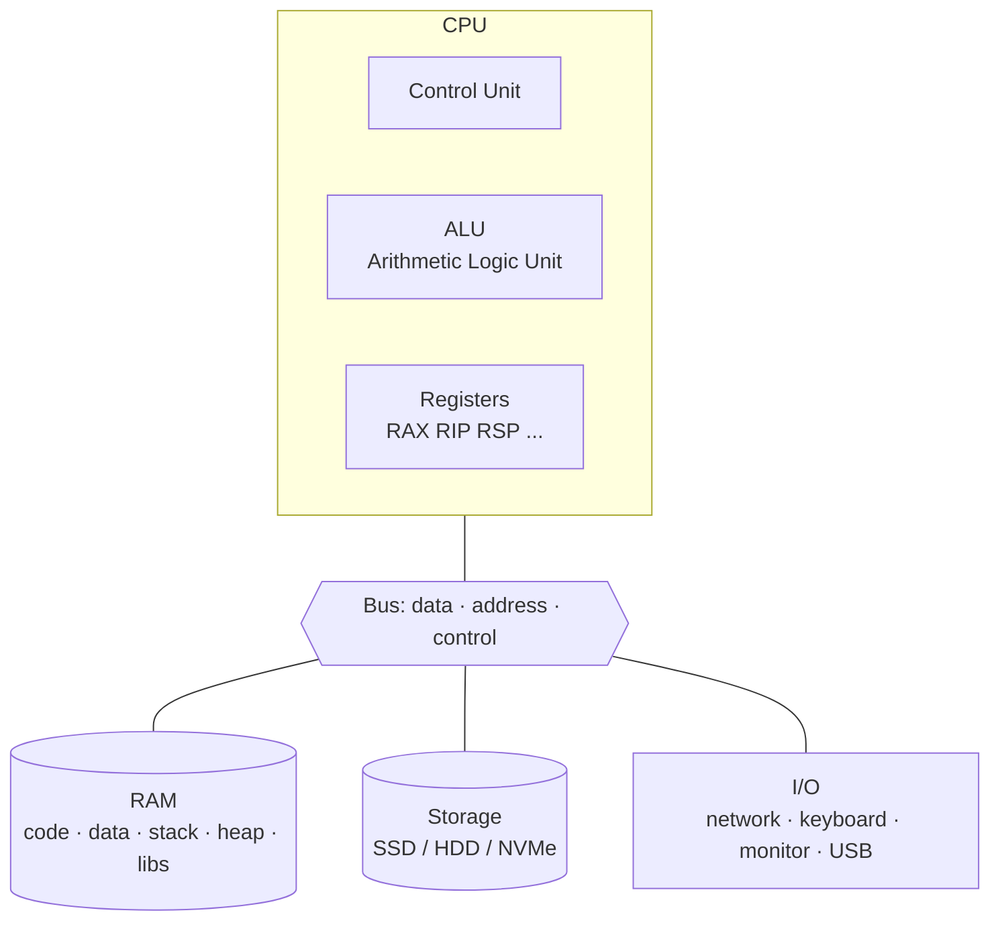
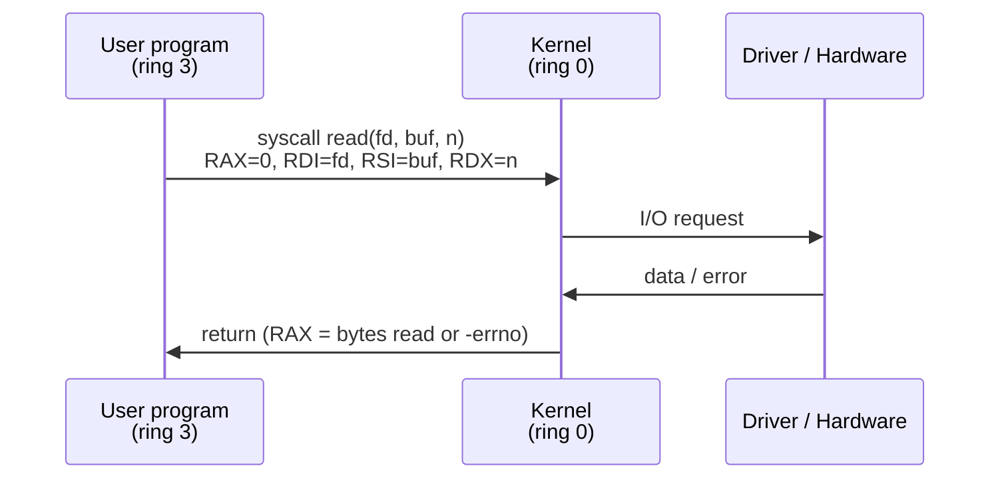

# Computer science fundamentals for security

## Why you need these fundamentals

In information security, 99% of attacks exploit either a bug *or* a system behavior the defender didn't understand. Examples:

- **Buffer overflow:** exploits how memory is organized (stack/heap), how CPU registers work, how the operating system loads a binary.
- **SQL injection:** exploits how a string is interpreted by a DB parser.
- **DLL hijacking:** exploits the path resolution order on Windows.
- **DNS rebinding:** exploits browser DNS caching and the Same-Origin Policy.

If you don't know what a register, a process, a file descriptor, or a socket is — you'll never *really* understand any of these. So: grit your teeth and read this section even if "you know it."

## Computer architecture (von Neumann model)

The standard model since 1945:



**Key concepts:**

- The CPU executes **instructions** fetched from RAM.
- **Registers** are extremely fast memory *inside* the CPU (tens, not billions). On x86-64 architecture the main general purpose registers are: `RAX, RBX, RCX, RDX, RSI, RDI, RBP, RSP, R8–R15`. Plus special registers: `RIP` (instruction pointer — current instruction), `RFLAGS` (status flags).
- **Memory** is a byte-addressed space (on x86-64, 64-bit addresses).
- The **bus** carries data, addresses, and control signals.

### Executing an instruction (simplified)

For each instruction the CPU runs the *fetch–decode–execute* cycle:

1. **Fetch:** loads the instruction at address `RIP` from RAM.
2. **Decode:** interprets the opcodes (e.g. `mov`, `add`, `jmp`).
3. **Execute:** runs it (e.g. ALU for addition, memory access, jump).
4. Updates `RIP` (usually next instruction, or jump target).

**Why does this matter for security?** All exploit development (section 14) is based on:
- *Controlling* `RIP` to hijack control flow.
- *Knowing* where your data lives in memory (stack/heap).
- *Building* instruction sequences that do what you want (shellcode, ROP).

## Number systems (decimal, binary, hexadecimal)

Computers work in **binary** (base 2). For readability we use **hexadecimal** (base 16): 4 bits = 1 hex digit.

| Decimal | Binary | Hex |
|---|---|---|
| 0 | 0000 | 0 |
| 1 | 0001 | 1 |
| 9 | 1001 | 9 |
| 10 | 1010 | A |
| 15 | 1111 | F |
| 16 | 10000 | 10 |
| 255 | 11111111 | FF |
| 256 | 100000000 | 100 |

**Notations:** in C/Python/most-lang: `0xFF` for hex, `0b11111111` for binary.

### Bitwise operations you must know

| Operation | C/Python | Example |
|---|---|---|
| AND | `&` | `0b1100 & 0b1010 = 0b1000` |
| OR | `\|` | `0b1100 \| 0b1010 = 0b1110` |
| XOR | `^` | `0b1100 ^ 0b1010 = 0b0110` |
| NOT | `~` | `~0b1100 = ...11110011` |
| Shift left | `<<` | `0b0010 << 2 = 0b1000` |
| Shift right | `>>` | `0b1000 >> 2 = 0b0010` |

You'll run into XOR everywhere in cryptography (one-time pad, stream ciphers, AES MixColumns, …). AND/OR/shift are the bread and butter of bit-twiddling (e.g. in protocols, in flags, in network masks).

### Number representation

- **Unsigned:** `uint8` from 0 to 255, `uint32` from 0 to $2^{32}-1$.
- **Signed** in **two's complement**: `int8` from -128 to 127. The most significant bit is the sign. To negate: invert the bits and add 1. Example: `-1` in `int8` is `0xFF` (all ones).
- **Endianness:**
  - *Little-endian* (x86, standard ARM mode): least significant byte first in memory. `0x12345678` in RAM: `78 56 34 12`.
  - *Big-endian* (network byte order, old PowerPC, SPARC): `12 34 56 78`.

Endianness will bite you the first time you write a shellcode. Memorize it.

### Exercise 1.1 — Conversions
Without a calculator, convert:
- `0x4A` to decimal
- `217` to hex
- `0b10110101` to hex and decimal
- `-5` in `int8` (binary)

<details><summary>Solution</summary>

- `0x4A` = 4·16 + 10 = **74**
- `217` = 16·13 + 9 = **0xD9**
- `0b10110101` = `0xB5` = 128+32+16+4+1 = **181**
- `-5` two's complement int8: `+5` = `0000 0101` → inverted `1111 1010` → +1 = `1111 1011` = **0xFB**

</details>

## Memory of a process

When you launch a program, the OS creates a **process** with its own virtual address space (on 64-bit: 256 TB theoretical, but only 48 bits usable → 256 TB). Typical Linux x86-64 layout:

<figure class="diagram">
<svg viewBox="0 0 460 480" width="460" height="480" xmlns="http://www.w3.org/2000/svg">
  <style>
    .lbl { font-family: 'JetBrains Mono', monospace; font-size: 13px; fill: #e8eef0; }
    .addr { font-family: 'JetBrains Mono', monospace; font-size: 11px; fill: #8a9499; }
    .note { font-family: 'JetBrains Mono', monospace; font-size: 11px; fill: #ffe066; }
  </style>
  <text x="230" y="18" class="addr" text-anchor="middle">high addresses — 0x7fff ffff ffff</text>
  <!-- stack -->
  <rect x="50" y="30" width="280" height="60" fill="#3a0b0b" stroke="#ff4d4d" stroke-width="2"/>
  <text x="190" y="65" class="lbl" text-anchor="middle">Stack (grows ↓)</text>
  <text x="340" y="65" class="note">← local vars, saved RIP</text>
  <!-- arrow down -->
  <line x1="190" y1="76" x2="190" y2="98" stroke="#ff4d4d" stroke-width="2" marker-end="url(#a)"/>
  <!-- free -->
  <rect x="50" y="100" width="280" height="80" fill="#0b0f10" stroke="#243035" stroke-width="2" stroke-dasharray="6 4"/>
  <text x="190" y="145" class="addr" text-anchor="middle">(free — randomized by ASLR)</text>
  <!-- libs -->
  <rect x="50" y="190" width="280" height="50" fill="#11171a" stroke="#00e6ff" stroke-width="2"/>
  <text x="190" y="220" class="lbl" text-anchor="middle">Memory-mapped libs (libc.so, ...)</text>
  <!-- heap -->
  <line x1="190" y1="250" x2="190" y2="272" stroke="#00ff9c" stroke-width="2" marker-end="url(#a)"/>
  <rect x="50" y="280" width="280" height="60" fill="#0b3a1a" stroke="#00ff9c" stroke-width="2"/>
  <text x="190" y="315" class="lbl" text-anchor="middle">Heap (grows ↑)</text>
  <text x="340" y="315" class="note">← malloc / new</text>
  <!-- bss -->
  <rect x="50" y="350" width="280" height="32" fill="#1d262b" stroke="#243035" stroke-width="2"/>
  <text x="190" y="370" class="lbl" text-anchor="middle">BSS (uninit globals = 0)</text>
  <!-- data -->
  <rect x="50" y="382" width="280" height="32" fill="#1d262b" stroke="#243035" stroke-width="2"/>
  <text x="190" y="402" class="lbl" text-anchor="middle">Data (init globals)</text>
  <!-- text -->
  <rect x="50" y="414" width="280" height="44" fill="#11171a" stroke="#00e6ff" stroke-width="2"/>
  <text x="190" y="441" class="lbl" text-anchor="middle">Text (code — RX, non-writable)</text>
  <text x="230" y="475" class="addr" text-anchor="middle">low addresses — 0x0000 0000 0000</text>
  <defs>
    <marker id="a" viewBox="0 0 10 10" refX="8" refY="5" markerWidth="6" markerHeight="6" orient="auto">
      <path d="M0,0 L10,5 L0,10 z" fill="currentColor"/>
    </marker>
  </defs>
</svg>
<figcaption>Memory layout of a Linux x86-64 process</figcaption>
</figure>

- **Stack:** LIFO. Each function call "pushes" a *frame* with arguments, return address (saved RIP), local variables. Grows toward low addresses.
- **Heap:** dynamic allocations. Grows toward high addresses. Managed by `malloc/free` or `new/delete`.
- **Text/Code:** the program's instructions. Typically **read-only** + executable.
- **Data/BSS:** global variables. Data = initialized, BSS = zeroed.

### Mitigations you'll always see

- **ASLR** (Address Space Layout Randomization) — addresses of stack/heap/libs are randomized at every launch. Defends against exploits that hardcode addresses.
- **DEP / NX** (Data Execution Prevention / No-eXecute) — stack/heap pages marked non-executable. Defends against "shellcode on stack."
- **Stack Canary** — a random value placed between local variables and the saved RIP; if overwritten by an overflow, the program aborts.
- **PIE** (Position Independent Executable) — even the binary's code is loaded at randomized addresses (requires ASLR).
- **Full RELRO** (RELocation Read-Only) — the GOT is read-only after loading, hindering GOT overwriting.
- **CFI** (Control Flow Integrity), **CET** (Control-flow Enforcement Technology, Intel hardware) — restrict jump/call targets.
- **W^X** (Write XOR eXecute) — a page can be writable *or* executable, never both.

Know these by heart. You'll only understand what they protect against after section 14.

## Operating systems: roles and mechanisms

An OS is the software that manages hardware resources and provides an interface to programs.

### Kernel and user mode

The x86-64 CPU has 4 privilege *rings* (0–3). In practice:
- **Ring 0 (kernel mode):** has access to all hardware, can modify the memory map, manage I/O.
- **Ring 3 (user mode):** sees only its virtual memory, cannot perform direct I/O, must request the kernel via *syscall*.

A **syscall** is a request from user space to the kernel: "read this file," "open a socket," "fork." On Linux there are ~330. Examples: `open`, `read`, `write`, `close`, `fork`, `execve`, `mmap`, `socket`, `connect`, `ptrace`, `prctl`.



On x86-64 Linux, syscalls are invoked with the `syscall` instruction, registers: `RAX` = syscall number, `RDI/RSI/RDX/R10/R8/R9` = arguments.

**Why does this matter:** when you reverse a malware sample, you'll see suspicious syscalls (`ptrace` anti-debug, `mmap` with `PROT_EXEC` flag, `socket+connect` for C2). When you write shellcode, you make syscalls directly. EDRs and sandboxes **hook** syscalls to intercept malware.

### Processes and threads

- **Process:** a running instance of a program. Has a PID, its own address space, file descriptor table, security context.
- **Thread:** a unit of execution *inside* a process. All threads of a process share memory. Context switch is lighter than process switch.

Key structures to remember:
- **PID** (Process ID) — unique number.
- **PPID** (Parent PID) — who created you.
- **UID/GID** — user/group for access control.
- **EUID/EGID** — effective UID/GID, used for checks (see setuid).
- **FD table** — table of open file descriptors (`0`=stdin, `1`=stdout, `2`=stderr by convention).

### Process creation

On Unix: `fork()` (duplicates the process) + `execve()` (replaces the image with another program). On Windows: `CreateProcess` or `CreateProcessW` directly.

On Linux:
```c
pid_t pid = fork();
if (pid == 0) {
    // I'm the child
    execve("/bin/ls", argv, envp);
} else if (pid > 0) {
    // I'm the parent
    waitpid(pid, NULL, 0);
}
```

Suspicious `fork+execve` chains are typical of web shells, reverse shells, and Linux malware: you'll be filtering strace and auditd logs looking for them.

### Scheduling, isolation, cgroups, namespaces

- **Scheduler:** decides which process runs on which CPU and when. On Linux: CFS (Completely Fair Scheduler), soon EEVDF.
- **Namespace** (Linux): resource isolation. Types: `mnt`, `pid`, `net`, `ipc`, `uts`, `user`, `cgroup`. They're the foundation of containers.
- **cgroup** (Control Groups): limit resources (CPU, RAM, I/O). Also foundational for containers.
- **Capabilities:** break the old "all-powerful root" into granular capabilities (`CAP_NET_ADMIN`, `CAP_SYS_PTRACE`, …). `getcap`/`setcap`.

We'll discuss these in depth in section 19 (containers).

## File systems

On Linux/macOS everything is (more or less) a file:
- regular files, directories
- *symbolic links* (pointers) and *hard links* (multiple names for the same inode)
- *device files* (`/dev/sda`, `/dev/null`, `/dev/urandom`)
- *sockets* and *pipes*
- files in `/proc/` and `/sys/` (kernel interface)

### Classic Unix permissions

Each file has an owner (user), group, and a triplet of `rwx` permissions for *owner / group / other*. `ls -l` shows:

```text
-rwxr-xr-- 1 alice dev 1234 May 19 10:00 script.sh
│└─┬─┘└─┬─┘└┬┘
│  │    │   └─ other (r--)
│  │    └───── group (r-x)
│  └────────── owner (rwx)
└─ type: - file, d dir, l link, c char device, b block device, s socket, p pipe
```

Octal notation:
- `7` = rwx, `6` = rw-, `5` = r-x, `4` = r--, `0` = ---
- `chmod 755 file` = `rwxr-xr-x`

**Special bits (extremely important in security):**

- **setuid** (`s` on owner-x, octal `4xxx`) — the program runs with the privileges of the **file's owner**, not the user who launches it. Example: `/usr/bin/passwd` is setuid-root because only root can write to `/etc/shadow`. **Buggy setuid-root programs are the main source of local privesc on Linux.**
- **setgid** (`s` on group-x, octal `2xxx`) — like setuid but for the group. On a directory: new files inherit the directory's group.
- **sticky** (`t` on other-x, octal `1xxx`) — on a directory: only the file's owner (or root) can delete. Typical of `/tmp`.

### POSIX ACLs, Linux capabilities, xattrs

Classic `rwx` permissions are too limited. Extensions:

- **POSIX ACL** (`getfacl` / `setfacl`) — permissions for multiple users/groups.
- **Linux capabilities** on files (`getcap` / `setcap`) — replace setuid to grant granular permissions (e.g. `cap_net_bind_service` to bind ports < 1024 without being root).
- **Extended attributes** (`getfattr`/`setfattr`) — custom metadata. Also used by SELinux.

### Classic FS vulnerabilities

- **Race conditions / TOCTOU** (Time-of-check vs Time-of-use): checks on a file done before using it, but between check and use the file is changed (e.g. via symlink). Example: `access()` then `open()` — don't do it.
- **Path traversal:** user input like `../../etc/passwd` interpreted by server code.
- **Symlink attack:** a privileged file follows an attacker-controlled symlink to write/read elsewhere.
- **World-writable file in cron/init:** if a script run by root is world-writable, anyone who modifies it = privesc.

## Networking — low layer (preparation for section 3)

We'll preview concepts we'll cover in depth later:

- **MAC address:** network card address (layer 2, OSI). 48 bits, written as `aa:bb:cc:dd:ee:ff`.
- **IP address:** logical address (layer 3). IPv4 is 32 bits (`192.168.1.1`), IPv6 is 128 bits.
- **Port:** identifies a service/socket on a host (layer 4). 0–65535. 0–1023 = "well-known."
- **Protocol:** communication rules (HTTP, DNS, TLS, …).

On Linux, to view network state:

```bash
ip addr               # interfaces
ip route              # routing table
ss -tulpn             # listening TCP/UDP sockets
ss -tan state established
```

On Windows:

```powershell
ipconfig /all
netstat -ano
Get-NetTCPConnection
```

## Exercises

### Exercise 1.2 — Stack and functions
Compile and analyze:

```c
// hello.c
#include <stdio.h>
#include <string.h>

void greet(const char *name) {
    char buf[16];
    strcpy(buf, name);
    printf("Hello, %s\n", buf);
}

int main(int argc, char **argv) {
    if (argc > 1) greet(argv[1]);
    return 0;
}
```

Compile it *without protections*: `gcc -fno-stack-protector -z execstack -no-pie -o hello hello.c`.

1. Run it with a 100-character argument. What happens?
2. Open it with `objdump -d hello` and identify `greet`.
3. What do you think happened to `RIP` upon return from `greet`?

<details><summary>Explanation</summary>

`strcpy` copies the entire string up to `\0`, without checking the destination size. Stack frame of `greet`: `buf[16]` + saved `RBP` + return address. 100 bytes overwrite everything, including the return address → on `ret` the CPU jumps to an "attacker-controlled" address → segfault, because 65 bytes of 'A' (0x41) form the address `0x4141414141414141`, which isn't mapped. This is the classic stack buffer overflow. We'll actually exploit it in section 14.

</details>

### Exercise 1.3 — Capabilities and SUID
On a Linux VM:
- Find all `setuid-root` files (`find / -perm -4000 -user root -type f 2>/dev/null`). How many are there?
- Find all files with capabilities (`getcap -r / 2>/dev/null`).
- For each one, try to figure out why it has that privilege. Look up the names on [gtfobins.github.io](https://gtfobins.github.io): are there any that allow privesc if they can be executed?

<details><summary>Hint</summary>

You typically find `/usr/bin/passwd`, `/usr/bin/sudo`, `/usr/bin/mount`, `/usr/bin/chsh`, `/usr/bin/su`. GTFOBins is a list of binaries that can be used to "escape" restrictions or to privesc if misconfigured. Example: `find` with suspicious capabilities can run `-exec /bin/sh` → root shell.

</details>

### Exercise 1.4 — Endianness
In a Python shell:

```python
import struct
v = 0xdeadbeef
print(struct.pack("<I", v).hex())   # little-endian
print(struct.pack(">I", v).hex())   # big-endian
```

Explain the output. Why is `struct.pack("<Q", addr)` used in x86 shellcode/payloads to write a 64-bit pointer?

<details><summary>Solution</summary>

`<I` = little-endian unsigned 32-bit int → `efbeadde`. `>I` = big-endian → `deadbeef`. On x86/x86-64 memory is little-endian: the least significant byte is at the lowest address. When you write an address into a buffer to overwrite a pointer, you must write it in the same layout the CPU expects to read.

</details>

### Exercise 1.5 — Explore `/proc`
On Linux:

```bash
cat /proc/cpuinfo
cat /proc/meminfo
cat /proc/self/maps          # memory map of the cat process itself
cat /proc/self/status        # status, UID, capabilities
ls /proc/self/fd             # open file descriptors
cat /proc/sys/kernel/randomize_va_space   # 0=ASLR off, 1=partial, 2=full
```

What does `/proc/self/maps` represent? Find which library is loaded and at what address.

<details><summary>Explanation</summary>

`/proc/<pid>/maps` shows the process's virtual map: each line = an address range, permissions (rwxp), offset, device, inode, path of the file/anonymous. You'll use it constantly in local exploit dev.

</details>

### Exercise 1.6 — Identify your SUID files and capabilities (CTF-style)
On a "vulnerable" VM (e.g. TryHackMe "Linux PrivEsc"), enumerate the SUIDs and check which ones are on GTFOBins.

## Key concepts to memorize

1. **Kernel/user mode, syscalls** — attack and defense often go through here.
2. **Process memory layout: text, data, bss, heap, stack** — foundation of exploit dev and reverse engineering.
3. **Unix permissions, SUID, capabilities** — foundation of Linux privesc.
4. **Endianness little vs big** — it will bite you.
5. **ASLR, NX, canary, PIE, RELRO** — know by heart what they do.
6. **Process vs thread** — different concurrency and isolation models.
7. **Two's complement, XOR, shift** — they come back in crypto, reverse, networking.

All of this is foundational. If it feels abstract, you'll see it become concrete in the next sections.
