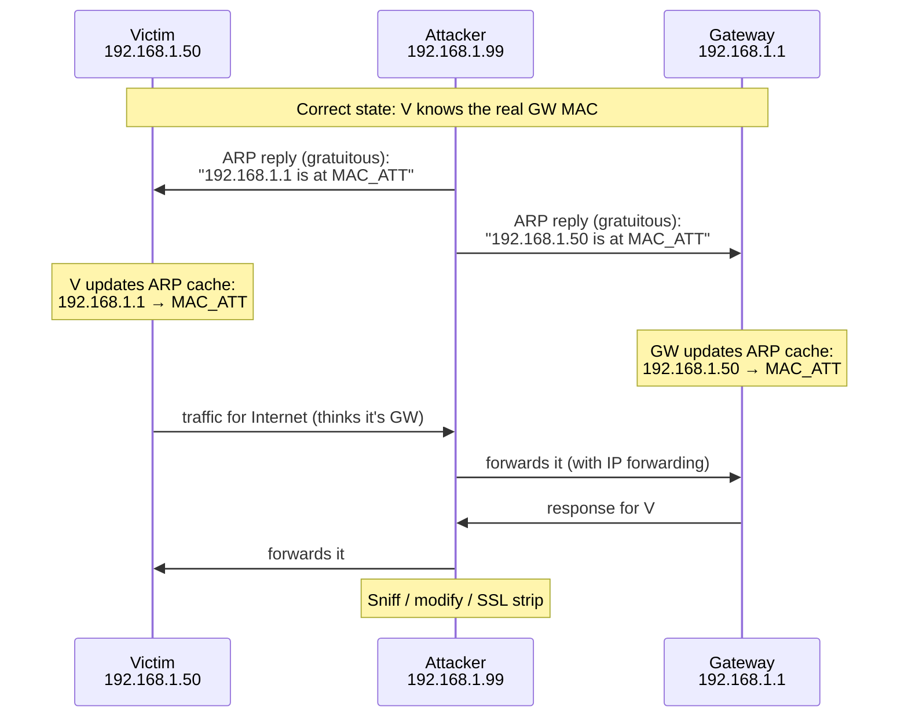
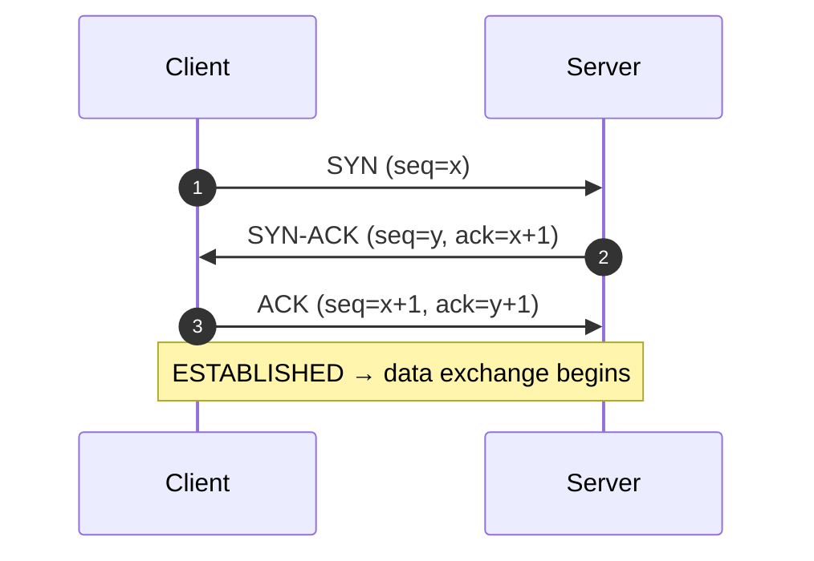
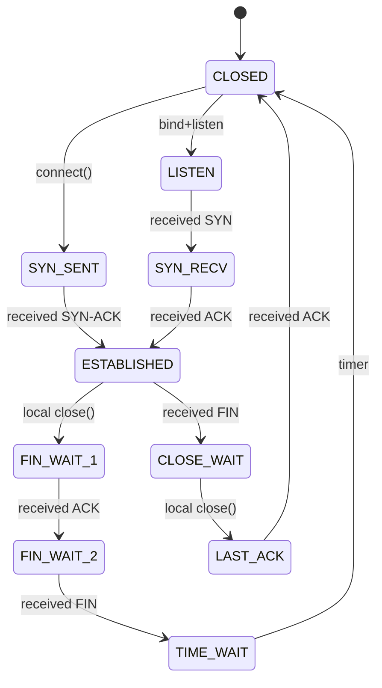

# Networking: from cables to TCP/IP

## The OSI model vs the TCP/IP model

| OSI layer | TCP/IP layer | Examples |
|---|---|---|
| 7 Application | Application | HTTP, DNS, SMTP, SSH, FTP |
| 6 Presentation | (included in Application) | TLS, ASN.1, JSON |
| 5 Session | (included) | RPC, session tokens |
| 4 Transport | Transport | TCP, UDP, QUIC, SCTP |
| 3 Network | Internet | IP (v4/v6), ICMP, IPsec |
| 2 Data Link | Link | Ethernet, Wi-Fi, ARP, MAC |
| 1 Physical | Link | Cable, fiber, radio wave |

In practice we use the 4-layer TCP/IP model. The 7-layer OSI model is didactic: it helps you reason about roles, but in real life "session" and "presentation" are rarely distinguished.

Key concept: **encapsulation**. Each layer adds a header to the payload of the upper layer.

```mermaid
flowchart TB
    A[HTTP request<br/>GET /api/users] --> B[+ TLS record header<br/>encryption, MAC]
    B --> C[+ TCP header<br/>src/dst ports, seq, ack, flags]
    C --> D[+ IP header<br/>src/dst IP, TTL, proto]
    D --> E[+ Ethernet header<br/>src/dst MAC, EtherType]
    E --> F[physical bits<br/>cable / fiber / radio]
    style A fill:#0b3a1a,stroke:#00ff9c
    style F fill:#3a0b0b,stroke:#ff4d4d
```



All packet sniffing/spoofing/MITM works by *removing* encapsulations to read, or *modifying* a header to deceive.

## Layer 2: Ethernet, MAC, ARP

### MAC address
48 bits, every network card has one. Convention: `aa:bb:cc:dd:ee:ff`. The first 3 bytes (OUI) identify the vendor.

```bash
ip link show
ip link set dev eth0 address 02:00:00:00:00:01    # MAC spoofing
macchanger -r eth0                                 # random
```

### Switch
Operates at layer 2: it sees MACs, builds a CAM table `MAC ↔ port`. It limits the broadcast domain of the individual segment.

**Typical switch attacks:**
- **MAC flooding** (CAM table overflow): saturate the CAM with fake MACs → the switch enters "hub" mode → you receive all traffic. Tool: `macof`.
- **VLAN hopping** (double tagging / DTP): abuse trunks to jump across VLANs.

### ARP (Address Resolution Protocol)
Maps IP → MAC on the LAN. When you want to talk to `192.168.1.1`, you broadcast an ARP "who has 192.168.1.1?". The owner answers "me, MAC is AA:BB:..".

ARP is **stateless and unauthenticated**. Anyone on the LAN can answer a request, or spam spontaneous ARP replies (gratuitous ARP). → **ARP spoofing / poisoning**: convince the victim that YOU are the gateway, and the gateway that YOU are the victim. Traffic flows through you. It's the classic LAN MITM.



Tools: `arpspoof`, `bettercap`, `ettercap`.

**Defenses:**
- Static ARP (on critical hosts).
- DHCP snooping + Dynamic ARP Inspection (DAI) on enterprise switches.
- 802.1X port-based auth.
- VLAN segmentation.

We'll see spoofing in practice in section 12.

## Layer 3: IP

### IPv4
32 bits, written as 4 decimal octets (`192.168.1.10`). With the **subnet mask** (e.g. `/24` = `255.255.255.0`) we distinguish network from host.

```text
192.168.1.10/24
  network: 192.168.1.0
  broadcast: 192.168.1.255
  usable range: 192.168.1.1 - 192.168.1.254
```

#### Private classes (RFC 1918) — not routable on the internet
- `10.0.0.0/8`
- `172.16.0.0/12`
- `192.168.0.0/16`

#### Special
- `127.0.0.0/8` loopback (`127.0.0.1` = myself)
- `169.254.0.0/16` link-local (APIPA, when DHCP fails)
- `0.0.0.0` "all interfaces" / default route
- `224.0.0.0/4` multicast
- `255.255.255.255` limited broadcast

### IPv6
128 bits, 8 groups of 4 hex digits separated by `:` with compression. `2001:0db8:0000:0000:0000:ff00:0042:8329` → `2001:db8::ff00:42:8329`.

- `::1/128` loopback
- `fe80::/10` link-local (always present)
- `fc00::/7` ULA (private)
- `2000::/3` global unicast (routable)

IPv6 has autoconfiguration (SLAAC), no ARP (replaced by NDP — Neighbor Discovery Protocol), no NAT (in theory), no broadcast (multicast).

**Security caveat:** many networks have IPv6 enabled by default but firewalls only for IPv4 → unintentional bypasses. Always verify with `ip -6 ...`.

### IP header (simplified)

```text
0       4       8              16                              31
+-------+-------+--------------+-------------------------------+
| Ver=4 | IHL   | Type of Serv | Total Length                  |
+-------+-------+--------------+----------+--------------------+
| Identification               | Flags     | Fragment Offset    |
+-----------------------------+------+-----+--------------------+
| TTL          | Protocol     | Header Checksum                |
+--------------+--------------+--------------------------------+
| Source Address (32 bit)                                       |
+---------------------------------------------------------------+
| Destination Address (32 bit)                                  |
+---------------------------------------------------------------+
| Options (rare) ... + Padding                                  |
+---------------------------------------------------------------+
| Payload (TCP/UDP/ICMP/...)                                    |
```

Useful fields:
- **TTL** (Time To Live): decremented by 1 at each hop. If it reaches 0 → ICMP TTL expired. Basis of **traceroute**.
- **Protocol:** identifies the payload (1=ICMP, 6=TCP, 17=UDP, 47=GRE, 50=ESP, ...).
- **Flags+Fragment Offset:** fragmentation. Historically abused for IDS evasion (ambiguous reassembly).

### Routing
Routing is the process of deciding "which interface should I send a packet destined to that IP on". Each host has a table; if no specific route matches → **default gateway**.

```bash
ip route
# default via 192.168.1.1 dev wlan0
# 192.168.1.0/24 dev wlan0 proto kernel scope link src 192.168.1.20

ip route add 10.10.10.0/24 via 192.168.1.254
```

### NAT (Network Address Translation)
The reason you have a private IP at home but still browse the internet. The router rewrites the outgoing source IP with its own public IP, keeps a table (internal IP+port ↔ external IP+port) and does the reverse on inbound.

**SNAT** (Source NAT): outbound translation (what your router does).
**DNAT** (Destination NAT): inbound translation (port forwarding).
**PAT / NAPT:** NAT with ports (Linux iptables masquerade).

In internal pentesting, the target's NAT is often an obstacle (you can't reach private hosts directly from outside) and is bypassed with tunneling/pivoting (see section 12).

### ICMP
IP control protocol. Famous types: 8 (echo request = ping), 0 (echo reply), 3 (destination unreachable), 11 (TTL expired, basis of traceroute), 5 (redirect — used for attacks).

`ping`, `traceroute`/`tracert`, `mtr` use ICMP (or UDP for the default Unix traceroute — ports 33434+). On many enterprise networks ICMP is filtered on egress: if ping fails it doesn't mean the host is down.

## Layer 4: TCP and UDP

### UDP
- Connectionless, no handshake.
- No delivery or ordering guarantees.
- Header: src/dst ports, length, checksum. That's it.
- Fast, used for DNS, DHCP, QUIC, VoIP, gaming, syslog, NTP.

### TCP
- Connection-oriented, with states.
- Guarantees in-order delivery without duplicates.
- Three-way handshake:



Teardown:
- **FIN** + ACK in both directions (graceful)
- **RST** (reset, "tear down immediately")

### TCP header (relevant)

```text
src port (16 b) | dst port (16 b)
sequence number (32 b)
ack number (32 b)
data offset | reserved | URG ACK PSH RST SYN FIN | window (16 b)
checksum (16 b) | urgent ptr (16 b)
options (TCP MSS, SACK, timestamp, window scale)
data...
```

**Relevant flags:**
- **SYN**: initiates the connection
- **ACK**: acknowledges reception
- **FIN**: graceful close
- **RST**: forced close
- **PSH**: immediate push to the application
- **URG**: urgent data (rarely used)

**Port states (server side):**
- **OPEN**: a service is listening (replies with SYN-ACK).
- **CLOSED**: no service (replies with RST).
- **FILTERED**: the firewall blocks (no reply, or ICMP unreachable).

`nmap` distinguishes these states (section 9).

### TCP states you'll see



`ss -tan` to see them on your system.

### Well-known ports
| Port | TCP/UDP | Service |
|---|---|---|
| 20/21 | TCP | FTP (data/control) |
| 22 | TCP | SSH |
| 23 | TCP | Telnet (cleartext, avoid) |
| 25 | TCP | SMTP |
| 53 | TCP/UDP | DNS |
| 67/68 | UDP | DHCP server/client |
| 80 | TCP | HTTP |
| 88 | TCP/UDP | Kerberos |
| 110 | TCP | POP3 |
| 123 | UDP | NTP |
| 135 | TCP | MS-RPC endpoint mapper |
| 137-139 | TCP/UDP | NetBIOS |
| 143 | TCP | IMAP |
| 161/162 | UDP | SNMP / trap |
| 389 | TCP/UDP | LDAP |
| 443 | TCP | HTTPS |
| 445 | TCP | SMB |
| 465 | TCP | SMTPS |
| 514 | UDP | syslog |
| 587 | TCP | SMTP submission (TLS) |
| 636 | TCP | LDAPS |
| 993 | TCP | IMAPS |
| 995 | TCP | POP3S |
| 1433/1521/3306/5432/27017 | TCP | DB (MSSQL/Oracle/MySQL/Postgres/Mongo) |
| 3389 | TCP | RDP |
| 5985/5986 | TCP | WinRM HTTP/HTTPS |
| 8080/8443 | TCP | HTTP/S alternative |

Memorize at least the top 30. They'll be the first thing you look for on a target.

## DNS: the names of the web

DNS translates names (`www.example.com`) into IPs. Hierarchy: root → TLD → domain authoritative.

**Main record types:**
| Type | What it does |
|---|---|
| A | name → IPv4 |
| AAAA | name → IPv6 |
| CNAME | alias to another name |
| MX | mail server for the domain |
| TXT | free text (SPF, DKIM, verifications, …) |
| NS | authoritative name servers |
| SOA | start of authority |
| PTR | reverse DNS (IP → name) |
| SRV | service location (Kerberos, AD, …) |
| CAA | which CAs can issue certs for the domain |
| DS / DNSKEY | DNSSEC |

```bash
dig example.com               # A
dig +short example.com
dig MX example.com
dig @8.8.8.8 example.com      # query a specific resolver
dig ANY example.com           # often filtered
dig +trace example.com        # query from the root
dig -x 8.8.8.8                # reverse
```

**Public resolvers:** 1.1.1.1 (Cloudflare), 8.8.8.8 (Google), 9.9.9.9 (Quad9).

**DNS attacks:**
- **DNS spoofing / cache poisoning** (see Kaminsky 2008) — inject fake responses into a resolver's cache.
- **DNS hijacking** (at the registrar/user account level).
- **DNS amplification** — use open resolvers for amplified DoS.
- **DNS tunneling** — exfiltrate data encapsulated in DNS queries (slow but often gets past firewalls). Tools: `dnscat2`, `iodine`.
- **NXDOMAIN flood, NSEC walking.**

**Defenses:** DNSSEC (signing), DoT/DoH (DNS over TLS / over HTTPS), DNS sinkholing for blue teams.

## DHCP

Dynamic Host Configuration Protocol. Automatic discovery of network configuration.

```text
Client → DHCPDISCOVER (broadcast)
Server → DHCPOFFER (offer: IP X, lease Y, gateway Z, DNS W)
Client → DHCPREQUEST (I accept)
Server → DHCPACK
```

Cleartext, no auth → an attacker can:
- Become a **rogue DHCP server** and give clients a gateway/DNS he controls.
- **DHCP starvation:** exhaust the real DHCP server's pool and then become its replacement.

Defenses: DHCP snooping on switches.

## Wireshark and tcpdump

Your eyes on the network.

### tcpdump

```bash
sudo tcpdump -i eth0                  # everything
sudo tcpdump -i eth0 -nn -v port 80   # HTTP only, numeric, verbose
sudo tcpdump -i eth0 host 1.2.3.4
sudo tcpdump -i eth0 net 192.168.1.0/24
sudo tcpdump -i eth0 -w capture.pcap  # save
sudo tcpdump -r capture.pcap          # read
sudo tcpdump -A 'port 80'             # ASCII payload (HTTP cleartext)
sudo tcpdump 'tcp[tcpflags] & (tcp-syn) != 0'  # SYN only
```

BPF filters (Berkeley Packet Filter): `host`, `net`, `port`, `tcp`, `udp`, `icmp`, `and`, `or`, `not`, parentheses.

### Wireshark

GUI for pcap analysis. Display filters are different from BPF: `ip.addr == 1.2.3.4`, `tcp.port == 443`, `http.request.method == "POST"`, `tls.handshake.type == 1`, `dns.qry.name contains "evil"`.

Killer features:
- **Follow TCP stream** — reconstructs the conversation.
- **Decrypt TLS** if you have the SSL keys (env var `SSLKEYLOGFILE`).
- **Statistics → Conversations / I/O Graph / Protocol Hierarchy.**
- **Expert Info.**

You'll use Wireshark in CTFs ("Capture the traffic" challenges), in incident response, in network troubleshooting.

## Firewalls and ACLs

### iptables / nftables (Linux)

iptables is the old engine (superseded by nftables, `nft` syntax). Concept: chains (INPUT, FORWARD, OUTPUT) with rules. Each rule: match → target.

```bash
# Drop everything on input, accept SSH and already-established traffic
iptables -P INPUT DROP
iptables -A INPUT -m state --state ESTABLISHED,RELATED -j ACCEPT
iptables -A INPUT -i lo -j ACCEPT
iptables -A INPUT -p tcp --dport 22 -j ACCEPT

# Forward (for NAT/routing)
iptables -t nat -A POSTROUTING -o eth0 -j MASQUERADE

# Save rules
iptables-save > /etc/iptables.rules
```

In security: **default deny**, **minimal** exposure, log drops.

### Windows Firewall, ufw, firewalld
- **ufw:** friendly iptables wrapper (`ufw allow 22`).
- **firewalld:** wrapper over nftables/iptables with zones (public, internal, dmz, ...).
- **Windows Defender Firewall:** Domain/Private/Public profiles, inbound/outbound rules. Configurable via PowerShell (`New-NetFirewallRule`).

## VLAN and segmentation

A **VLAN** (Virtual LAN) logically divides a switch into separate broadcast domains (802.1Q tag in frames). It enables segmentation without additional physical switches.

In security, segmentation is central: OT network isolated from IT, servers in DMZ, workstations not in direct contact with DBs. **Zero Trust** takes this principle to the extreme: no implicit trust based on network location.

## Exercises

### Exercise 3.1 — Subnetting by hand
For each: find the network address, broadcast, usable host range, number of hosts.

1. `10.20.30.40/26`
2. `192.168.1.130/29`
3. `172.16.5.0/20`

<details><summary>Solution</summary>

1. `/26` → 6 host bits → 64 IPs, 62 usable. `10.20.30.0/26` covers 0-63; `40` falls in this. Network `10.20.30.0`, broadcast `10.20.30.63`, hosts `10.20.30.1`–`10.20.30.62`.
2. `/29` → 3 host bits → 8 IPs, 6 usable. Subnet containing `.130`: block `.128`–`.135`. Net `192.168.1.128`, broadcast `.135`, hosts `.129`–`.134`.
3. `/20` → 12 host bits → 4096 IPs, 4094 usable. Mask `255.255.240.0`. Subnet containing `172.16.5.0`: `172.16.0.0`–`172.16.15.255`. Net `172.16.0.0`, bc `172.16.15.255`, hosts `172.16.0.1`–`172.16.15.254`.

</details>

### Exercise 3.2 — Capture your own handshake
1. `sudo tcpdump -i any -w handshake.pcap host example.com`
2. In another shell: `curl https://example.com` (or open the browser).
3. Stop, open with Wireshark.
4. Identify: DNS query, TCP SYN, SYN-ACK, ACK, TLS Client Hello, Server Hello, certificate, application data, FIN.

### Exercise 3.3 — Decrypt HTTPS in lab
1. Set `export SSLKEYLOGFILE=~/sslkeys.log` before launching Firefox/Chrome.
2. Capture traffic (`tcpdump -w cap.pcap`).
3. In Wireshark: Edit → Preferences → Protocols → TLS → "(Pre)-Master-Secret log filename" → select the file.
4. Now you see HTTP in cleartext.

What does this procedure demonstrate about TLS security? What does the attacker need to do this on the victim side without physical access to the machine?

<details><summary>Explanation</summary>

TLS is secure against someone sniffing the network without the keys. To decrypt you need the server's private key **or** the pre-master keys of the sessions (which the browser will give you if you ask). Without compromising one of the two endpoints, pure sniffing isn't enough. That's why modern MITM attacks aim at:
- **Replacing the certificate** (compromised trust store, Burp/mitmproxy with an installed CA).
- **Downgrade** (SSL strip, TLS downgrade, rare today thanks to HSTS).
- **Compromising the client** (malware) or the server (private key leak).

</details>

### Exercise 3.4 — DNS deep dive
1. Find all the NS records of `wikipedia.org`. How many are there?
2. Find the MX of `google.com` with priority.
3. Find the SPF (TXT record starting with `v=spf1`) of `microsoft.com`.
4. Look up CAA of `letsencrypt.org`. What does it mean?

<details><summary>Commands</summary>

```bash
dig NS wikipedia.org +short
dig MX google.com +short
dig TXT microsoft.com | grep spf
dig CAA letsencrypt.org +short
```

CAA states which CAs are authorized to issue certs for the domain. It's a protection against fraudulent CAs.

</details>

### Exercise 3.5 — Map your home network
From Kali in lab (or on your network, carefully):
- `ip addr` and `ip route` → identify gateway and subnet.
- `arp -a` → hosts on your LAN.
- `nmap -sn 192.168.1.0/24` (host discovery, no port scan).
- `nmap --top-ports 100 -sV 192.168.1.0/24` (only on YOUR network).

How many active hosts? Which services? Any exposed printer/IoT?

### Exercise 3.6 — Dynamic SSH tunnel in practice
1. On a VPS (even a local container): `ssh -D 1080 user@vps`.
2. Configure Firefox: Preferences → Network → Manual proxy → SOCKS5 127.0.0.1:1080, and "Proxy DNS when using SOCKS v5".
3. Browse: your IP as seen by `whatsmyip.com` is the VPS's.

How does a company limit this technique?

<details><summary>Explanation</summary>

- Egress firewall: outbound SSH blocked on non-standard ports / to non-whitelisted destinations.
- DPI / SSL inspection to recognize unauthorized SSH.
- ZTNA / forward proxy that require auth and block non-standard traffic.
- Binary restrictions (e.g. AppLocker on Windows prevents launching an unsigned `ssh.exe`).

</details>

### Exercise 3.7 — Sniff HTTP cleartext
In lab: a Linux client + server with a non-TLS HTTP service. Capture with tcpdump, reconstruct with Wireshark "Follow TCP Stream". What do you see if the user logs in with `POST /login` cleartext body? What changes with HTTPS?

## Key concepts

1. **OSI/TCP-IP encapsulation:** understanding how each layer adds a header → foundation of sniffing/spoofing.
2. **MAC vs IP vs port:** identities at layer 2/3/4.
3. **ARP is unauthenticated, the basis of LAN MITM.**
4. **TCP three-way handshake and port states:** foundation of scanning.
5. **DNS: hierarchy, records, attack types.**
6. **NAT creates reachability problems (which is why pivoting is needed in pentesting).**
7. **Wireshark/tcpdump + filters** — indispensable tools.

In the next sections we move to the application layer (HTTP/TLS) and then to "why all this is hackable".
