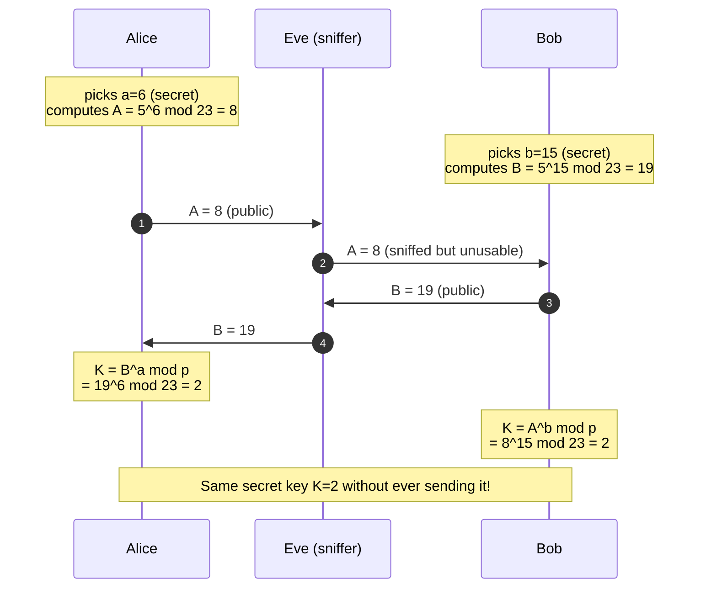
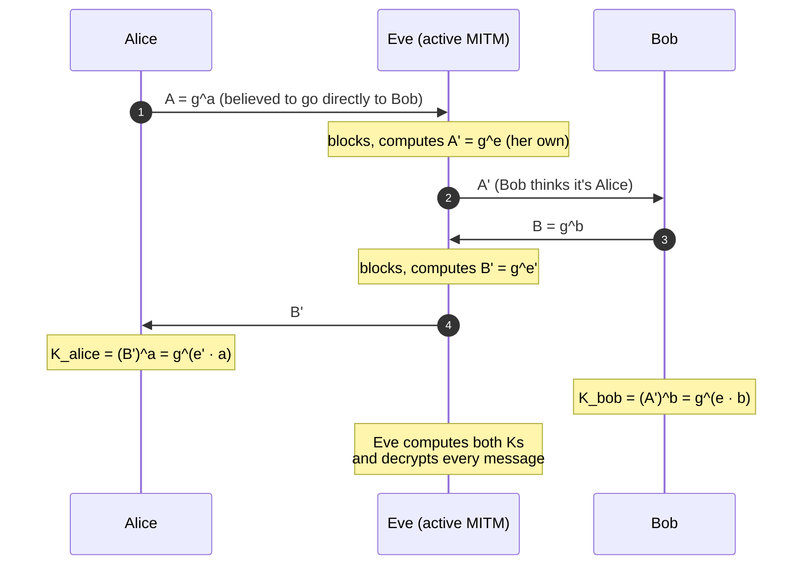
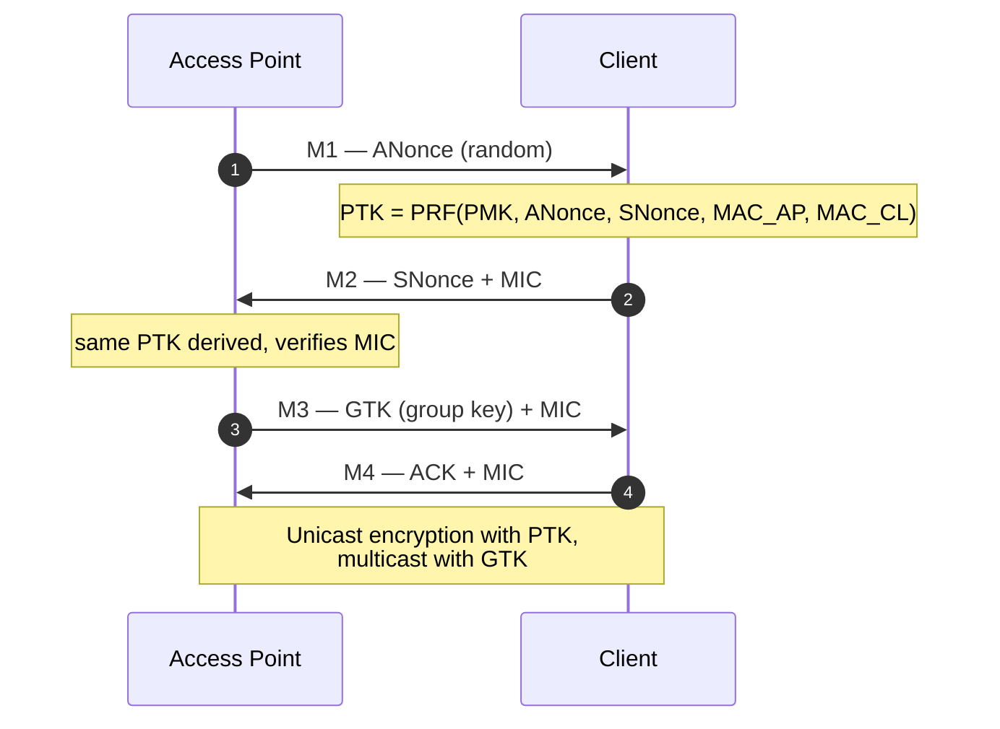

# Cryptography — step-by-step worked examples

> All the "why it works" of cryptography becomes obvious when you sit down and do the math on paper. Here we calculate everything **by hand** (using `pow(a,b,n)` for the bigger computations). No skipped steps.

## 1. RSA — encryption and decryption step by step

### Key generation

Pick two small primes (in production: 1024 bits each!):
- $p = 61$, $q = 53$.

Calculations:
- $n = pq = 61 \cdot 53 = 3233$.
- $\varphi(n) = (p-1)(q-1) = 60 \cdot 52 = 3120$.
- Pick $e$ coprime with $\varphi$: $e = 17$. Verify: $\gcd(17, 3120) = 1$ ✅.
- Compute $d = e^{-1} \mod \varphi(n)$. With extended Euclid or `pow(17, -1, 3120)` → $d = 2753$. Verify: $17 \cdot 2753 = 46801 = 15 \cdot 3120 + 1$ ✅.

**Public key:** $(n, e) = (3233, 17)$. **Private key:** $(n, d) = (3233, 2753)$.

### Encrypt the message $m = 65$ (ASCII code for 'A')

Encryption: $c = m^e \mod n = 65^{17} \mod 3233$.

Step-by-step computation with **repeated modular exponentiation** (needed to keep the numbers from blowing up):

$$ 65^{17} = 65^{16} \cdot 65^1 = (65^8)^2 \cdot 65 $$

By hand (mod 3233 at each step):
```
65^1   = 65
65^2   = 4225          → 4225 mod 3233 = 992
65^4   = 992^2 = 984064 → mod 3233 = ?
        984064 / 3233 = 304.4...  → 304 · 3233 = 982832  → 984064 - 982832 = 1232
65^4   ≡ 1232
65^8   = 1232^2 = 1517824 → mod 3233 = ?
        1517824 / 3233 = 469.5 → 469 · 3233 = 1516277 → 1517824 - 1516277 = 1547
65^8   ≡ 1547
65^16  = 1547^2 = 2393209 → mod 3233 = ?
        2393209 / 3233 ≈ 740.4 → 740 · 3233 = 2392420 → 2393209 - 2392420 = 789
65^16  ≡ 789

65^17  = 65^16 · 65^1 = 789 · 65 = 51285
        51285 mod 3233 = ?
        51285 / 3233 ≈ 15.86 → 15 · 3233 = 48495 → 51285 - 48495 = 2790
65^17  ≡ 2790
```

So $c = 2790$. Verification in Python: `pow(65, 17, 3233)` → 2790 ✅.

### Decrypt

$m = c^d \mod n = 2790^{2753} \mod 3233$.

By hand this is prohibitive; in Python: `pow(2790, 2753, 3233)` → **65**. ✅

**It works because**: by Euler, $m^{\varphi(n)} \equiv 1 \pmod n$ if $\gcd(m,n)=1$, and since $ed \equiv 1 \pmod{\varphi(n)}$, there exists $k$ with $ed = 1 + k\varphi(n)$. So:
$$m^{ed} = m^{1 + k\varphi(n)} = m \cdot (m^{\varphi(n)})^k \equiv m \cdot 1^k = m \pmod n.$$

### "Magic" text-form

```
Alice                                        Bob
 │ generates (p,q) secret                      │
 │ computes n, e, d                            │
 │ publishes (n, e) ────────────────────────►  │
 │                                             │ wants to send m=65
 │                                             │ computes c = m^e mod n = 2790
 │ ◄───────── c=2790 ──────────────────────────┤
 │ computes m = c^d mod n = 65                 │
 │ reads "A"                                   │
```

Without the private key, even knowing $n=3233, e=17, c=2790$, the only way (without mathematical breakthroughs) is to **factor 3233 = 61·53**. On 3233 that's laughable. On a 2048-bit $n$ (~617 decimal digits) it would take thousands of CPU-years.

### Why "textbook" RSA is insecure (very important)

Encrypt $m_1 = 2$ and $m_2 = 3$ with the same key $(e=17, n=3233)$:
- $c_1 = 2^{17} \mod 3233 = 131072 \mod 3233 = 131072 - 40\cdot 3233 = 131072 - 129320 = 1752$.
- $c_2 = 3^{17} \mod 3233$. `pow(3,17,3233)` = 3055. Verify.

Now $c_1 \cdot c_2 \mod n = 1752 \cdot 3055 \mod 3233 = ?$. With Python: `(1752 * 3055) % 3233 = 1486`.

And $(m_1 m_2)^e \mod n = 6^{17} \mod 3233 = ?$. `pow(6, 17, 3233) = 1486`. **Identical.**

That is: $E(m_1) \cdot E(m_2) = E(m_1 \cdot m_2)$. This is the **multiplicative property of RSA**. It enables **chosen-plaintext attacks** (you can modify the cipher in a predictable way). That's why **OAEP padding** is used, which breaks the property by adding random data.

### RSA padding: PKCS#1 v1.5 vs OAEP

"Raw" RSA only encrypts `m < n`. To encrypt an arbitrary block of bytes, you **pad** it to exactly `k = |n|` bytes (e.g. 256 for RSA-2048).

#### PKCS#1 v1.5 (old, vulnerable)

```
EM = 00 || 02 || PS || 00 || M
     │     │     │    │     │
     │     │     │    │     └── message (k-3-len(PS) bytes)
     │     │     │    └────── separator
     │     │     └──────── random padding (>= 8 NON-zero bytes)
     │     └────────── block type (02 = encrypted)
     └────────── initial 0x00
```

Problem: you can **distinguish** a "valid padding" cipher from an "invalid" one via server behavior (error vs OK). Bleichenbacher 1998 showed that with this information you can recover an encrypted `m` in $\sim 2^{20}$ queries (a few hours). All protocols that use PKCS#1 v1.5 in interactive mode → vulnerable. E.g. **ROBOT attack 2017** found this in TLS 1.2 of Facebook, F5, Cisco.

#### OAEP — Optimal Asymmetric Encryption Padding

The algorithm:

```
                ┌─────────────────────┐
                │     message M       │
                └─────────────────────┘
                          │
                  ┌───────┴───────┐
                  │               │
                  ▼               ▼
        ┌───────────────┐  ┌──────────┐
        │ M || 00..00   │  │ random r │
        │ (k0 bytes)    │  │ (k1 bytes)│
        └───────┬───────┘  └────┬─────┘
                │               │
                ▼               │
            G(r) MGF1           │
                │               │
                ▼               │
              XOR               │
                │               │
                ▼               │
            X = M||000 ⊕ G(r)   │
                │               │
                ├─► H(X) MGF1   │
                │       │       │
                │       ▼       │
                │      XOR ◄────┘
                │       │
                │       ▼
                │    Y = r ⊕ H(X)
                │       │
                └───────┴────► EM = 0x00 || X || Y
                              then RSA(EM)
```

`MGF1` is a "mask generation function" based on SHA-256. Effect:
- The output is **indistinguishable from random**.
- Without the private key, you can't perform a "valid vs invalid" padding check → **no padding oracle**.
- The **multiplicative property** is also broken because the random padding makes things non-linear.

**Practice:** in Python `cryptography`:

```python
from cryptography.hazmat.primitives.asymmetric import padding
from cryptography.hazmat.primitives import hashes

ciphertext = pub_key.encrypt(
    message,
    padding.OAEP(
        mgf=padding.MGF1(algorithm=hashes.SHA256()),
        algorithm=hashes.SHA256(),
        label=None
    )
)
```

**Never** `padding.PKCS1v15()` if you have the choice.

## 2. Diffie-Hellman — key exchange by hand

Alice and Bob want to agree on a secret key **without** ever sending it in the clear, over a channel anyone can listen to.

**Public parameters** (agreed upon or standard): a prime $p$ and a generator $g$. Educational example: $p = 23$, $g = 5$.



**Both arrive at $K = 2$.** Eve, who has seen $g=5, p=23, A=8, B=19$, would have to compute $\log_5 8 \mod 23$ (i.e. $a=6$) — the **discrete logarithm problem** — which is "easy" on $p=23$ but on a 2048-bit $p$ becomes intractable.

### Algebraic verification

$$ K = A^b = (g^a)^b = g^{ab} $$
$$ K = B^a = (g^b)^a = g^{ba} = g^{ab} $$

Same value. ✅

### Step calculations

$5^6 \mod 23$:
```
5^1 = 5
5^2 = 25 = 23·1 + 2 → 2
5^4 = 2^2 = 4
5^6 = 5^4 · 5^2 = 4 · 2 = 8
```

$5^{15} \mod 23$ (Bob):
- $5^{15} = 5^{8+4+2+1}$.
- $5^1 = 5$. $5^2 = 2$. $5^4 = 4$. $5^8 = 4^2 = 16$.
- $5^{15} = 16 \cdot 4 \cdot 2 \cdot 5 = 640 \mod 23 = 640 - 27\cdot 23 = 640 - 621 = 19$. ✅

$19^6 \mod 23$ (Alice):
- $19^2 = 361 \mod 23 = 361 - 15\cdot 23 = 361 - 345 = 16$.
- $19^4 = 16^2 = 256 \mod 23 = 256 - 11\cdot 23 = 3$.
- $19^6 = 19^4 \cdot 19^2 = 3 \cdot 16 = 48 \mod 23 = 2$. ✅

### Classic man-in-the-middle (why authentication is needed)



"Pure" DH is **vulnerable to MITM**. That's why TLS combines DH with a server **signature** (to authenticate it): the attacker in the middle can't sign with the server's private key, and gets unmasked.

## 3. ECC visualized (elliptic curve)

An elliptic curve over the reals: $y^2 = x^3 + ax + b$. Example $a = -1, b = 1$:

<figure class="diagram">
<svg viewBox="-200 -180 400 360" width="500" height="450" xmlns="http://www.w3.org/2000/svg">
  <!-- axes -->
  <line x1="-190" y1="0" x2="190" y2="0" stroke="#5b6669" stroke-width="1"/>
  <line x1="0" y1="-170" x2="0" y2="170" stroke="#5b6669" stroke-width="1"/>
  <text x="185" y="-6" fill="#8a9499" font-family="JetBrains Mono" font-size="11">x</text>
  <text x="6" y="-165" fill="#8a9499" font-family="JetBrains Mono" font-size="11">y</text>
  <!-- curve y^2 = x^3 - x + 1, parametrized, two branches -->
  <path d="M -160,-15 Q -140,-30 -120,-50 Q -90,-80 -50,-90 Q -20,-95 0,-90 Q 30,-85 60,-70 Q 100,-50 140,-25 Q 170,-12 195,0"
        fill="none" stroke="#00e6ff" stroke-width="2"/>
  <path d="M -160,15 Q -140,30 -120,50 Q -90,80 -50,90 Q -20,95 0,90 Q 30,85 60,70 Q 100,50 140,25 Q 170,12 195,0"
        fill="none" stroke="#00e6ff" stroke-width="2"/>
  <!-- points P, Q, R, P+Q -->
  <circle cx="-80" cy="-70" r="5" fill="#00ff9c"/>
  <text x="-105" y="-78" fill="#00ff9c" font-family="JetBrains Mono" font-size="13">P</text>
  <circle cx="40" cy="55" r="5" fill="#00ff9c"/>
  <text x="45" y="73" fill="#00ff9c" font-family="JetBrains Mono" font-size="13">Q</text>
  <!-- line between P and Q extended -->
  <line x1="-160" y1="-126" x2="150" y2="100" stroke="#ffe066" stroke-width="1.5" stroke-dasharray="5 4"/>
  <!-- third point on the line (R) and its reflection (P+Q) -->
  <circle cx="120" cy="84" r="5" fill="#ff3da6"/>
  <text x="125" y="100" fill="#ff3da6" font-family="JetBrains Mono" font-size="13">R</text>
  <line x1="120" y1="84" x2="120" y2="-84" stroke="#ff3da6" stroke-width="1" stroke-dasharray="3 3"/>
  <circle cx="120" cy="-84" r="5" fill="#ff3da6"/>
  <text x="125" y="-75" fill="#ff3da6" font-family="JetBrains Mono" font-size="13">P+Q</text>
  <text x="-180" y="-150" fill="#e8eef0" font-family="JetBrains Mono" font-size="11">y² = x³ − x + 1</text>
</svg>
<figcaption>Addition on an elliptic curve: P + Q = reflection of the third intersection point</figcaption>
</figure>

**Point addition** (graphical intuition):
1. Draw the line through $P$ and $Q$.
2. The line intersects the curve at a third point $R'$.
3. Reflect $R'$ across the $x$-axis → $R = P + Q$.

**Doubling**: tangent at $P$ → third point → reflection.

In modular arithmetic (curve $y^2 \equiv x^3 + ax + b \pmod p$), this addition becomes purely algebraic with explicit formulas.

### Minimal numeric example

Curve $y^2 = x^3 + 2x + 3 \pmod{97}$. Verify that $P = (3, 6)$ is a point: $6^2 = 36 \equiv 27 + 6 + 3 = 36 \pmod{97}$ ✅.

Let's compute $2P$:
- Slope (tangent): $\lambda = (3x^2 + a) / (2y) = (27 + 2) / 12 = 29/12 \pmod{97}$.
- $12^{-1} \mod 97$ = ? `pow(12, -1, 97) = 89` (verify: $12 \cdot 89 = 1068 = 11 \cdot 97 + 1$).
- $\lambda = 29 \cdot 89 \mod 97 = 2581 \mod 97 = 2581 - 26 \cdot 97 = 2581 - 2522 = 59$.
- $x_3 = \lambda^2 - 2x = 59^2 - 6 = 3481 - 6 = 3475 \mod 97 = ?$ $3475 / 97 \approx 35.8$ → $35 \cdot 97 = 3395$ → $3475 - 3395 = 80$. $x_3 = 80$.
- $y_3 = \lambda(x - x_3) - y = 59 \cdot (3 - 80) - 6 = 59 \cdot (-77) - 6 = -4549 \mod 97$. $-4549 + 47 \cdot 97 = -4549 + 4559 = 10$. $y_3 = 10$.

So $2P = (80, 10)$. Verify: $10^2 = 100 \equiv 3 \pmod{97}$? $100 - 97 = 3$ ✅. And $80^3 + 2\cdot 80 + 3 = 512000 + 160 + 3 = 512163 \pmod{97}$? $512163 / 97 = 5279.0... \cdot 97 = 5279 \cdot 97 = 512063$. $512163 - 512063 = 100$. Wait, 100 mod 97 = 3 ✅.

**ECDH works analogously to DH but with "$nP$" (added n times) instead of $g^n$**. The hard problem: given $P$ and $nP$, find $n$ (elliptic-curve discrete log, ECDLP). On standard parameters (P-256, Curve25519) intractable.

## 4. AES round 1 in detail

AES-128 encrypts 128-bit blocks (16 bytes) using a 128-bit key. It runs **10 rounds**. Each round (except the last) has 4 steps:

1. **SubBytes** (S-box): non-linear byte-by-byte substitution via a fixed table.
2. **ShiftRows**: rotation of the rows of the 4x4 matrix.
3. **MixColumns**: linear mixing of the columns.
4. **AddRoundKey**: XOR with the round subkey.

### Example: 128-bit input
Initial state (16 bytes as a 4x4 column-major matrix):

```
State (hex):
   32  88  31  e0
   43  5a  31  37
   f6  30  98  07
   a8  8d  a2  34
```

**Step 0 (AddRoundKey with the original key)** — we skip it, starting from round 1.

**SubBytes**: replace each byte with S-box[byte]. The S-box is a public 256-element table.
```
S-box[0x32] = 0x23
S-box[0x88] = 0xc4
S-box[0x31] = 0xc7
...
```

Result (tabulated):
```
   23  c4  c7  e1
   1a  be  c7  9a
   42  04  46  c5
   c2  5d  3a  18
```

**ShiftRows**:
- Row 0: no shift.
- Row 1: left shift 1.
- Row 2: left shift 2.
- Row 3: left shift 3.

```
   23  c4  c7  e1        ← unchanged
   be  c7  9a  1a        ← shift left 1
   46  c5  42  04        ← shift left 2
   18  c2  5d  3a        ← shift left 3
```

**MixColumns**: each column $C$ is multiplied (in $GF(2^8)$) by the fixed matrix:
```
[ 2 3 1 1 ]
[ 1 2 3 1 ]
[ 1 1 2 3 ]
[ 3 1 1 2 ]
```

On the first column $(23, be, 46, 18)$ (in hex). Operations in $GF(2^8)$. You get a new column. The math is completely fixed, no secret involved.

**AddRoundKey**: XOR with the round 1 subkey (derived from the original via the "key schedule", a small recursive routine). Output of round 1.

**Continue for 9 more rounds.** The last one skips MixColumns.

> The point: AES is a **substitution-permutation network (SPN)**. There's no "mathematical magic", just engineering of confusion (S-box) + diffusion (ShiftRows + MixColumns). Everything transparent, everything public, security in the key.

In Python with `pycryptodome`:
```python
from Crypto.Cipher import AES
key = bytes.fromhex("2b7e151628aed2a6abf7158809cf4f3c")
pt  = bytes.fromhex("3243f6a8885a308d313198a2e0370734")
ct  = AES.new(key, AES.MODE_ECB).encrypt(pt)
print(ct.hex())   # 3925841d02dc09fbdc118597196a0b32
```

This is exactly the NIST FIPS-197 example.

## 5. Padding oracle — decrypt a CBC cipher byte-by-byte without the key

Setup:
- Cipher in CBC without MAC, PKCS#7 padding.
- Server receives cipher, decrypts, returns a **different** response depending on whether the padding is "good" vs "broken".
- This is the **oracle**.

### How PKCS#7 works

Padding adds bytes to the data to reach a multiple of 16 (for AES). If $n$ bytes are missing: add $n$ bytes all of value $n$.
```
"hello"  (5 bytes) → padded to 16 bytes:
   68 65 6c 6c 6f 0b 0b 0b 0b 0b 0b 0b 0b 0b 0b 0b
                  └─────── 11 bytes of 0x0b ────────┘
```

If the data is already a multiple of 16, add an entire block of 0x10. The decoder checks the last byte $p$ and verifies that the last $p$ bytes are all equal to $p$.

### Attack

In CBC, decryption of block $C_n$: $P_n = D_K(C_n) \oplus C_{n-1}$.

If you **modify** $C_{n-1}$ → you modify $P_n$ correspondingly. **Without** modifying $D_K(C_n)$ (which you don't know).

Let $D_K(C_n) = I_n$ (the intermediate). Then $P_n = I_n \oplus C_{n-1}$.

**Goal**: discover $I_n$ byte by byte. Once you have $I_n$, the true $P_n$ = $I_n \oplus C_{n-1}$ true.

#### Finding the last byte of $I_n$

Send to the server: $C'_{n-1} \| C_n$ where $C'_{n-1}$ has random bytes but with the last byte $b$ variable (from 0 to 255). The decoder computes $P'_n = I_n \oplus C'_{n-1}$. If the last byte of $P'_n$ is $0x01$ (valid padding of length 1), the server **accepts** the padding.

```
I_n[15] ⊕ C'_{n-1}[15] = 0x01
→ I_n[15] = 0x01 ⊕ C'_{n-1}[15]
```

In **at most 256 queries** you find the right $C'_{n-1}[15]$, hence $I_n[15]$.

#### Finding the second-to-last byte

Now you want padding `02 02` in the last two positions. Set $C'_{n-1}[15] = I_n[15] \oplus 0x02$ (so you know the padding will end with `02`). Then vary $C'_{n-1}[14]$ from 0 to 255 until the server accepts → $I_n[14]$ found.

And so on, **byte by byte**, until you recover the entire $I_n$ — and hence $P_n$. In **~256 queries × 16 bytes = ~4096 queries** you decrypt a block.

### Code (pseudo)

```python
def find_byte(C_prev_known, C_target, position):
    """Find I[position] by modifying C_prev byte `position`."""
    target_pad = 16 - position
    # set bytes from position+1 to 15 to get target_pad at the end
    for guess in range(256):
        C_new = bytearray(C_prev_known)
        C_new[position] = guess
        for i in range(position + 1, 16):
            C_new[i] = I[i] ^ target_pad   # I[i] already known
        ct = bytes(C_new) + C_target
        if oracle(ct):    # returns True if padding accepted
            return guess ^ target_pad     # I[position]
```

**Guided lab:** [PortSwigger Padding Oracle Lab](https://portswigger.net/web-security/cryptography/lab-padding-oracle-attack). Solve it with automated `padbuster` and then redo it by hand to understand.

> **Notable history:** POODLE (SSLv3, 2014), .NET FormsAuth (2010), Steam server-side, JSF state.

## 6. Length extension by hand

The SHA-256 hash is based on Merkle-Damgård. Given:
- $h = \text{SHA-256}(\text{secret} \| m)$ (naive "signature")
- $\text{len}(secret)$ known.

**Without** knowing `secret`, you compute $h' = \text{SHA-256}(\text{secret} \| m \| \text{pad} \| \text{ext})$ for any `ext`.

**How?** The final "internal state" of SHA-256 on `secret||m` is exactly $h$ (with a small representation trick). You resume computation from $h$ by appending `ext`. Tools: `hashpump`, `hash_extender`, Python library.

```bash
hashpump -s '6d5f807e23db210bc254a28be2d6759a' \
         -d 'count=10&lat=37.351&user_id=1&long=-119.827&waffle=eggo' \
         -k 14 -a '&waffle=liege'

# Output: new hash h' and full payload (with secret replaced by pad)
```

**Mitigation**: use HMAC ($\text{HMAC}(K, m) = H(K_{outer} \| H(K_{inner} \| m))$, double call) or SHA-3 (immune to length extension by design).

## 7. Visualization of the WPA2 4-way handshake



**What `airodump` captures**: the M1-M4 exchanges (especially M2 with MIC). From M1+M2 + SSID:
- PMK = PBKDF2(passphrase, SSID, 4096, 32) → requires candidates.
- PTK = PRF(PMK, ANonce, SNonce, MACs) → computable.
- MIC = HMAC-MD5(PTK, M2 frame) → verify.

The offline attack (`aircrack-ng` / `hashcat -m 22000`): for each candidate passphrase, compute PMK, PTK, MIC. If MIC matches → found. Speed on a modern GPU: ~$10^6$/sec on WPA-PBKDF2.

## Exercises

### Ex 5b.1 — RSA encrypt/decrypt by hand
With $p=11, q=13, e=7$:
1. Compute $n$, $\varphi$, $d$.
2. Encrypt $m=9$.
3. Decrypt the resulting $c$.

(Verify with Python.)

<details><summary>Solution</summary>

$n=143, \varphi=120, d=103$. $c = 9^7 \mod 143 = 48$. $m = 48^{103} \mod 143 = 9$. ✅

</details>

### Ex 5b.2 — DH by hand
With $p=11, g=2$, $a=5$ (Alice), $b=4$ (Bob): compute $A$, $B$, $K$.

<details><summary>Solution</summary>

$A = 2^5 \mod 11 = 32 \mod 11 = 10$. $B = 2^4 \mod 11 = 16 \mod 11 = 5$. $K_A = B^a = 5^5 \mod 11$. $5^2=25 \mod 11 = 3$; $5^4 = 9$; $5^5 = 45 \mod 11 = 1$. $K_B = A^b = 10^4 \mod 11$. $10 \equiv -1$, $10^4 \equiv 1$. ✅ $K=1$.

</details>

### Ex 5b.3 — Factor a small $n$
$n = 247$. Find $p, q$ by hand, derive $d$ (given $e=5$).

<details><summary>Solution</summary>

Try divisors. $247 / 13 = 19$. So $p=13, q=19$. $\varphi = 12 \cdot 18 = 216$. $d = 5^{-1} \mod 216$. Extended: $5 \cdot 173 = 865 = 4 \cdot 216 + 1$. $d = 173$.

</details>

### Ex 5b.4 — RSA multiplicative property
With the key from section 1 ($n=3233, e=17$), encrypt $m_1=2$ and $m_2=3$. Show that $c_1 c_2 \mod n = E(m_1 m_2)$.

### Ex 5b.5 — Padding oracle in practice
PortSwigger has free labs on padding oracle. Solve one. (Search for "padding oracle" in the labs.)

### Ex 5b.6 — AES first round with OpenSSL
Use OpenSSL to encrypt with AES-128 in "ECB single block" mode (`-nopad`):
```bash
echo -n "3243f6a8885a308d313198a2e0370734" | xxd -r -p | \
  openssl enc -aes-128-ecb -nopad -K 2b7e151628aed2a6abf7158809cf4f3c | xxd -p
```

Compare with the expected value `3925841d02dc09fbdc118597196a0b32` (FIPS-197). Match?

### Ex 5b.7 — Implement HMAC by hand (revisit sec 5)
Already seen, but redo it without looking. Verify with `hmac.new`.

### Ex 5b.8 — Length extension lab
Set up a Python script that signs cleartext with `sha256(secret + msg)` and only accepts input with a valid signature. Without modifying the script, use `hash_extender` to forge a new valid input.

## Key concepts

1. **RSA** is modular exponentiation; security = difficulty of factoring $n$.
2. **DH** is modular exponentiation in groups; security = discrete log.
3. **ECC** is the same idea on elliptic curves, with $k$ + $kP$. Shorter keys, same security.
4. **AES** is a substitution-permutation network, 10 rounds in AES-128.
5. **Padding oracle** turns "distinguishable errors" into byte-by-byte decryption.
6. **Length extension** requires HMAC or SHA-3 to be defeated.
7. **WPA2** offline crack = brute-force PBKDF2 + match MIC.

Everything is arithmetic. The security comes from **enormous** numbers + specific algorithms. When you see formulas, remember that behind them are the calculations you did yourself in 60 seconds by hand.
