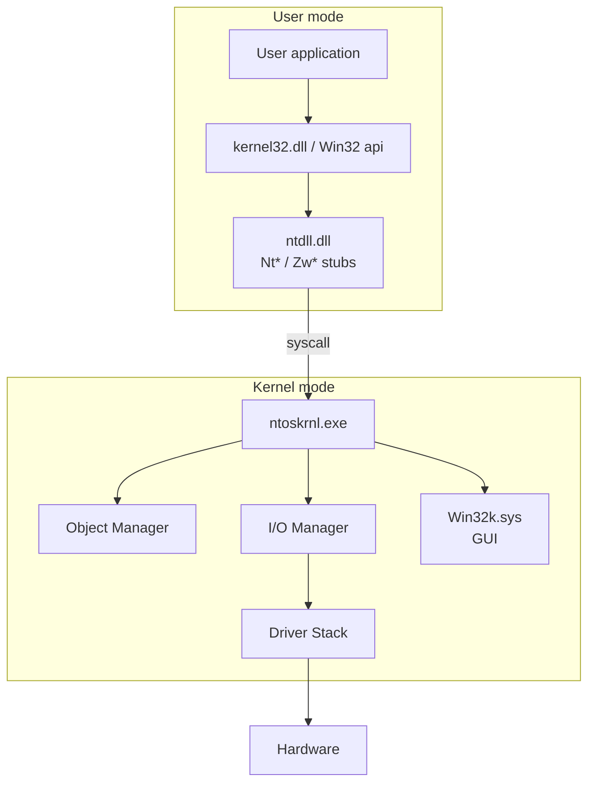

# OS internals: Linux and Windows in depth

## Why internals matter to you

There's no privesc, persistence, EDR evasion, or malware analysis without understanding how the OS works on the inside. This section lays the advanced foundations. You'll use pieces of it in **every** later section (14 exploit dev, 15 reverse, 16 malware, 22 forensics).

## Boot and startup (Linux)

```text
Power → UEFI/BIOS firmware → bootloader (GRUB/systemd-boot) → kernel (vmlinuz) 
   → initramfs (basic drivers) → root filesystem → /sbin/init (PID 1, today systemd)
   → multi-user target → services
```

Places where malware nests:
- **UEFI implant** (LoJax, MosaicRegressor) — survives reinstalls.
- **Bootloader bootkit** (BlackLotus on UEFI Secure Boot 2023 — Baton Drop bypass).
- **Modified initramfs**.
- **systemd unit/timer/service** (section 02).
- **kernel module rootkit** (we'll see later).

### Modern defensive measures
- **Secure Boot**: only bootloaders signed with keys in the firmware.
- **Measured Boot + TPM**: every step is measured (hash), saved in TPM PCRs. They can be validated remotely via attestation.
- **Verified boot** (Android, ChromeOS): trust chain kernel/system.
- **Linux IMA / EVM**: integrity of files at execution time.

## Linux kernel: key areas

### Loadable Kernel Modules (LKM)
The kernel is monolithic but extensible with `.ko`. Loaded with `insmod`/`modprobe`.

```bash
lsmod                          # loaded modules
modinfo nf_conntrack
sudo dmesg | tail              # kernel log
```

**Kernel-mode rootkit:** a module that hooks syscalls, hides processes/files, opens backdoors. Famous ones: Diamorphine, Reptile, knark. Symptoms of compromise: difference between `/proc/*/` direct ls vs `ps`, hidden PIDs, modified `modules` branch.

### eBPF — the "modular kernel" without a module

**eBPF** (extended Berkeley Packet Filter) is a "virtual machine" that lives **inside the kernel** and runs programs sent from userspace. The program is written in restricted C (no unbounded loops, no free pointer arithmetic), compiled to bytecode, **verified** by the kernel before execution (no crash, no out-of-bounds, guaranteed termination).

What it's used for:
1. **Observability** — `bcc`, `bpftrace`, `Pixie`: profilers/tracers with no perceptible overhead. Sees every syscall, every open(), every connect().
2. **Networking** — **XDP** intercepts packets at the network driver level (faster than iptables). **Cilium** replaces kube-proxy.
3. **Security** — **Falco**, **Tetragon**, **Tracee**: in-kernel runtime detection.

#### Example: trace all `openat()` calls with bpftrace

```bash
sudo bpftrace -e '
  tracepoint:syscalls:sys_enter_openat {
    printf("%s %s\n", comm, str(args->filename));
  }
'
```

Instant output for every file opened by any process in the system. Zero `strace`, zero recompile, zero kernel module.

#### As a "sandbox" → better than kernel modules

| | Classic kernel module (`.ko`) | eBPF |
|---|---|---|
| Loading | `insmod` (requires root + signing) | `bpf()` syscall (requires CAP_BPF) |
| Security | accesses all of the kernel | verifier blocks unsafe code |
| Possible kernel crash? | **yes** | **no** (by design) |
| Hot reload | difficult | trivial |
| Kernel upgrade | often breaks | stable ABI |

#### Attacker side / "Bad BPF"

The tool is neutral → it can be abused:
- **Hide processes / files** by hooking listing syscalls.
- **Network backdoor**: filter/trigger on specific packets.
- **Reverse tracing**: eBPF can read memory of other processes (with CAP_BPF/CAP_SYS_ADMIN).
- **Persistence**: eBPF programs "auto-attach" via cgroup/socket programs.

Noisy examples: [boopkit](https://github.com/krisnova/boopkit), [TripleCross](https://github.com/h3xduck/TripleCross), [bad-bpf](https://github.com/pathtofile/bad-bpf).

**Blue team detection:**
- `bpftool prog show` → list loaded programs.
- `cat /sys/kernel/debug/tracing/events/` → active tracepoints.
- Modern EDRs (CrowdStrike, SentinelOne) have a baseline of "legitimate" vs anomalous eBPF.
- Audit `bpf()` syscall via auditd.

### LSM (Linux Security Modules) — MAC

Discretionary access control (DAC) = the classic rwx permissions. **MAC** (Mandatory Access Control) = the kernel enforces rules that not even the owner can bypass.

- **SELinux**: policies per domain (subject, object, class). Modes `enforcing`, `permissive`, `disabled`. Visible in the context (`ls -Z`, `ps -Z`).
- **AppArmor**: profiles per binary, path-based. Simpler than SELinux.
- **smack, Tomoyo**: less common.

In pentesting, an SELinux-confined service can limit exploits even with RCE. In the same processes it's common to find `setenforce 0` as the first action (audit-worthy). SELinux audit log: `/var/log/audit/audit.log`.

### Namespace and cgroup (recap)
Already mentioned: the foundation of containers. `unshare`, `nsenter`, `setns()`. `cgroup v2` unified model. Container breakouts exploit:
- wrong mounts/proc (`/proc/self/exe`, `/sys/fs/cgroup`).
- capabilities left in the container (`CAP_SYS_ADMIN` = nearly host root).
- shared kernel: a kernel LPE = host root from container.

We'll see this in section 19.

### Capabilities (granularity of root)

On Linux, traditional root = omnipotence. Capabilities subdivide it. Examples:
- `CAP_NET_BIND_SERVICE`: bind ports < 1024 as non-root.
- `CAP_SYS_PTRACE`: ptrace other processes.
- `CAP_SYS_ADMIN`: huge, "nearly root".
- `CAP_NET_RAW`: raw sockets (ping, sniffing).
- `CAP_DAC_OVERRIDE`: bypass DAC permissions.
- `CAP_CHOWN`: chown without being owner.

Visible with `getcap`, set with `setcap`. `capsh --print` shows the effective ones of the current process.

### seccomp
Restricts the syscalls a process can make. Modes:
- `SECCOMP_MODE_STRICT`: only `read`, `write`, `exit`, `sigreturn`.
- `SECCOMP_MODE_FILTER`: BPF programs decide.

Used in: Chrome sandbox, Docker, systemd (`SystemCallFilter=`), modern runtimes.

### Linux Audit (auditd)

```bash
auditctl -l
auditctl -w /etc/passwd -p wa -k passwd_changes
ausearch -k passwd_changes
```

Logs syscall events to a userland daemon. Heavy but crucial for detection. Falco and Sysmon-for-Linux are modern alternatives.

### Analysis tools
- `strace -fp PID` — trace syscalls.
- `ltrace` — trace libcalls.
- `perf` — kernel + user profiling.
- `bpftrace 'tracepoint:syscalls:sys_enter_openat { printf("%s %s\n", comm, str(args->filename)); }'` — eBPF one-liner.
- `dmesg`, `journalctl -k`, `journalctl -u service`.

## Linux privilege escalation — how it's done

From unprivileged user → root. Common paths:

1. **Kernel exploit** — unpatched CVE, module bug. E.g.: DirtyPipe (CVE-2022-0847), DirtyCow (CVE-2016-5195), pwnkit polkit (CVE-2021-4034). Reliable but leaves crash traces.
2. **Buggy SUID binaries** — GTFOBins. E.g.: `find / -perm -4000` → check if `vim`, `nmap`, `awk` are setuid → shell escape.
3. **Misassigned capability** — `getcap -r / 2>/dev/null` → e.g. `python3` with `cap_setuid+ep` → privesc.
4. **Sudo misconfig** — `sudo -l` shows what you can do. If I can run `/usr/bin/less` as root → shell escape with `!sh`. If `NOPASSWD` on a command with a wildcard → typical bypass.
5. **PATH hijacking** — root script calls `tar` without an absolute path, and the user controls a directory in PATH that precedes `/usr/bin`. Create malicious `tar`.
6. **LD_PRELOAD/LD_LIBRARY_PATH** — when allowed by config (sudoers `env_keep`), library injection.
7. **Vulnerable cron jobs** — root script in a world-writable directory.
8. **Exposed local services** (Redis without auth bound on 0.0.0.0, Docker socket /var/run/docker.sock readable by your group → host escape).
9. **NFS no_root_squash** + share mount.
10. **Plaintext credentials** in `.bash_history`, `~/.aws/credentials`, `.git/config`, logs.

Tools: **LinPEAS**, **linenum**, **linux-smart-enumeration**, **LinEnum**. Run one, read output, follow the leads.

### Exercise 6.1 — Privesc Lab
Go to TryHackMe → "**Linux PrivEsc**" and "**Linux PrivEsc Arena**". They're guided, all vectors above are there.

## Windows internals — overview

Different kernel model but similar properties. Key points:

### Architecture



Windows applications call Win32 APIs (`CreateFileW`) which internally call `Nt*`/`Zw*` from `ntdll.dll`, which performs the actual syscall. Each version of Windows has **different syscall numbers**: malware doing "direct syscall" must resolve them at runtime.

### Processes, threads, fibers
- **Process** (PID): EPROCESS struct in the kernel. Contains PEB (Process Environment Block) in user mode.
- **Thread** (TID): ETHREAD/TEB.
- **Job**: groups of processes with quotas/limits.
- **Service**: SCM (Service Control Manager) manages them.

### Token
Every process has an **access token** that represents the security context:
- **SID** of the user.
- **Group SIDs** + flags (enabled, mandatory, ...).
- **Privileges** (e.g. `SeDebugPrivilege`, `SeImpersonatePrivilege`, `SeBackupPrivilege`).
- **Owner, primary group, default DACL**.
- **Integrity level** (Low, Medium, High, System).

Attacks often go through:
- **Token impersonation / theft**: steal a SYSTEM process token. Tools: `incognito`, `Token Manipulation` in Cobalt Strike, Rubeus for Kerberos.
- **JuicyPotato / RoguePotato / PrintSpoofer**: if you have `SeImpersonatePrivilege` (default for service accounts), UAC bypass/privesc from service → SYSTEM.

### Integrity level
Windows' flavor of MAC. A Low process cannot write to High/System objects. By default IE/Edge tabs run Low (sandbox isolation).

### ACL and DACL
Every securable object (file, registry key, process, mutex) has a security descriptor → **DACL** (Discretionary ACL) + **SACL** (audit) + Owner + Group.

ACEs (entries): `Allow/Deny` + SID + Access Mask (e.g. `GENERIC_READ | DELETE`).

### Registry
Hierarchical DB. Hives:
- `HKLM` (HKEY_LOCAL_MACHINE) — system config.
- `HKCU` (CURRENT_USER) — current user config.
- `HKU` — all users.
- `HKCR` — Classes (file associations).
- `HKCC` — current config.

Hot keys for security:
- `HKLM\Software\Microsoft\Windows\CurrentVersion\Run` — autorun at startup.
- `HKCU\...\Run` — per user.
- `HKLM\System\CurrentControlSet\Services` — services.
- `HKLM\System\CurrentControlSet\Control\Lsa` — LSA config (NTLM, Kerberos).
- `HKLM\Software\Microsoft\Windows NT\CurrentVersion\Image File Execution Options` — IFEO (debugger, also for persistence/evasion).

### UAC (User Account Control)
When an Admin user runs something, they're given a "filtered" token (Medium IL) by default. To run at high integrity, UAC prompt. **UAC bypasses** are many (CMSTPLUA, ICMLuaUtil, fodhelper, eventvwr, sdclt — see UACMe). Microsoft doesn't consider them security bugs because UAC is "convenience", not a "security boundary".

### Mandatory Integrity (recap) and AppContainer
AppContainer (UWP/EDGE old) — sandbox tighter than Low IL. Modern Win32 apps can use AppContainer manually. Windows Sandbox & WDAG are based on Hyper-V containers.

### Windows Defender + ASR + WDAC + AMSI
- **Defender** built-in AV/EDR.
- **ASR** (Attack Surface Reduction) rules block risky behaviors (Office spawning macros, scripts from email, …).
- **WDAC / AppLocker**: code integrity policy. Specifies allowed signed binaries/scripts.
- **AMSI** (Antimalware Scan Interface): script engines (PowerShell, JScript, VBScript, MSHTA, MS Office macro) pass content to AMSI before executing it, which offers it to Defender. **AMSI bypass** is an art:
  - in-memory patch of `AmsiScanBuffer`.
  - PowerShell reflection on the `amsiInitFailed` field.
  - hooking of `AMSI.dll`.

### Sysmon (Sysinternals)
Detailed logging driver (process creation with cmdline+hash, file mod, network, image load, DNS, named pipe, registry, WMI...). Output to Event Log. **Daily bread for SOCs**. The community has well-known configs (SwiftOnSecurity, Olaf Hartong) — adapt them to your needs.

### ETW (Event Tracing for Windows)
Kernel + user tracing. Modern EDRs hook here (ETW providers). **ETW bypass / patching** is an advanced technique.

## Windows privilege escalation

Like Linux but with specifics:

1. **Token privileges** — if you have `SeImpersonatePrivilege` / `SeAssignPrimaryTokenPrivilege` → Potato attack → SYSTEM.
2. **Unquoted Service Path** — service path `C:\Program Files\My App\bin\app.exe` not quoted: if the attacker can write `C:\Program.exe` or `C:\Program Files\My.exe` → executed by SYSTEM at startup.
3. **Weak Service Permissions** — a High-integrity service but anyone can `sc config` or replace the binary.
4. **AlwaysInstallElevated** — registry keys that allow elevated MSI installs for any user → privesc.
5. **DLL Hijacking / Sideloading** — application looks for DLLs in a specific order; if the attacker writes in a writable dir read first → loads malicious DLL.
6. **Credentials** — `c:\unattend.xml`, GPP cpassword, `c:\Windows\Panther\`, Credentials Manager, browser, saved RDP.
7. **Print Nightmare** (CVE-2021-34527), **EFSPotato**, **CertifiedPotato** — known public exploits.
8. **AD-related** (section 13): cached tokens, Kerberos.

Tools: **WinPEAS**, **SharpUp**, **PowerUp**, **PrivescCheck**, **Watson** (missing patch?).

## Sysinternals — tools you must know

- **Process Explorer** — task manager pro.
- **Process Monitor (procmon)** — per-event log: file/registry/network/process. Filter it. When an app fails or malware does something, you see it.
- **Autoruns** — shows ALL autostart entries (Run keys, services, scheduled tasks, drivers, shell extensions...). The first tool opened on a suspicious system.
- **TCPView** — TCP/UDP connections with process.
- **Handle** — open handles.
- **PsExec / PsList / PsKill** — remote admin.
- **Sigcheck** — verifies digital signatures.
- **Strings** — extracts strings from binaries.
- **WinObj** — explores the Object Manager namespace.

All on [docs.microsoft.com/sysinternals](https://learn.microsoft.com/sysinternals/) or `live.sysinternals.com`.

## PE format (overview)

A Windows executable is a PE/COFF: legacy DOS header, `PE\0\0` PE signature, COFF header, Optional Header (entry point, ImageBase), sections (.text, .data, .rdata, .reloc, .rsrc), import table (IAT — imported libraries and functions), export table.

Reverse engineering and malware analysis techniques (section 15) lean on this. **Tools:** `dumpbin`, `pestudio`, `CFF Explorer`, `Detect It Easy`.

## Exercises

### Exercise 6.2 — Explore a Windows service
1. Launch `Process Explorer` as admin.
2. Find the `lsass.exe` process. Which user? Integrity? Which handles does it have (named pipes, registry)?
3. `Threads` tab — how many threads? Stack of one → see the functions in `ntdll`/`lsasrv`.
4. Why is LSASS the preferred credentials target (Mimikatz, secretsdump)?

<details><summary>Hint</summary>

LSASS keeps in memory: NTLM hashes of logged-in users, Kerberos tickets, DPAPI master key credentials. `Mimikatz sekurlsa::logonpasswords`, `lsadump::dcsync`. That's why Microsoft introduces **Credential Guard** (Hyper-V isolates LSASS in a Secure Kernel VM), and Defender protects LSASS from process dumping with ASR rules.

</details>

### Exercise 6.3 — Procmon on a suspicious process
Launch any binary and capture with Procmon: how many file/registry operations does it perform in 5 seconds? Filter by process name. How many DLL loads?

### Exercise 6.4 — Linux capabilities privesc
On a VM where the user has the `cap_setuid+ep` cap on `/usr/bin/python3`:

```bash
python3 -c 'import os; os.setuid(0); os.system("/bin/bash")'
```

Explain. What mitigates it? What should you never do?

<details><summary>Solution</summary>

`setcap cap_setuid+ep /usr/bin/python3` lets anyone running `python3` call `setuid` with any UID. The binary doesn't check who calls it. Immediate privesc to root. **Never give cap_setuid to a generic interpreter.** Capabilities go on single-purpose binaries (e.g. `ping` with `cap_net_raw`).

</details>

### Exercise 6.5 — Sudo misconfig
File `/etc/sudoers.d/deploy`:

```text
deploy ALL=(root) NOPASSWD: /usr/bin/find /etc/myapp -name *.log -delete
```

Find the bypass.

<details><summary>Solution</summary>

- `find` has `-exec`. The user can pass any `*.log` (wildcard expanded by the shell): `sudo find /etc/myapp -name 'anything.log' -delete -exec /bin/bash \;`
- Or: an unquoted wildcard in sudoers lets you inject options. On `sudo find /etc/myapp -name *.log -delete`, the user can create filenames that become flags (e.g. a file named `--exec=...`).
- GTFOBins on `find`.

Lesson: never sudo with wildcards. Never sudo to `find`, `vi`, `less`, `awk` without restrictions. Use an explicit wrapper.

</details>

### Exercise 6.6 — Sysmon config
Download [sysmon-modular](https://github.com/olafhartong/sysmon-modular) (Olaf Hartong). Install Sysmon with `sysmonconfig.xml`. Run `cmd /c whoami`. Open Event Viewer → Applications and Services → Microsoft → Windows → Sysmon → Operational. Do you see event 1 (Process Create)? Which parent? Which image hash?

### Exercise 6.7 — Strace an app
`strace -f -e trace=openat,read,write,connect,socket curl https://example.com`. Explain the syscalls you see. Which syscall opens the TCP connection?

### Exercise 6.8 — eBPF observability one-liner

```bash
# List syscalls made by a PID for 10 seconds
sudo bpftrace -e 'tracepoint:raw_syscalls:sys_enter /pid == 1234/ { @[probe] = count(); } interval:s:10 { exit(); }'

# Files opened in write mode by anyone
sudo bpftrace -e 'tracepoint:syscalls:sys_enter_openat /args->flags & 1/ { printf("%s %s\n", comm, str(args->filename)); }'
```

Try it. Explain what each one does.

## Key concepts

1. **Linux:** monolithic kernel, LKM, eBPF, namespaces, cgroups, capabilities, seccomp, LSM.
2. **Windows:** processes/threads, tokens, SID, ACL, IL, UAC, registry, services, Sysmon, ETW, AMSI.
3. **Linux privesc:** SUID, capability, sudo misconfig, kernel exploit.
4. **Windows privesc:** token privileges (Potato), unquoted service path, weak ACL, DLL hijack.
5. **In-host detection:** SELinux/AppArmor + auditd + Falco on Linux; Sysmon + ETW + EDR on Windows.
6. **Memorize:** Process Explorer, Autoruns, Procmon, strace, bpftrace.

The next sections lean on this. Start to "see" a computer as made of processes, tokens, syscalls, memory map, descriptors. No longer "Word", "Chrome".
