# OSINT and reconnaissance

> *"Recon is 80% of pentest."* Knowing the target — domains, IPs, technologies, people, dependencies — is what distinguishes a "tool-driven" pentest from a targeted and effective one.

## Passive vs active recon

| | Passive | Active |
|---|---|---|
| Definition | Collection from public sources, without touching the target | Direct interaction with the target (probe) |
| Risk for target | None | Visible in logs/IDS |
| Examples | Google, public DNS, CT logs, leaks, social | nmap, web fuzzing, banner grabbing |

In red team / engagements with high OPSEC: you maximize passive before moving to active. In day-to-day bug bounty: you often go straight to active because the scope allows it.

## Domain and subdomain discovery

### Passive

**Certificate Transparency logs** — anyone who issues a TLS cert has to log it. The log is public. Therefore you can enumerate subdomains of `example.com` simply by reading CT:

```bash
curl -s "https://crt.sh/?q=%25.example.com&output=json" | jq -r '.[].name_value' | sort -u
```

**Passive DNS aggregators:**
- `subfinder -d example.com` — uses dozens of sources.
- `amass enum -passive -d example.com`.
- `assetfinder example.com`.
- `chaos`/`dnsx` (Project Discovery).
- Censys / SecurityTrails / VirusTotal passive DNS.

**Misc:**
- Google dorking (see below).
- GitHub: code often mentions endpoints, subdomains, env URLs.
- Wayback Machine (`waybackurls`), CommonCrawl (`gau`).

### Active

**DNS bruteforce** — you query resolvers with a wordlist of candidates:

```bash
amass enum -active -d example.com -brute -w subs.txt
ffuf -u https://FUZZ.example.com -w subs.txt
dnsx -d example.com -w subs.txt -resp-only
```

Notable wordlists: **commonspeak2**, assetnote's **all.txt**, **bug-bounty-wordlists**.

**Permutation** — combining known names (e.g. `dev-api.example.com`, `api.staging.example.com`). Tools: `gotator`, `dnsgen`, `altdns`.

**Reverse DNS sweep** on CIDR ranges published for the org.

## IP, ASN, infrastructure discovery

- **WHOIS** of the domain + IP range. `whois example.com`, `whois 1.2.3.4`. RIRs: ARIN (USA), RIPE (EU+ME), APNIC (Asia/Pacific), AFRINIC, LACNIC.
- **ASN lookup**: `whois -h whois.cymru.com " -v 8.8.8.8"`, `bgp.he.net`, `ipinfo.io/AS15169`.
- **Reverse IP**: which domains point to the same IP? Useful for shared hosting. SecurityTrails, ViewDNS.
- **BGP feeds** — `bgp.tools`, `ripestat`, `team-cymru`.

For a large org: you find the ASN → derive all the prefixes → enumerate public hosts.

## Shodan / Censys / FOFA / ZoomEye

Search engines **for devices** (not for pages). They constantly scan the internet, indexing banners.

```text
# Shodan (CLI: shodan)
hostname:"example.com"
ssl.cert.subject.cn:"*.example.com"
http.title:"Login"
port:445 country:"IT" org:"banca"
product:Jenkins
http.html:"Welcome to nginx" port:80
```

```text
# Censys (UI / API)
services.tls.certificates.leaf_data.subject.common_name: example.com
parsed.names: example.com and parsed.issuer.organization: Let's Encrypt
```

For red team pentesting:
- Find exposed services (Jenkins, RDP, FTP, Mongo with no auth).
- Find branded login pages (login page with the company logo).
- Find pre-prod web apps (`staging-*`, `dev-*`).

> **Censys** also includes SSH/SMTP/etc. scans, shows historical infrastructure views. **FOFA / ZoomEye** are Chinese equivalents, often with different coverage.

## Google dorking (and other search engines)

Useful operators:

| Operator | Meaning |
|---|---|
| `site:` | restrict to a domain |
| `inurl:` | in the path/URL |
| `intitle:` | in the `<title>` |
| `intext:` | in the body |
| `filetype:` or `ext:` | file extension (pdf, sql, log, env) |
| `cache:` | Google cache |
| `-term` | exclude term |
| `"exact"` | exact phrase match |
| `OR`, parentheses | logic |

Classic examples (Google Hacking DB — GHDB at [exploit-db.com/google-hacking-database](https://www.exploit-db.com/google-hacking-database)):

```text
site:example.com ext:sql
site:example.com inurl:admin
site:example.com filetype:env intext:"DB_PASSWORD"
site:pastebin.com "example.com" "@example.com" password
intitle:"index of" "parent directory" site:example.com
```

**Alternative engines**: Bing, DuckDuckGo, Yandex (often indexes different things), Baidu, Mojeek.

## OSINT on people and organizations

**Tooling:**
- **theHarvester** — emails + subdomains from search engines.
- **Maltego CE** — graph of entities (person, domain, IP, email).
- **Spiderfoot** — orchestrator of many sources.
- **Recon-ng** — modular framework.
- **Sherlock** — username on 300+ social networks.
- **Holehe** — checks whether an email is registered on services (without logging in).
- **Maigret** — usernames on social, extended.
- **EPIEOS** — OSINT tool for email/account discovery.
- **Have I Been Pwned** — email/domain in known leaks.
- **Dehashed**, **IntelligenceX** — leak databases.
- **OSINT Framework** ([osintframework.com](https://osintframework.com)) — taxonomy of tools.

For a **person target**:
- LinkedIn → role, tech stack, colleagues (useful for phishing).
- Twitter/Mastodon → opinions, interests.
- GitHub → projects, emails in commits (`git log --format='%ae %an'`), API keys in history.
- Photos → EXIF metadata (gps, model).
- Addresses/events → Google Maps Street View, OpenStreetMap.

**Ethical/legal limits:** even if everything is public, **systematic collection** of personal data is subject to GDPR. Document the scope of the engagement.

## Tech stack discovery

On a web target:

```bash
whatweb https://example.com
wafw00f https://example.com    # detects WAFs
nuclei -u https://example.com -t technologies/
httpx -title -tech-detect -status-code -l hosts.txt
```

What to look for:
- Server: nginx/Apache/IIS + version → known CVEs.
- Framework: Rails/Django/Express/Spring → patterns.
- CMS: WordPress/Drupal/Joomla → plugin/theme vuln (wpscan).
- JS framework: React/Vue/Angular + bundle (sourcemap?).
- Server / X-Powered-By / X-AspNet-Version headers.
- Distinctive 404 pages.
- Cookie names (PHPSESSID, JSESSIONID, ASP.NET_SessionId, …).

## OSINT on code

GitHub is a goldmine:

```text
# Exposed code of the org
org:acme            # Github advanced search
filename:.env "DB_PASSWORD"
"smtp.gmail.com" "password" extension:py
"BEGIN RSA PRIVATE KEY"
```

Dedicated tools:
- **Gitleaks**, **trufflehog**, **gitrob** — scan history for secrets.
- **gh-dorker**, **github-search**.
- **Sourcegraph** for cross-repo search.

For private repos historically exposed, check the **Wayback Machine** of the GitHub profiles (rare but it happens).

## Mobile code

- Google Play / App Store → `apkpure`, `apkmirror` to download APKs.
- Decompile with **jadx**, **apktool**, **MobSF** → URLs, API keys, internal endpoints.

## Public threat intelligence

To enrich OSINT with data on "what's out there":

- **AlienVault OTX** (open threat exchange) — IOCs.
- **VirusTotal** — file/url/IP/domain reputation.
- **AbuseIPDB** — malicious IPs reported.
- **GreyNoise** — who is internet-wide "noise" (Shodan crawlers, etc.) vs. targeted.
- **URLScan.io** — public URL sandbox.
- **CTI feeds**: ThreatFox (abuse.ch), MalwareBazaar (abuse.ch), URLhaus.

## Typical recon workflow (for pentest/bug bounty)

```mermaid
flowchart TB
    SC[1. Scope<br/>what is in / out] --> AS[2. Asset acquisition]
    AS --> SUB[subdomains<br/>passive + active]
    AS --> IP[IP / ASN / netblock]
    AS --> GH[GitHub / docs /<br/>mobile app / partners]
    SUB --> LC[3. Live check<br/>httpx -title -tech]
    IP --> LC
    GH --> LC
    LC --> MAP[4. Mapping<br/>spreadsheet · BloodHound]
    MAP --> PR[5. Priority<br/>login · API · staging · CMS]
    PR --> VS[6. Vulnerability scan<br/>nuclei · nikto]
    VS --> MT[7. Manual web testing<br/>Burp · business-critical]
    style MT fill:#3a2a00,stroke:#ffe066
```



1. **Scope**: what's in scope (domains, IPs, mobile, API). What is NOT.
2. **Asset acquisition**:
   - subdomains (passive + active).
   - IP/ASN.
   - GitHub / docs / mobile apps / partner portals.
3. **Live check**: who responds? `httpx -l domains.txt -title -status-code -tech-detect -follow-redirects`.
4. **Mapping**: organize into a spreadsheet/Notion/BloodHound.
5. **Priority**: promising targets (login portals, APIs, old staging, well-known CMSs).
6. **Vulnerability scan**: nuclei, nikto.
7. **Manual web testing**: Burp, focus on business-critical parts.

In red team add: **people** (phishing targets), **cloud/AD infrastructure**, **MFA absence detection**.

## OPSEC while doing recon

Even passive activity leaves traces:
- From which IP do you query Shodan/Censys? They are logged.
- Tools like `amass active` make thousands of DNS queries → the target's authoritative NS sees them.
- Tests on corporate login pages → IDP logs.

For serious engagements:
- Use a **dedicated VPS** for the active footprint.
- **Tor / proxy chain** when appropriate.
- Realistic User-Agents.
- Human rate limits.
- Coordinate traffic with the client.

## Exercises

### Exercise 8.1 — Map a public company
Pick a public company (e.g. one with a public bug bounty on HackerOne — hypothetical `acme.com`). Without sending a single active packet to the target:
1. How many subdomains can you find from CT logs + aggregators?
2. Which ASNs/IP ranges?
3. How many GitHub repos for the org?
4. Any leaks on HIBP?

> Work carefully: passive scope only. For active: only if the bug bounty program allows it.

### Exercise 8.2 — Guided DNS enum
On `tryhackme.com` or an HTB target domain:

```bash
subfinder -d target.com -all -silent > subs.txt
amass enum -passive -d target.com >> subs.txt
sort -u subs.txt -o subs.txt

httpx -l subs.txt -title -status-code -tech-detect -o live.txt

cat live.txt | grep -iE "admin|login|dev|staging|internal"
```

### Exercise 8.3 — Shodan dorking
With a free Shodan account:
- `org:"target Inc"` how many hosts?
- `ssl.cert.subject.cn:"*.target.com"` compare with the previous result.
- `port:3389 country:"IT"` (RDP exposed in Italy, tens of thousands).
- `product:Jenkins http.html:"Dashboard"` — exposed Jenkins.

Document what you see. **Do not interact** with hosts found.

### Exercise 8.4 — Email harvesting
`theHarvester -d example.com -b all`. How many emails? Match against HIBP? Phishing-ready list?

### Exercise 8.5 — GitHub secrets
On a demo repo (e.g. yours, with a fake secret committed and then removed):

```bash
trufflehog filesystem --directory .
trufflehog git file:///path/to/repo
gitleaks detect --source=. -v
```

Do you find the secret? Even though it was removed in a subsequent commit?

### Exercise 8.6 — APK OSINT
Download a public APK (e.g. yours or open source) with `apkpure`:
- `jadx-gui app.apk` → decompile.
- Look for URLs: `grep -rEi "https?://[^\"']+" sources/`
- Look for keys: `grep -rEi "api[_-]?key|secret|token" sources/`

What do you find in `strings.xml`, AndroidManifest, certificate?

### Exercise 8.7 — TryHackMe room
TryHackMe has free rooms: "OhSINT", "Searchlight - IMINT", "OSINT". They're guided. Do them.

### Exercise 8.8 — Maltego
Install Maltego CE. Run public transforms on `example.com`. Build a graph with: domains, IPs, emails, people.

## Key concepts

1. **Passive first**: maximize what you obtain without touching the target.
2. **CT logs** = a goldmine of subdomains.
3. **Shodan/Censys** = a map of the attack surface exposed on the internet.
4. **GitHub and dorks** often reveal keys and architectures.
5. **Iterative recon**: every discovery opens new targets.
6. **OPSEC even in passive** when it's red team.
7. **Document**. A good report is born from good recon.

Now we move on to active weapons: scanning and enumeration.
