# Scanning, enumeration and fingerprinting

> Once you have the **hosts**, you need to turn them into a **list of surfaces**. Service, version, config, authentication, web content, shares, default credentials. This is the section that separates those who know how to use nmap from those who only know `nmap -A`.

## Host discovery

Before scanning ports, you need to know which hosts are "alive". Techniques:

```bash
nmap -sn 10.10.10.0/24                 # ping scan, no port (requires root for ICMP/ARP)
nmap -PE -PP -PM 10.10.10.0/24         # ICMP echo, timestamp, mask
nmap -PR 192.168.1.0/24                # ARP (LAN, more reliable)
nmap -PS22,80,443 -PA80 10.10.10.0/24  # TCP SYN/ACK probe to known ports
nmap -PU53,161 10.10.10.0/24           # UDP probe
nmap -n -sn -PE 10.0.0.0/16            # no DNS resolve, fast
```

On a LAN: ARP is the truth (no host can "hide" from ARP if it's on the same segment and has an IP). On WAN: ICMP is often filtered. Best to combine TCP SYN on typical ports (80, 443, 22, 3389).

### Alternatives (faster)
- **masscan**: ultra-fast SYN scan. `masscan -p1-65535 10.0.0.0/16 --rate 10000 -oL out.txt`. Half a ms more but transmits raw packets at insane speeds.
- **naabu** (Project Discovery): modern scriptable scanner, supports sd-only.
- **rustscan**: fast wrapper that then passes results to nmap.

Classic pipeline:
```bash
naabu -l hosts.txt -p - -silent -o ports.txt
nmap -sV -sC -iL ports.txt -oA nmap_full
```

## Port scanning with nmap — the flags you need to know

```bash
# Scan modes
nmap -sS target            # SYN scan (default for root, "half open")
nmap -sT target            # TCP connect scan (no root, completes handshake)
nmap -sU target            # UDP scan (slow, combine with --top-ports)
nmap -sA target            # ACK scan (identify stateful vs stateless firewall)
nmap -sF -sN -sX target    # FIN/NULL/XMAS — bypass simple firewalls
nmap -sY target            # SCTP INIT

# Ports
nmap -p-                   # all 1-65535
nmap -p1-1024
nmap -p 80,443,8080-8090
nmap --top-ports 1000      # the 1000 most common
nmap -p T:80,U:53          # mix TCP+UDP

# Service + scripts
nmap -sV                   # version detection (banner + probe)
nmap -sC                   # default safe scripts (NSE)
nmap -A                    # aggressive: -sV -sC -O --traceroute
nmap --script vuln         # vuln detection scripts (watch out: noisy)
nmap --script "smb-* and safe" -p445

# OS detection
nmap -O                    # TCP/IP fingerprint
nmap --osscan-guess

# Timing
nmap -T0 ... -T5           # paranoid -> insane. Default T3
nmap --min-rate 1000 --max-retries 1

# Output
nmap -oA basename          # produces .nmap .gnmap .xml
nmap -oN -                 # stdout

# Evasion
nmap -f                    # fragment packets
nmap --mtu 24
nmap -D RND:10 target      # decoy (10 fake IPs + yours)
nmap -S spoofed            # spoof source IP (requires -e and routing)
nmap --source-port 53      # fake DNS source
nmap --data-length 50      # random payload padding
nmap --badsum              # wrong checksum to test IDS

# Performance vs accuracy
nmap -Pn                   # no host discovery (assume alive)
nmap -n                    # no DNS resolution
```

### Interpreting port states

- **open** — responds with SYN-ACK / data.
- **closed** — responds with RST.
- **filtered** — no response or ICMP unreachable -> firewall in between.
- **unfiltered** (only with `-sA`) — accessible but state unknown.
- **open|filtered**, **closed|filtered** — ambiguous (typical for UDP).

### NSE — Nmap Scripting Engine

`/usr/share/nmap/scripts/` contains ~600 Lua scripts. Categories: `auth`, `broadcast`, `brute`, `default`, `discovery`, `dos`, `exploit`, `external`, `fuzzer`, `intrusive`, `malware`, `safe`, `version`, `vuln`.

Useful examples:

```bash
nmap --script ssl-enum-ciphers -p 443 target
nmap --script ssh2-enum-algos -p 22 target
nmap --script http-enum,http-headers,http-title -p 80,443 target
nmap --script smb-os-discovery,smb-enum-shares,smb-vuln-* -p 139,445 target
nmap --script ftp-anon,ftp-bounce -p 21 target
nmap --script ldap-rootdse,ldap-search -p 389,636 target
nmap --script dns-zone-transfer --script-args dns-zone-transfer.domain=target.com -p 53 ns1.target.com
nmap --script smtp-enum-users,smtp-vuln-cve* -p 25 target
nmap --script rdp-enum-encryption,rdp-vuln-ms12-020 -p 3389 target
nmap --script ssh-auth-methods --script-args ssh.user=admin -p 22 target
```

NSE isn't "the magic hacking tool", but it's excellent for *enumeration*. Most `*-vuln-*` scripts check specific CVEs; don't expect them to find everything.

## Manual banner grabbing

```bash
nc -nv target 22       # SSH banner
nc -nv target 21       # FTP banner
echo -e "GET / HTTP/1.0\r\n\r\n" | nc -nv target 80   # HTTP raw

# HTTPS
openssl s_client -connect target:443 -servername target -quiet
GET / HTTP/1.1
Host: target

# SMB
nbtscan target
smbclient -L //target -N            # list shares anonymously
smbmap -H target -u guest -p ""

# SNMP
snmpwalk -v2c -c public target
onesixtyone -c communities.txt target

# LDAP
ldapsearch -x -H ldap://target -s base -b "" "(objectClass=*)"

# DNS
dig @target version.bind chaos txt   # DNS server version
```

## Enumeration of specific services

### SMB / NetBIOS
```bash
nmap -p139,445 --script smb-os-discovery,smb-enum-shares,smb-enum-users,smb-protocols target
enum4linux-ng -A target
smbclient -L //target -N
smbclient //target/share -N
smbmap -u user -p pass -H target
crackmapexec smb target -u users.txt -p passwords.txt
# (in AD pentest: ntpassword spray, Kerbrute — section 13)
```

### NFS
```bash
showmount -e target
mount -t nfs target:/share /mnt -o nolock
```

### FTP
```bash
ftp target          # try anonymous
nmap --script ftp-anon target
```

### HTTP/HTTPS — web enumeration

```bash
# Content / endpoint discovery
gobuster dir -u https://target -w /usr/share/wordlists/dirb/big.txt -k -t 50
gobuster vhost -u https://target -w subs.txt
feroxbuster -u https://target -w big.txt -k -t 100 -d 4
ffuf -u https://target/FUZZ -w big.txt -e .php,.html,.bak -mc 200,301,302,403

# Parameter fuzzing
ffuf -u 'https://target/api/user?FUZZ=value' -w params.txt -fs 0

# Subdomain fuzz via Host header (vhost)
ffuf -u https://target -H "Host: FUZZ.target.com" -w subs.txt -fs 1234

# WAF detection
wafw00f https://target

# Tech stack
whatweb https://target
webanalyze -host https://target

# Headers, scope
curl -I https://target
nikto -h https://target
```

**Recommended wordlists:**
- **SecLists** (Daniel Miessler): `git clone https://github.com/danielmiessler/SecLists`. Tons of themed lists.
- **dirsearch wordlists**.
- **Assetnote wordlists** (industry standard).
- **rockyou.txt** (in Kali under `/usr/share/wordlists`).

### CMS-specific
```bash
wpscan --url https://target --enumerate p,t,u
joomscan -u https://target
droopescan scan drupal -u https://target
```

### Nuclei — the template engine

[Nuclei](https://github.com/projectdiscovery/nuclei) by Project Discovery: scanner based on community-driven YAML templates. Thousands of public checks.

```bash
nuclei -update-templates
nuclei -u https://target
nuclei -l targets.txt -severity critical,high
nuclei -t exposures/ -l targets.txt
nuclei -t cves/2023/ -l targets.txt
nuclei -t technologies/ -l targets.txt
```

Very fast, very up to date. JSON/JSONL output -> integrate with other tools. Writing templates is an extra skill.

### SSH
- Version (`SSH-2.0-OpenSSH_x.y`) -> CVE (see USN advisory).
- Algorithms: `nmap --script ssh2-enum-algos`.
- User enumeration via timing (historic CVE-2018-15473 OpenSSH).
- Brute force: `hydra -L users.txt -P pass.txt -t 4 ssh://target` (in the lab!).

### Mail
```bash
nmap --script smtp-commands,smtp-enum-users target -p 25
swaks --to test@target --server target
```

### Databases
- **MySQL** 3306: `mysql -h target -u root` (no password?), `nmap --script mysql-empty-password`.
- **PostgreSQL** 5432: `psql -h target -U postgres`.
- **MongoDB** 27017: `mongo --host target` (no auth common?).
- **Redis** 6379: `redis-cli -h target ping` -> often without auth -> RCE via SSH key write or module load.
- **Elastic** 9200: `curl http://target:9200/_cluster/health`.

## OS fingerprinting

`nmap -O target` sends probes and analyzes:
- TCP options order, MSS, window scale.
- Initial TTL (Win=128, Linux=64, old Sun=255).
- IP ID generation.
- ISN (Initial Sequence Number).

Imprecise if the host filters heavily. Often combined with banners (SSH, HTTP `Server`, SMB).

## Evasion (concepts)

Detection systems look at:
- Packet rate and patterns (fast scan -> alert).
- Source IP (geo/reputation).
- TCP flag anomalies (SYN-FIN combo).
- Signatures of known tools (`nmap` default UA).

Techniques **legal in pentests** when scope allows:
- Slow scan (`-T1`, `--max-rate 50`).
- Decoys (`-D`).
- Source port 53/80 (`--source-port`).
- Fragmentation (`-f`).
- IP rotation (multiple VPS).
- Realistic User-Agent for HTTP.

**Not for fraudulent purposes**: these are for the realism of a test, not to hide against someone else.

## Spray and default credentials

Often "scanning" ends up in:
- Trying default credentials. *Default password lists*: github.com/CISOfy/default-passwords, [datarecovery.com password DB](https://datarecovery.com/rd/default-passwords/).
- Password spray (1 password against N users) to avoid lockout — see section 13 for AD.
- Check exposure of **secrets-as-services** (Jenkins anon job creation, Kibana without auth, Mongo no auth, ...).

## Scanning workflow for pentests

```mermaid
flowchart TB
    A[Host discovery<br/>nmap -sn / ARP] --> B[Fast port scan<br/>naabu top 1000 · masscan]
    B --> C[Full port scan<br/>nmap -p- on the hot ones]
    C --> D[Service version + scripts<br/>nmap -sV -sC]
    D --> E[Targeted NSE<br/>smb-* · http-* · ssl-*]
    D --> F[Web fuzz<br/>ffuf · gobuster · feroxbuster]
    D --> G[CMS-specific<br/>wpscan · joomscan]
    D --> H[Generic Nuclei<br/>cves/ misconfig/ exposures/]
    E --> I[Manual triage<br/>find CVE · write PoC]
    F --> I
    G --> I
    H --> I
    style I fill:#3a2a00,stroke:#ffe066
```



1. **Targeted host discovery**.
2. **Fast port scan** top 1000 (`naabu` or `nmap -F`).
3. **Full port scan** on the hottest hosts (`nmap -p-`).
4. **Service version + default scripts** (`-sV -sC`).
5. **Targeted NSE** for relevant services (`smb-*`, `http-*`, ...).
6. **Web app fuzz** on all 80/443/8080/8443.
7. **CMS-specific** where applicable.
8. **Generic Nuclei**.
9. **Manual triage** on hits.

Document everything. **Standard pentest tool report**: a table of host x service x version x potential CVEs x notes.

## Detection on the blue team side

If you're blue team or defensive:
- Log firewall drops: scans generate many drops on unopen ports.
- IDS (Suricata, Snort) have "ET SCAN ..." rules.
- Correlation: same IP attempting many ports in a short time.
- Honeypots (`opencanary`, `t-pot`) attract scanners.
- Rate limit ACL on firewall.
- Network segmentation: scans shouldn't reach critical IPs from user segments.

## Exercises

### Exercise 9.1 — Full scan on a lab
On Metasploitable 2 (in an isolated lab):

```bash
nmap -sV -sC -p- -T4 --min-rate 500 -oA meta2 192.168.56.20
```

Count the services. Identify:
- Apache, MySQL, vsftpd versions.
- shell shocker (vsftpd 2.3.4 backdoor — it exists).
- distccd (port 3632).
- ingreslock (1524).
- open NFS shares.

How many vulnerabilities does `--script vuln` find?

### Exercise 9.2 — Web enum on DVWA
DVWA lab (in Docker). From Kali:

```bash
gobuster dir -u http://dvwa.local -w /usr/share/wordlists/dirb/common.txt -t 50
nikto -h http://dvwa.local
wpscan --url http://dvwa.local --enumerate p,t,u --random-user-agent
```

What do you find?

### Exercise 9.3 — UDP scan
UDP is the "annoying" one because without a response it's ambiguous. In the lab:

```bash
sudo nmap -sU --top-ports 50 -sV target
```

Identify DNS, DHCP, NTP, SNMP, IPMI (623).

### Exercise 9.4 — Manual banner grabbing
Without nmap, identify the server and version of:
- SSH on port 22: `nc -v target 22`
- HTTP on 80: `printf 'GET / HTTP/1.1\r\nHost: x\r\n\r\n' | nc target 80`
- FTP on 21: `nc target 21`
- SMTP on 25: `nc target 25` -> `EHLO test`

### Exercise 9.5 — Nuclei discovery
On a lab target with many services:

```bash
nuclei -u http://target -t exposures/ -t misconfiguration/ -t default-logins/ -severity medium,high,critical -o findings.txt
```

Discuss the "default-logins" findings: how many? Which services?

### Exercise 9.6 — Custom NSE script
Open an existing NSE script (e.g. `/usr/share/nmap/scripts/http-title.nse`). Read and understand the structure: portrule, action. Write a variant that searches for the string "Login" in the body.

### Exercise 9.7 — HTB Starting Point
On HackTheBox -> Starting Point (free): complete the first 5 machines. They are guided. They'll have you use nmap + gobuster + Metasploit.

### Exercise 9.8 — Explore SecLists
```bash
git clone https://github.com/danielmiessler/SecLists
find SecLists -name "*.txt" | head -20
wc -l SecLists/Discovery/Web-Content/*.txt | sort -rn | head
```

How many use cases are they intended for? Which wordlist would you use for:
- subdomain bruteforce of an IT-only site?
- API endpoint discovery?
- password spray?
- file extension fuzzing?

## Key concepts

1. **Discovery -> Scan -> Enum -> Triage**: rigorous workflow.
2. **nmap is the father**, but masscan/naabu/rustscan are complementary for speed.
3. **NSE scripts** replace many dedicated tools.
4. **Web enum (gobuster/ffuf) is critical**: most of the modern surface is web.
5. **Nuclei** is a fast check machine — it doesn't replace manual testing.
6. **Manual banner grabbing** will come in handy when tools don't work.
7. **Evasion is theater**: yes for realistic tests, but not for malicious intent — only run against authorized systems.

Next step: after mapping everything, **we break into the web application** (OWASP).
