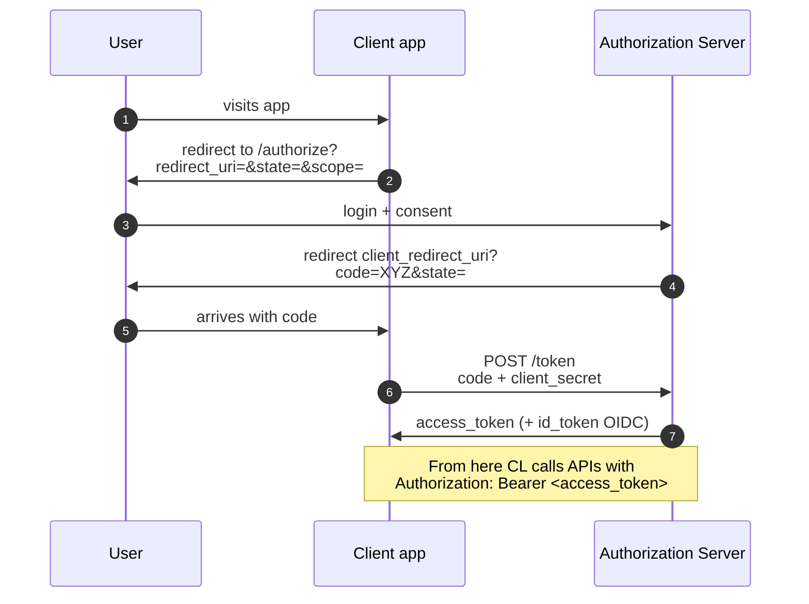
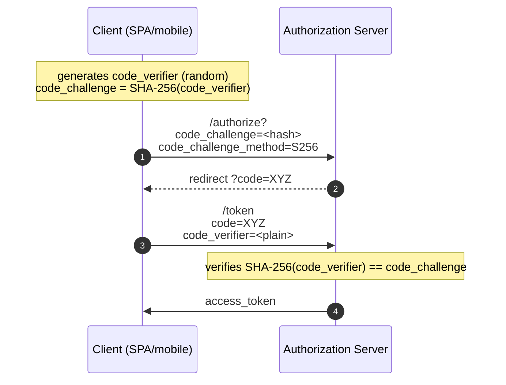

# Advanced web hacking

> The categories from section 10 are 70% of what you'll find. This section covers the 30% that makes the difference between a BSCP/OSWA-level report and a junior with sqlmap.

## Race conditions / TOCTOU web

When an "atomic" server-side operation isn't actually atomic, two nearly simultaneous requests do contradictory things. Examples:

- **Double use of a coupon / voucher**: the "already used?" check and the "use it" application aren't atomic → send 30 requests together → 5 succeed.
- **Double withdraw**: balance check + decrement → 2 requests both see enough balance, both deduct.
- **Account creation race**: 2 users with the same email if the unique check isn't inside a transaction.
- **MFA bypass**: send multiple OTP code attempts in the same "window" before lockout.

### How to test
Tooling: **Burp Repeater "Send group in parallel"** (Tab Group in 2022.10+), **Turbo Intruder** (extension, Python script), or **race-the-web**.

Key technique: James Kettle's **single-packet attack** (2021). On HTTP/2, you send N streams in the **last frame** simultaneously → they arrive at the backend with sub-millisecond offsets. Practically atomic from the backend's point of view.

```python
# Turbo Intruder snippet
def queueRequests(target, wordlists):
    engine = RequestEngine(endpoint=target.endpoint, concurrentConnections=1, requestsPerConnection=30, engine=Engine.BURP2)
    for i in range(30):
        engine.queue(target.req, gate='race1')
    engine.openGate('race1')
```

### Mitigation
- **Lock** at DB level (`SELECT FOR UPDATE` on PostgreSQL).
- Transactions with serializable isolation level + retry.
- **Idempotency key** for payments / critical actions.
- Real rate limit + MFA lockout.
- All-in-one operations: `UPDATE ... WHERE balance >= amount`.

## Prototype Pollution (JS)

In JS, every object inherits from `Object.prototype`. If the app recursively merges user input into a target object with keys like `__proto__`, it can end up modifying `Object.prototype` → global influence over the runtime.

```js
// vulnerable merge
function merge(target, source) {
  for (let key in source) {
    if (typeof source[key] === 'object') {
      merge(target[key], source[key]);  // no __proto__ / constructor check
    } else {
      target[key] = source[key];
    }
  }
}
merge({}, JSON.parse('{"__proto__":{"isAdmin":true}}'));
console.log(({}).isAdmin);  // true!!
```

Consequences:
- **Auth/authorization bypass**: the user object becomes admin.
- **DoS** by modifying base methods.
- **RCE in Node**: if the app uses pollutable properties in dangerous functions (`child_process` envs, template engine config). Famous cases: blitz.js, kibana CVE-2019-7609.

### Test
- Look for modified `Object.prototype.x`.
- Burp DOM Invader or dedicated extensions.
- nuclei template `prototype-pollution-check`.

### Mitigation
- `Object.create(null)` as the container, not `{}`.
- Safe merge library (lodash >= 4.17.12, mergerino).
- `Object.freeze(Object.prototype)` at the entry point (breaks legacy code).
- Schema validation (Ajv) on input.

## JWT attacks

See section 5 for the basics. Practical attacks:

### 1. `alg: none`
Header `{"alg":"none"}` → token without signature. A vulnerable server accepts it.

```text
header: {"alg":"none","typ":"JWT"}
payload: {"user":"admin"}
signature: (empty)
```

### 2. HS256 vs RS256 confusion
The server expects RS256 (asymmetric signature with private key, verify with public key). The attacker sends with HS256, using the **server's public key** (often exposed) as the "HMAC key". If the server takes the public key and uses it as an "HMAC secret", it verifies successfully.

### 3. Weak HS256 secret
Brute force with `hashcat -m 16500` against common wordlists. If the secret is `secret`, `password`, `s3cret`, … → game over.

### 4. `kid` injection
The `kid` (key id) header can be used for SQL injection / LFI / command injection if the server passes it to a DB query / file path. Example: `kid: ../../../../../dev/null` → server reads `/dev/null` as the key → the key is empty → HS with empty secret is valid.

### 5. `jku` / `jwk` / `x5u` confusion
The header says "where to fetch the public key" (`jku`, JWK Set URL). A vulnerable server fetches it without validating the domain → the attacker points to their own JWK → valid signature with their private key.

### 6. ECDSA invalid signature (CVE-2022-21449)
Java 15–18: ES256 verification with `(r=0, s=0)` accepted any signature. Mandatory patch.

### Tool: jwt_tool
```bash
jwt_tool eyJ... -M at        # all tampering attacks
jwt_tool eyJ... -X k -pk pubkey.pem    # try HS/RS confusion
jwt_tool eyJ... -C -d wordlist.txt     # crack HS secret
```

### Mitigation
- Specific exposed algorithms (`alg` whitelist).
- Reject `alg: none`.
- Verify signature with the correct key (separate JWK per alg).
- HS256 secret → 256-bit random, never user-provided.
- `kid` as UUID, whitelist lookup.
- Validate `iss`, `aud`, `exp`, `nbf`.
- Server-side revocation (token blacklist, or short-lived tokens + refresh).

## OAuth 2.0 / OIDC attacks

OAuth Authorization Code flow:



### The "why" of the OAuth flow (the implicit part)

- **Why send `code` instead of `access_token`?** Because the code travels in the browser URL (visible in history, proxy logs, Referer). Sending it instead of the real token limits the damage: the code is single-use, short-lived (30-60 sec), and `client_secret` is needed to exchange it → an attacker who intercepts the code doesn't get the token without the server-side secret.
- **Why `state`?** It's an opaque random value the client generates and includes in the request; the server returns it unchanged. If an attacker tries to kick off an OAuth flow in the victim's browser (CSRF), they don't know `state` → the legitimate client rejects it → no unwanted "social account linking".
- **Why PKCE** (Proof Key for Code Exchange)? In mobile/SPA there's no `client_secret` on the client side (it would be visible to anyone inspecting the app). Without a secret, an attacker who steals the code can call `/token` as if they were the client. PKCE solves this:
  1. Client generates a random `code_verifier` (43-128 bytes).
  2. Computes `code_challenge = SHA-256(code_verifier)`.
  3. `/authorize?code_challenge=...&code_challenge_method=S256`.
  4. At `/token` it sends `code_verifier`.
  5. The server verifies `SHA-256(code_verifier) == code_challenge`.

   The attacker who intercepts the code **doesn't have** the `code_verifier` (random in the client, never in transit) → they can't exchange it. Genius.



**Attacks:**

- **Open redirect via `redirect_uri`**: partial server validation → code leak.
- **State CSRF**: if `state` isn't verified, the attacker injects their own code → the victim logs their own account into the attacker's → account takeover via "link social".
- **Implicit flow + XSS**: deprecated for a reason.
- **Missing PKCE**: SPAs without PKCE are vulnerable to code interception.
- **`response_type` confusion**: switching `code` ↔ `token`.
- **`scope` escalation**: adding scopes during the token request that the consent didn't cover.
- **JWT id_token**: the attacks seen above.
- **Public client secret in JS bundle**: misconfigured confidential client.
- **`prompt=none`** in iframe + fragile targets = silent token exfil via XSS.
- **Cross-Site Scripting in OAuth providers** → catastrophic.

### Mitigation
- Authorization Code + PKCE mandatory for SPA / mobile.
- `redirect_uri` exact match (no wildcards).
- Random, verified `state`.
- HTTPS everywhere.
- Short-lived access tokens + refresh token rotation.
- Strict audience/issuer validation.

## GraphQL security

GraphQL is an API query language: the client composes a query, the server responds.

### Typical vulnerabilities

- **Introspection enabled in production** → the attacker discovers the full schema.
  - Tools: **graphw00f**, **clairvoyance** (if introspection is off, schema-leak via response diff).
- **Missing field/object-level authorization** (BFLA, BOLA): you check "can you call this query?" — what about individual fields?
- **Denial of Service via nested queries**: `user { friends { friends { friends { ... } } } }` → enormous load.
- **Batch queries** (some servers) → DoS, and rate limit bypass for password testing.
- **Field suggestion** (`__schema` errors) leaks info.
- **SQL injection via arguments**: every resolver is code.
- **GraphQL-specific CSRF**: if it accepts `application/json` from a form (rare), CSRF is possible.

### Tools
- **InQL** (Burp extension).
- **graphw00f**: detect server type.
- **clairvoyance**: infer schema without introspection.
- **gqlmap**.

### Mitigation
- Disable introspection in prod.
- Query depth/complexity limit (graphql-depth-limit).
- Persisted queries.
- Resolver-level authorization.

## HTTP Request Smuggling

Discrepancy in how the frontend (CDN/proxy) and the backend interpret request boundaries.

### Variants
- **CL.TE**: frontend uses `Content-Length`, backend uses `Transfer-Encoding`.
- **TE.CL**: the opposite.
- **TE.TE**: both process `Transfer-Encoding` but one is "fooled" by variants (`Transfer-Encoding: chunked` with a space, `TrAnSfEr-eNcOdInG`, ...).
- **H2.CL / H2.TE**: HTTP/2 downgraded to HTTP/1.1 on the backend.
- **CL.0**: backend ignores Content-Length if there's no body.

### Impact
- **Front-end ACL bypass** (restricted files).
- **Cache poisoning** (another request's response is served to others).
- **Credential theft** (header injection).
- **Admin takeover** by hijacking another user's request.

### Study
PortSwigger Academy has a full section (recommended, free) based on James Kettle's papers.

## Web Cache Poisoning / Web Cache Deception

### Poisoning
You inject content into the CDN/server cache. When another user makes the same request, they receive what you stored. Vectors:
- Non-keyed headers that affect the response but not the cache key (`X-Forwarded-Host`, `X-Original-URL`).
- Unkeyed parameters.

### Deception
You persuade the cache to store private responses. E.g.: `GET /profile/john.css` → the public cache stores it because it ends with `.css` → the attacker then requests `/profile/john.css` and gets the victim's profile page.

## Advanced SSRF + cloud metadata

Basics already seen in section 10. In detail:

- **AWS IMDSv1**: GET `http://169.254.169.254/latest/meta-data/iam/security-credentials/<role>` → AccessKey/Secret/SessionToken. Every AWS pentest starts here.
- **AWS IMDSv2**: requires PUT with header `X-aws-ec2-metadata-token-ttl-seconds`, you get a token, then GET with `X-aws-ec2-metadata-token`. Mitigation **of** generic SSRF (requires the PUT method, uncommon in "naive" SSRF).
- **Azure IMDS**: `Metadata: true` header mandatory → blocks "header pass-through" SSRF.
- **GCP**: `Metadata-Flavor: Google` header mandatory.
- **Kubernetes**: pod service account token in `/var/run/secrets/kubernetes.io/serviceaccount/token` (LFI-style if SSRF supports `file://`).

### DNS rebinding for SSRF
The server "validates" the host by resolving it, sees a public IP → OK. Then it calls again (separate call) → the attacker's DNS server responds with 169.254.169.254. Mitigation: validate the IP, fetch with that fixed IP (no new resolution).

## Server-Side Template Injection (SSTI) — practice

Each engine has different payloads. Examples:

```text
# Jinja2 (Python Flask)
{{ config.items() }}                            # leak config
{{ ''.__class__.__mro__[1].__subclasses__() }}  # gadget chain
{{ cycler.__init__.__globals__.os.popen('id').read() }}

# Twig (PHP)
{{ _self.env.registerUndefinedFilterCallback("system") }}{{ _self.env.getFilter("id") }}

# Freemarker (Java)
<#assign x="freemarker.template.utility.Execute"?new()>${x("id")}

# Velocity
#set($x=$class.inspect("java.lang.Runtime").type.getRuntime().exec("id"))
```

Detection: input like `${7*7}` or `{{7*7}}` → output `49`. Reference: PayloadsAllTheThings/Server Side Template Injection.

## DOM clobbering, postMessage, SOP-related

- **DOM clobbering**: `` "clobbers" `window.alert` (old browsers/IE). Modern: `<form id="config"><input name="adminMode" value="true">` → `document.config.adminMode` reads the "true" attribute.
- **postMessage misuse**: receiver without `event.origin` check → the attacker sends messages from a controlled iframe.
- **Window.opener** + missing `noopener`.

## Insecure direct API design

- **Mass assignment**: the API accepts every JSON field → the attacker sends `{"isAdmin":true}` during registration.
- **Over-fetching**: the API returns more fields than the client displays → leak via DevTools.

## Exercises

### Exercise 11.1 — Real race condition
On PortSwigger Academy → "Race conditions" (5+ labs). Complete:
- "Limit overrun race conditions" (coupon reused).
- "Bypassing rate limits via race conditions" (MFA).
- "Multi-endpoint race conditions" (gift card creation + check).

### Exercise 11.2 — JWT cracking
Lab: take a weak JWT (generate one with secret "secret"):
```python
import jwt
token = jwt.encode({"sub":"alice","role":"user"}, "secret", algorithm="HS256")
print(token)
```

Crack with hashcat:
```bash
hashcat -m 16500 token.txt /usr/share/wordlists/rockyou.txt
```

Then forge a new token with `role:admin`.

### Exercise 11.3 — JWT alg none + RS/HS confusion
PortSwigger Academy → "JWT attacks". All labs.

### Exercise 11.4 — Prototype pollution
Lab: write a small Express app with a hand-rolled recursive `merge`. Add a `/login` endpoint that reads `req.body.user` via the merge. Demonstrate escalation to admin via `__proto__`.

### Exercise 11.5 — AWS SSRF
You have a `?url=` endpoint on an EC2 sandbox with IMDSv1 (purely for the lab — Localstack or an ec2-metadata-mock container):
- Extract the role.
- Extract the credentials.
- Verify with `aws sts get-caller-identity --profile leaked`.

Discuss the difference with IMDSv2 and why every modern cloud setup should have it enabled.

### Exercise 11.6 — Request smuggling
PortSwigger Academy has the best training ground: complete "HTTP request smuggling - Basic" (CL.TE and TE.CL).

### Exercise 11.7 — GraphQL enum
Find a public GraphQL API (with program authorization):
- Check introspection.
- Extract the schema.
- Identify queries/mutations with user arguments.
- Test BOLA.

### Exercise 11.8 — OAuth via PortSwigger
PortSwigger Academy → "OAuth authentication". Complete at least 4 labs.

### Exercise 11.9 — DOM Invader
Burp has DOM Invader (embedded in the browser). Use it on a site vulnerable to postMessage or DOM-XSS. What does it report?

### Exercise 11.10 — Mass assignment
On a vulnerable REST API (Juice Shop, vAPI, crapi), find a user-update endpoint that accepts more than name/email. Exploit it to escalate.

## Key concepts

1. **Race conditions** are everywhere there's check-then-act.
2. **Prototype pollution** is the modern category of "configuration object hacking".
3. **JWT**: alg none, HS/RS confusion, weak secret, kid injection — always test.
4. **OAuth**: redirect_uri, state, PKCE, exact match.
5. **GraphQL**: introspection + complex queries + field-level authz.
6. **Request smuggling** is hard but high-impact: whoever masters it monetizes it in bug bounty.
7. **SSRF + cloud metadata** = infrastructure takeover.
8. **SSTI** always worth trying when you see input reflected into HTML/template.

Now we step down from the web app to the network: MITM, AD, network attacks.
