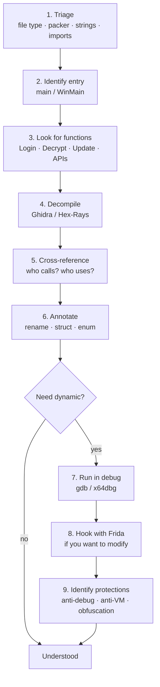

# Reverse engineering

> Understanding a binary without the source. Required for: malware analysis, vulnerability research, proprietary software assessment, CTFs, firmware audits.

## What a binary is

On disk: header + code sections + data + symbol table + relocations. Formats:

- **ELF** (Linux/Unix). Header starts with `\x7fELF`.
- **PE/COFF** (Windows). Starts with `MZ` (DOS stub) and then `PE\0\0`.
- **Mach-O** (macOS/iOS). Magic `0xFEEDFACE`/`0xFEEDFACF`.
- **APK** (Android) = ZIP of `classes.dex` (Dalvik bytecode) + native ELF libs.
- **IPA** (iOS) = ZIP of Mach-O + resources + Info.plist.
- **embedded firmware** — can be raw, ELF, or custom.

Run:
- `file binary`
- `Detect It Easy (DIE)` for Windows — recognizes compilers, packers, frameworks.
- `binwalk binary` for firmware (extracts embedded filesystems).
- `strings binary`, `strings -e l binary` (UTF-16 for Windows strings).
- `nm binary` (ELF symbol table).
- `objdump -d -M intel binary` (disasm).
- `readelf -a`, `dumpbin` (Windows).

## Assembly you need to know

### x86-64 essentials

General-purpose registers: `RAX, RBX, RCX, RDX, RSI, RDI, RBP, RSP, R8-R15`. Sub-registers: `EAX` (32), `AX` (16), `AH`/`AL` (8).

SysV calling convention (Linux): args in `RDI, RSI, RDX, RCX, R8, R9`; additional ones on the stack; return value in `RAX`. Microsoft x64 calling convention (Windows): `RCX, RDX, R8, R9`; 32-byte shadow space.

Basic instructions:

```asm
mov rax, rbx          ; rax = rbx
lea rax, [rbx+8]      ; rax = rbx+8 (load effective address; arithmetic without memory access)
add rax, 1
sub rax, 5
xor rax, rax          ; rax = 0 (idiomatic)
push rax              ; rsp -= 8; [rsp] = rax
pop rax
call funct            ; push return; jmp
ret                   ; pop into rip
jmp label
je / jne / jg / jl / jz / jnz / ja / jb   ; conditional jumps
cmp rax, 10           ; sets flags (ZF, SF, CF, OF)
test rax, rax         ; AND and sets flags (does not alter operands)

; string loops
mov rdi, dst
mov rsi, src
mov rcx, length
rep movsb             ; copies rcx bytes from rsi to rdi
```

### ARM64 (AArch64) essentials
Registers: `X0-X30`, `XZR` (zero), `SP` (stack), `PC`. Calling: `X0-X7` args, `X0` return value. RISC fixed-size (4 bytes/instr).

```asm
mov x0, #1
add x0, x0, x1
ldr x0, [x1, #8]       ; load
str x0, [x1, #8]       ; store
bl funct                ; branch with link (call)
ret                     ; branch to X30 (link register)
```

### x86 vs ARM mood
- x86 CISC: many complex instructions, variable length.
- ARM RISC: few instructions, orthogonal, fixed length.

For IoT/mobile you will know ARM well.

## Static vs dynamic

### Static
You analyze without executing. You see *all* the code, identify patterns, understand the logic.

**Pros:** safe (you don't run potentially harmful malware), comprehensive.
**Cons:** slow; obfuscation/packing blocks you; complex flows are hard without execution.

Tools:
- **Ghidra** (NSA, open source): excellent decompiler, free, multi-arch. **My default**.
- **IDA Pro** (Hex-Rays, commercial): industry standard. **IDA Free** only has x86-64 and no decompiler.
- **Binary Ninja** (Vector 35, commercial): modern UX, nice Python plugins.
- **radare2 / Rizin**: open source, CLI. Steep learning curve.
- **Cutter**: GUI for Rizin.

### Dynamic
You execute it in a sandbox or debugger.

**Pros:** you see the *real* behavior, discover input-dependent paths.
**Cons:** risk (malware), anti-debug, limited coverage.

Tools:
- **gdb** + pwndbg/gef (Linux).
- **x64dbg** (Windows).
- **WinDbg** (Microsoft, also kernel).
- **lldb** (macOS/iOS).
- **Frida**: cross-platform runtime hooking.
- **DBI** (Dynamic Binary Instrumentation): PIN (Intel), DynamoRIO.

### Emulation
- **qemu-user** to run binaries from other architectures.
- **unicorn** / **qiling** for partial CPU/function-level emulation.
- **angr**: symbolic execution.

## Typical workflow



1. **Triage**: file type, packer/protector, strings, imports, sections (DIE, `strings`, `file`, IDA's auto-analysis).
2. **Identify entry**: `main` (or `WinMain`, `wmain`).
3. **Look for interesting functions**: names (e.g. `Login`, `Decrypt`, `Update`), imported APIs (e.g. `socket`, `CryptEncrypt`).
4. **Decompile** and read pseudo-C.
5. **Cross-reference** (xrefs): who calls this function? who accesses this variable?
6. **Annotate** (rename variables, structs, enums).
7. **Run dynamically** if needed (breakpoints on key functions).
8. **Hook with Frida** when you want to modify behavior.
9. **Identify protections** (anti-debug, anti-VM, obfuscation).

## Anti-RE — recognize and bypass

### Windows anti-debug
- `IsDebuggerPresent` API → patch return to 0.
- `CheckRemoteDebuggerPresent`, `NtQueryInformationProcess` (ProcessDebugPort).
- `PEB.BeingDebugged` flag → patch in-memory.
- `int 3` / `int 2d` / `int 3` tricks.
- `RDTSC` timing checks: if a debugger is attached, time increases.
- `OutputDebugString` quirks.
- Thread Local Callbacks (executed before main; an entry-point breakpoint misses them).
- TLS callbacks.
- `NtSetInformationThread(ThreadHideFromDebugger)`.

### Anti-VM
- Hardware fingerprint: MAC vendor (VMware, VirtualBox), BIOS/system manufacturer, file/registry indicators.
- CPUID hypervisor bit.
- Actual sleep duration (sleep evasion).
- Number of CPUs, RAM, disks (VMs have fewer).
- Paths like `C:\Windows\System32\drivers\VBoxSF.sys` etc.

### Anti-disasm
- Junk bytes that confuse linear disassembly (`db 0xE8` in front of a ret to spook the disassembler).
- Opaque predicates (`if (true)` in disguise).
- Control flow flattening.
- Virtualization (VMProtect, Themida): converts instructions into bytecode interpreted by a custom VM.
- Packers (UPX, ASPack, Themida, Enigma...). Often you fingerprint them with `pestudio` or `DIE`.

### Encrypted strings
Malware often encrypts strings at compile time and decrypts them at runtime. You identify the decryption function → call it from **Frida**/**angr**/**unicorn** to recover the strings.

## Decompile vs disasm

A decompiler (Ghidra/Hex-Rays) gives you pseudo-C. **Convenient**, but **not always correct**. For complex code (vector intrinsics, inline optimizations, jump tables, custom calling conventions) read the disassembly directly.

## Reverse engineering Java/.NET/Android

- **Java JAR / class**: `jd-gui`, `procyon`, `cfr`, `JADX` (Android and Java).
- **.NET** PE: **dnSpy**, **ILSpy**, **dotPeek**. They can *recompile* to IL and decompile to C#.
- **.NET obfuscation**: ConfuserEx, .NET Reactor; deobfuscators exist (de4dot).
- **Android**: APK → `apktool` (smali), `JADX` (decompiled Java), MOBSF for automated analysis.

## Reverse engineering obfuscated scripts

- **JS**: beautify, devtools "Pretty print", **JS Nice**, take the time to rename. Tools: **JSHint**, **AST exploration**.
- **PowerShell**: PSDecode, AMSI bypass deobfuscation. Reversing `Invoke-Obfuscation`: look for concat patterns + `IEX`/`Invoke-Expression`.
- **Office VBA macros**: `oledump.py`, `olevba`, `ViperMonkey`.
- **HTA/JScript**: pattern `eval(unescape(`.

## Frida — runtime instrumentation

On a native binary (Linux/macOS/Windows/Android/iOS):

```js
// js
var crypto = Module.findExportByName("libssl.so.3", "EVP_DecryptUpdate");
Interceptor.attach(crypto, {
    onEnter(args) {
        var len = args[5].toInt32();
        console.log("decrypt", len, "bytes from", args[3]);
        console.log(hexdump(args[3], { length: len }));
    }
});
```

```bash
frida -U -l hook.js -f com.target.app   # USB, Android
```

For crackmes: bypass a license check by modifying the `retval` of `validate()`.

## Symbolic execution

Use **angr** to automatically explore all paths:

```python
import angr
proj = angr.Project("./challenge", auto_load_libs=False)
state = proj.factory.entry_state()
sm = proj.factory.simulation_manager(state)
sm.explore(find=0x401234, avoid=[0x401200])
print(sm.found[0].posix.dumps(0))   # stdin that leads to the win
```

It works but explodes on loops and crypto. Use it for small functions.

## Firmware reversing

```bash
binwalk -e firmware.bin           # extracts filesystem (squashfs, jffs2, etc.)
binwalk --signature firmware.bin
strings firmware.bin | grep -i password
file extracted/
```

Find UART/JTAG on the device (section 21), dump the flash chip (SOIC clip + bus pirate). Extract bootloader, kernel, root fs. Look for:
- hardcoded credentials.
- private RSA keys in firmware updates.
- web admins with vulnerable CGIs.
- open shells.

Tools:
- **Ghidra** with MIPS/ARM extensions.
- **qemu emulation** of the binary.
- **FACT** (Firmware Analysis and Comparison Tool).

## Software cracking (ethical exercise)

[crackmes.one](https://crackmes.one) has thousands of legally available crackmes built precisely for this. Categories from easy to brutal.

Common techniques:
1. Find the "validate" function (`strings | grep "Wrong"`).
2. Invert the logic (jne → je via patch).
3. Patch in memory (Frida `Interceptor.replace` or setting the Z flag).
4. Understand the serial algorithm → write a keygen.

## Exercises

### Exercise 15.1 — Guided crackme
Download a level 1-2 crackme from crackmes.one. Open it in Ghidra. Find `main`. Identify the check function. Find the password.

### Exercise 15.2 — Bandit-style binary
Build your own simple binary:

```c
#include <stdio.h>
#include <string.h>
int main(int argc, char **argv) {
    char secret[] = "\x6c\x65\x74\x6d\x65\x69\x6e";  // "letmein" — obviously XOR-obfuscatable
    if (argc < 2) return 1;
    if (strcmp(argv[1], secret) == 0) {
        printf("flag{w3ll_d0n3}\n");
    } else {
        printf("nope\n");
    }
    return 0;
}
```

Compile stripped (`-s`). Now:
- without running it, find the flag with `strings` + Ghidra.
- obfuscate it a bit (XOR the string) and repeat.

### Exercise 15.3 — Ghidra deep dive
[Ghidra Class](https://github.com/HackOvert/GhidraSnippets) — repo with cheatsheets. Open a real binary (even a `coreutils` like `/bin/ls`). Identify `main`, follow the structure, derive the prototype of `getopt`.

### Exercise 15.4 — Frida hooking
On a crackme with a check `int validate(char*)` that returns 0/1:

```js
const sym = Module.findExportByName(null, 'validate');
Interceptor.replace(sym, new NativeCallback(function() { return 1; }, 'int', ['pointer']));
```

You bypass the check. Does it work? How easy was it?

### Exercise 15.5 — Analyze malware (LAB!)
**Only in an isolated VM**. Download a known educational sample (e.g. **MalwareBazaar**, **theZoo**). Static analysis:
- DIE → packer?
- strings → URL/IOC?
- import table → suspicious APIs (`CreateRemoteThread`, `WriteProcessMemory`, `InternetOpen`)?

Then (carefully) detonate in a sandbox (Cuckoo, ANY.RUN, joesandbox).

### Exercise 15.6 — Reverse Engineering for Beginners
Free book by Dennis Yurichev. Chapters 1-5 are essential. Study them.

### Exercise 15.7 — pwn.college reversing
The "Reverse engineering" module on pwn.college. Excellent.

### Exercise 15.8 — IDA Free vs Ghidra
Open the same binary in both. Compare:
- analysis speed.
- decompiler quality.
- workflow.

There is no absolute "best".

## Key concepts

1. **Static + dynamic**: you need both.
2. **Ghidra is free and excellent.** Learn it well.
3. **Know how to read assembly (at least x86-64) and calling conventions.**
4. **Anti-debug and packers**: recognize them, bypass them.
5. **Frida** for runtime cracking of non-kernel apps.
6. **angr** for small functions / CTFs.
7. **Reverse Engineering for Beginners** (Yurichev), pwn.college, crackmes.one.

Now the next topic: what reverse engineering analyzes most often — malware.
