# Malware: taxonomy and analysis

> **Safety first.** Analyze malware **only** in an isolated, snapshotted VM, with no shares to the host, with no "real" internet access (fakedns/inetsim) unless intentional. Assume the sample will escape isolation. Work accordingly.

## Taxonomy (and why a single label is not enough)

Real-world malware **is not a single category**. It is a modular system with a loader, one or more payloads, a C2 channel, persistence and exfil capabilities. But knowing the labels helps with communication and CTI.

| Category | What it does |
|---|---|
| **Virus** | self-replicates by infecting other files/programs |
| **Worm** | spreads autonomously across the network (Conficker worm, WannaCry, NotPetya) |
| **Trojan / RAT** | masquerades as legitimate software; RAT = Remote Access Trojan (remote control of the victim) |
| **Ransomware** | encrypts files and demands ransom (Conti, LockBit, BlackCat/ALPHV, Akira) |
| **Wiper** | destroys data with no demand (NotPetya, Shamoon, HermeticWiper) |
| **Stealer / Infostealer** | steals browser credentials, wallets, cookies (RedLine, Vidar, Raccoon, Lumma, StealC) |
| **Banker / Banking trojan** | steals financial credentials via web inject (Zeus, Emotet, IcedID, TrickBot, Qakbot) |
| **Loader / Dropper** | downloads/installs the final payload (SmokeLoader, Bumblebee, Gozi loader, Pikabot) |
| **Backdoor** | unauthorized persistent access (PoisonIvy, ShadowPad) |
| **Rootkit** | hides itself from the system (user-mode, kernel-mode, hypervisor, firmware) |
| **Bootkit** | persists at bootloader/firmware level (BlackLotus, MoonBounce) |
| **Adware / PUA** | grey area: intrusive advertising, browser hijack |
| **Spyware** | monitoring (Pegasus, FinFisher, Predator) — often high-profile targeting |
| **Cryptominer / Cryptojacker** | mines cryptocurrencies (XMRig wrapped, CoinMiner) |
| **Botnet** | mass-infects to build a bot network (Mirai, Emotet) |
| **APT custom malware** | tools specific to state-sponsored groups (Sandworm Industroyer, Equation Group implant, ...) |

## Initial Access vectors

Knowing how they get in is the basis for detection.

- **Phishing email** with attachment (DOC/XLS macro, ISO/IMG, LNK, OneNote, ZIP-encrypted, HTML smuggling) or link to a fake OAuth/login.
- **Drive-by download** / malvertising / exploit kit (rare in 2026).
- **Supply chain**: compromised software update (3CX, SolarWinds), npm/PyPI typosquatting library.
- **Exposed vulnerability**: web (Log4j, MOVEit), VPN/firewall, Exchange (ProxyLogon, ProxyShell), Ivanti.
- **Brute force / spray**: exposed RDP, OWA/Webmail.
- **USB drop** (Stuxnet, BadUSB).
- **Compromised MSP / remote IT**: AnyDesk, ScreenConnect.
- **Insider** (executor or accomplice).

## Cyber Kill Chain — the map of the attack

```mermaid
flowchart LR
    A[1. Reconnaissance<br/>OSINT, scan] --> B[2. Weaponization<br/>generate payload]
    B --> C[3. Delivery<br/>email, USB, web]
    C --> D[4. Exploitation<br/>vuln, social eng]
    D --> E[5. Installation<br/>persistence]
    E --> F[6. C2<br/>contact operator]
    F --> G[7. Actions on Obj.<br/>exfil / impact]
    style A fill:#11171a,stroke:#00e6ff
    style D fill:#3a2a00,stroke:#ffe066
    style G fill:#3a0b0b,stroke:#ff4d4d
```



Stopping the attack at the first step saves you everything else. **Defense in depth** = controls at every layer.

## Defensive techniques to know (MITRE ATT&CK)

[MITRE ATT&CK](https://attack.mitre.org) is a **hierarchical taxonomy** of adversary behavior, maintained by MITRE based on real-world observed attacks. Three levels:

- **Tactics** (14): **the "why"** (Initial Access, Execution, Persistence, ..., Impact). Each tactic is a phase of the attack.
- **Techniques** (~200): **the "how"**. E.g.: T1059 — Command and Scripting Interpreter.
- **Sub-techniques** (~600): **the "specific how"**. E.g.: T1059.001 — PowerShell.

For each technique, the ATT&CK encyclopedia includes: description, procedures (groups that have used it), mitigations, detections, references.

### How to read an ID

```
T1003.001
│ │    │
│ │    └── Sub-technique: LSASS memory dumping
│ └────── Technique: OS Credential Dumping
└──────── "T" = Technique (IDs with "M" are mitigation, "S" are software)
```

### Matrices

ATT&CK has **multiple matrices**:
- **Enterprise**: Windows, macOS, Linux, Cloud (AWS/Azure/GCP/M365), Network devices, Containers, ESXi.
- **Mobile**: Android, iOS.
- **ICS**: industrial (SCADA, PLC).

### ATT&CK Navigator — operational tool

[Navigator](https://mitre-attack.github.io/attack-navigator/) lets you:
- **Map the coverage** of your detection rules → heatmap.
- **Compare** TTPs of two groups (e.g., APT29 vs APT28).
- **Export** to JSON for tool integration.

Every modern CTI report includes an "ATT&CK Navigator layer" as an attachment.

### Example of mapping an alert

SIEM alert: "Process `wmic.exe` with arguments `process call create powershell.exe`".

ATT&CK mapping:
- **Tactic**: TA0002 Execution.
- **Technique**: T1047 Windows Management Instrumentation.
- **Related sub-technique**: T1059.001 PowerShell.

From this, the SOC analyst knows: probably lateral movement / remote execution, context = AD attacks. Look for correlations: 4624 logon, network connect, etc.

The general map to memorize:

| Tactic | Example Techniques |
|---|---|
| TA0001 Initial Access | T1566 Phishing, T1190 Exploit Public-Facing App |
| TA0002 Execution | T1059 Command/Scripting Interpreter, T1204 User Execution |
| TA0003 Persistence | T1547 Boot/Logon Autostart, T1053 Scheduled Task, T1543 System Service |
| TA0004 Privilege Escalation | T1068 Exploit, T1078 Valid Accounts |
| TA0005 Defense Evasion | T1027 Obfuscation, T1055 Process Injection, T1218 LOLBins |
| TA0006 Credential Access | T1003 OS Cred Dumping, T1110 Brute Force, T1555 Credentials from Stores |
| TA0007 Discovery | T1083 File/Dir Discovery, T1018 Remote System Discovery |
| TA0008 Lateral Movement | T1021 Remote Services, T1570 Lateral Tool Transfer |
| TA0009 Collection | T1005 Data from Local System, T1056 Input Capture |
| TA0011 Command and Control | T1071 Application Layer Protocol, T1573 Encrypted Channel |
| TA0010 Exfiltration | T1041 Exfil over C2, T1567 Exfil over Web Service |
| TA0040 Impact | T1486 Data Encrypted for Impact, T1485 Data Destruction |

## Technical Windows malware techniques (you must recognize them)

### Execution & loader

- **AMSI bypass**: patch `AmsiScanBuffer`/`AmsiOpenSession`.
- **ETW bypass**: patch `EtwEventWrite` or ETW provider GUID.
- **Reflective DLL injection**: load a DLL into the memory of a target process without touching disk.
- **Process Hollowing**: start a legitimate process suspended, replace the image section, resume.
- **Process Doppelgänging / Herpaderping**: abuse transactional NTFS / handle ordering.
- **Process Ghosting**: rename/delete PE before it gets mapped.
- **Module Stomping**: load a legitimate DLL, overwrite the code section.
- **APC injection**: queue an APC on an alertable thread.
- **Atom Bombing**: use the atom table to copy code.

### Persistence

- **Run keys** (`HKCU/HKLM\...\Run`).
- **Scheduled Tasks** (`schtasks /create ...`).
- **Services** (`sc create`, autorun).
- **WMI Event Subscription** (filter + consumer + binding).
- **DLL hijacking / search order**.
- **COM hijacking** (HKCU CLSID override).
- **AppInit_DLLs**, **Image File Execution Options** debugger.
- **Office add-ins**, **Outlook rules**, **Custom desktop.ini**.
- **Logon scripts**, **Shortcut hijack**, **PowerShell profile**.
- **Bootkit, UEFI**.

### Defense evasion

- **Living off the Land Binaries (LOLBins)**: `certutil`, `bitsadmin`, `msbuild`, `regsvr32`, `mshta`, `wmic`, `rundll32`, `installutil`, `cmstp`. They use Microsoft-signed binaries to do the dirty work.
- **Signed driver abuse** (BYOVD — Bring Your Own Vulnerable Driver: rwdrv, gigaboot, ASUS, Avast aswSnx).
- **Obfuscation**: packer, encryption at rest, runtime decoder.
- **Sandbox evasion**: check CPU/RAM/MAC/process list/uptime.
- **Timer/sleep evasion** (`NtDelayExecution` >5min to exhaust the sandbox).
- **Indirect syscall**: call `Nt*` directly with syscall numbers to avoid user-mode hooks.
- **Module unhooking**: reload ntdll.dll fresh from disk to "unpatch" EDR hooks.

### Credential Access

- **LSASS dumping** (Mimikatz, `procdump lsass.exe`, MiniDump). Driven via SilentLsassDump, NanoDump.
- **DPAPI** dumping for browser cookies/passwords.
- **SAM/SYSTEM** hive backup (`reg save`).
- **NTDS.dit** dump from the DC (DCSync or copy via VSS).
- **Browser cookies/login**: SQLite `Login Data`, `Cookies`.

### C2 (Command and Control)

- **HTTPS** beacon (Cobalt Strike default).
- **DNS** tunnel (Cobalt Strike DNS, dnscat2).
- **Domain fronting** (historically CloudFront, now limited).
- **Slack / Discord / Telegram / Github / Pastebin** as C2 (legitimate cloud traffic).
- **Email** (smtp/imap exfil).
- **Custom protocol over TCP/UDP** (rare, more suspicious).

Famous C2 frameworks:
- **Cobalt Strike** (commercial, abused leak).
- **Sliver** (modern open source, BishopFox).
- **Havoc** (open source).
- **Mythic** (modular, multi-implant).
- **Brute Ratel C4** (commercial).

## Analysis workflow

### 1. Triage (5 min)
- File hash (MD5/SHA1/SHA256). Check on VT (carefully — uploading spreads the sample).
- PE info: timestamp, sections, entropy.
- Imports: "interesting" APIs → category.
- Strings (UTF-8 + UTF-16) → URLs, mutexes, registry paths, error messages.
- Detect packer (DIE, Exeinfo).

### 2. Static
- Ghidra/IDA decompile.
- Identify entry, init, main loop.
- Decode strings (manually, with Python in Ghidra, or with `FLOSS`).
- Map API calls.
- YARA rule (see below).
- FireEye/Mandiant's `capa` analyzes capabilities automatically.

### 3. Dynamic
- VM snapshot.
- Procmon + Process Hacker + Wireshark + RegShot.
- Run it. Capture for N minutes.
- What does it write to disk? Which registry key? Which network?
- Restore snapshot. Re-detonate with environment variants (local, no internet, with fakedns).

### 4. Debug
- x64dbg → break on interesting functions (`VirtualAllocEx`, `WriteProcessMemory`, `CreateRemoteThread`, `LoadLibraryA`).
- Patch anti-debug checks.
- Trace the unpacking chain.

### 5. Reporting
- IOCs: hash, URL, IP, mutex, file path, registry key, persistence mechanism.
- TTPs: map to MITRE ATT&CK.
- Sigma rule for detection.
- YARA rule to identify variants.
- Behavior: "it does X, then Y, communicates with Z".

## YARA — pattern matching on files

```yara
rule EmotetLikeLoader {
    meta:
        author = "you"
        date   = "2026-05-19"
        description = "Detect Emotet-like loader"
    strings:
        $api1 = "VirtualAllocEx"
        $api2 = "WriteProcessMemory"
        $api3 = "CreateRemoteThread"
        $hex1 = { 48 8B 05 ?? ?? ?? ?? 48 89 C1 E8 }
        $url  = /https?:\/\/[a-z0-9.-]+\/[A-Za-z0-9_-]{8,}/
    condition:
        uint16(0) == 0x5A4D and (2 of ($api*)) and ($hex1 or $url)
}
```

Run with: `yara rule.yar sample.bin`.

Tools: **yarGen** auto-generates rules from samples; **yarAnalyzer** measures quality.

## Sigma — pattern for logs

[Sigma](https://github.com/SigmaHQ/sigma) is "the YARA of logs". You specify patterns in YAML and convert them for your SIEM.

```yaml
title: Suspicious whoami after PsExec
id: 12345678-...
status: experimental
logsource:
    category: process_creation
    product: windows
detection:
    selection_psexec:
        ParentImage|endswith: '\PSEXESVC.exe'
    selection_whoami:
        Image|endswith: '\whoami.exe'
    condition: selection_psexec and selection_whoami
level: high
```

`sigma-cli convert -t splunk -p ...` → Splunk query. Tools: pySigma, Sigma online converter.

## Automated sandboxes

- **ANY.RUN** — interactive, free with limits.
- **Joe Sandbox** — high quality, commercial.
- **Hybrid Analysis** (Falcon Sandbox) — free.
- **VirusTotal** Behavior tab.
- **CAPE Sandbox** — self-hosted open source (fork of Cuckoo).
- **Tria.ge** — community-friendly.

**Privacy**: uploading to a public sandbox = public sample. For sensitive or targeted malware, self-host.

## Threat intel feeds and sources

- [Malware Bazaar](https://bazaar.abuse.ch) — Free sample DB from abuse.ch.
- [URLhaus](https://urlhaus.abuse.ch) — malicious URLs.
- [ThreatFox](https://threatfox.abuse.ch) — structured IoCs.
- [VirusTotal Intelligence](https://www.virustotal.com) — commercial.
- [Mandiant Advantage], **CrowdStrike Falcon Intelligence**, **Recorded Future**, **Microsoft Defender Threat Intelligence** — commercial.
- Twitter/Mastodon: accounts (vx-underground, Malwarebytes, Trend Micro Research, Sekoia, ...) — rapid sources.

## Persistence detection (recap)

As blue team, on Windows look at:
- Sysmon event 1 (Process Create) + 11 (File Create) + 13 (Registry Set) + 7 (Image Load).
- Autoruns (Sysinternals) — initial snapshot.
- Scheduled Tasks (`Get-ScheduledTask`).
- WMI Event Subscriptions (`Get-WMIObject -Namespace root\subscription -Class __FilterToConsumerBinding`).
- Recently created services.
- COM hijack: registry CLSID comparison.

Linux:
- crontab/anacrontab/systemd timers (see section 02).
- `.bashrc`, `.profile`, `/etc/profile.d/`.
- LD_PRELOAD in the env of suspicious processes.
- `/etc/init.d`, `/etc/systemd/system`.
- Kernel modules: `lsmod`, `cat /proc/modules`.

## Exercises

### Exercise 16.1 — Malware lab setup
1. Windows 10 VM + Flare-VM (https://github.com/mandiant/flare-vm).
2. REMnux VM (https://remnux.org) for Linux analysis + network simulation.
3. Network: "internal only" between the two VMs, REMnux runs fakedns + inetsim.
4. Clean snapshot.

### Exercise 16.2 — Triage of an educational sample
Download from MalwareBazaar (free account) a sample tagged "educational" / old (e.g., WannaCry, NotPetya — WARNING: some are still dangerous if you break out of isolation):
- File info, hash.
- VT result.
- Strings → URL, mutex.
- Pestudio → indicators.
- Capa → capabilities.

### Exercise 16.3 — Simple detonation
In Flare-VM, run a safe sample (e.g., from a MalwareTrafficAnalysis.net training exercise). Procmon + Wireshark. For N minutes. Stay calm. Examine:
- Files created.
- Registry mods.
- Network: DNS, HTTP, C2 attempt.

Produce a short report.

### Exercise 16.4 — Write a YARA rule
Take 2-3 samples from the same family. Find common strings / hex sequences. Write a rule that matches all of them with no false positives on benign samples. Verify.

### Exercise 16.5 — Sigma rule
Generate Sysmon events for:
- PowerShell with `-EncodedCommand`.
- Office spawning `cmd.exe`.

Write Sigma rules. Convert them for your SIEM (Splunk, ES, Sentinel).

### Exercise 16.6 — Safe ransomware lab
DO NOT use real ransomware. Use `RansomwareSimulator` (Malware Analyst SR) or write a fake one: iterate over `.txt` files in a directory, encrypt with AES, write `README.txt`. Run it in a VM. See what Procmon reveals. Write a Sigma rule for "mass encryption of user files".

### Exercise 16.7 — Practical Malware Analysis (book)
Sikorski & Honig — the standard book. It has dozens of labs with included samples. Do them all.

### Exercise 16.8 — MalwareBazaar challenge
Find a recent sample in a family that interests you (Emotet, IcedID, Pikabot, Bumblebee). Analyze it, write a 1-page report with IoCs and TTPs.

### Exercise 16.9 — TryHackMe
"Cyber Defense" path:
- "MAL: Malware Introductory"
- "MAL: REMnux - The Redux"
- "Static Analysis Practical Tactics"

## Key concepts

1. **Malware ≠ single category**: modular systems with loader+payload+C2+persistence.
2. **MITRE ATT&CK** is the lingua franca of behaviors.
3. **Workflow**: triage → static → dynamic → debug → report.
4. **YARA** for file patterns, **Sigma** for log patterns.
5. **Always use an isolated sandbox**.
6. **LOLBins, indirect syscall, BYOVD, AMSI/ETW patch**: modern evasions.
7. **Modern C2** lives in legitimate HTTPS + cloud services → detection is statistical/behavioral, not signature-based.

Next: mobile.
