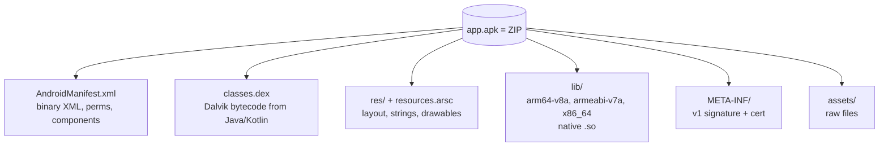

# Mobile security: Android and iOS

> A mobile app is "a webapp that talks to an API + a native binary + tokens saved on the device". The typical vulnerabilities live in those three places.

## OWASP Mobile Top 10 (2024)

| # | Category |
|---|---|
| M1 | Improper Credential Usage |
| M2 | Inadequate Supply Chain Security |
| M3 | Insecure Authentication / Authorization |
| M4 | Insufficient Input/Output Validation |
| M5 | Insecure Communication |
| M6 | Inadequate Privacy Controls |
| M7 | Insufficient Binary Protections |
| M8 | Security Misconfiguration |
| M9 | Insecure Data Storage |
| M10 | Insufficient Cryptography |

## Android: anatomy of an app



An APK = ZIP containing:
- `AndroidManifest.xml` (compiled to binary XML).
- `classes.dex` (Dalvik bytecode, compiled from Java/Kotlin via D8/R8).
- `resources.arsc` + `res/` (resources).
- `lib/` (native `.so` per ABI: armeabi-v7a, arm64-v8a, x86, x86_64).
- `META-INF/` (APK signature).
- `assets/` (bundled files).

Lifecycle of an app:
- Build → AAB (Android App Bundle) or APK.
- Sign with jar/apksigner v1/v2/v3/v4.
- Install via Play Store / sideload (`adb install app.apk`).
- Runs in the Android Runtime (ART), on a modified Linux kernel.
- Per-app sandbox: each app has a dedicated UID, and a private `/data/data/<pkg>/` directory.

### Extraction and analysis
```bash
# pull APK from device
adb shell pm path com.example.app
adb pull /data/app/.../base.apk app.apk

# or from apkpure / Aurora Store

# unzip
apktool d app.apk -o app/
jadx-gui app.apk           # decompile to Java
jadx -d out app.apk

# strings/ASCII
strings app/lib/arm64-v8a/libnative.so

# MobSF
docker run -p 8000:8000 opensecurity/mobile-security-framework-mobsf
# upload app.apk → report
```

## AndroidManifest — what to look for

```xml
<manifest ...>
  <uses-permission android:name="android.permission.INTERNET"/>
  <uses-permission android:name="android.permission.READ_EXTERNAL_STORAGE"/>
  <application
      android:allowBackup="true"
      android:debuggable="true"
      android:networkSecurityConfig="@xml/network_security_config"
      android:usesCleartextTraffic="true">
    <activity android:name=".LoginActivity" android:exported="true"/>
    <activity android:name=".AdminActivity" android:exported="false"/>
    <provider
        android:authorities="com.example.provider"
        android:exported="true"
        android:readPermission="..."/>
    <receiver android:name=".SmsReceiver" android:exported="true">
      <intent-filter><action android:name="android.provider.Telephony.SMS_RECEIVED"/></intent-filter>
    </receiver>
  </application>
</manifest>
```

**Red flags:**
- `debuggable="true"` in a production build.
- `allowBackup="true"` (an attacker with ADB can back up the app's data).
- `usesCleartextTraffic="true"` (plain HTTP in the app).
- `exported="true"` on sensitive components (admin activities, providers holding private data).
- `READ_LOGS`, `READ_SMS` permissions if not actually needed.

## Insecure storage (M9)

Apps write to:
- `/data/data/<pkg>/` (private, but on a rooted device → readable).
- SharedPreferences (XML in `shared_prefs/`).
- SQLite DBs (`databases/`).
- External storage (`/sdcard`) — accessible to any app with the right permission.

Look for:
- credentials / tokens / API keys in plaintext.
- SQLite DBs with sensitive data unencrypted.
- Files exported to sdcard.

```bash
adb shell run-as com.example.app ls /data/data/com.example.app/
```

### EncryptedSharedPreferences / SQLCipher / Android Keystore
The Android Jetpack Security library offers EncryptedSharedPreferences/EncryptedFile (key in the **Keystore**, hardware-backed when available). Use it for tokens.

## Insecure Communication (M5) — SSL pinning bypass

Modern apps do *certificate pinning*: they only accept specific certs / public-key hashes. Bypass:

### Frida + Objection
```bash
pip install frida-tools objection
adb push frida-server /data/local/tmp/
adb shell "chmod +x /data/local/tmp/frida-server && /data/local/tmp/frida-server &"

objection -g com.example.app explore
> android sslpinning disable
> android root disable
> android hooking watch class_method com.example.AuthManager.login
```

### Dedicated Frida scripts
[frida-codeshare.com](https://codeshare.frida.re) has dozens of SSL pinning bypasses for OkHttp, Conscrypt, Cronet, Cordova, Flutter, Xamarin, ...

```bash
frida -U --codeshare pcipolloni/universal-android-ssl-pinning-bypass-with-frida -f com.example.app
```

### Network Security Config
File `res/xml/network_security_config.xml`:
```xml
<network-security-config>
    <base-config cleartextTrafficPermitted="false">
        <trust-anchors>
            <certificates src="system"/>
            <!-- in debug: <certificates src="user"/> -->
        </trust-anchors>
    </base-config>
    <domain-config>
        <domain includeSubdomains="true">api.example.com</domain>
        <pin-set>
            <pin digest="SHA-256">...</pin>
        </pin-set>
    </domain-config>
</network-security-config>
```

To MITM with Burp:
1. Install the Burp certificate as a **system CA** (requires root or an emulator without Google Play services).
2. Bypass pinning with Frida.
3. Set the Wi-Fi proxy on Android to point at your PC.

On an AOSP emulator rootable from Studio: `emulator -writable-system`, then `adb root && adb remount` to install the cert in `/system`.

## Insecure IPC: deep links and content providers

### Deep link & app link abuse
An exported activity with an intent-filter `BROWSABLE/DEFAULT` receives URLs `app://...` or `https://example.com/...` (App Link). If the activity processes parameters without validation → XSS in an internal WebView, open redirect, account takeover.

```text
adb shell am start -W -a android.intent.action.VIEW \
    -d "app://example/path?token=stolen" com.example.app
```

### Unprotected content providers
A provider with `exported=true` and no permission → any app can read/write.

```bash
adb shell content query --uri content://com.example.app/users
adb shell content insert --uri content://com.example.app/users --bind 'admin:s:true'
```

### Broadcast receivers with unsanitized intent extras
An exported receiver that runs logic on `getStringExtra("cmd")` without validation → a malicious app sends an intent.

## Native code (M7)

`.so` libs in C/C++:
- Reverse with **Ghidra/IDA + ARM/AARCH64**.
- **Frida** for native hooks.
- JNI functions (`Java_com_example_native_method`) are the entry points.
- Hardcoded strings → API keys often live there.

```bash
strings -e l lib/arm64-v8a/libapp.so | grep -i key
```

## Root detection bypass

Banking apps often refuse to run on rooted devices. Detection techniques:
- Existence of `/system/bin/su`, `/system/xbin/su`, `magisk`.
- Presence of the Magisk Manager package.
- `mount` showing `rw` on `/system`.
- Build tags `test-keys` (vs `release-keys`).
- SafetyNet/Play Integrity attestation.

Bypass:
- **Magisk Hide / Zygisk** + DenyList.
- **Frida hook**: intercept `File.exists("/system/bin/su")` and return false.
- **Objection**: `android root disable`.
- For **Play Integrity** it's much harder (server-side check).

## iOS — overview

App = **IPA** = ZIP with a `.app` bundle (Mach-O binary + resources + Info.plist).

- Tight app sandbox.
- Code signed by Apple, App Store or enterprise.
- To analyze it you need to **jailbreak** a device (legacy iOS: checkra1n; recent iOS: palera1n/Dopamine semi-untethered).
- On the iOS simulator (Mac only) you can analyze some things, but the TEE / Keychain is simulated.

Grabbing the app:
- `frida-ios-dump` or `bagbak` (requires a JB device) → decrypted binary dump.
- `ipatool` to download an IPA from the App Store.

Reverse engineering:
- **Hopper Disassembler** (popular on Mac).
- **Ghidra** also handles Mach-O.
- **class-dump-z** extracts Objective-C headers.
- **r2** / **rabin2** for symbols.

Frida also works on jailbroken iOS. Objection has an iOS pinning bypass.

Storage:
- **NSUserDefaults** → plist file.
- Keychain → hardware-backed, but export is possible on JB.
- App file system: `/var/mobile/Containers/Data/Application/<UUID>/`.

## Pegasus & mobile spyware

NSO Pegasus, Intellexa Predator, FinSpy — commercial spyware sold to nation-states. Chains of **0-day** browser + LPE kernel + firmware persistence. Targeting journalists, activists, lawyers.

Forensics:
- **MVT** (Mobile Verification Toolkit) from Amnesty International — analyzes iOS/Android for Pegasus IOCs.
- **iOS** leaves traces in `DataUsage.sqlite`, `Spotlight`/`KnowledgeC.db`.

## Exercises

### Exercise 17.1 — Set up the Android environment
- Android Studio + AVD (Pixel arm64 API 33, *no Google Play services* for easy rooting).
- Working ADB.
- Frida + frida-server.
- Burp Suite + cert installed in system.

### Exercise 17.2 — Static analysis: Damn Vulnerable Hybrid Mobile App
DVHMA, [InsecureBankv2](https://github.com/dineshshetty/Android-InsecureBankv2), Pivaa, **OWASP-MASWE**: a series of vulnerable apps. Static analysis with MobSF and jadx:
- Hardcoded credentials.
- Cleartext traffic.
- Exported activities/providers.
- Insecure storage.

### Exercise 17.3 — Burp + pinning bypass
On an open-source app with pinning (e.g. a modified version of Nextcloud Android for training): configure the proxy, intercept. When pinning blocks you, use the Frida `universal-pinning-bypass`.

### Exercise 17.4 — Deep link injection
On a vulnerable app (DIVA, Pivaa) that opens a WebView on a deep-link URL:
```bash
adb shell am start -a android.intent.action.VIEW -d "diva://internal/webview?url=javascript:alert('XSS')" jakhar.aseem.diva
```

XSS in the WebView?

### Exercise 17.5 — Content provider leak
DIVA Lesson 8: query the content provider to extract data without permission.

### Exercise 17.6 — Frida native hook
App with a license check in a native function `Java_..._validate(JNIEnv, jstring)`:

```js
Java.perform(() => {
  const M = Java.use("com.example.MainActivity");
  M.checkLicense.implementation = function(s) {
    console.log("called with:", s);
    return true;
  };
});
```

### Exercise 17.7 — TryHackMe & HTB
- TryHackMe: "**Android Hacking 101**", "**Insekube**".
- HackTheBox: mobile machines are rare but they exist (see the category).

### Exercise 17.8 — Read iOS forensics
Read the MVT report on the Pegasus case against the Sahar researchers. Which IOCs are searched for? Which files?

## Key concepts

1. **A mobile app = web client + binary + local storage**.
2. **Android**: APK structure, Manifest red flags, IPC abuse, insecure storage.
3. **SSL pinning bypass** is almost always feasible on a controlled device (Frida).
4. **Native (`.so`)** holds logic and secrets — analyze it.
5. **iOS** requires a jailbreak for deep analysis.
6. **Pegasus & co.**: 0-day chains; defense = Lockdown Mode, patches, hygiene.
7. **OWASP Mobile Top 10** as a taxonomy.

Next up: the cloud, where every company now lives.
