# Cloud security: AWS, Azure, GCP

> The whole world is moving to the cloud. That means web/network/AD vulnerabilities are being redistributed across managed services with IAM models that few people actually understand. The highest-paying bug bounties these days are often cloud takeovers.

## Shared responsibility

The provider is responsible for the **security OF the cloud** (hardware, hypervisor, datacenter). The customer is responsible for **security IN the cloud** (config, IAM, app, network, data).

Typical rookie mistake: "I'm on AWS, so I'm secure." No: the publicly exposed S3 bucket is your fault.

| Service type | Provider responsibility | Customer |
|---|---|---|
| IaaS (EC2, VM) | hardware, hypervisor | OS, network, app, data |
| PaaS (Lambda, App Service) | + OS, runtime | app, IAM config, data |
| SaaS (Office 365, Salesforce) | + app | config, data, IAM identity |

## AWS — the key concepts

### IAM
The core. Components:
- **User**: long-term identity, can have access keys.
- **Group**: a set of users.
- **Role**: identity that can be *assumed* by entities (users, services, federated). Used by EC2/Lambda/ECS via instance profile.
- **Policy**: JSON document granting permissions (Effect, Action, Resource, Condition).
- **Identity-based** (attached to user/group/role) vs **resource-based** (on S3 bucket, KMS key, …).
- **Service Control Policy (SCP)** — Organizations level, hard limit.
- **Permission boundary** — limit per role/user.
- **Session policy** — limit per assume-role.

Effective permission = intersection of:
SCP ∩ (identity policy ∪ resource policy) − ACL deny ∩ permissions boundary ∩ session policy.

### IAM misconfig red flags
- Policy `*/*` (both action and resource wildcard).
- Overly permissive cross-account trust (e.g. `"Principal": {"AWS": "*"}`).
- MFA not required for privileged users.
- Root account used for operations.
- Long-lived access keys for humans (prefer SSO + temporary credentials).

### S3
Bucket: objects + ACL + policy + Block Public Access settings + versioning + encryption.

**Top misconfigs:**
- Publicly readable / writable bucket.
- "AuthenticatedUsers" group in the ACL = any AWS user (anyone with an account!).
- Pre-signed URL leak.
- Misconfigured cross-account access.

Test: `aws s3 ls s3://bucket --no-sign-request`.

### EC2 / Lambda / metadata
- **IMDSv1** (GET path only) → SSRF disasters.
- **IMDSv2** (requires token via PUT) → mitigation.
- Check: `curl -v http://169.254.169.254/latest/meta-data/iam/security-credentials/<role>`.

If you obtain role credentials:
```bash
aws sts get-caller-identity --profile leaked
aws iam list-attached-role-policies --role-name X
# then enumerate accessible resources
```

### Lambda
- Public Function URLs with auth `NONE` = public endpoint.
- Function policy with `Principal:*` = anyone can `Invoke`.
- Code injection through environment variables.
- Secrets in env vars (visible in the console if you have `lambda:GetFunction`).
- Compromised layers.

### CloudTrail, CloudWatch, GuardDuty
- **CloudTrail** logs every API call. Verify multi-region, S3 protection, integrity validation.
- **GuardDuty** ML-based detection (anomalies).
- **Detective** post-incident investigation.
- **Security Hub** aggregator.
- **Config** monitors resource drift / compliance.

## Azure (Entra ID + Azure RM)

### Identity
- **Entra ID** (formerly Azure AD): tenant, users, groups, app registrations, service principals.
- **Azure RM**: management plane for resources, RBAC role assignment.

Two coexisting "worlds". Different permissions (Entra ID directory roles vs Azure RBAC).

### Typical attacks
- **Pass-the-PRT** — the PRT is the Entra ID "TGT", living in the TPM on a joined workstation.
- **Token theft** via XSS or malware.
- **Illicit consent**: phishing on OAuth consent → malicious app with scopes like `Mail.Read offline_access`.
- **Device code phishing**: the user enters the code into a device-code flow initiated by the attacker → the attacker gets the token.
- **Application/Service Principal compromise**: client_secret in a Git repo → authenticate as the app.
- **Conditional Access bypass** (anomalies: legacy auth not blocked, mobile bypass, country spoofing).
- **Storage account anonymous access**.
- **Managed Identity abuse** → Azure IMDS, similar to AWS but with header `Metadata: true`.

Tools: **ROADtools** (recon), **AADInternals**, **MicroBurst**, **TokenTactics**, **GraphRunner**.

## GCP

Concepts:
- **Project** = resource + billing boundary.
- **Organization** > Folders > Projects (hierarchy).
- **IAM**: principals (user, group, service account, domain) + role.
- **Service Account**: "machine" identity — with JSON keys or impersonation.

### Typical misconfigs
- **GCS bucket** publicly accessible.
- **Service account keys** committed in Git.
- **Compute Engine metadata** with public SSH keys enabled.
- **OAuth consent screen** with lax verification.
- **Cloud Functions** triggered publicly.
- **Service account impersonation** with overly permissive trust.

Tools: **gcp_scanner** (Google), **GCPBucketBrute**, **TRGRMI** (Google CIS posture), Prowler GCP.

## Automated audit (multi-cloud)

| Tool | Language | Notes |
|---|---|---|
| **Prowler** | Python | AWS+Azure+GCP+K8s, over 500 checks |
| **ScoutSuite** | Python | NCC Group, multi-cloud |
| **CloudSploit** (Aqua) | Node | open source |
| **CFRipper** | Python | CloudFormation static analysis |
| **tfsec, Checkov** | various | Terraform/IaC |
| **kube-bench, kubeaudit** | | K8s |
| **trivy** | | containers + IaC + repos |

Example:
```bash
prowler aws --profile audit -o csv,html
```

## Real-world attacks studied

- **Capital One 2019**: SSRF against a misconfigured WAF → IMDSv1 → role → S3 with 100M records.
- **Code Spaces 2014**: AWS root compromise → the attacker wiped everything within hours — the company shut down.
- **Tesla 2018**: Kubernetes dashboard exposed without auth, AWS keys in secrets → cryptominer.
- **SolarWinds 2020**: SUNBURST → golden SAML token in Entra ID → Microsoft email, US Gov.
- **MOVEit 2023**: SQLi 0-day in MOVEit Transfer (Cl0p).
- **Snowflake 2024**: customer credentials in info-stealers + no MFA enforced → mass exfil including Ticketmaster, Santander, AT&T.

## Baseline hardening (cloud-agnostic)

1. **Identity**: MFA everywhere (FIDO2 where possible). Zero long-lived human credentials → SSO + JIT. Conditional Access / OPA.
2. **IAM least privilege**: no `*`, role per task.
3. **Networking**: private subnets by default, restrictive security groups, VPC endpoints for AWS services.
4. **Secrets**: manager (Secrets Manager, Vault, Key Vault) with rotation. Never cleartext env vars for sensitive apps.
5. **Encryption**: at-rest (KMS-managed) + in-transit (TLS).
6. **Logging**: everything to a centralized log, immutable, alerts on critical actions (root login, IAM changes).
7. **Patching**: managed services help, but self-managed containers/EC2 must be patched.
8. **Backup**: separated from the main account, MFA delete on versioned S3.
9. **Posture management** (CSPM): Prowler, Wiz, Orca, Lacework, Tenable.cs.
10. **Threat detection**: GuardDuty / Defender / SCC + EDR on VMs + WAF + CDN.

## Typical cloud-native attack chain

```mermaid
flowchart LR
    IA[1. Initial Access<br/>phish / leaked key /<br/>public bucket] --> CD[2. Cred Discovery<br/>env · IMDS · git history]
    CD --> LM[3. Lateral via IAM<br/>AssumeRole chain]
    LM --> PE[4. Privesc<br/>iam:PassRole + Lambda/Glue]
    PE --> PR[5. Persistence<br/>new AccessKey ·<br/>role trust attacker]
    PR --> EX[6. Exfil<br/>S3 / RDS snapshot copy<br/>to attacker account]
    EX --> CO[7. Cover tracks<br/>stop CloudTrail · retention]
    style IA fill:#11171a,stroke:#00e6ff
    style PE fill:#3a2a00,stroke:#ffe066
    style EX fill:#3a0b0b,stroke:#ff4d4d
```



1. **Initial access**: phish, exposed dev API key, public S3 with a backup.
2. **Cred discovery**: env, IMDS, code commits.
3. **Lateral via IAM**: assume role + chain (`AssumeRole` from role A to B to C).
4. **Persistence**: new access key for a user, role trust that includes the attacker's identity.
5. **Privesc**: IAM policy "iam:PassRole" + a service that runs code (Lambda, Glue Job).
6. **Data exfil**: S3 / RDS snapshot copy to the attacker's own account.
7. **Cover tracks**: stop CloudTrail (GuardDuty flags this), change retention.

## Exercises

### Exercise 18.1 — AWS lab setup
- AWS free tier account, separate from everything else.
- Create a VPC, subnet, EC2 t2.micro.
- S3 bucket (private).
- Hello-world Lambda.
- Separate IAM user for "operator", no root console use.

### Exercise 18.2 — SSRF + IMDSv1
Intentionally vulnerable setup:
- EC2 with `MetadataOptions HttpTokens=optional` (IMDSv1 enabled).
- Web app that fetches a given URL (e.g. preview feature).
- From outside: SSRF to `169.254.169.254` → extract role.
- Configure `--profile leaked`, `aws sts get-caller-identity`.

Then switch to IMDSv2 + remediate. Which flag prevents "naive" SSRF?

### Exercise 18.3 — Public bucket
Set up a bucket with a policy allowing `s3:GetObject` to `*` on a prefix. Upload a fake file. Verify with `curl https://bucket.s3.amazonaws.com/x.txt`. Then remove + enable Block Public Access on everything. Re-verify.

### Exercise 18.4 — Audit with Prowler
```bash
docker run -ti --rm -v $PWD/output:/output \
  -e AWS_ACCESS_KEY_ID=... -e AWS_SECRET_ACCESS_KEY=... \
  toniblyx/prowler:latest aws --output-modes csv,html
```

How many HIGH findings? Did you leave a bucket exposed? IMDSv1?

### Exercise 18.5 — PACU (offensive AWS)
[Pacu](https://github.com/RhinoSecurityLabs/pacu) is a Metasploit-like framework for AWS.

```bash
pip install pacu
pacu
> set_keys (import the leaked key from the lab)
> run iam__enum_permissions
> run iam__privesc_scan
> run lambda__enum
```

Find any privesc? Bug bounty in practice.

### Exercise 18.6 — Azure lab
Azure trial tenant. Run [AzureGoat](https://github.com/ine-labs/AzureGoat) — modular vulnerable labs.

### Exercise 18.7 — flAWS / flaws2 / wizer / hackthebox cloud
- [flaws.cloud / flaws2.cloud](http://flaws.cloud) — gamified AWS.
- [hackthebox Pro Labs "Offshore"](https://www.hackthebox.com/news/pro-labs) (hybrid cloud + AD).

### Exercise 18.8 — Threat hunting in CloudTrail
On an account with CloudTrail enabled, simulate:
- `CreateAccessKey` for an IAM user.
- `PutBucketPolicy` with Principal:*.
- `AssumeRole` against a role in another account.

Look for these events in CloudWatch Logs Insights. Write queries to alert on them.

### Exercise 18.9 — Read incident reports
Read the Capital One post-mortem (Krebs, Brian) and the [Capital One DOJ filing](https://www.justice.gov/usao-wdwa/pr/seattle-tech-worker-arrested-data-theft-involving-large-financial-services-company). Identify the chain: SSRF → IMDS → role → S3 → exfil. What would have mitigated each step?

## Key concepts

1. **Shared responsibility**: you are responsible for the **config**.
2. **IAM is the security plane**: small user base, left open → game over.
3. **Metadata service** is the door from SSRF to cloud takeover. IMDSv2 is mandatory.
4. **Audit tooling** (Prowler, ScoutSuite) gives you 80% of the issues in minutes.
5. **Identity > Network**: in zero trust, the perimeter is identity.
6. **Secrets in repos, plaintext service keys** are still the #1 cause of cloud breaches.
7. **CSPM + CIEM + CWPP**: buzzword acronyms but real things — know the differences.

Next up: containers and Kubernetes.
