# Hardware and firmware hacking

> When the software is hardened but the device ends up in someone else's hands, the attack surfaces multiply: debug interfaces left open, flash chips readable from outside, clock glitches that skip a check instruction. Welcome back to "the physical".

## Mindset

Three typical phases:
1. **Tear-down**: open the device without breaking it. Look for chips, test points, headers.
2. **Identify interfaces**: UART (serial), SPI (flash), I²C (sensors), JTAG/SWD (debug), USB, Ethernet.
3. **Extract / interact**: firmware dump, debug, command execution, fault injection.

Typical workshop bench:
- Digital multimeter.
- Soldering iron (e.g., Hakko, Pinecil).
- Oscilloscope or Logic Analyzer (Saleae Logic 8/16 or a cheap clone with Sigrok).
- Bus Pirate or FT232H for SPI/I²C/UART USB→TTL.
- SOIC-8 / SOIC-16 clip adapter for flash chips.
- CH341A programmer (5€) for SPI flash.
- JTAG/SWD probe (J-Link / ST-Link / OpenOCD compatible).

## UART — the wild card

Asynchronous serial interface. 3 pins: TX, RX, GND (and VCC). Standard speeds: 9600, 19200, 38400, 57600, 115200 bps. Voltage: 3.3V or 5V — check with a multimeter **before** connecting.

Vendors often leave UART active in production with a root shell (uboot, busybox login, ash).

### Finding UART on a PCB
- 4-pin header (TX/RX/GND/VCC) or test points.
- Multimeter: GND (ground, test against the case shield); TX (3.3V idle); RX (3.3V idle).
- Logic analyzer on suspect pins during boot → recognize the UART pattern (start bit + 8 data + stop).
- Tool: **JTAGulator** (Joe Grand) — auto-tries pin combinations.

### Connection

```mermaid
flowchart LR
    subgraph DEV [Target device]
        TX[TX pin]
        RX[RX pin]
        GND[GND pin]
        VCC[VCC pin · do not connect]
    end
    subgraph ADP [USB-TTL adapter · FT232/CP2102]
        ARX[RX pin]
        ATX[TX pin]
        AGND[GND pin]
    end
    TX -.->|3.3V signal| ARX
    ATX -.->|3.3V signal| RX
    GND --- AGND
    ADP --> PC[PC<br/>screen / minicom / picocom]
    style VCC fill:#3a0b0b,stroke:#ff4d4d
```



```bash
# Linux
ls /dev/ttyUSB*
screen /dev/ttyUSB0 115200
# or
minicom -D /dev/ttyUSB0 -b 115200
# or picocom, tio
```

Typical output: Linux kernel boot log (printk), uboot prompt → **break** with a key if active → `printenv`, `setenv`, `boot`. If boot completes → busybox login.

## SPI flash dumping

The small memories on devices (boot, root fs on SoC) are often 4/8/16 MB SPI NOR flash in SOIC-8 / WSON-8 package. The datasheet (e.g., Winbond W25Q64) standardizes pinout and commands (READ 0x03, FAST_READ 0x0B, etc.).

### Setup
- **In-circuit (clip)**: SOIC clip on the chip + CH341A. Works if the other components on the board don't interfere (sometimes you have to "isolate" Vcc or hold the CPU in reset).
- **Off-board**: desolder the chip (hot air), mount it on an adapter, dump.

```bash
# flashrom with CH341A
flashrom -p ch341a_spi -r dump.bin -V
# Identify chip
flashrom -p ch341a_spi
```

Dump = binary file. Ready for analysis.

## Analyzing the dumped firmware

```bash
binwalk -e dump.bin
# Looks for filesystems (squashfs, jffs2, cramfs, ubi) and extracts them
ls _dump.bin.extracted/

# Filesystem found → loop mount or direct search
sudo mount -o loop squashfs-root.img /mnt
# Often binwalk -e has already unpacked it

# Search for credentials
grep -rEi "password|admin" mnt/etc/
strings dump.bin | less

# Search for keys/certs
find . -name "*.pem" -o -name "*.key" -o -name "*.crt"
```

In typical firmware you find:
- `/etc/passwd` + `/etc/shadow` with root hash.
- Web admin CGI (lighttpd, micro_httpd) → CGI binaries to reverse.
- SSH host keys.
- Hardcoded API tokens.
- Update server URL (potential supply chain).

### Firmware emulation
- **QEMU user-mode** if it's an ELF Linux ARM/MIPS.
- **QEMU system-mode** to emulate full boot (more complex).
- **firmadyne**, **FAT**, **EMUX** automate it.

```bash
sudo apt install qemu-user qemu-user-static
cp $(which qemu-mipsel-static) ./squashfs-root/usr/bin/
sudo chroot squashfs-root /usr/bin/qemu-mipsel-static /bin/busybox sh
```

In emulation you can also run the web admin binaries for local fuzzing.

## JTAG / SWD

Embedded debug standards. JTAG (IEEE 1149.1) — 5 signals (TCK, TMS, TDI, TDO, TRST). SWD (ARM) — only 2 (SWDIO, SWCLK).

Tools:
- **JTAGulator** for auto-detect of the pinout.
- **OpenOCD** for generic JTAG.
- **J-Link Commander / RTT** (Segger, commercial).
- **ST-Link** for STM32 (cheap).

```bash
openocd -f interface/stlink.cfg -f target/stm32f4x.cfg
# in another terminal
telnet localhost 4444
> halt
> dump_image flash.bin 0x08000000 0x100000
> reg
> step
```

With JTAG active + unprotected chip = full flash + RAM dump + step-by-step execution. **Only on your own devices or authorized ones.**

### Vendor-side mitigations
- **JTAG fuse**: burn an OTP fuse to disable debug. Often not burned in production (cost-saving).
- **Readout protection** (RDP) on STM32, IAP/IRoT on other families.
- **Secure Boot** + signature.

## Glitching / Fault injection

Injection of disturbances (voltage drop, clock glitch, EM pulse, laser) during a critical operation → the CPU "skips" an instruction → check bypass.

Well-known examples:
- **Voltage glitch** on PS3 / Xbox to bypass firmware verify.
- **Trezor wallet glitch** extracting the seed (Kraken Security Labs).
- **Tesla key fob** + glitch.

Tool: **ChipWhisperer** (NewAE) — open source board for training and real attacks. ~250–800€.

```text
# Concept
1. Boot fuses → check signature → branch to "OK" or "ERROR".
2. Glitch on that branch.
3. If you calibrate offset + amplitude + duration correctly → the CPU skips "test" and goes to OK.
```

## Side channel — DPA, SPA, EM, timing

Power analysis: the current drawn by a chip depends on the data being processed. Measuring it with a shunt resistor + oscilloscope during AES, after ~10–100k traces, statistical analysis (DPA, CPA) recovers the key bit by bit.

ChipWhisperer + NewAE's tutorials are the standard way to learn.

EM (electromagnetic) — a probe placed close to the chip captures emissions → similar to power.

Timing — already seen: non-constant-time memcmp comparison → leak byte by byte.

## Hardware Trojan and supply chain

- Chips modified at the factory (the "Big Hack" Bloomberg case, contested).
- **Compromised resellers**.
- Modification of the firmware update server software.

Defense: zero-trust supply chain (Sigstore-like for firmware), in-toto attestation, **roots of trust** in TPM/HSM.

## Typical microcontrollers

When you tear down a commercial device:
- **STM32** — Cortex-M, common in IoT and industry.
- **ESP32 / ESP8266** — extremely popular Wi-Fi/BLE SoCs (Espressif).
- **NXP LPC/Kinetis**.
- **Nordic nRF52/nRF5340** — Bluetooth LE.
- **Atmel AVR/SAM** (Arduino style).
- **Microchip PIC**.
- **MediaTek MT76xx, Realtek RTLxxxx, Marvell, Broadcom** — consumer routers.

For each: public datasheet (~500–1500 pages), reference manual, errata.

## Bus Pirate / FT232H

Universal serial bus translator. Speaks SPI, I²C, UART, 1-wire, raw bitbang. Extremely handy for exploration.

```text
# Bus Pirate menu
> m              # mode select
> a              # AUX action
> r              # read
> 0x9F r:3       # send 9F (JEDEC ID), read 3 bytes
```

## Exercises

### Exercise 21.1 — Safe router teardown
Get an old consumer router (~10-15€ used). Open it:
- Identify SoC, RAM, flash (printed numbers → datasheet).
- Unpopulated test points/headers: 4 pins in a row → likely UART.
- Multimeter: measure VCC voltage, identify GND.

### Exercise 21.2 — Capture boot UART
Connect the USB-TTL adapter. `screen /dev/ttyUSB0 115200`. Power the router back on. What do you see? Which bootloader (uboot, redboot)? Which kernel? Look for a key/command to stop the boot.

### Exercise 21.3 — Flash dump with CH341A
**Only on your own device.** SOIC-8 clip on the flash chip. `flashrom -p ch341a_spi -r dump.bin`. Dump size?

### Exercise 21.4 — Analyze firmware
`binwalk -e dump.bin`. Extracted rootfs? `etc/passwd`? Crack the root hash? Web binary? Reverse it and look for vulns (command injection in CGI is a classic — unsanitized `system("ping " + parm)`).

### Exercise 21.5 — Emulate web binary
Extract a MIPS CGI binary. Emulate it with `qemu-mips-static`. Verify the response to a request. Fuzz the params.

### Exercise 21.6 — JTAG hunting
On a microcontroller dev board (STM32 Discovery, Nucleo, Pine64 RISC-V):
- Identify the SWD pinout from the datasheet.
- OpenOCD + ST-Link/J-Link.
- `dump_image flash.bin 0x08000000 0x40000`.
- Reverse the dump in Ghidra (ARM Cortex-M).

### Exercise 21.7 — ChipWhisperer (advanced)
If you own/rent a CW. AES single trace SCA tutorial. Understand the difference between SPA, DPA and CPA.

### Exercise 21.8 — Online IoT challenges
- [embedded CTF MIT](https://2024.ectf.mitre.org).
- DEF CON / DEFCON Hardware Hacking Village writeups.
- [Damn Vulnerable Router Firmware](https://github.com/praetorian-inc/DVRF).
- [OWASP IoTGoat](https://github.com/OWASP/IoTGoat).

### Exercise 21.9 — Read
- "The Hardware Hacker" (Bunnie Huang).
- "The Hacker Hardware Handbook".
- "Practical IoT Hacking" (Chantzis et al.).
- Joe Grand (@kingpin) talks on YouTube.

## Key concepts

1. **UART open in production = often root shell**.
2. **SPI flash dump with CH341A** is dirt cheap and powerful.
3. **JTAG/SWD** = total control if unprotected.
4. **Glitching** isn't just for top hackers — ChipWhisperer democratizes it.
5. **Firmware emulation** lets you fuzz offline.
6. **Side channel** is the "mathematically secure but physically leaky" layer.
7. **Vendor-side hardening**: secure boot + readout protection + fuses + signed updates.

Next up: forensics and DFIR — from the defensive side.
