# Forensics and DFIR

> **Digital Forensics & Incident Response.** When the attack is in progress or just happened, you are the person who reconstructs what happened, contains the damage, removes the adversary, and writes the report that will end up in a courtroom or a SOC.

## The IR process (NIST 800-61r2)

```mermaid
flowchart LR
    P([1. Preparation<br/>playbook · contacts · tools]) --> D([2. Detection &<br/>Analysis<br/>triage · scope])
    D --> C([3. Containment<br/>Eradication<br/>Recovery])
    C --> L([4. Post-Incident<br/>lessons learned<br/>fix detection gap])
    L -.->|feedback| P
    style D fill:#3a2a00,stroke:#ffe066
    style C fill:#3a0b0b,stroke:#ff4d4d
```



1. **Preparation** — playbook, contacts, tools, authorizations.
2. **Detection & Analysis** — is the incident really an incident?
3. **Containment, Eradication, Recovery** — stop, remove, recover.
4. **Post-Incident Activity** — lessons learned, improvements.

In parallel: communication (client, legal, regulator), evidence preservation.

## SANS Investigative Process (PICERL model)

Preparation → Identification → Containment → Eradication → Recovery → Lessons learned.

## Chain of custody

Every piece of evidence has:
- Where it comes from (host, image hash).
- Who took it and when.
- Who held it afterwards.
- What was done to it.

In corporate IR the rigor is often lower than in a criminal investigation. But if the incident "escalates" to a prosecutor, you **should have** been rigorous from the start.

Tooling: append-only activity log, photos of the setup, witnesses, signed disk image (SHA-256), evidence stored in a safe/encrypted digital vault.

## Acquisition

### Disk imaging
- **Bit-stream image** = exact copy of the device (sectors). `dd`, `dcfldd`, `ewfacquire`, **FTK Imager**.
- Hardware **write blocker** to avoid modifying the source.

```bash
sudo dd if=/dev/sda of=evidence.img bs=4M status=progress conv=noerror,sync
sha256sum evidence.img > evidence.sha256

# alternatives
ewfacquire /dev/sda             # creates .E01 (EnCase compressed)
```

### Memory dump (live)
For Windows:
- **DumpIt** (MoonSols / Comae).
- **WinPmem** (Velociraptor).
- **FTK Imager** "Capture Memory".

Linux:
- **LiME** (Linux Memory Extractor) — kernel module.
- **avml** (Microsoft AVML).
- `/proc/kcore` has limits.

```bash
sudo insmod lime-$(uname -r).ko "path=/tmp/mem.lime format=lime"
```

### Fast triage (Velociraptor / KAPE)
When you need to collect "a lot of things but not everything":
- **KAPE** (Eric Zimmerman): configurable targets, artifact collections.
- **Velociraptor**: live response remote, GPL, VQL queries.

```bash
# KAPE — example
.\kape.exe --tsource C: --target !BasicCollection --tdest C:\evidence
```

## Memory forensics with Volatility 3

Volatility 3 (Python 3) analyzes RAM dumps. Auto-detected profile.

```bash
vol -f mem.dmp windows.info
vol -f mem.dmp windows.pslist
vol -f mem.dmp windows.pstree
vol -f mem.dmp windows.psscan          # also "hidden"
vol -f mem.dmp windows.cmdline
vol -f mem.dmp windows.netstat
vol -f mem.dmp windows.netscan
vol -f mem.dmp windows.malfind         # injected code
vol -f mem.dmp windows.dlllist --pid 1234
vol -f mem.dmp windows.handles --pid 1234
vol -f mem.dmp windows.registry.userassist
vol -f mem.dmp windows.registry.printkey --key 'Microsoft\Windows\CurrentVersion\Run'
vol -f mem.dmp windows.dumpfiles --pid 1234
vol -f mem.dmp windows.svcscan
vol -f mem.dmp windows.callbacks       # kernel callbacks (rootkit)
```

Linux:
```bash
vol -f mem.lime linux.pslist
vol -f mem.lime linux.bash             # cmdline from bash history
vol -f mem.lime linux.netstat
vol -f mem.lime linux.lsmod
vol -f mem.lime linux.malfind
```

**What to look for:** process without a legitimate parent, cmdline with base64/encoded content, outbound network to suspicious IPs, code injection (RWX in the heap of an unexpected process), recently installed services.

## Windows artifacts (must-know)

### Registry hive
- `HKLM\Software` → installed apps, settings (auto-mounted).
- `HKLM\System` → services, USB device history.
- `HKLM\Sam` → SAM user database (offline crack with `samdump2`/`secretsdump`).
- `HKU\<SID>` → user preferences, MRU.

Tools: **Registry Explorer** (Zimmerman), **RegRipper** (Carvey), **Volatility windows.registry.\***.

Hot keys:
- `Software\Microsoft\Windows\CurrentVersion\Run` (autostart).
- `Software\Microsoft\Windows\CurrentVersion\Explorer\UserAssist` (programs executed).
- `System\CurrentControlSet\Services` (services, persistence).
- `System\MountedDevices`, `Enum\USBSTOR` (connected USBs).
- `Software\Microsoft\Windows\CurrentVersion\Explorer\TypedPaths` (Explorer history).

### File system
- **$MFT** (NTFS Master File Table): every record = a file. SI/$FILE_NAME timestamps (4 vs 4 → timestomping). Tools: **MFTECmd** (Zimmerman), `analyzeMFT.py`.
- **$LogFile, $UsnJrnl** — change journals.
- **$Recycle.Bin\<SID>\** — deleted files: `$I` (metadata) + `$R` (content).
- **Prefetch** (`C:\Windows\Prefetch\*.pf`): traces of launched executables (execution history).
- **Amcache.hve** (`C:\Windows\AppCompat\Programs\Amcache.hve`): executed files + SHA-1 hashes.
- **ShimCache** (AppCompatCache, inside the SYSTEM hive): executables seen by the OS.
- **SRUM** (System Resource Usage Monitor, `SRUDB.dat`): resource usage per process per user.
- **Jump Lists** (`%AppData%\Microsoft\Windows\Recent\AutomaticDestinations\`).
- **LNK files** (Recent, Start Menu, Desktop) — file links with path, timestamps.
- **Hibernation file** (`hiberfil.sys`), **pagefile.sys** — memory.

### Event Log
`%SystemRoot%\System32\winevt\Logs\*.evtx`. Key categories:
- **Security.evtx**: 4624 (login success), 4625 (login failure), 4634 (logoff), 4672 (privileged login), 4688 (process create with audit on), 4720 (account created), 5140 (file share access).
- **System.evtx**: services, drivers.
- **Application.evtx**.
- **Microsoft-Windows-Sysmon%4Operational.evtx**: Sysmon (see section 06).
- **Microsoft-Windows-PowerShell%4Operational.evtx**: 4104 (scriptblock logging).
- **Microsoft-Windows-WMI-Activity%4Operational.evtx**.

Tools: **EvtxECmd** (Zimmerman) → CSV / SOF-ELK; **Chainsaw** (F-Secure) → event hunting with Sigma rules.

### Browser
- Chrome / Edge SQLite: `History`, `Cookies`, `Login Data`, `Web Data` in `%LocalAppData%\Google\Chrome\User Data\Default\`.
- Firefox: `places.sqlite`, `cookies.sqlite`, `formhistory.sqlite` in `%AppData%\Mozilla\Firefox\Profiles\...`.
- IE/Edge legacy: `WebCacheV01.dat` (ESE DB).

## Linux artifacts

- `/var/log/auth.log` (Debian/Ubuntu) / `/var/log/secure` (RHEL): login/sudo.
- `/var/log/syslog` / `/var/log/messages`: general.
- `journalctl` (systemd-journald) binary. `journalctl -u sshd`.
- `~/.bash_history`, `~/.zsh_history` (watch out for `HISTFILE=`, `unset HISTFILE`, history -c).
- `/var/log/wtmp`, `utmp`, `btmp`: login/logout. `last`, `lastb`.
- `/etc/crontab`, `/etc/cron.*`, `/etc/systemd/system/*.{service,timer}`.
- `/var/log/audit/audit.log` (auditd).
- `~/.ssh/authorized_keys` (typical persistence).
- `/etc/passwd`, `/etc/shadow` (integrity check).
- Inode / mtime / ctime — compare with baseline.

## Timeline analysis with plaso / log2timeline

Build a **super-timeline** from dozens of sources.

```bash
log2timeline.py --storage_file evidence.plaso /mnt/evidence/C/
psort.py -o l2tcsv -w timeline.csv evidence.plaso
# Load into Timesketch (web GUI) for interactive querying
```

## Network forensics

- Full **PCAP** when available (rolling buffer).
- **Zeek** logs (conn.log, http.log, dns.log, ssl.log) — pre-parsed, readable.
- **NetFlow / IPFIX** for long-retention visibility.
- **Wireshark** for deep analysis.

## Anti-forensics

- **Timestomping**: changing timestamps. Mismatched $FILE_NAME and $STANDARD_INFO = red flag.
- **Wiping**: `shred`, `sdelete`, Bitlocker rotation.
- **Encryption**: Bitlocker, LUKS (requires key / TPM dump).
- **Slack space**: data in unallocated areas.
- **Steganography**, **alternate data streams (ADS)** on NTFS (`type secret.txt > visible.txt:hidden.txt`).
- **In-memory only** malware (no disk artifact).
- **Log deletion / forced rotation**.

Modern DFIR fights these with continuous telemetry and centralized logs (the attacker can't delete what is already in a remote SIEM).

## Modern frameworks

### Velociraptor
Massive endpoint live response. VQL language. Client on endpoint (binary), central server.

```vql
SELECT * FROM Artifact.Windows.System.PsList()
SELECT FullPath FROM glob(globs="C:/Users/**/AppData/Roaming/**/*.exe")
```

You will use it in modern corporate IR for **hunt at scale**.

### TheHive + Cortex + MISP
- **TheHive**: IR case management.
- **Cortex**: analyzers (VT lookup, sandbox, hash analysis) — observable execution.
- **MISP**: threat intel sharing (see section 24).

### YARA in IR
Keep a set of "known malware" YARA rules ready to run on disk images and RAM dumps.

## Example: full IR (workflow)

Scenario: SIEM alert for "PsExec launched by non-admin user".

1. **Verify**: is the L1 SOC expected to run this? In a maintenance window? No → escalation.
2. **Initial triage**: hostname, user, time. From Velociraptor: `Generic.System.PsList`, `Windows.Network.Netstat`, `Windows.Events.PowerShell` for that host.
3. **Contain**: isolate via EDR network containment.
4. **Snapshot**: memory dump + KAPE basic collection.
5. **Identify entry**: backward in time. Last 24h. Process tree, parent.
6. **Identify spread**: lateral? Look for other hosts with the same TTL/process pattern.
7. **Identify data theft**: large outbound traffic? File access patterns? VSS shadow copy?
8. **Eradicate**: remove persistence, force credential reset, patch the vuln entry point.
9. **Recover**: re-image if necessary, restore from clean backup.
10. **Lessons**: write a report (executive summary + technical timeline). Update detection rules, playbook.

## Exercises

### Exercise 22.1 — Set up a forensics workstation
- A dedicated VM (SIFT Workstation or REMnux for Linux, or Win10 with the tools installed).
- Volatility 3, Autopsy, Sleuthkit, RegRipper, Zimmerman Tools, plaso, KAPE.

### Exercise 22.2 — Memory analysis
Download a training dump (e.g. from [DFIR.training](https://dfir.training), MemLabs, [Volatility samples](https://github.com/volatilityfoundation/volatility/wiki/Memory-Samples)). Practice:
- `pslist`, `pstree`.
- `cmdline` on suspicious processes.
- `malfind` → injected memory.
- `netstat`/`netscan`.

### Exercise 22.3 — Crack SAM hashes
Extract the SAM + SYSTEM hives from a Windows VM (offline, `reg save HKLM\SAM sam.hive`, `reg save HKLM\SYSTEM system.hive`). `samdump2` → hashes. `hashcat -m 1000 hashes.txt rockyou.txt`.

### Exercise 22.4 — Timeline with plaso
On a Windows dump directory (KAPE collection or mounted disk image):
```bash
log2timeline.py --storage_file out.plaso /mnt/evidence
psort.py -o l2tcsv out.plaso > timeline.csv
```

Open in Excel. Look for activity compressed in time, files created in system directories, new autoruns.

### Exercise 22.5 — Sigma + Chainsaw
[Chainsaw](https://github.com/WithSecureLabs/chainsaw):
```bash
chainsaw hunt /path/to/evtx --sigma-rules /path/to/sigma --mapping mapping.yml
```

What comes out?

### Exercise 22.6 — IR-style challenge
- TryHackMe path "**Cyber Defense**" — many IR + forensics rooms.
- **DFIR Madness** (https://dfirmadness.com): complete disk+RAM scenarios with questions.
- **CyberDefenders blue.team labs** — excellent.

### Exercise 22.7 — Memory CTF
Download a memory analysis challenge (e.g. **MemLabs** by stuxnet999 — github). Solve them in order.

### Exercise 22.8 — Velociraptor lab
Set up a Velociraptor server + client on a VM. Run hunts:
- Processes with cmdline containing "powershell" + "encode".
- Files modified in the last 24h under `%TEMP%`.
- Registry Run keys.

## Key concepts

1. **Acquire before touching**: image RAM and disk.
2. **Volatility for memory, plaso for disk timeline.**
3. **Windows artifacts to memorize:** registry, MFT, prefetch, amcache, shimcache, jump list, evtx.
4. **Linux:** auth.log, journal, bash_history (with caution), audit.log, cron.
5. **Modern anti-forensics** (in-memory, log deletion) is countered with continuous remote telemetry.
6. **Velociraptor + Sigma + YARA** = modern DFIR stack.
7. **Chain of custody even in corporate IR**: it could escalate to legal.

Up next: the SOC and continuous detection.
