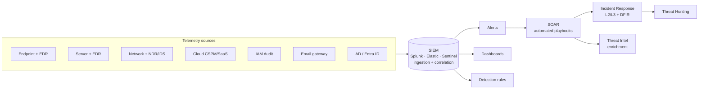

# Blue team: SOC, SIEM, EDR, hunting

> Defending requires knowing everything attackers know **plus** understanding how to turn that knowledge into sustainable, scalable, low-false-positive detection.

## The architecture of a SOC



- **EDR** (Endpoint Detection and Response): agent on the endpoint that logs events (Sysmon-like) + responds (kill process, isolate). CrowdStrike Falcon, SentinelOne, Microsoft Defender for Endpoint, Cybereason, Sophos.
- **NDR** (Network Detection and Response): sniff/Zeek/ML on traffic. ExtraHop, Vectra, Darktrace.
- **SIEM** (Security Information and Event Management): aggregates logs, queries, correlates, alerts. Splunk, Elastic Security, Microsoft Sentinel, IBM QRadar, Chronicle.
- **XDR**: vendor-specific combination of all the above in a single platform.
- **SOAR**: automated response playbooks. Tines, Splunk SOAR, XSOAR.

## SOC "tiers"

| Tier | Skill | What they do |
|---|---|---|
| **L1** Analyst | Junior | Alert triage, escalation, playbook documentation |
| **L2** Analyst | Mid | Investigation, contextualization, basic hunt |
| **L3** Analyst | Senior | Threat hunting, detection engineering, IR lead |
| **Detection Engineer** | | Writing SIEM rules, tuning, telemetry |
| **Threat Intelligence** | | TI / reports / TTP mapping |
| **SOC Manager** | | management, metrics, business escalation |

## SIEM 101

A SIEM has:
- **Collectors / Forwarders** (e.g., Splunk Universal Forwarder, Filebeat, Winlogbeat, Logstash agents).
- **Parsing & Enrichment**: timestamp parsing, GeoIP, threat feeds.
- **Index/Storage**.
- **Search language**: SPL (Splunk), KQL (Sentinel/Defender), EQL (Elastic), LogQL (Loki).
- **Detection rules**: scheduled saved searches → alert.

### SPL example (Splunk)
```spl
index=windows EventCode=4624 LogonType=3
| stats count by user, src
| where count > 50
```

Logon type 3 (network) > 50 in a time window. Anomaly / lateral movement.

### KQL example (Sentinel/Defender)
```kql
DeviceProcessEvents
| where Timestamp > ago(1d)
| where FileName == "powershell.exe"
| where ProcessCommandLine has_any ("-EncodedCommand", "-enc", "FromBase64")
| project Timestamp, DeviceName, AccountName, ProcessCommandLine, InitiatingProcessFileName
```

### EQL example (Elastic)
```eql
process where process.name == "powershell.exe" and process.command_line : "*EncodedCommand*"
```

## Sigma — write once, deploy everywhere

Sigma is the neutral YAML format. Convert for your SIEM via `sigma convert`.

```yaml
title: Suspicious WMIC LOLBin
id: ...
status: experimental
logsource:
    category: process_creation
    product: windows
detection:
    selection:
        Image|endswith: '\wmic.exe'
        CommandLine|contains|all:
            - 'process'
            - 'call create'
    condition: selection
level: high
tags:
    - attack.execution
    - attack.t1047
```

Repo: [SigmaHQ/sigma](https://github.com/SigmaHQ/sigma) has thousands of community rules.

## The telemetry you need

**On Windows endpoints:**
- Sysmon with a decent config (SwiftOnSecurity, Olaf Hartong sysmon-modular).
- PowerShell ScriptBlock logging (event 4104).
- Process Command Line auditing (4688 with cmdline).
- WMI Activity log.
- Defender event log.

**On Linux endpoints:**
- auditd or Sysmon for Linux.
- Falco / Tetragon (eBPF).
- journald.

**Server / cloud:**
- Auth / IAM events.
- DNS queries (Pi-hole, Cloudflare logpush, Azure DNS analytics).
- Network: Zeek / Suricata IDS / firewall logs.
- Email: O365 audit log (Mailbox audit), Gmail Workspace events.
- Identity: Azure AD sign-in logs, Okta, Auth0.

## Detection engineering — in practice

The cycle:
1. **Threat modeling**: which TTPs are relevant for my business? (e.g., ransomware, BEC, supply chain).
2. **Hunting hypothesis**: "If the attacker did X, I would see Y in log Z".
3. **Telemetry**: do I have Z? log enabled? sufficient retention?
4. **Query**: write and test.
5. **False positive tuning**: no alerts on legitimate activity.
6. **Alert + playbook**: what does the L1 do when it fires?
7. **Atomic Red Team**: simulated test to validate detection.
8. **Document**: MITRE tags, runbook, owner.

### Atomic Red Team
Suite of "atomic tests" for MITRE ATT&CK techniques. Run a test → does your detection see it?

```powershell
git clone https://github.com/redcanaryco/atomic-red-team
Import-Module .\invoke-atomicredteam\Invoke-AtomicRedTeam.psd1 -Force
Invoke-AtomicTest T1059.001 -ShowDetails
Invoke-AtomicTest T1059.001-1                # runs test 1
```

## Threat hunting

Hunt = proactive search for TTPs that the SIEM isn't alerting on yet.

### Hunt hypotheses (examples)
- "Is there a Cobalt Strike beacon disguised as outbound HTTPS?" → look for regular jitter, specific JA3 fingerprints, known URIs.
- "Has anyone done AS-REP roasting in the last 30 days?" → Sysmon event 4768 with RC4 encryption + UF_DONT_REQUIRE_PREAUTH flag.
- "Executions from Word with macros?" → process create cmdline `winword.exe` → child `cmd.exe`/`powershell.exe`.
- "Service account logging in interactively?" → 4624 LogonType=10 (RemoteInteractive) with a service account.

### Hunt techniques
- **Stack counting**: aggregates of rare values (e.g., rare parent-child pairs).
- **Outliers** (UEBA): user behavior vs baseline.
- **Time-series anomaly**: unexpected spikes.
- **Threat intel matching**: IOC vs local data.
- **Beacon detection**: regular-interval connections.

## Deception

Honeypots and honey-tokens: fake objects that should never be touched. When they are → high-confidence alert.

- **Canary file** in a strategic location (e.g., `passwords.xlsx` in a share).
- **Canary token** ([canarytokens.org](https://canarytokens.org)) free: file/URL/DNS that notify when opened.
- **Honeyusers** in AD (with SPNs specifically designed to be Kerberoasted).
- **Full honeypots** (T-Pot by DLR — distributing).

Deception has an extremely high signal-to-noise ratio.

## EDR — what it really does

Modern EDR:
1. Kernel-mode or user-mode hooks to intercept events (process create, image load, file write, network).
2. Telemetry sent upstream to the cloud.
3. In-cloud detection with ML and rules.
4. Response: kill, quarantine, isolate, rollback (some have it).

Red team bypasses:
- **BYOVD** (signed vulnerable driver to disable EDR).
- **DLL unhooking** restores a fresh ntdll.
- **Direct syscalls** to avoid user-mode hooks.
- **Esoteric process injection** (Process Doppelgänging, Threadless Inject, Phantom Notification).
- **DKOM**, **kernel token swap**.

Blue team: EDR is "one" layer. Without Sysmon/audit, total reliance = SPOF.

## SOAR — automating response

Playbooks:
- **Phishing alert**: extract email, sandbox links, sandbox attachments, TI lookup, if malicious → quarantine + ban sender + email the user.
- **Compromised credential alert**: revoke tokens, force password reset, isolate device, notify IT.

Tools: Tines, XSOAR, Splunk SOAR, Sentinel Logic Apps, Shuffle (open source).

## SOC metrics

- **MTTD** (Mean Time to Detect).
- **MTTR** (Mean Time to Respond).
- **Alert volume**, false positive ratio.
- **MITRE ATT&CK coverage** (matrix-based reporting).
- **Detection efficacy**: rules that caught a true positive / total.

To keep L1s alive: continuous tuning, focus on quality > quantity.

## Exercises

### Exercise 23.1 — Detection Lab
Chris Long's [Detection Lab](https://github.com/clong/DetectionLab): pre-configured stack Splunk + Sysmon + GPO Velociraptor + Caldera. Vagrant + VirtualBox or cloud. Local setup.

### Exercise 23.2 — Sysmon config + first detection
Install Sysmon with sysmon-modular on a Win10. Launch `whoami` from `cmd.exe`. Verify event 1 in Event Viewer. Write an SPL/KQL/EQL query that captures the execution.

### Exercise 23.3 — Atomic Red Team + detection
Run Atomic test T1059.001-1 (PowerShell base64 decoded). Verify:
- Does Defender block it? (if yes → disable for the test).
- Does Sysmon event 1 / 4104 exist?
- Does your Sigma rule fire?

### Exercise 23.4 — Sigma → Splunk
Pick a rule from the SigmaHQ repo. Convert with sigma-cli to SPL. Run it in your lab. Result?

### Exercise 23.5 — Hunt: Cobalt Strike beacon
Look up on public resources (DFIR Report) how a CS beacon manifests:
- Default named pipe `\\.\pipe\msagent_*`.
- JARM fingerprint.
- Default URI pattern.

Write 1 Sigma/Splunk/KQL query for each.

### Exercise 23.6 — Canary token
Create a DNS+URL token on canarytokens.org. Place it in a share/file. Wait for someone to open it (or open it yourself from another machine). How long does it take? Does the email arrive?

### Exercise 23.7 — TryHackMe Cyber Defense / SOC Level 1
TryHackMe has an entire **SOC Level 1** path. Excellent for L1 prep.

### Exercise 23.8 — Build a SIEM (mini)
Install Wazuh (ELK-based, open source) or the ELK stack:
- Log ingestion from a Linux VM.
- Index pattern.
- A simple rule (failed login > N).

### Exercise 23.9 — MITRE ATT&CK Navigator
Go to [mitre-attack.github.io/attack-navigator](https://mitre-attack.github.io/attack-navigator/). Map your rule coverage (if you have a real set). Which tactic has the biggest gap?

## Key concepts

1. **No telemetry, no detection.**
2. **Sysmon + PowerShell ScriptBlock + auditd + EDR + cloud audit** = baseline.
3. **Sigma** is the common language of detection.
4. **Atomic Red Team** validates your rules.
5. **Hunting is hypothesis-driven**, not tool-driven.
6. **Deception** has exceptional signal:noise.
7. **MITRE ATT&CK Navigator** gives you the map.

Next: threat intelligence.
