# GRC, regulations, and standards

> Governance, Risk, Compliance. You won't write exploits, but you'll decide what to protect, how much to invest, and how to prove it. This is the part that pays everyone else's salaries (security manager, CISO, audit).

## Governance, Risk, Compliance — what they mean

- **Governance**: who decides what the organization does about security? Structure, policies, roles, board responsibility.
- **Risk management**: identify, assess, treat risks. ISO 31000.
- **Compliance**: adherence to laws (GDPR, NIS2), contractual standards (PCI), certifications (ISO 27001).

The three overlap: governance sets the risk framework, which produces decisions that must be compliant.

## Risk management 101

### Vocabulary
- **Asset**: something with value (data, system, people).
- **Threat**: something that could cause harm (attacker, mistake, nature).
- **Vulnerability**: a weakness in the asset.
- **Impact**: potential damage (CIA — Confidentiality, Integrity, Availability).
- **Likelihood**: probability.
- **Risk = Likelihood × Impact**.

### Treatment
- **Mitigate**: reduce likelihood/impact (technical/organizational controls).
- **Transfer**: insurance, outsourcing.
- **Accept**: residual risk accepted, documented, and signed off.
- **Avoid**: don't perform the risky activity.

### Risk register
Table: ID, asset, threat, vuln, impact, likelihood, score, owner, mitigation, status.

## ISO/IEC 27001 + 27002

**ISO 27001** is the **certifiable standard** for information security management (ISMS — Information Security Management System).

- Risk-based approach.
- Plan-Do-Check-Act (PDCA).
- Certification via audit by an accredited body (every 3 years with annual surveillance).

**ISO 27001:2022 structure:**
- Sections 4-10 (mandatory clauses): context, leadership, planning, support, operations, performance evaluation, improvement.
- Annex A: 93 controls (in 4 macro-themes: Organizational, People, Physical, Technological).

**ISO 27002:2022** is the "manual" that explains each of the 93 controls in detail.

Example controls:
- 5.1 Policies for information security.
- 5.7 Threat intelligence.
- 5.23 Information security for use of cloud services.
- 8.7 Protection against malware.
- 8.16 Monitoring activities.
- 8.28 Secure coding.

Companies that handle customer data (B2B) often require it as a prerequisite.

## NIST Cybersecurity Framework (CSF) 2.0

US NIST. Open, free. Significant adoption outside the USA too.

CSF 2.0 (Feb 2024) — six functions:

```mermaid
flowchart LR
    GV([GOVERN<br/>leadership · roles · policy<br/>strategic risk]) --> ID([IDENTIFY<br/>assets · threats · vulns])
    ID --> PR([PROTECT<br/>preventive<br/>controls])
    PR --> DE([DETECT<br/>continuous<br/>monitoring])
    DE --> RS([RESPOND<br/>incident response<br/>containment])
    RS --> RC([RECOVER<br/>business continuity<br/>lessons learned])
    RC -.-> ID
    style GV fill:#3a2a00,stroke:#ffe066,stroke-width:3px
    style PR fill:#0b3a1a,stroke:#00ff9c
    style DE fill:#11171a,stroke:#00e6ff
    style RS fill:#3a0b0b,stroke:#ff4d4d
    style RC fill:#0b0f10,stroke:#ff3da6
```

1. **Govern** (new in 2.0): leadership, roles, risk.
2. **Identify**: assets, threats, vulnerabilities.
3. **Protect**: preventive controls.
4. **Detect**: monitoring.
5. **Respond**: incident response.
6. **Recover**: business continuity, lessons learned.

For each: categories and subcategories with outcomes ("PR.AC-01: Identities and credentials are issued, managed...").

CSF maps to ISO 27001/2, CIS Controls, NIST 800-53. Used as a "lingua franca" to align programs.

## NIST 800-53 (US federal)

Catalog of **1100+ controls** for US federal information systems. Highly granular. Families: AC (access control), AU (audit), CM (config management), ...

US gov + contractors.

**Low/Moderate/High profiles** based on FIPS 199 categorization.

## CIS Controls v8.1

Center for Internet Security. **18 prioritized controls** to "do the important things first". Pragmatic.

Top 5 ("Basic"):
1. Inventory of Enterprise Assets.
2. Inventory of Software Assets.
3. Data Protection.
4. Secure Configuration of Enterprise Assets and Software.
5. Account Management.

CIS Benchmarks (config baselines for OS/app) are separate but complementary (e.g., CIS for Ubuntu, Windows, Kubernetes, AWS).

## NIS2 (EU)

**Directive (EU) 2022/2555**, transposed in Italy with D.Lgs. 138/2024 (Legislative Decree 138/2024). In force.

- Extends NIS (2016) to many more sectors (grown from 5 to 18, "essential" and "important entities").
- Pillars: governance, risk management, incident reporting (24h early warning, 72h notification), supply chain security, vulnerability disclosure.
- Specific obligations: MFA, encryption, incident reporting, training.
- Sanctions: up to €10M or 2% of turnover (essential), €7M/1.4% (important).
- ACN (Agenzia per la Cybersicurezza Nazionale — National Cybersecurity Agency) is the Italian authority.

**Entering the NIS2 perimeter in Italy**: registration via the ACN portal. Required since 2024.

## GDPR (Regulation (EU) 2016/679)

Already covered as a privacy law. For security:
- **Art. 32**: technical and organizational measures appropriate to the risk (pseudonymization, encryption, restoration capability).
- **Art. 33**: notify the supervisory authority of a breach within 72h.
- **Art. 34**: notify data subjects if high risk.
- **DPO** (Data Protection Officer) mandatory in some cases.
- **DPIA** (Data Protection Impact Assessment) for high-risk processing.

Sanctions: €20M or 4% global turnover (greater of).

## DORA (Digital Operational Resilience Act)

**Regulation (EU) 2022/2554**. Applicable from **17 January 2025** for the EU **financial** sector.

5 pillars:
1. ICT Risk Management.
2. ICT incident classification & reporting.
3. Digital operational resilience testing (including TLPT — Threat-Led Penetration Testing).
4. Third-party risk management.
5. Information sharing.

Obligations on contracts with cloud / IT providers, three-yearly TLPT for "significant" institutions, contract registration.

## PCI-DSS 4.0

Payment Card Industry Data Security Standard. For anyone who processes/stores/transmits card data. **Contractual** (not law), but banks/networks (Visa, Mastercard) enforce it.

12 high-level requirements, ~300 sub-requirements:
- network segmentation (CDE — Cardholder Data Environment).
- vulnerability management.
- restrictive access control (need-to-know, MFA on admins).
- monitoring (Req 10).
- annual pen test, quarterly ASV scan.

Version 4.0 (effective March 2024) has "future-dated" requirements (target 2025+) that are much more restrictive (MFA everywhere on the CDE, anti-phishing technical control, ...).

## SOC 2 (AICPA)

American standard for service organizations. **5 Trust Service Criteria** (TSC):
- Security (mandatory).
- Availability.
- Processing Integrity.
- Confidentiality.
- Privacy.

Type I = point in time. Type II = effectiveness over a period (3-12 months).

Audit by accredited CPAs. A typical B2B requirement in the USA.

## HIPAA (USA, healthcare)

Health Insurance Portability and Accountability Act. US healthcare sector. Security Rule + Privacy Rule. PHI (Protected Health Information).

## Others worth knowing
- **ISO 22301** business continuity.
- **ISO 27017/27018** cloud / cloud privacy.
- **ISO 27701** privacy info management.
- **OWASP ASVS / MASVS** application/mobile security verification standards.
- **NIST SP 800-171** controlled unclassified info (for US gov contractors).
- **CCPA / CPRA** (California).
- **LGPD** (Brazil).
- **PIPL** (China).
- **Common Criteria** (ISO 15408) for product evaluation.
- **NIS2-related**: for IT Telco → AGCom (Italian Communications Authority); for energy → ARERA (Italian Regulatory Authority for Energy, Networks and Environment).
- **Cyber Resilience Act** (EU, 2024) — product safety for products with digital elements.

## Threat modeling — STRIDE

Microsoft's approach. For each component of a system:

| Letter | Category | Example |
|---|---|---|
| **S**poofing | False identity | Logging in as someone else with a stolen cookie |
| **T**ampering | Data modification | Bit flip in transit |
| **R**epudiation | Denial of an action | Missing log |
| **I**nformation Disclosure | Leak | Data in responses |
| **D**enial of Service | Unavailability | Resource exhaustion |
| **E**levation of Privilege | Privesc | User → admin |

Approach:
1. Draw the system with a DFD (data flow diagram), trust boundaries.
2. For each component/flow, apply STRIDE.
3. Identify threats, mitigations, residual risk.

Tools: **Microsoft Threat Modeling Tool**, **OWASP Threat Dragon**, **pytm**.

Other frameworks: **PASTA** (process-oriented), **OCTAVE**, **VAST** (agile-friendly), **Trike**.

## DevSecOps — building security in

- **Shift left**: security in design (threat model) + coding (SAST + IDE plugin) + build (SCA, SBOM) + test (DAST) + deploy (signed artifacts) + run (RASP, EDR, runtime detection).
- **Pipeline gates**: no merge if SAST high. No deploy if signature is missing.
- **Policy as Code**: OPA / Kyverno / Sentinel.
- **Infrastructure as Code** security: Terraform scanners (tfsec, Checkov).
- **Production monitoring**: feature flag rollout, security canaries.

## Building a security program (small scale)

For someone starting from zero (e.g., an SMB):

1. **Asset inventory** — you can't protect what you don't know you have.
2. **Identity** — MFA everywhere, SSO if possible.
3. **Endpoint** — EDR + patching.
4. **Email** — anti-phishing gateway + DMARC, DKIM, SPF.
5. **Backup 3-2-1-1-0** (3 copies, 2 media, 1 offsite, 1 offline, 0 errors).
6. **Network segmentation** baseline.
7. **Centralized logging** (even a small SIEM like Wazuh/ELK).
8. **Annual awareness training** + phishing simulation.
9. **Incident response plan**, even just 5 pages.
10. **Cyber insurance** (if appropriate).

CIS Controls v8 implementation group 1 (IG1) is the "minimum" — 56 safeguards.

## Exercises

### Exercise 25.1 — Fictional risk register
For a small e-commerce company: identify 10 risks (asset / threat / vuln) and propose mitigations. Score 1-5 likelihood/impact.

### Exercise 25.2 — CSF map
For your organization (or a hypothetical one), map the CSF 2.0 functions (Govern → Recover) and identify gaps.

### Exercise 25.3 — STRIDE on a web app
Draw a DFD of a web app with: users, app server, DB, S3 storage. Apply STRIDE for each flow. For 3 threats, propose controls.

### Exercise 25.4 — Read and summarize
Pick **one**: NIS2 (D.Lgs. 138/2024 — Italian Legislative Decree 138/2024), GDPR Art. 32-34, DORA pillars. Summarize in 1 page what it means for the security team.

### Exercise 25.5 — CIS Controls audit
Download CIS Controls v8.1 (free). For your org / lab, do an IG1 self-assessment: how many safeguards do you have? How many are missing?

### Exercise 25.6 — Pen test report — the GRC perspective
Find a public pen test report (e.g., from [Foxglove Security](https://foxglovesecurity.com), [PenTestPartners](https://www.pentestpartners.com)). Identify:
- Executive summary.
- Methodology.
- Findings with CVSS.
- Recommendations.
- Re-test plan.

How many findings are "technical" vs "governance"?

### Exercise 25.7 — Awareness budget exercise
You have a €50k/year security budget for a 100-employee company with zero pre-existing tools. Allocate it. Justify.

## Key concepts

1. **Risk = Likelihood × Impact**; treat it, don't suppress it.
2. **ISO 27001** = certifiable framework; **NIST CSF** = strategic framework.
3. **NIS2 + GDPR + DORA** are the EU 2025 regulatory backbone.
4. **PCI-DSS, SOC 2, HIPAA** = sector-specific / contractual.
5. **CIS Controls** = "do these things first" — pragmatic.
6. **STRIDE** = entry-level threat modeling.
7. **DevSecOps**: security built into the cycle, not a final gate.

Next up: red team and adversary emulation.
