# Red team and adversary emulation

> Red team is not "a longer pen test". It's **emulation of a real threat** against the entire organization, **including processes and blue team**, with the goal of measuring end-to-end defense.

## Pen test vs red team vs purple team

| | Pen test | Red team | Purple team |
|---|---|---|---|
| **Objective** | Find technical vulns | Measure defense against adversary | Iteratively improve detection |
| **Scope** | System/application | Whole org | Specific scenario |
| **Blue team awareness** | Often aware | Not aware | Coordinated |
| **OPSEC** | Limited | Maximum | Transparent |
| **Output** | Vuln list + remediation | TTPs + dwell time + crown jewel reach | Detection gaps + fixes |
| **Duration** | 1-3 weeks | 1-3+ months | Continuous / sprint-based |

In many orgs, "red team" is an internal team that runs periodic exercises. In others, you engage a specialized vendor (Mandiant, Bishop Fox, NCC Group, F-Secure/WithSecure, MDSec).

## Engagement lifecycle

```mermaid
flowchart TB
    SC[1. Scoping<br/>business objective] --> ROE[2. Rules of Engagement<br/>contract · IP · timing]
    ROE --> TM[3. Threat modeling<br/>which APT to emulate?]
    TM --> INF[4. Infrastructure<br/>C2 · redirector · payload]
    INF --> REC[5. External recon<br/>OSINT + active]
    REC --> INI[6. Initial Access<br/>phish · vuln · supply chain]
    INI --> FOO[7. Foothold<br/>initial persistence]
    FOO --> INT[8. Internal recon<br/>BloodHound · manual]
    INT --> LAT[9. Privesc + Lateral<br/>AD attacks · pivoting]
    LAT --> AOO[10. Action on Objective<br/>reach crown jewel]
    AOO --> MUL[11. Multi-channel persistence]
    MUL --> REP[12. Reporting<br/>timeline · ATT&CK Nav · biz impact]
    style INI fill:#11171a,stroke:#00e6ff
    style LAT fill:#3a2a00,stroke:#ffe066
    style AOO fill:#3a0b0b,stroke:#ff4d4d
    style REP fill:#0b3a1a,stroke:#00ff9c
```



1. **Scoping**: business objective ("can we breach data X?"), constraints (off-limits hosts/segments, working hours, communication).
2. **Rules of Engagement (RoE)**: signed contractual document. Includes white card escalation, emergency contacts, IP whitelist if necessary, disclosure procedures.
3. **Threat modeling**: which group to emulate? TTPs mapped to ATT&CK.
4. **Infrastructure prep**: C2, redirector, payload, social engineering pretext.
5. **Recon**: OSINT + active recon (sections 8/9).
6. **Initial access**: phishing, exposed vulns, supply chain simulation.
7. **Foothold**: persistence, opsec.
8. **Internal recon**: BloodHound, manual, low-noise.
9. **Privilege escalation, lateral movement**: AD attacks, pivoting.
10. **Action on objective**: reach the objective (file, transfer, IP, ...) **without** actually exfiltrating.
11. **Multi-channel persistence**.
12. **Reporting**: timeline, TTPs vs detection (what the blue team saw), business impact, recommendations.

## Operational OPSEC

Think like a realistic APT:

- **Infrastructure**: aged domains with history, categorized, registered with clean emails, valid certs (LE), "innocuous" hosting (DigitalOcean, AWS).
- **Redirector chain**: traffic goes through Nginx/Apache reverse proxy → CDN → C2 tea server. If the redirector is burnt, the C2 survives.
- **Malleable C2 profile**: configure beacon traffic to resemble innocuous profiles (Microsoft Teams API, Slack, Office 365).
- **Domain fronting** (limited) or **High-Reputation Domains**.
- **Payload delivery**: realistic phishing; replaces the historical macro with LNK + side-loading, HTML smuggling, ISO/IMG containing LNK+DLL, OneNote, ClickOnce.
- **Sleep + jitter**: beacon every 1-4 hours with 30% jitter. Low frequency = low visibility.
- **Daytime traffic only**: matches the victim's working hours.
- **No backup C2** = no good. Plan failover.

### EDR evasion (overview)

- **Indirect / direct syscall**: Hell's Gate, Halo's Gate, FreshyCalls, Tartarus.
- **Unhooking**: reload fresh ntdll, system call number resolution.
- **AMSI bypass**: patch `AmsiScanBuffer`.
- **ETW bypass**: patch `EtwEventWrite` or disable provider.
- **Modern process injection**: APC, Threadless inject (see MDsec), DLL sideloading via signed binary.
- **BYOVD** (e.g. Lazarus' FudModule, Avoslocker's aswSnx).
- **Stealth execution** in legitimate process (notepad), reflective DLL.

Combined with industry training (Maldev Academy, OST courses).

> **Ethics**: all of this only in an authorized red team, with signed ROE.

## C2 frameworks

### Open source

- **Sliver** (BishopFox): Go, multi-stage, mTLS or WireGuard, Python scriptable. **Default top open-source pick in 2026**.
- **Mythic**: modular, multi-implant (Apollo C#, Athena, Poseidon Go), pluggable C2 profile. Excellent for teaming.
- **Havoc** (C5pider): C++/Go, reflective daemon, focus on modern evasion.
- **Empire / Starkiller**: PowerShell-heavy (e.g. legacy), died and revived.
- **Covenant**: .NET focused.

### Commercial

- **Cobalt Strike** (Fortra): industry standard. Malleable C2 profiles. Expensive (~$6k/year).
- **Brute Ratel C4** (Chetan Nayak): EDR-aware, focus on evasion.
- **Nighthawk** (MDSec): commercial, premium.
- **PowerShell Empire** (deprecated).

### Payload stages
1. **Stager** (small, downloads next stage).
2. **Stage** (full beacon, persistent).
3. **In-memory only**: no disk artifact.
4. **Reflective loading**: DLL loaded without `LoadLibrary`.

Obfuscation/packing tools for payloads: **Donut** (PIC shellcode from .NET/EXE), **SGN** (Shikata Ga Nai polymorphic encoder), **Bunkr**, **NimGuardKit**, custom packer.

## Modern initial access patterns

### Phishing
- **Microsoft 365 Adversary in the Middle** (Evilginx, Modlishka): proxy phishing that steals session tokens bypassing MFA.
- **Browser-in-the-Browser** (BITB) UI phishing.
- **OAuth illicit consent**: malicious app with intrusive scopes → "consent" social engineering.
- **Device code phishing** (Entra ID).

### Phishing payload trends (2024-2026)
- **HTML smuggling**: HTML attached to email → JS in the page reconstructs the file (ISO/ZIP) locally, bypassing mail filters.
- **LNK / SVG / OneNote** with scripts.
- **ContainerFile (ISO/IMG/VHD)**: Windows-mount bypasses MOTW (mark of the web). Microsoft has mitigated this.
- **Bitbucket/Github/Cloud abuse**: payload hosted on trusted CDN.

### Email config
- **DMARC, DKIM, SPF** of the adversary correctly set up.
- **Lookalike domain** (`example-eu.com`).
- **VOIP callback** (callback phishing).

## Modern post-exploit

- **Stealthy AD recon**: SharpHound `--CollectionMethods DCOnly` (no SMB session, no heavy LDAP queries).
- **Print Spooler avoidance**: trigger forced auth via WebDAV, MS-EFSRPC (PetitPotam), MS-FSRVP.
- **Remote NTDS dump**: `secretsdump.py -dc-ip ... -just-dc admin@dc`.
- **Token impersonation**: Rubeus, SharpRoast.
- **Low-noise lateral movement**: WMI, DCOM, WinRM (5985) preferred over PsExec (noisier).
- **AD-CS abuse** (see section 13).

## Executive reporting

Final red team output includes:

- **Executive summary** (1-2 pages, NO jargon).
- **Engagement narrative** (chronological story).
- **TTPs mapped to ATT&CK + Navigator layer**.
- **Detection gaps**: what they saw / didn't see.
- **Crown jewels reached**: objects reached, proof.
- **Recommendations**: tactical (detection rules), strategic (architecture).
- **Detection timeline** (heatmap): for each stage, did the blue team detect/respond/contain?

## Purple team

Coordinated red+blue exercises. A TTP is simulated, you verify whether the rule fires, then tune. Iterative process.

Tools: **Caldera** (MITRE) automation, **Atomic Red Team** atomic tests, **Vectr** tracking platform.

## Contemporary tradecraft

Trends visible in real 2024-2026 attacks:
- **Identity-centric attacks** (Snowflake, M365): credential stuffing + MFA fatigue + token theft → cloud breach without endpoint malware.
- **Living off the cloud** (LOC): only cloud-native tooling in the attack, no custom binaries on the endpoint.
- **Branching supply chain** (3CX, SolarWinds, MOVEit, XZ-utils backdoor 2024).
- **Ransomware-as-a-Service** (RaaS) ecosystem: affiliate program (LockBit before takedown, BlackCat, Akira).
- **Initial Access Broker (IAB)** market separate from ransomware affiliates.
- **OT/IoT targeting** (Volt Typhoon US infrastructure).
- **AI-augmented social engineering**: voice cloning, deepfake CEO call.
- **AI red teaming** of vendor products (see section 27).

## Exercises

### Exercise 26.1 — Sliver lab setup
```bash
# Server
curl https://sliver.sh/install | sudo bash
sliver-server
> generate --mtls --save .
# Client
> implants
# Trigger on a controlled Windows VM
```

### Exercise 26.2 — Caldera adversary emulation
[Caldera](https://github.com/mitre/caldera). Set it up. Run a pre-built plan (e.g. APT29). See what your Sysmon/SIEM catches.

### Exercise 26.3 — Phishing simulation (in lab)
**Only on your own identity or lab.**
- GoPhish or King Phisher.
- Template cloning Microsoft / Google login.
- Run a self-phish. How convincing is it? How easy is it to detect (DMARC, SPF, headers)?

### Exercise 26.4 — Malleable C2 profile
For Sliver/Mythic/CobaltStrike (if you have access), profile C2 traffic to resemble:
- Microsoft Teams polling.
- Slack webhook.
- O365 outlook sync.

Set up Wireshark + analysis. What signature could distinguish it?

### Exercise 26.5 — Purple exercise
On your AD lab:
1. Launch AS-REP Roast (Rubeus).
2. Look at events 4768/4769 on the DC.
3. Write a Sigma rule for detection.
4. Re-run with `--enctype rc4` vs `--enctype aes256` — what's the difference?
5. Re-test.

### Exercise 26.6 — Read & emulate
Pick one of the [Adversary Emulation Plans](https://github.com/center-for-threat-informed-defense/adversary_emulation_library):
- FIN6, FIN7, OilRig, APT29, Wizard Spider.

Execute step-by-step in the lab. How many steps does the blue team detect?

### Exercise 26.7 — Read books / OSEP
- **Red Team Field Manual** (Clark) — pocket reference.
- **Operator Handbook** (Netmux).
- "Red Team Operations" course (Zero-Point Security CRTO 1 and 2).
- OSEP (Offensive Security Experienced Penetration Tester) cert.

## Key concepts

1. **Red team ≠ pen test**: full org scope, high OPSEC, measures **detection** and **response**.
2. **ROE always signed**.
3. **C2 framework + redirector + malleable** = realistic infrastructure.
4. **EDR evasion** is an art, but in real engagements LOLBins/identity attacks are often enough.
5. **Purple team accelerates** detection improvement.
6. **ATT&CK Navigator** is the natural output.
7. **Executive reporting**: few numbers, stories, recommendations.

Next: AI and ML security — the future / present.
