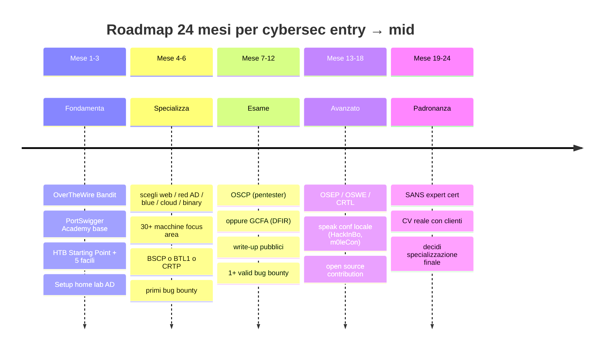

# Capstone: CTF roadmap, home lab, certifications

## Where you are and where to go

You've read 27 sections. **In theory** you know what exists in cybersecurity. **In practice** you're a competent beginner who has read an encyclopedia. To become an expert you need to **do**: hours of exercise, attempts, failures, repetition.

This section tells you how to structure the next 6, 12, 24 months.

## The suggested roadmap (12-24 months)



### Month 1-3 — Solid foundations
- Complete **OverTheWire Bandit** (levels 1-30).
- Complete **PortSwigger Web Security Academy** (go through all the base modules).
- 10 **HackTheBox Starting Point** machines + 5 easy ones.
- Set up a **home AD lab** (see section 13).
- Start writing **write-ups**. Yours, even if brief. On Notion / blog / Git.

### Month 4-6 — Initial specialization
Choose **one** path (not three). Web, Red AD, Blue/SOC, Cloud, Mobile, Binary.

For **Web**:
- 30+ HTB / TryHackMe machines focused on web.
- Complete **PortSwigger** including advanced modules.
- Burp Suite Certified Practitioner (**BSCP**): practical cert, real-world style exam. 200 EUR.
- Bug bounty: pick 1 program, read all the write-ups from the last 6 months on the platform, try it.

For **AD / Internal pentest**:
- TryHackMe paths "Offensive Pentest" and "Wreath".
- HTB Pro Lab "Dante" or "Offshore".
- Study **CRTO** (Zero-Point Security, ~360 EUR) or **CRTP** (Pentester Academy).

For **Blue team**:
- TryHackMe path "SOC Level 1".
- Detection Lab + Atomic Red Team.
- **Blue Team Level 1** (BTL1, Security Blue Team).
- **Splunk Power User** or Microsoft SC-200.

For **Binary / Reversing**:
- pwn.college all base modules.
- Cryptopals Sets 1-3.
- picoCTF "Reverse" and "Pwn".
- Yurichev's book "Reverse Engineering for Beginners".

For **Cloud**:
- flaws.cloud, flaws2.cloud.
- HTB Pro Labs "Hephaestus" (cloud-focused).
- AWS SCS-C02 cert (Security Specialty).

### Month 7-12 — Industry exam + bug bounty
- **OSCP** (Offensive Security Certified Professional) — the "rite of passage". 1500 EUR + 90 days of lab. 24h practical exam + report.
- Bug bounty: dedicated target, at least 1 valid report.
- Keep publishing write-ups.

### Month 13-18 — Advanced
- For offensive: **OSEP** (evasion + complex AD) or **OSWE** (web).
- For AD: **CRTL** (Pentester Academy expert).
- For reversing: **OSED** (exploit dev).
- For cloud: advanced vendor certs.
- For blue: **GIAC** (GCFA, GNFA, GREM).

### Month 19-24 — Mastery
- "Expert" tier cert (SANS pricey).
- Conferences as a speaker.
- Open source contribution.
- Real CV with clients / paid work.

## CTF — types and formats

CTF = Capture The Flag. A challenge with "flags" (strings) to find by solving problems.

### Classic categories
- **Web** — web application vulns.
- **Pwn / Binary exploit** — buffer overflow, ROP.
- **Reverse Engineering** — disassembly, crackmes.
- **Crypto** — weak primitives, padding oracle, math attacks.
- **Forensics** — pcap, memory, disk analysis.
- **Stego** — info hidden in files.
- **OSINT** — public investigation.
- **Misc / Networking / Mobile / Hardware**.

### Formats
- **Jeopardy** (challenges per category, ranking by points). Online, dozens of players.
- **Attack & Defense** (A&D): each team has vulnerable services to defend while attacking others'. Live (RuCTF/iCTF).
- **King of the Hill**: everyone against everyone on a single box.
- **Boot2root** (HTB / proving grounds): full machines, gain root.

### Essential platforms

| Platform | What it offers |
|---|---|
| **HackTheBox** | boot2root machines, fortresses, pro labs, prolab cloud, sherlocks (DFIR) |
| **TryHackMe** | guided rooms, structured paths, excellent to start |
| **PortSwigger Academy** | free, web-focused, excellent labs |
| **picoCTF** | free, CMU/junior CTF, multi-category |
| **OverTheWire** | Bandit wargame (Linux), Narnia, Leviathan |
| **root-me** | French, wide variety |
| **pwn.college** | ASU course, free, deep exercises |
| **CryptoHack** | crypto-focused |
| **Hacker101** (HackerOne) | bug-bounty oriented |
| **Vulnhub** | downloadable VMs for local labs |
| **CTFtime** | worldwide CTF calendar, team rankings |

### Examples of well-known live CTFs
- **DEF CON CTF** (Las Vegas, August).
- **PlaidCTF, Google CTF, Hack-A-Sat, Pwn2Own**.
- **m0leCon** (Turin, IT) — Italian, well done.
- **N3rdctf**, **ENOWARS**, **CSAW** (NYU).

## Bug bounty — how to start seriously

### Platforms
- **HackerOne** — the largest. Public and private programs.
- **Bugcrowd** — alternative.
- **Intigriti** — strong in the EU.
- **YesWeHack** — FR.
- **Open Bug Bounty** — for small sites.

### Realistic ways to start
1. **Study 50+ public write-ups** on the bug type you're hunting. Understand patterns.
2. **Pick a program** with broad scope and high signal-to-noise ratio (e.g., Atlassian, GitHub, GitLab, Shopify have well-known historical reports).
3. **Specialize**: those hunting IDORs on REST APIs beat those trying "everything".
4. **Deep recon** before touching anything.
5. **Quality > quantity**: poorly written reports = ban.

### Typical payouts (2026)
- Low/Info: 0 (often unpaid).
- Medium: $100-500.
- High: $500-3000.
- Critical: $2000-20000 (top programs: 50k+).

Living off bug bounty alone is rare and hard. It's usually combined with consulting / employment.

## Building a serious home lab (recap)

Three lab tiers:

**Base tier (free, lightweight):**
- VirtualBox + Kali + 1-2 targets.
- DVWA / Juice Shop in Docker.

**Intermediate tier (a few EUR):**
- Proxmox on an old mini-PC.
- 5-10 VMs (Kali + AD + 2 workstations + 1 Linux + 1 IoT lab).
- pfSense as a router with rules.

**Advanced tier (a few hundred EUR):**
- Homelab server (Dell R720 used, 200 EUR on eBay).
- VLAN-aware switch.
- Modifiable wireless AP (OpenWRT).
- USB SDR + JTAG/CH341A kit.

**Pre-built**:
- **GOAD** (Game of Active Directory) — scriptable AD lab.
- **DetectionLab** — Splunk + sysmon ready.
- **Vulhub** — Docker compose for specific CVEs.

## Communities and continuous resources

- **Twitter / Mastodon / Bluesky**: profiles like Bishop Fox, SpecterOps, Mandiant, Trend Micro Research, Daniel Miessler, Tavis Ormandy, John Hammond, Tib3rius, ippsec.
- **Official Discord / Slack**: HackTheBox, TryHackMe, Pentester Lab, Bug Bounty Hunters.
- **Reddit**: r/netsec (high quality), r/AskNetSec.
- **IT conferences**: m0leCon (Turin), HackInBo (Bologna), No Hat (Bergamo), HackInTheBox (various), Code Blue, OffensiveCon.
- **Online lectures**: ippsec YouTube (HTB walkthroughs), LiveOverflow, John Hammond, PwnFunction.
- **Newsletters**: Risky Business, tl;dr sec, Bleeping Computer, This Week in Security.
- **Podcasts**: Risky Business (Patrick Gray), Darknet Diaries (Jack Rhysider), CyberWire.

## Career in Italy — practical

### Real 2026 salaries (indicative gross)
- **Junior SOC L1**: 24-32k.
- **Junior Pentester / SOC L2**: 30-42k.
- **Mid Pentester (3-5y)**: 40-55k.
- **Senior Pentester / Red Team (5-8y)**: 55-75k.
- **Senior DFIR**: 50-80k.
- **AppSec / Cloud Sec mid**: 45-65k.
- **CISO / Security Architect**: 80-150k+.

### What they actually look for
- **OSCP** is almost mandatory for junior pentesters in Italy 2026.
- **Documented practical experience** (completed HTB Pro Labs, write-ups) beats a degree alone.
- **Technical English** is a prerequisite (reports, advisories, vendors).
- **Written communication** (being able to write readable reports) is underrated by everyone and makes the difference.

### Sectors in IT that hire
- Consulting: Accenture, Deloitte Cyber, KPMG, EY, PwC, NTT, Reply Communication Valley, Hwg Sababa, Var Group, P4I.
- Vendor / Telco: TIM, Vodafone, Wind3, Almaviva, Engineering, IBM.
- Industry / energy: ENI, Enel, Snam, Leonardo (defense), Saipem.
- Finance: UniCredit, Intesa Sanpaolo, MPS, Generali, ING.
- Pure-play security: SecureFlag, P4I, Pikered, Yarix, Hackmanac, Telsy.
- ACN (National Cybersecurity Agency) — public competitions.

### When to apply
- Stop "studying for one more year". Apply to SOC L1 after finishing the TryHackMe SOC L1 path.
- For junior pentester with no experience: OSCP + 5 HTB Pro Labs + validated bug bounties = applicable.
- Heads-up: junior in security pays LESS than the equivalent dev role. You make it up in 2-3 years if you grow.

## Common mistakes to avoid

1. **"When I know everything I'll start"**: never. Start anyway.
2. **"I'll buy 5 certs and then look for a job"**: certs without practical experience are worthless.
3. **"I'll specialize in everything"**: impossible. Specialize in 1, know 3 adjacent areas, name-level knowledge of the rest.
4. **"Tool > understanding"**: someone who only knows how to click in Burp is replaceable by a script.
5. **"Solo"**: the community speeds you up 10x.
6. **"Never write"**: write write-ups, even bad ones. They improve over time.
7. **"Bug bounty will make me rich"**: few live off bounty alone. It's an add-on.
8. **"I'll buy Cobalt Strike for the lab"**: use open source Sliver/Mythic. The cert will give you access when needed.

## "30 seconds" cheat sheet

```text
Vuoi essere pentester?
  → OSCP + HTB + write-up + bug bounty validi.

Vuoi essere blue team?
  → Sysmon mastery + SIEM (Splunk/Sentinel/Elastic) + Sigma + DFIR practice.

Vuoi reverse / malware?
  → Yurichev + Ghidra + Practical Malware Analysis + crackmes.

Vuoi cloud?
  → AWS SCS-C02 + flaws.cloud + Prowler + bug bounty cloud-focused.

Vuoi AI security?
  → OWASP LLM Top 10 + garak + PyRIT + ricerca paper.

Vuoi essere CISO?
  → 10+ anni esperienza tecnica + CISSP/CISM + MBA-light + comunicazione executive.
```

## Final exercise: the next 90 days plan

Actually write it down. On paper or a doc.

- **Week 1-4**: what you complete (4 measurable goals).
- **Month 2**: what you practice (labs, write-ups).
- **Month 3**: what you demonstrate (certs, bug bounties, write-ups, applications).

Publish it (even just "to yourself", or to a mentor). **Accountability = result.**

## A sincere word to close

Cybersecurity will give you:
- **Deep knowledge** of systems most engineers use as black boxes.
- **Stable work** in an industry where demand > supply.
- **A sense of purpose** (you protect people, businesses, infrastructure).
- **An international career**.

And it will ask of you:
- **Continuous learning** for the rest of your career. Everything changes every 3 years.
- **Mental resilience** when an attack fails, a client is unhappy, an HTB machine drives you crazy for 10 hours.
- **Solid ethics**. The temptation is there (you know things worth money). Resist.

Safe travels. Don't look at others: compare yourself to who you were yesterday.

> *"There is no royal road to geometry."* — Euclid.
> *"There is no royal road to security either."* — anyone who has tried it.
