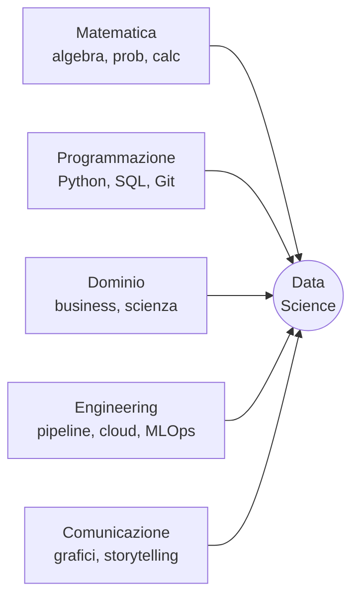
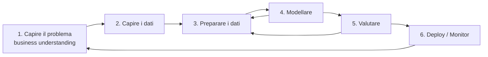
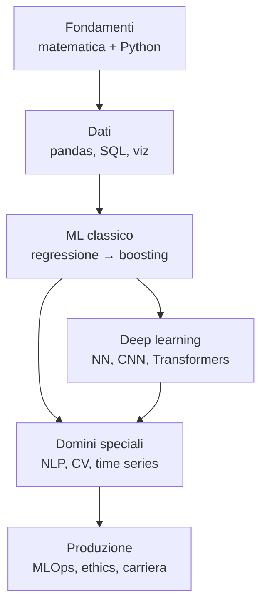
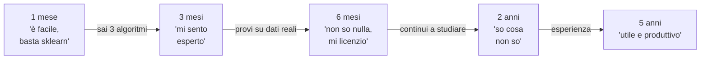

# Cos'è la data science (e cosa non è)

## Una definizione che funziona davvero

La definizione più diffusa, "intersezione di statistica, informatica e dominio applicativo", è vera ma inutile. Una più operativa:

> **Data science = trasformare dati grezzi in decisioni replicabili.**

Tre parole chiave:

- **trasformare**: scrivi codice. Estrai, pulisci, modelli, valuti. Niente magia.
- **dati grezzi**: imperfetti, mancanti, sbilanciati. Il 70% del tuo tempo è qui.
- **decisioni replicabili**: la metrica conta solo se qualcuno la usa per scegliere. Altrimenti è arte.

## Il diagramma di Venn aggiornato

Il famoso diagramma di Drew Conway (2010) divideva il mondo in tre cerchi: matematica/statistica, hacking skills, dominio. Nel 2026 ne serve uno aggiornato con cinque cerchi:

Se ti manca uno qualsiasi di questi cerchi, puoi comunque essere bravo — ma in un sottoinsieme di problemi. Un data scientist accademico è forte in M+D+C, debole in E. Un ML engineer è forte in P+E+M, debole in D. Sapere dove sei forte è metà del lavoro.

## Il ciclo di vita di un progetto (CRISP-DM aggiornato)

Il modello classico **CRISP-DM** (Cross-Industry Standard Process for Data Mining, IBM 1996) è ancora il più sensato. Sei fasi, iterative:

**Numeri reali dalla mia esperienza** (rough estimate, qualsiasi senior te lo confermerà):

| Fase | % del tempo |
|---|---|
| Capire il problema | 5–15% |
| Capire ed esplorare i dati | 20% |
| Preparare i dati | 30–50% |
| Modellare | 10–15% |
| Valutare | 10% |
| Deploy/monitor | 10–20% |

Il modello non è la cosa più importante. Lo è la **pulizia** e la **comprensione del problema**. Se ricordi solo una cosa di questa pagina, ricorda questo.

## Cosa NON è data science

- **Non è "fittare un modello"**. Quello è un'ora di lavoro su otto settimane di progetto.
- **Non è "trovare insight con un dashboard"**. Quello è business intelligence, anche se utilissima.
- **Non è "applicare il deep learning a tutto"**. Per il 70% dei problemi reali, una regressione logistica ben fatta batte una rete neurale male specificata.
- **Non è "lavorare con i Big Data"**. La maggior parte dei dataset aziendali stanno in RAM. Pandas, non Spark.
- **Non è "AI"**. AI è un termine di marketing che oggi significa principalmente LLM. La data science è un campo molto più vasto e più vecchio (Tukey scriveva di "data analysis" negli anni '60).

## I ruoli che troverai sul mercato

| Ruolo | Cosa fa | Stack tipico |
|---|---|---|
| **Data analyst** | Risponde a domande con SQL e dashboard | SQL, Excel, Tableau/PowerBI |
| **Data scientist** | Costruisce modelli predittivi/inferenziali | Python, scikit-learn, statsmodels |
| **ML engineer** | Mette modelli in produzione | Python, Docker, Kubernetes, MLflow |
| **Data engineer** | Costruisce pipeline che muovono i dati | SQL, Spark, Airflow, dbt |
| **Research scientist** | Inventa nuovi metodi (richiede PhD) | PyTorch/JAX, paper |
| **Analytics engineer** | Modella dati per business intelligence | dbt, SQL, Snowflake |
| **AI engineer (2024+)** | Costruisce applicazioni con LLM | LangChain, vector DB, APIs |

Non sono ruoli rigidi: in startup uno fa tutto, in big tech sono separati. Questo percorso ti prepara a essere principalmente un **data scientist generalista** con basi solide ovunque.

## Cosa imparerai in questo percorso

Alla fine sarai in grado di:

1. Leggere un paper di ML e capire cosa fa (anche se non subito ogni dettaglio).
2. Affrontare un dataset nuovo: capirlo, pulirlo, trovare segnale.
3. Scegliere il modello giusto (non sempre il più nuovo).
4. Valutare onestamente: non barare a te stesso sui risultati.
5. Mettere un modello in produzione e monitorarlo.
6. Comunicare cosa hai trovato a chi non parla matematica.

## Cosa NON imparerai (qui)

- **PhD-level math**. Capirai algebra lineare e calcolo a livello "applicato", non a livello dimostrativo.
- **Frontend / mobile**. Niente React, niente Swift. Backend Python sì.
- **Tutti i framework**. PyTorch sì, JAX e TensorFlow accennati. Non puoi sapere tutto, e va bene.
- **L'ultimo paper di NeurIPS**. La ricerca avanza più veloce di qualsiasi corso. Ti darò le basi per leggerli da solo.

## La curva di Dunning–Kruger della data science

Se ti trovi al punto C, non mollare. Tutti ci passano. È il punto in cui inizi a capire **perché** le cose funzionano (o no), e da lì in avanti ogni mese di studio ha un rendimento composto.

## L'unica frase da incorniciare

> Il tuo modello migliore è inutile se non puoi spiegare cosa fa, perché funziona, e quando smetterà di funzionare.

Modelli accurati esistono ovunque. **Modelli affidabili** sono rari, e sono ciò che paga lo stipendio dei data scientist senior.

## Esercizi

Esercizio 1 — Classifica i problemi

Per ciascun problema, identifica se è meglio risolvibile con: A) data analysis, B) ML classico, C) deep learning, D) regole hand-coded, E) niente di tutto questo (è una domanda sbagliata).

1. "Quanti utenti hanno aperto la nostra app la scorsa settimana?"
2. "Quali clienti smetteranno di pagare l'abbonamento nei prossimi 30 giorni?"
3. "Identifica i tumori in queste 10000 immagini di risonanza magnetica."
4. "Se aggiungiamo questo bottone, vendiamo di più?"
5. "Genera un riassunto di questo articolo di 5000 parole."
6. "L'IBAN inserito dall'utente è formalmente valido?"
7. "Perché l'utente John Smith ha smesso di usare l'app?"
8. "Quale prezzo dovremmo applicare per massimizzare i profitti?"

**Soluzione:**
1. A (SQL). 2. B (regressione logistica/gradient boosting). 3. C (CNN). 4. E (A/B test, non ML). 5. C (LLM). 6. D (regex/checksum). 7. E (non rispondibile da dati soli, serve user research). 8. B+E (modello + business sense).

Il punto chiave: non tutto è ML. La domanda "qual è lo strumento giusto?" precede sempre "quale algoritmo uso?".

Esercizio 2 — Stima il tempo

Un'azienda ti commissiona un sistema per prevedere quali clienti faranno churn (annulleranno il contratto) nei prossimi 90 giorni. Hai 6 settimane.

Stima quante ore spenderai in ciascuna fase CRISP-DM. Includi: meeting con stakeholder, esplorazione dati, feature engineering, modellazione, valutazione, presentazione, deploy.

**Stima ragionevole** (su ~240 ore totali):

- Capire problema + stakeholder: 30h (12%)
- Esplorazione dati + SQL: 50h (21%)
- Pulizia + feature engineering: 70h (29%)
- Modellazione: 30h (12%)
- Valutazione + iterazione: 30h (12%)
- Presentazione + deploy: 30h (12%)

Se la tua stima diceva "150h di modellazione e 10h di pulizia", riflettici. Quando un junior dice "non ho avuto tempo di fare niente di interessante", il problema è quasi sempre che ha sottovalutato la 3, non la 4.

Esercizio 3 — Quale ruolo ti somiglia?

Leggi questi tre estratti di job description e identifica il ruolo:

**A)** "5+ years experience with distributed systems, Kafka, Airflow. Build and maintain ELT pipelines moving 500GB/day from operational stores to Snowflake. Optimize dbt models for downstream analytics teams."

**B)** "PhD or equivalent in CS/Stat. Strong publication record in NeurIPS/ICML. Design and prototype novel architectures for multimodal foundation models. Familiarity with JAX preferred."

**C)** "Strong Python and SQL. Experience deploying scikit-learn or XGBoost models to production. Familiarity with Docker, Kubernetes, MLflow or similar. Owned model lifecycle end-to-end."

**Soluzione:** A=data engineer, B=research scientist, C=ML engineer. Nessuna delle tre è "data scientist puro", che oggi è in via di estinzione nelle big tech a favore di ruoli più specializzati. In aziende più piccole il "data scientist" fa pezzi di tutti e tre.

## Cosa leggere oltre

- **Andrew Ng** — "Machine Learning Yearning" (gratis, PDF): strategia di progetto, non algoritmi.
- **Hadley Wickham, Garrett Grolemund** — "R for Data Science" (sì, anche se usiamo Python): i workflow descritti sono universali.
- **Trevor Hastie, Robert Tibshirani** — "An Introduction to Statistical Learning" (ISLR, gratis): il testo standard. Lo userai in più sezioni di questo percorso.
- **Cassie Kozyrkov** — articoli su Medium: il miglior critico del "tutto è AI". Leggila per non perdere la testa.

## Prossimo step

Nella prossima sezione impostiamo Python e l'ambiente di lavoro. Se hai già un setup, leggila comunque: la maggior parte dei junior usa male `pip` e `venv`, e poi paga il prezzo per anni.
