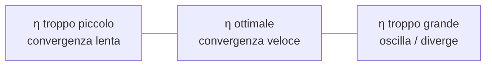

# Calcolo, gradiente e ottimizzazione

## Perché il calcolo

Quasi ogni algoritmo di ML minimizza una **loss function** $L(\boldsymbol{\theta})$ rispetto ai parametri $\boldsymbol{\theta}$. Trovare il minimo richiede sapere **da che parte scendere**: questa è la definizione di derivata/gradiente.

> "Backpropagation" — il cuore del deep learning — è solo applicazione iterata della **chain rule**.

## Derivata in una variabile

La derivata di $f(x)$ in $x_0$ misura **la pendenza** della funzione lì:

$$f'(x_0) = \lim_{h \to 0} \frac{f(x_0 + h) - f(x_0)}{h}$$

Geometricamente: la pendenza della retta tangente al grafico nel punto $x_0$.

<div class="chart"><svg viewBox="0 0 360 220" xmlns="http://www.w3.org/2000/svg">
<line x1="30" y1="200" x2="340" y2="200" stroke="#444"/>
<line x1="30" y1="20" x2="30" y2="200" stroke="#444"/>
<path d="M 30 195 Q 100 195 180 110 T 340 30" fill="none" stroke="#7aa2ff" stroke-width="2.5"/>
<line x1="120" y1="180" x2="240" y2="80" stroke="#ffb347" stroke-width="2"/>
<circle cx="180" cy="130" r="4" fill="#ffb347"/>
<text x="190" y="125" fill="#ffb347" font-size="11">x₀, f(x₀)</text>
<text x="245" y="100" fill="#ffb347" font-size="11">f'(x₀) = pendenza</text>
</svg><div class="chart-caption">La derivata è la pendenza della tangente al grafico.</div></div>

### Regole essenziali

| Funzione | Derivata |
|---|---|
| $c$ (costante) | $0$ |
| $x^n$ | $n x^{n-1}$ |
| $e^x$ | $e^x$ |
| $\ln x$ | $1/x$ |
| $\sin x$ | $\cos x$ |
| $\sigma(x) = \frac{1}{1+e^{-x}}$ | $\sigma(x)(1-\sigma(x))$ |
| $\text{ReLU}(x) = \max(0, x)$ | $1$ se $x>0$, $0$ altrimenti |
| $\tanh x$ | $1 - \tanh^2 x$ |

E le regole di combinazione:

- **Somma**: $(f+g)' = f' + g'$
- **Prodotto**: $(fg)' = f'g + fg'$
- **Quoziente**: $(f/g)' = (f'g - fg')/g^2$
- **Catena (chain rule)**: $(f(g(x)))' = f'(g(x)) \cdot g'(x)$

La **chain rule** è il pezzo più importante. La userai in ogni passo della backpropagation.

### Esempio: derivata della sigmoid

$\sigma(x) = \frac{1}{1+e^{-x}}$. Mostriamo che $\sigma'(x) = \sigma(x)(1 - \sigma(x))$.

Sia $u = 1 + e^{-x}$. Allora $\sigma = u^{-1}$ e $u' = -e^{-x}$. Per chain rule:

$$\sigma'(x) = -u^{-2} \cdot u' = \frac{e^{-x}}{(1+e^{-x})^2}$$

Riscrivendo: $\frac{e^{-x}}{1+e^{-x}} = 1 - \frac{1}{1+e^{-x}} = 1 - \sigma(x)$. Quindi $\sigma'(x) = \sigma(x)(1 - \sigma(x))$. Bello, no?

## Funzioni di più variabili: il gradiente

Per $f: \mathbb{R}^n \to \mathbb{R}$, il **gradiente** è il vettore delle derivate parziali:

$$\nabla f(\mathbf{x}) = \left( \frac{\partial f}{\partial x_1}, \frac{\partial f}{\partial x_2}, \dots, \frac{\partial f}{\partial x_n} \right)^T$$

**Proprietà chiave**: $\nabla f$ punta nella direzione di **massima crescita**. Andando nella direzione opposta $-\nabla f$, scendiamo più velocemente possibile. Questa è la base di **gradient descent**.

### Esempio: $f(x, y) = x^2 + y^2$

$\frac{\partial f}{\partial x} = 2x$, $\frac{\partial f}{\partial y} = 2y$. Quindi $\nabla f = (2x, 2y)^T$.

Nel punto $(1, 1)$ il gradiente è $(2, 2)$ — punta a nord-est, lontano dal minimo che è in $(0, 0)$. Per scendere, ci muoviamo verso $(-2, -2)$.

<div class="chart"><svg viewBox="0 0 320 220" xmlns="http://www.w3.org/2000/svg">
<g transform="translate(160,110)">
  <circle r="80" fill="none" stroke="#444" stroke-width="1"/>
  <circle r="60" fill="none" stroke="#444" stroke-width="1"/>
  <circle r="40" fill="none" stroke="#444" stroke-width="1"/>
  <circle r="20" fill="none" stroke="#444" stroke-width="1"/>
  <line x1="-100" y1="0" x2="100" y2="0" stroke="#555"/>
  <line x1="0" y1="-100" x2="0" y2="100" stroke="#555"/>
  <circle cx="0" cy="0" r="3" fill="#5ee2c4"/>
  <text x="6" y="-6" fill="#5ee2c4" font-size="10">min</text>
  <circle cx="50" cy="-50" r="4" fill="#ffb347"/>
  <line x1="50" y1="-50" x2="80" y2="-80" stroke="#ffb347" stroke-width="2"/>
  <polygon points="80,-80 73,-75 75,-83" fill="#ffb347"/>
  <text x="56" y="-46" fill="#ffb347" font-size="10">∇f</text>
  <line x1="50" y1="-50" x2="20" y2="-20" stroke="#7aa2ff" stroke-width="2" stroke-dasharray="3,2"/>
  <polygon points="20,-20 27,-25 25,-17" fill="#7aa2ff"/>
  <text x="6" y="-32" fill="#7aa2ff" font-size="10">-∇f</text>
</g>
</svg><div class="chart-caption">Curve di livello di f=x²+y². ∇f è perpendicolare alle curve, punta a salire. -∇f è la direzione di discesa.</div></div>

### Hessiana

La matrice delle derivate seconde:

$$H_f(\mathbf{x}) = \begin{bmatrix} \frac{\partial^2 f}{\partial x_1^2} & \cdots & \frac{\partial^2 f}{\partial x_1 \partial x_n} \\ \vdots & \ddots & \vdots \\ \frac{\partial^2 f}{\partial x_n \partial x_1} & \cdots & \frac{\partial^2 f}{\partial x_n^2} \end{bmatrix}$$

Usata in:
- **Test del minimo**: $H$ definita positiva → $\mathbf{x}$ è minimo locale.
- **Newton's method**: $\mathbf{x}_{k+1} = \mathbf{x}_k - H^{-1} \nabla f$. Convergenza quadratica, ma costoso (calcolare e invertire $H$).
- **Curvature**: caratterizza la "forma" della loss surface.

## Gradient descent

L'algoritmo più importante del machine learning moderno:

```
inizializza θ
ripeti:
    g = ∇L(θ)              # calcola il gradiente
    θ = θ - η · g          # aggiorna nella direzione opposta
finché non converge
```

dove $\eta$ (eta) è il **learning rate**.

### Scelta del learning rate



<div class="chart"><svg viewBox="0 0 480 200" xmlns="http://www.w3.org/2000/svg">
<g transform="translate(20,20)">
  <path d="M 0 160 Q 60 0 120 160" fill="none" stroke="#5ee2c4" stroke-width="2"/>
  <circle cx="20" cy="120" r="3" fill="#ffb347"/>
  <circle cx="32" cy="95" r="3" fill="#ffb347"/>
  <circle cx="44" cy="75" r="3" fill="#ffb347"/>
  <circle cx="55" cy="55" r="3" fill="#ffb347"/>
  <text x="20" y="190" fill="#5ee2c4" font-size="11">η piccolo</text>
</g>
<g transform="translate(180,20)">
  <path d="M 0 160 Q 60 0 120 160" fill="none" stroke="#5ee2c4" stroke-width="2"/>
  <circle cx="20" cy="120" r="3" fill="#ffb347"/>
  <circle cx="55" cy="55" r="3" fill="#ffb347"/>
  <circle cx="60" cy="40" r="3" fill="#ffb347"/>
  <text x="20" y="190" fill="#5ee2c4" font-size="11">η ottimale</text>
</g>
<g transform="translate(340,20)">
  <path d="M 0 160 Q 60 0 120 160" fill="none" stroke="#5ee2c4" stroke-width="2"/>
  <circle cx="20" cy="120" r="3" fill="#ff7a7a"/>
  <circle cx="95" cy="100" r="3" fill="#ff7a7a"/>
  <circle cx="10" cy="135" r="3" fill="#ff7a7a"/>
  <circle cx="100" cy="120" r="3" fill="#ff7a7a"/>
  <text x="20" y="190" fill="#ff7a7a" font-size="11">η troppo grande</text>
</g>
</svg></div>

In pratica: prova $\eta \in \{10^{-1}, 10^{-2}, 10^{-3}, 10^{-4}\}$ e guarda la loss. Esistono **scheduler** che lo riducono nel tempo (cosine, step decay, warmup).

### Implementazione manuale

```python
import numpy as np

def f(x):
    return (x - 3) ** 2 + 2          # minimo in x=3, f=2

def grad(x):
    return 2 * (x - 3)

x = 0.0
eta = 0.1
history = [x]
for step in range(50):
    g = grad(x)
    x = x - eta * g
    history.append(x)
print(f"x finale: {x:.4f}, f: {f(x):.4f}")
# x finale: 2.9999, f: 2.0000
```

### Visualizzato: la "pallina che rotola nella valle"

<div class="chart"><svg viewBox="0 0 460 240" xmlns="http://www.w3.org/2000/svg">
<line x1="40" y1="200" x2="440" y2="200" stroke="#555"/>
<line x1="40" y1="20" x2="40" y2="200" stroke="#555"/>
<text x="240" y="225" fill="#8b949e" font-size="11" text-anchor="middle">parametro θ →</text>
<text x="22" y="120" fill="#8b949e" font-size="11">loss L(θ)</text>

<path d="M 60 50 Q 250 230 440 50" fill="none" stroke="#7aa2ff" stroke-width="2"/>

<circle cx="80" cy="76" r="6" fill="#ffb347"/>
<text x="60" y="70" fill="#ffb347" font-size="10">θ₀</text>

<circle cx="130" cy="135" r="6" fill="#ffb347" opacity="0.85"/>
<text x="115" y="128" fill="#ffb347" font-size="10">θ₁</text>

<circle cx="180" cy="175" r="6" fill="#ffb347" opacity="0.7"/>
<text x="165" y="168" fill="#ffb347" font-size="10">θ₂</text>

<circle cx="230" cy="195" r="6" fill="#ffb347" opacity="0.55"/>
<text x="215" y="188" fill="#ffb347" font-size="10">θ₃</text>

<circle cx="250" cy="200" r="7" fill="#5ee2c4"/>
<text x="265" y="198" fill="#5ee2c4" font-size="11">minimo θ*</text>

<line x1="80" y1="76" x2="130" y2="135" stroke="#ffb347" stroke-width="1" stroke-dasharray="3,2"/>
<line x1="130" y1="135" x2="180" y2="175" stroke="#ffb347" stroke-width="1" stroke-dasharray="3,2"/>
<line x1="180" y1="175" x2="230" y2="195" stroke="#ffb347" stroke-width="1" stroke-dasharray="3,2"/>
<line x1="230" y1="195" x2="250" y2="200" stroke="#ffb347" stroke-width="1" stroke-dasharray="3,2"/>

<text x="240" y="35" fill="#8b949e" font-size="11" text-anchor="middle">step lunghi all'inizio (gradiente grande), corti vicino al minimo (gradiente piccolo)</text>
</svg><div class="chart-caption">Gradient descent: ad ogni step ti muovi nella direzione opposta del gradiente, di una quantità proporzionale alla pendenza.</div></div>

### Varianti che vedi nel codice reale

| Variante | Idea | Quando usarla |
|---|---|---|
| **GD batch** | $\nabla L$ su tutti i dati | Dataset piccoli |
| **SGD** | $\nabla L$ su 1 campione a caso | Storica, rumorosa ma scalabile |
| **Mini-batch SGD** | $\nabla L$ su batch di 32–512 | Standard in DL |
| **SGD + momentum** | accumula direzione passate | Accelera in valli strette |
| **Adam** | adatta learning rate per parametro | Default di partenza per NN |
| **AdamW** | Adam con decay corretto | Default attuale per Transformer |
| **L-BFGS** | approssima Hessian | Problemi convessi piccoli (Logistic, MLE) |

Adam, in formula compatta:

$$m_t = \beta_1 m_{t-1} + (1-\beta_1) g_t$$
$$v_t = \beta_2 v_{t-1} + (1-\beta_2) g_t^2$$
$$\hat{m}_t = m_t / (1-\beta_1^t), \quad \hat{v}_t = v_t / (1-\beta_2^t)$$
$$\theta_{t+1} = \theta_t - \eta \frac{\hat{m}_t}{\sqrt{\hat{v}_t} + \epsilon}$$

Tieni a mente $\beta_1=0.9$, $\beta_2=0.999$, $\epsilon=10^{-8}$ come default.

## La chain rule, di nuovo: backpropagation

Una rete neurale è una funzione composta:

$$y = f_L(f_{L-1}(\dots f_1(\mathbf{x}; \theta_1) \dots; \theta_{L-1}); \theta_L)$$

Vogliamo $\frac{\partial L}{\partial \theta_l}$ per ogni layer $l$. Backpropagation calcola questi gradienti applicando la chain rule strato per strato, da destra a sinistra. Il costo è O(forward pass) — questo è il miracolo.

Esempio con due layer:

$$y = \sigma(w_2 \cdot \sigma(w_1 \cdot x + b_1) + b_2)$$

$$L = \frac{1}{2}(y - y_\text{true})^2$$

Per chain rule:

$$\frac{\partial L}{\partial w_1} = \underbrace{(y - y_\text{true})}_{\partial L / \partial y} \cdot \underbrace{\sigma'(\dots)}_{\partial y / \partial z_2} \cdot \underbrace{w_2}_{\partial z_2/\partial h_1} \cdot \underbrace{\sigma'(\dots)}_{\partial h_1/\partial z_1} \cdot \underbrace{x}_{\partial z_1/\partial w_1}$$

Lungo, ma meccanico. PyTorch lo fa automaticamente con autograd.

## Ottimizzazione vincolata e Lagrangiani

Per minimizzare $f(\mathbf{x})$ soggetto a $g(\mathbf{x}) = 0$, si introduce il **moltiplicatore di Lagrange**:

$$\mathcal{L}(\mathbf{x}, \lambda) = f(\mathbf{x}) + \lambda g(\mathbf{x})$$

e si risolve $\nabla_{\mathbf{x}} \mathcal{L} = 0$, $\nabla_\lambda \mathcal{L} = 0$.

**Dove appare in ML?** SVM (margine massimo), regressione vincolata, PCA con vincolo di norma unitaria. Ne riparleremo nelle sezioni dedicate.

## Funzioni convesse: la promessa dell'ottimizzazione

Una funzione $f$ è **convessa** se il segmento tra due punti del grafico sta sopra al grafico:

$$f(\alpha x_1 + (1-\alpha) x_2) \leq \alpha f(x_1) + (1-\alpha) f(x_2), \quad \alpha \in [0,1]$$

**Perché ti interessa**: per una funzione convessa, **ogni minimo locale è globale**, e gradient descent converge al minimo vero. Sono convesse:

- Loss quadratica della regressione lineare
- Loss logistica della regressione logistica
- Loss SVM (hinge)
- Funzioni L1 e L2

**Non convesse**: le reti neurali. Ecco perché GD sulle NN trova minimi locali (ma in pratica funziona lo stesso — questo è uno dei misteri felici del deep learning).

## Numeri da memorizzare

- Derivata di $x^n$: $nx^{n-1}$
- $\sigma'(x) = \sigma(x)(1-\sigma(x))$
- $\text{softmax}_i' = p_i (\delta_{ij} - p_j)$ (vedrai nei NN)
- $\frac{d}{dx} \ln x = 1/x$, base di tutta la cross-entropy

## Esercizi

<details>
<summary>Esercizio 1 — Derivate base</summary>

Calcola:
1. $f(x) = 3x^4 - 2x^2 + 5$
2. $f(x) = e^{2x} \sin(x)$
3. $f(x) = \ln(1 + x^2)$
4. $f(x) = \sigma(2x + 1)$ (sigmoid)

**Soluzioni**:
1. $12x^3 - 4x$
2. $2 e^{2x} \sin x + e^{2x} \cos x = e^{2x}(2\sin x + \cos x)$
3. $\frac{2x}{1+x^2}$
4. $2 \sigma(2x+1)(1 - \sigma(2x+1))$
</details>

<details>
<summary>Esercizio 2 — Gradiente di funzioni vettoriali</summary>

Calcola $\nabla f$ per:
1. $f(x, y) = x^2 + 3xy + 2y^2$
2. $f(\mathbf{x}) = \mathbf{x}^T A \mathbf{x}$ con $A$ simmetrica
3. $f(\mathbf{w}) = \|\mathbf{y} - X \mathbf{w}\|_2^2$ (loss OLS)

**Soluzioni**:
1. $(2x + 3y, 3x + 4y)$
2. $2 A \mathbf{x}$
3. $-2 X^T (\mathbf{y} - X \mathbf{w})$ → posto a zero: $X^T X \mathbf{w} = X^T \mathbf{y}$ (Normal Equations)
</details>

<details>
<summary>Esercizio 3 — Gradient descent su funzione 2D</summary>

Implementa GD per $f(x, y) = x^2 + 5y^2$, partendo da $(3, 2)$. Plotta la traiettoria.

```python
import numpy as np, matplotlib.pyplot as plt

def f(p): return p[0]**2 + 5*p[1]**2
def grad(p): return np.array([2*p[0], 10*p[1]])

p = np.array([3.0, 2.0])
eta = 0.05
traj = [p.copy()]
for _ in range(50):
    p = p - eta * grad(p)
    traj.append(p.copy())
traj = np.array(traj)

x = np.linspace(-4, 4, 80); y = np.linspace(-3, 3, 80)
X, Y = np.meshgrid(x, y); Z = X**2 + 5*Y**2
plt.contour(X, Y, Z, 20)
plt.plot(traj[:,0], traj[:,1], 'o-', color='orange')
plt.show()
```

Osserva: il percorso "zig-zaga" perché la funzione è "stretta" su $y$. Questo è il motivo per cui si normalizzano le feature in ML.
</details>

<details>
<summary>Esercizio 4 — Confronto SGD vs Adam</summary>

Su una funzione semplice 2D non isotropica $(x^2 + 25 y^2)$, confronta convergenza di vanilla GD vs Adam:

```python
import numpy as np

def grad(p): return np.array([2*p[0], 50*p[1]])

def run_gd(p0, eta, n=200):
    p = p0.copy(); h = [p.copy()]
    for _ in range(n):
        p = p - eta * grad(p); h.append(p.copy())
    return np.array(h)

def run_adam(p0, eta=0.1, n=200, b1=0.9, b2=0.999, eps=1e-8):
    p = p0.copy(); m = np.zeros_like(p); v = np.zeros_like(p)
    h = [p.copy()]
    for t in range(1, n+1):
        g = grad(p)
        m = b1*m + (1-b1)*g
        v = b2*v + (1-b2)*g*g
        mh = m/(1-b1**t); vh = v/(1-b2**t)
        p = p - eta * mh / (np.sqrt(vh)+eps)
        h.append(p.copy())
    return np.array(h)

p0 = np.array([5.0, 1.0])
gd = run_gd(p0, eta=0.03)
ad = run_adam(p0)
print("GD finale:", gd[-1], " Adam finale:", ad[-1])
```

Adam tipicamente converge molto più veloce su questo paesaggio.
</details>

<details>
<summary>Esercizio 5 — Convessità</summary>

Quali sono convesse?
1. $f(x) = x^4$
2. $f(x) = -\ln(x)$ per $x > 0$
3. $f(x) = x \sin(x)$
4. $f(x) = \max(0, 1 - x)$ (hinge loss)
5. $f(x) = x^2 - 4x + 3$

**Soluzioni**: 1 sì (seconda derivata = $12x^2 \geq 0$), 2 sì ($1/x^2 > 0$), 3 NO (oscilla), 4 sì (massimo di due funzioni convesse), 5 sì (parabola).
</details>

## Cosa portarti via

- Derivata = pendenza. Gradiente = "verso quale direzione cresce di più".
- Gradient descent: $\theta \leftarrow \theta - \eta \nabla L$, l'algoritmo che muove tutto.
- Chain rule = backpropagation. Capirla = capire il deep learning.
- Convessità garantisce minimi globali. Reti neurali non sono convesse, ma in pratica funzionano lo stesso.
- Adam come default per NN, SGD+momentum è ancora valido (e a volte migliore in generalizzazione).

## Letture

- **3Blue1Brown** — "Essence of Calculus" (YouTube)
- **Stanford CS229** — note di matematica (gratis)
- **Goodfellow, Bengio, Courville** — "Deep Learning", capitoli 4–5: la teoria dell'ottimizzazione in DL

Prossimo: probabilità — la lingua dell'incertezza.
