# Distribuzioni di probabilità che incontrerai

## Mappa mentale

```mermaid
flowchart TD
    DISCRETE[Discrete] --> BER[Bernoulli<br/>1 lancio]
    DISCRETE --> BIN[Binomiale<br/>n lanci, conta successi]
    DISCRETE --> POIS[Poisson<br/>eventi in intervallo]
    DISCRETE --> GEO[Geometrica<br/>lanci fino a 1° successo]
    DISCRETE --> NEG[Neg. Binomiale<br/>varianza &gt; media]

    CONT[Continue] --> NORM[Normale<br/>somme, errori]
    CONT --> EXP[Esponenziale<br/>tempo tra eventi]
    CONT --> GAMMA[Gamma / Erlang<br/>somma di esponenziali]
    CONT --> BETA[Beta<br/>proporzioni in 0,1]
    CONT --> LN[Log-normale<br/>prodotti, redditi]
    CONT --> PAR[Pareto<br/>code pesanti]
    CONT --> TST[t-Student<br/>campioni piccoli]
    CONT --> FCH[F, χ²<br/>test]
```



## Distribuzioni discrete

### Bernoulli

Una prova binaria con probabilità di successo $p$.

$$P(X=1)=p, \quad P(X=0)=1-p$$

$E[X]=p$, $\text{Var}(X)=p(1-p)$. È la base di **regressione logistica** e classificazione binaria.

### Binomiale

Numero di successi in $n$ prove Bernoulli indipendenti con stessa $p$.

$$P(X=k) = \binom{n}{k} p^k (1-p)^{n-k}, \quad k=0,\dots,n$$

$E[X]=np$, $\text{Var}(X)=np(1-p)$.

Uso: conversion rate, click rate, sondaggi sì/no, A/B test.

```python
from scipy.stats import binom
binom(n=100, p=0.05).pmf(7)   # P(7 successi su 100, p=0.05)
binom.rvs(100, 0.05, size=10) # 10 campioni
```

### Poisson

Numero di eventi in un intervallo (tempo, spazio) se la rate è $\lambda$.

$$P(X=k) = \frac{\lambda^k e^{-\lambda}}{k!}, \quad k=0,1,2,\dots$$

$E[X]=\lambda$, $\text{Var}(X)=\lambda$. **Media uguale varianza** è la firma di Poisson.

Uso: chiamate al call center per ora, click in un'ora, mutazioni in DNA, terremoti, code.

> Se i dati hanno varianza >> media, NON sono Poisson — sono **overdispersed**, usa **Negative Binomial**.

### Geometrica

Numero di prove fino al primo successo (Bernoulli con prob $p$).

$$P(X=k) = (1-p)^{k-1} p, \quad k=1,2,\dots$$

$E[X]=1/p$. "Memoryless": $P(X > a+b | X > a) = P(X > b)$.

### Negative Binomial

Numero di fallimenti prima del $r$-esimo successo. Generalizza Poisson permettendo overdispersion. Usata in modelli di conteggi reali (vendite, chiamate) dove Poisson sotto-stima la coda.

## Distribuzioni continue

### Normale (Gaussiana)

$$f(x) = \frac{1}{\sigma \sqrt{2\pi}} \exp\left(-\frac{(x-\mu)^2}{2\sigma^2}\right)$$

Notazione: $X \sim \mathcal{N}(\mu, \sigma^2)$.

**Perché ovunque**: TLC garantisce che somme di molte variabili tendano a normale. Errori di misura, residui di modelli, medie campionarie.

Proprietà:
- 68% dei dati entro $\mu \pm \sigma$, 95% entro $\mu \pm 2\sigma$, 99.7% entro $\mu \pm 3\sigma$.
- Somma di normali indipendenti è normale: $X_1 + X_2 \sim \mathcal{N}(\mu_1+\mu_2, \sigma_1^2+\sigma_2^2)$.
- Trasformazione lineare: $aX+b \sim \mathcal{N}(a\mu+b, a^2\sigma^2)$.

<div class="chart"><svg viewBox="0 0 400 180" xmlns="http://www.w3.org/2000/svg">
<line x1="20" y1="150" x2="380" y2="150" stroke="#555"/>
<path d="M 20 150 Q 100 150 160 140 Q 180 130 200 30 Q 220 130 240 140 Q 300 150 380 150" fill="rgba(122,162,255,0.2)" stroke="#7aa2ff" stroke-width="2"/>
<line x1="200" y1="30" x2="200" y2="150" stroke="#ffb347" stroke-dasharray="3,3"/>
<text x="200" y="170" fill="#ffb347" font-size="11" text-anchor="middle">μ</text>
<line x1="160" y1="140" x2="160" y2="150" stroke="#c084fc" stroke-width="2"/>
<line x1="240" y1="140" x2="240" y2="150" stroke="#c084fc" stroke-width="2"/>
<text x="160" y="170" fill="#c084fc" font-size="10" text-anchor="middle">μ-σ</text>
<text x="240" y="170" fill="#c084fc" font-size="10" text-anchor="middle">μ+σ</text>
</svg><div class="chart-caption">La gaussiana standard: 68% nei colori più scuri, 95% nei dintorni di μ±2σ.</div></div>

### Esponenziale

Tempo tra eventi di Poisson con rate $\lambda$.

$$f(x) = \lambda e^{-\lambda x}, \quad x \geq 0$$

$E[X]=1/\lambda$, $\text{Var}(X)=1/\lambda^2$. Memoryless.

Uso: tempi di vita, tempo tra chiamate, tempi di attesa.

### Gamma

Somma di $k$ esponenziali (con shape $k$, rate $\lambda$).

$$f(x) = \frac{\lambda^k}{\Gamma(k)} x^{k-1} e^{-\lambda x}$$

Quando $k=1$, è esponenziale. Per $k$ intero si chiama **Erlang**. Usata per tempi di completamento di code, durate di chiamate.

### Beta

Distribuita su $[0,1]$. Famiglia molto flessibile, parametrizzata da $\alpha, \beta > 0$.

$$f(x) = \frac{x^{\alpha-1}(1-x)^{\beta-1}}{B(\alpha,\beta)}$$

Usi:
- Modellare proporzioni (conversion rate, tasso di successo).
- **Prior coniugata** della Binomiale (analisi Bayesiana).
- A/B test bayesiano: posterior di una conversion rate è Beta.

<div class="chart"><svg viewBox="0 0 400 160" xmlns="http://www.w3.org/2000/svg">
<line x1="20" y1="140" x2="380" y2="140" stroke="#555"/>
<path d="M 20 140 L 380 140 L 380 100 L 20 100 Z" fill="rgba(94,226,196,0.2)" stroke="#5ee2c4" stroke-width="2"/>
<path d="M 20 140 Q 200 -10 380 140" fill="none" stroke="#ffb347" stroke-width="2"/>
<path d="M 20 60 Q 100 40 200 100 Q 300 130 380 140" fill="none" stroke="#7aa2ff" stroke-width="2"/>
<text x="60" y="80" fill="#5ee2c4" font-size="11">α=1,β=1 uniforme</text>
<text x="200" y="20" fill="#ffb347" font-size="11" text-anchor="middle">α=5,β=5 picco al centro</text>
<text x="50" y="55" fill="#7aa2ff" font-size="11">α=0.5,β=2 decrescente</text>
</svg></div>

### Log-normale

Se $\log X \sim \mathcal{N}(\mu, \sigma^2)$, allora $X$ è log-normale. Coda destra pesante. Modella:
- Redditi
- Dimensioni file
- Concentrazioni biologiche
- Durate sessioni utente

### Pareto

Code estremamente pesanti. $f(x) \propto x^{-\alpha-1}$.

Modella: ricchezza ("80/20"), download da CDN, popolarità di tweet/video, terremoti.

Differenza con log-normale: la log-normale è "moderata" sulle code, Pareto è "estrema". Distinguere con un **CCDF in log-log**: Pareto è una retta.

### t-Student

$$T = \frac{Z}{\sqrt{V/k}}, \quad Z\sim\mathcal{N}(0,1), V \sim \chi^2_k$$

Code più pesanti della normale, parametrizzata dai gradi di libertà $k$. Per $k \to \infty$ → normale.

Uso: test su medie con $n$ piccolo e $\sigma$ ignota.

### Chi-quadrato ($\chi^2$)

Somma di $k$ normali standard al quadrato.

$$Q = Z_1^2 + Z_2^2 + \dots + Z_k^2 \sim \chi^2_k$$

Uso: test di indipendenza, varianza campionaria.

### F (Fisher-Snedecor)

Rapporto di due $\chi^2$ scalate. Test ANOVA usa F.

## Coniugazioni e prior bayesiani

Tabella mnemonica delle prior coniugate (vedi sezione bayesiana per dettagli):

| Likelihood | Prior coniugata | Posterior |
|---|---|---|
| Bernoulli/Binomiale | Beta(α, β) | Beta(α+successi, β+fallimenti) |
| Poisson | Gamma(α, β) | Gamma(α+somma, β+n) |
| Normale (σ noto) | Normale | Normale |

## Quale distribuzione per quali dati?

Workflow pratico:

1. **Variabile discreta?**
   - 0/1 → Bernoulli
   - conteggio limitato in n prove → Binomiale
   - conteggio in intervallo → Poisson (se var ≈ media), NegBin se varianza alta
2. **Variabile continua?**
   - simmetrica → Normale
   - $> 0$, skew destra moderata → Log-normale o Gamma
   - $> 0$, coda estremamente lunga → Pareto / Weibull
   - in $[0, 1]$ → Beta
3. **Adatta** con MLE, **valuta** con Q-Q plot, AIC, KS test.

```python
from scipy import stats
# fit di lognormale
shape, loc, scale = stats.lognorm.fit(data, floc=0)
# Q-Q plot
import statsmodels.api as sm
sm.qqplot(data, dist=stats.lognorm, sparams=(shape, loc, scale), line='45')
```

## Esercizi

<details>
<summary>Esercizio 1 — Identifica la distribuzione</summary>

Per ogni scenario, quale distribuzione?

1. Numero di click su un banner in un'ora (rate noto).
2. Frazione di utenti che cliccano (in $[0,1]$).
3. Tempo tra arrivi a un casello.
4. Reddito annuo di una popolazione.
5. Numero di gol in una partita.
6. Risultato di un lancio di moneta.
7. Altezza degli adulti.

**Soluzioni**: 1 Poisson, 2 Beta, 3 Esponenziale, 4 Log-normale (o Pareto sulla coda), 5 Poisson, 6 Bernoulli, 7 Normale.
</details>

<details>
<summary>Esercizio 2 — Calcolo Poisson</summary>

Un call center riceve in media 4 chiamate ogni 10 minuti. Qual è la probabilità di riceverne 7 in 10 minuti?

**Soluzione**:
$$P(X=7) = \frac{4^7 e^{-4}}{7!} \approx 0.0595$$

```python
from scipy.stats import poisson
poisson.pmf(7, mu=4)  # 0.0595
```
</details>

<details>
<summary>Esercizio 3 — A/B test bayesiano con Beta</summary>

Hai due varianti. Variante A: 100 visitatori, 12 conversioni. Variante B: 100 visitatori, 18 conversioni. Usando prior Beta(1,1) (uniforme), calcola posterior e P(B migliore di A).

```python
import numpy as np
from scipy.stats import beta
# posterior: Beta(α + successi, β + fallimenti)
a_post = beta(1+12, 1+88)
b_post = beta(1+18, 1+82)

# Monte Carlo: P(B > A)
n = 100_000
sa = a_post.rvs(n); sb = b_post.rvs(n)
print((sb > sa).mean())   # ~0.89
```

89% di probabilità che B sia meglio. Non è ancora "p<0.05" ma ti dà una stima diretta della probabilità d'interesse.
</details>

<details>
<summary>Esercizio 4 — Fit di una log-normale ai redditi</summary>

```python
import numpy as np
from scipy import stats
rng = np.random.default_rng(0)
income = rng.lognormal(10, 0.8, 1000)
shape, loc, scale = stats.lognorm.fit(income, floc=0)
print(f"σ̂ = {shape:.3f}, μ̂ = {np.log(scale):.3f}")
# atteso: σ̂ ≈ 0.8, μ̂ ≈ 10
```
</details>

<details>
<summary>Esercizio 5 — Regola del 68-95-99.7</summary>

Una variabile $X \sim \mathcal{N}(100, 15^2)$ (es: IQ). Senza calcolatrice:

- P(X > 130)?
- P(70 < X < 130)?
- P(X < 55)?

**Soluzioni**:
- 130 = $\mu + 2\sigma$, quindi P(X>130) ≈ 2.5%.
- 70 e 130 sono $\mu \pm 2\sigma$, quindi ~95%.
- 55 = $\mu - 3\sigma$, P(X < 55) ≈ 0.15%.
</details>

## Cosa portarti via

- 8–10 distribuzioni ti coprono il 95% dei casi.
- Poisson e Normale sono i pilastri: conoscile a memoria.
- Q-Q plot è il modo migliore per testare l'adattamento.
- Beta e Gamma sono le "prior coniugate" più importanti — vivono nel bayesiano.

Prossimo: NumPy, il fondamento numerico di tutto.
