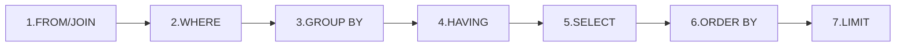
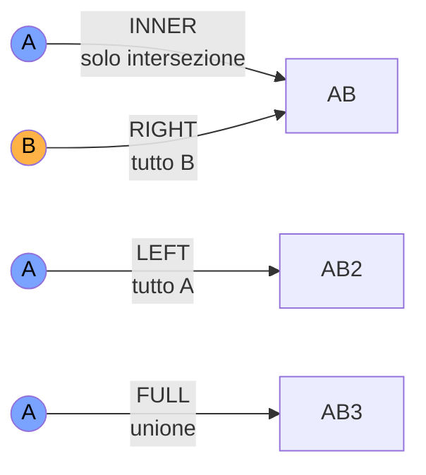

# SQL per data scientist

## Perché impararlo bene

Il 90% dei dati aziendali vive in database relazionali. Anche se userai pandas o Spark, il primo step è sempre `SELECT ... FROM ...`. Non puoi essere un buon data scientist senza saper scrivere SQL avanzato — almeno window function, CTE, query plan.

> **DuckDB** (gratuito, embedded, super-veloce su file CSV/Parquet) è il modo migliore per imparare SQL nel 2026 senza setup. `pip install duckdb`, poi `duckdb.sql("SELECT * FROM 'data.csv'")`.

## Sintassi: l'ordine logico è diverso da quello scritto

L'ordine in cui scrivi una query (`SELECT`, `FROM`, `WHERE`, `GROUP BY`, `HAVING`, `ORDER BY`) **non è** quello in cui viene eseguita:



Capirlo ti salva da bug strani. Ad esempio: **non puoi usare un alias di SELECT in WHERE**, perché WHERE viene prima di SELECT. Devi ripetere l'espressione o usare un CTE.

## Le 5 operazioni base

### 1. Filtri e ordinamento

```sql
SELECT name, age, salary
FROM employees
WHERE department = 'Engineering'
  AND salary > 50000
ORDER BY salary DESC
LIMIT 10;
```

### 2. Aggregazioni

```sql
SELECT
    department,
    COUNT(*) AS n,
    AVG(salary) AS avg_salary,
    PERCENTILE_CONT(0.5) WITHIN GROUP (ORDER BY salary) AS median_salary,
    MAX(salary) AS max_salary
FROM employees
GROUP BY department
HAVING COUNT(*) > 5
ORDER BY avg_salary DESC;
```

> `WHERE` filtra righe prima dell'aggregazione, `HAVING` filtra dopo. Confondersi = bug classico.

### 3. JOIN

I 4 tipi essenziali:



```sql
-- INNER JOIN: solo match
SELECT o.id, o.amount, u.name
FROM orders o
INNER JOIN users u ON o.user_id = u.id;

-- LEFT JOIN: tutti gli ordini, anche utenti cancellati
SELECT o.id, o.amount, u.name
FROM orders o
LEFT JOIN users u ON o.user_id = u.id
WHERE u.name IS NULL;   -- ordini di utenti cancellati

-- self join
SELECT e1.name AS employee, e2.name AS manager
FROM employees e1
LEFT JOIN employees e2 ON e1.manager_id = e2.id;
```

### 4. CTE (Common Table Expression)

`WITH` rende le query leggibili come funzioni:

```sql
WITH top_customers AS (
    SELECT user_id, SUM(amount) AS total
    FROM orders
    WHERE order_date >= '2025-01-01'
    GROUP BY user_id
    HAVING SUM(amount) > 10000
),
top_with_emails AS (
    SELECT t.user_id, t.total, u.email
    FROM top_customers t
    JOIN users u ON t.user_id = u.id
)
SELECT * FROM top_with_emails ORDER BY total DESC;
```

Preferibile a subquery annidate. Più leggibile, più ottimizzabile, riutilizzabile.

### 5. UNION

```sql
SELECT id, name FROM users_active
UNION ALL
SELECT id, name FROM users_archived;
```

`UNION` rimuove duplicati, `UNION ALL` no (più veloce, da preferire se sai non ci sono duplicati).

## Window functions: il superpotere

Calcolano valori **per riga** considerando una "finestra" di righe correlate. Senza collassare il GROUP BY.

```sql
SELECT
    user_id,
    order_date,
    amount,
    -- somma cumulativa per utente
    SUM(amount) OVER (PARTITION BY user_id ORDER BY order_date) AS cum_total,
    -- numero d'ordine progressivo per utente
    ROW_NUMBER() OVER (PARTITION BY user_id ORDER BY order_date) AS order_num,
    -- valore dell'ordine precedente
    LAG(amount, 1) OVER (PARTITION BY user_id ORDER BY order_date) AS prev_amount,
    -- media mobile 7 ordini
    AVG(amount) OVER (
        PARTITION BY user_id ORDER BY order_date
        ROWS BETWEEN 6 PRECEDING AND CURRENT ROW
    ) AS ma7
FROM orders;
```

### Casi d'uso

| Funzione | Cosa fa |
|---|---|
| `ROW_NUMBER()` | numera progressivo (univoco) |
| `RANK()` / `DENSE_RANK()` | rank con/senza salti per pareggi |
| `LAG(col, n)` / `LEAD(col, n)` | n righe indietro / avanti |
| `FIRST_VALUE() / LAST_VALUE()` | primo / ultimo della finestra |
| `NTILE(n)` | divide in n bucket equi (quartili, decili) |
| `SUM / AVG / COUNT OVER (...)` | aggregazioni mobili |

### Esempio: top N per gruppo

"Per ogni dipartimento, i 3 dipendenti più pagati":

```sql
WITH ranked AS (
    SELECT
        name, department, salary,
        ROW_NUMBER() OVER (
            PARTITION BY department ORDER BY salary DESC
        ) AS rn
    FROM employees
)
SELECT name, department, salary
FROM ranked
WHERE rn <= 3;
```

Pattern usatissimo. Memorizzalo.

## CASE WHEN: l'if-else SQL

```sql
SELECT
    name,
    age,
    CASE
        WHEN age < 18 THEN 'minor'
        WHEN age < 65 THEN 'adult'
        ELSE 'senior'
    END AS age_group
FROM users;
```

Combinato con aggregazione → conditional sum:

```sql
SELECT
    SUM(CASE WHEN status = 'paid' THEN amount END) AS revenue,
    SUM(CASE WHEN status = 'refunded' THEN amount END) AS refunds
FROM orders;
```

## Date e tempo

Sintassi variabile tra DBMS, ma i concetti sono universali.

```sql
-- PostgreSQL / DuckDB
SELECT
    DATE_TRUNC('month', order_date) AS month,
    EXTRACT(DOW FROM order_date) AS day_of_week,
    order_date + INTERVAL '7 days' AS next_week,
    AGE(order_date) AS time_since,
    NOW() AS current_timestamp
FROM orders;
```

```sql
-- mese per mese
SELECT
    DATE_TRUNC('month', order_date) AS month,
    COUNT(*) AS n,
    SUM(amount) AS revenue
FROM orders
GROUP BY 1
ORDER BY 1;
```

## Performance: capire EXPLAIN

`EXPLAIN ANALYZE` mostra il piano di esecuzione e i tempi reali. Cose da cercare:

- **Seq Scan** su tabelle grandi senza indice → sospetto.
- **Hash Join** vs **Merge Join** vs **Nested Loop** — dipendono dalle dimensioni.
- **Indice** su colonne di filtro / join.
- `LIMIT` senza `ORDER BY` su tabelle grosse — comportamento non garantito.

```sql
EXPLAIN ANALYZE
SELECT * FROM orders WHERE user_id = 12345;
```

Suggerimenti:

1. Indicizza colonne usate in `WHERE` e `JOIN`. **Mai** indicizzare tutto: ogni indice rallenta `INSERT`.
2. **Evita SELECT \***: chiedi solo le colonne che ti servono.
3. **Pre-aggrega** prima del join se possibile.
4. **DISTINCT è spesso un bug**: stai dicendo "ho creato duplicati che non capisco".

## SQL ↔ pandas: il piccolo dizionario

| SQL | pandas |
|---|---|
| `SELECT * FROM t` | `df` |
| `SELECT a, b FROM t` | `df[['a','b']]` |
| `WHERE x > 5` | `df[df.x > 5]` |
| `GROUP BY g` | `df.groupby('g')` |
| `JOIN ON k` | `pd.merge(df1, df2, on='k')` |
| `ORDER BY x DESC` | `df.sort_values('x', ascending=False)` |
| `LIMIT 10` | `df.head(10)` |
| Window | `df.groupby('g').transform()` o rolling |

## Esercizi

<details>
<summary>Esercizio 1 — Top 3 per categoria</summary>

Dato `products(id, category, price)`, scrivi una query per i 3 prodotti più cari per categoria.

```sql
WITH ranked AS (
    SELECT *,
           DENSE_RANK() OVER (PARTITION BY category ORDER BY price DESC) AS r
    FROM products
)
SELECT * FROM ranked WHERE r <= 3;
```
</details>

<details>
<summary>Esercizio 2 — Customer churn</summary>

Trova utenti il cui ultimo ordine risale a più di 180 giorni fa.

```sql
SELECT user_id, MAX(order_date) AS last_order
FROM orders
GROUP BY user_id
HAVING MAX(order_date) < CURRENT_DATE - INTERVAL '180 days';
```
</details>

<details>
<summary>Esercizio 3 — Funnel</summary>

Dato `events(user_id, event_type, ts)`, calcola la conversione visita → registrazione → acquisto.

```sql
SELECT
    COUNT(DISTINCT CASE WHEN event_type='view' THEN user_id END) AS step1,
    COUNT(DISTINCT CASE WHEN event_type='signup' THEN user_id END) AS step2,
    COUNT(DISTINCT CASE WHEN event_type='purchase' THEN user_id END) AS step3
FROM events
WHERE ts >= CURRENT_DATE - INTERVAL '30 days';
```

Per percentuali: `ROUND(100.0 * step2 / NULLIF(step1, 0), 2) AS conv_1_to_2`.
</details>

<details>
<summary>Esercizio 4 — Retention day-N</summary>

Per ogni utente, ha generato un evento al giorno N (per N=1, 7, 30) dopo la registrazione?

```sql
WITH signup AS (
    SELECT user_id, DATE_TRUNC('day', signup_ts) AS d0
    FROM users
),
activity AS (
    SELECT
        s.user_id, s.d0,
        BOOL_OR(DATE_TRUNC('day', e.ts) = s.d0 + INTERVAL '1 day')  AS active_d1,
        BOOL_OR(DATE_TRUNC('day', e.ts) = s.d0 + INTERVAL '7 days') AS active_d7,
        BOOL_OR(DATE_TRUNC('day', e.ts) = s.d0 + INTERVAL '30 days') AS active_d30
    FROM signup s
    LEFT JOIN events e ON e.user_id = s.user_id
    GROUP BY s.user_id, s.d0
)
SELECT
    AVG(active_d1::int)  AS retention_d1,
    AVG(active_d7::int)  AS retention_d7,
    AVG(active_d30::int) AS retention_d30
FROM activity;
```
</details>

<details>
<summary>Esercizio 5 — Sessionization</summary>

Da `events(user_id, ts)`, definisci una sessione come una sequenza di eventi senza gap > 30 minuti. Conta sessioni per utente.

```sql
WITH ev AS (
    SELECT
        user_id, ts,
        LAG(ts) OVER (PARTITION BY user_id ORDER BY ts) AS prev_ts
    FROM events
),
flagged AS (
    SELECT
        user_id, ts,
        CASE WHEN prev_ts IS NULL OR ts - prev_ts > INTERVAL '30 min' THEN 1 ELSE 0 END AS is_new_session
    FROM ev
),
sessions AS (
    SELECT
        user_id, ts,
        SUM(is_new_session) OVER (PARTITION BY user_id ORDER BY ts) AS session_id
    FROM flagged
)
SELECT user_id, COUNT(DISTINCT session_id) AS n_sessions
FROM sessions
GROUP BY user_id;
```

Pattern raffinato: somma cumulativa di "start flag" assegna un ID di sessione progressivo. Usatissimo in analytics.
</details>

## Cosa portarti via

- Window function: il superpotere — non puoi farne a meno per analisi reali.
- CTE rendono le query leggibili.
- `WHERE` prima dell'aggregazione, `HAVING` dopo.
- `EXPLAIN ANALYZE` per capire performance.
- DuckDB = SQL su file CSV/Parquet senza setup. Usalo per imparare.

Prossimo: visualizzazione dei dati.
