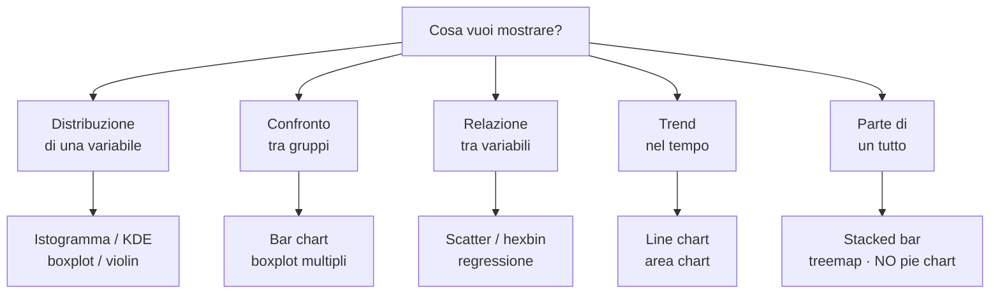

# Visualizzazione: matplotlib, seaborn, plotly

## Perché plottare conta più di quanto pensi

Plottare non è "rendere il report bello". È **come scopri pattern, outlier e bug nei tuoi dati**. Anscombe's quartet (visto nella sezione descrittiva) lo dimostra: stesse statistiche, distribuzioni completamente diverse.

> Regola: davanti a un dataset sconosciuto, fai 10 plot prima di scrivere una riga di modello.

## Quale grafico per quale domanda



> **Pie chart** sono difficili da leggere — l'occhio compara male gli angoli. Usa stacked bar o tabella numerica.

## Matplotlib: le basi

L'object-oriented API è più potente di `plt.qualcosa()`. Imparala:

```python
import matplotlib.pyplot as plt
import numpy as np

fig, ax = plt.subplots(figsize=(8, 5))
x = np.linspace(0, 10, 100)
ax.plot(x, np.sin(x), label='sin', color='#7aa2ff', linewidth=2)
ax.plot(x, np.cos(x), label='cos', color='#ffb347', linewidth=2)
ax.set_xlabel("x")
ax.set_ylabel("y")
ax.set_title("seni e coseni")
ax.legend()
ax.grid(True, alpha=0.3)
plt.tight_layout()
plt.savefig("plot.png", dpi=150)
plt.show()
```

### Subplot grid

```python
fig, axes = plt.subplots(2, 3, figsize=(12, 7), sharex=True)
for i, ax in enumerate(axes.flat):
    ax.hist(data[:, i], bins=30)
    ax.set_title(f"feature {i}")
plt.tight_layout()
```

### Stili

```python
plt.style.use('seaborn-v0_8-darkgrid')   # tema gradevole
plt.style.use('ggplot')
plt.style.use('fivethirtyeight')
plt.rcParams['figure.dpi'] = 110          # qualità default
plt.rcParams['savefig.dpi'] = 150
```

## Seaborn: grammatica statistica

Costruito su matplotlib, sintassi più alta per grafici statistici:

```python
import seaborn as sns
tips = sns.load_dataset('tips')

sns.scatterplot(data=tips, x='total_bill', y='tip', hue='time', size='size')
sns.histplot(tips, x='total_bill', hue='sex', element='step', stat='density')
sns.boxplot(data=tips, x='day', y='total_bill', hue='smoker')
sns.violinplot(data=tips, x='day', y='total_bill', inner='quartile')
sns.regplot(data=tips, x='total_bill', y='tip')
sns.pairplot(tips, hue='sex')              # matrice di scatter
sns.heatmap(tips.corr(numeric_only=True), annot=True, cmap='RdBu_r', center=0)
```

### FacetGrid e relplot/displot/catplot

Per "small multiples":

```python
sns.relplot(
    data=tips, x='total_bill', y='tip',
    col='time', row='sex', hue='smoker',
    height=3.5
)
```

Crea una griglia di scatter per ogni combinazione. Il modo migliore per esplorare interazioni.

## Plotly: interattività

Quando vuoi tooltip, zoom, e condividere HTML:

```python
import plotly.express as px
fig = px.scatter(tips, x='total_bill', y='tip', color='time', size='size',
                 hover_data=['day'], trendline='ols')
fig.show()
fig.write_html("plot.html")
```

```python
import plotly.graph_objects as go
fig = go.Figure()
fig.add_trace(go.Scatter(x=x, y=y, mode='lines+markers', name='sin'))
fig.update_layout(template='plotly_dark')
```

> Plotly è eccellente per dashboard e share. Per pubblicazioni statiche (paper, report PDF), matplotlib è più adatto.

## La grammatica dei grafici (Leland Wilkinson, 1999)

Concetto fondamentale: ogni grafico è la combinazione di:

- **Dati** (un DataFrame)
- **Mapping estetici** (x, y, colore, dimensione, forma)
- **Geometrie** (punti, linee, barre)
- **Statistica** (identità, conteggio, media, regressione)
- **Scale** (lineare, log, categoriale)
- **Faceting** (small multiples)
- **Coordinate** (cartesiane, polari)

In R, **ggplot2** lo incarna esplicitamente. In Python, **plotnine** ne è un porting fedele:

```python
from plotnine import *
(
    ggplot(tips, aes(x='total_bill', y='tip', color='time'))
    + geom_point(alpha=0.6)
    + geom_smooth(method='lm')
    + facet_wrap('~day')
    + theme_minimal()
)
```

## Best practice (e anti-pattern)

### Buone abitudini

- **Titolo e label sempre presenti**. Anche per uso interno.
- **Unità di misura** in label: "Sales (€)" non "Sales".
- **Annotazioni** per outlier o trend importanti.
- **Colori semantici**: rosso = pericolo, verde = ok. Non l'inverso.
- **Daltonismo**: usa palette consapevoli (`viridis`, `cividis`, `colorblind`).

### Anti-pattern

| ❌ | ✅ |
|---|---|
| Asse Y troncato che esagera differenze | inizia da 0 quando ha senso |
| Pie chart con 8 fette | bar chart ordinato |
| 3D bar/pie chart | 2D, sempre |
| Doppi assi Y | due plot affiancati |
| Colori a caso | palette coerente |
| Legenda copre dati | sposta o reduce |
| Grafico denso senza testo | un grafico = una idea |

## Visualizzazioni per ML specifiche

### Distribuzioni e overlay

Confrontare distribuzioni di train/test, o feature per classe:

```python
sns.histplot(data=df, x='age', hue='target', element='step', stat='density', common_norm=False)
```

### Confusion matrix

```python
from sklearn.metrics import ConfusionMatrixDisplay
ConfusionMatrixDisplay.from_predictions(y_true, y_pred, normalize='true')
```

### ROC e PR curve

```python
from sklearn.metrics import RocCurveDisplay, PrecisionRecallDisplay
RocCurveDisplay.from_estimator(model, X_test, y_test)
PrecisionRecallDisplay.from_estimator(model, X_test, y_test)
```

### Learning curve

```python
from sklearn.model_selection import LearningCurveDisplay
LearningCurveDisplay.from_estimator(model, X, y, train_sizes=np.linspace(0.1, 1, 10))
```

### Feature importance / SHAP

```python
import shap
explainer = shap.TreeExplainer(model)
shap_values = explainer.shap_values(X_sample)
shap.summary_plot(shap_values, X_sample)   # beeswarm plot
```

## Salvataggio: per cosa lo usi?

| Uso | Formato | Note |
|---|---|---|
| Pubblicazione | PDF o SVG | vettoriale, scala bene |
| Web statico | PNG (dpi=150) | universale |
| Dashboard | HTML (plotly) | interattivo |
| Slide | PNG con sfondo trasparente | `transparent=True` |
| Print | PDF a 300 dpi | richiesto dagli editori |

```python
fig.savefig("plot.pdf", bbox_inches='tight')
fig.savefig("plot.png", dpi=150, bbox_inches='tight', transparent=True)
```

## Esercizi

<details>
<summary>Esercizio 1 — Iris pairplot</summary>

```python
import seaborn as sns
iris = sns.load_dataset('iris')
sns.pairplot(iris, hue='species', diag_kind='kde')
```

Quali coppie di feature separano meglio le specie? Suggerimento: petal_length vs petal_width.
</details>

<details>
<summary>Esercizio 2 — Boxplot con outlier annotati</summary>

```python
import seaborn as sns, matplotlib.pyplot as plt
tips = sns.load_dataset('tips')
fig, ax = plt.subplots(figsize=(8,5))
sns.boxplot(data=tips, x='day', y='total_bill', ax=ax)
# annota gli outlier
import numpy as np
for day in tips.day.unique():
    sub = tips[tips.day == day].total_bill
    q1, q3 = sub.quantile([.25,.75])
    iqr = q3 - q1
    out = sub[(sub > q3+1.5*iqr) | (sub < q1-1.5*iqr)]
    for v in out:
        ax.annotate(f"€{v}", xy=(list(tips.day.unique()).index(day), v), fontsize=8)
plt.show()
```
</details>

<details>
<summary>Esercizio 3 — Heatmap calendario</summary>

Per dati giornalieri, una "github contributions heatmap":

```python
import pandas as pd, numpy as np, seaborn as sns, matplotlib.pyplot as plt
rng = np.random.default_rng(0)
dates = pd.date_range('2025-01-01', '2025-12-31')
values = rng.poisson(3, len(dates))
df = pd.DataFrame({'date': dates, 'v': values})
df['week'] = df.date.dt.isocalendar().week
df['dow']  = df.date.dt.dayofweek

pivot = df.pivot_table(index='dow', columns='week', values='v', fill_value=0)
fig, ax = plt.subplots(figsize=(16, 3))
sns.heatmap(pivot, cmap='Greens', cbar=False, ax=ax)
ax.set_yticklabels(['Lun','Mar','Mer','Gio','Ven','Sab','Dom'], rotation=0)
plt.show()
```
</details>

<details>
<summary>Esercizio 4 — Spot the outlier</summary>

Plotta uno scatter e identifica visivamente gli outlier:

```python
import numpy as np, matplotlib.pyplot as plt
rng = np.random.default_rng(0)
n = 200
x = rng.normal(0, 1, n)
y = 2*x + rng.normal(0, 0.5, n)
y[::40] = rng.normal(8, 1, n//40)   # outlier ogni 40 punti

fig, ax = plt.subplots(figsize=(7,5))
ax.scatter(x, y, alpha=0.6)
mask = np.abs(y - (2*x)) > 4
ax.scatter(x[mask], y[mask], color='red', edgecolor='k', s=80, label='outlier')
ax.legend()
plt.show()
```
</details>

## Cosa portarti via

- Distribuzione, confronto, relazione, trend, parte di tutto: 5 famiglie di grafici.
- Mai pie chart, mai 3D, mai assi truccati.
- Seaborn per esplorazione veloce, matplotlib per controllo fine, plotly per interattività.
- Salvataggi in vettoriale per pubblicazione, PNG per il web.
- Plotta 10 volte prima di modellare 1 volta.

Prossimo: pulizia e wrangling dei dati — la parte 50% del lavoro reale.
