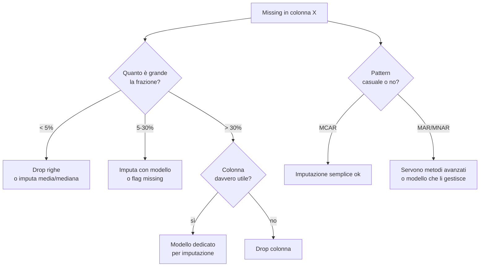

# Pulizia e data wrangling

## Il segreto sporco

> "Garbage in, garbage out." Tutti citano. Pochi praticano.

Il 50% del tempo di un data scientist senior va in capire e ripulire dati. Non perché sia stupido — perché i dati reali **sono sporchi**: formati misti, valori mancanti, errori di battitura, encoding, fusi orari, sistemi che cambiano nel tempo.

## Diagnosi iniziale (i primi 10 minuti)

```python
import pandas as pd
df = pd.read_csv("data.csv")

df.shape
df.head()
df.tail()
df.info()                            # tipi e null per colonna
df.describe(include='all')           # stats numeriche e categoriche
df.isna().sum().sort_values(ascending=False)
df.nunique().sort_values()
df.duplicated().sum()

# memory check
df.memory_usage(deep=True).sum() / 1e6  # MB

# distribuzioni rapide
df.hist(figsize=(12, 8))
```

Cose a cui prestare attenzione:

- Colonne con **un solo valore** → inutili (zero varianza).
- Colonne con **n valori distinti = n righe** → probabilmente ID o testo libero.
- **Dtype `object`** su colonne che sembrano numeriche → c'è dello sporco (virgola decimale, valuta, %).
- **Date come stringhe**.

## Missing values: 7 strategie



I tre tipi di missing (Rubin, 1976):

- **MCAR** (Missing Completely At Random): missing indipendente da tutto. Raro. Imputazione media OK.
- **MAR** (Missing At Random): missing dipende da altre variabili **osservate**. Imputazione con modello (KNN, MICE) corretta.
- **MNAR** (Missing Not At Random): missing dipende da variabili **non osservate** (es: i ricchi non dichiarano il reddito). Difficile, serve domain knowledge.

### Codice

```python
# semplice
df.fillna(0)
df.fillna(df.median(numeric_only=True))
df['cat'].fillna('UNKNOWN')

# avanzato
from sklearn.impute import KNNImputer, IterativeImputer  # IterativeImputer va abilitato
imputer = KNNImputer(n_neighbors=5)
X_imp = imputer.fit_transform(X)

# flag missing come feature
df['col_was_missing'] = df['col'].isna().astype(int)
df['col'] = df['col'].fillna(df['col'].median())
```

> Un trucco potente: **mantieni il missing come informazione**. Crea una colonna binaria che indica "originalmente NaN". Spesso è la feature più predittiva.

## Duplicati

```python
df.duplicated().sum()
df = df.drop_duplicates()

# duplicati su sottoinsieme di colonne, mantieni la riga più recente
df = (
    df.sort_values('ts', ascending=False)
      .drop_duplicates(subset=['user_id', 'product_id'], keep='first')
)
```

Attenzione: ID duplicati spesso indicano un **bug nel join** o un **dato sporco**. Non camuffare il problema rimuovendo: indaga.

## Parsing di date (la sofferenza universale)

```python
# pandas è generoso
df['date'] = pd.to_datetime(df['date_str'], errors='coerce')  # NaT su parse fail

# formato specifico (molto più veloce)
df['date'] = pd.to_datetime(df['date_str'], format='%d/%m/%Y')

# timezone
df['ts'] = pd.to_datetime(df['ts'], utc=True)
df['ts'] = df['ts'].dt.tz_convert('Europe/Rome')

# formati misti? dateparser è più tollerante (ma lento)
import dateparser
df['date'] = df['date_str'].apply(dateparser.parse)
```

Domande sempre da farti:

- Qual è il **fuso orario** dei timestamp? UTC, locale, naive?
- I dati attraversano **cambi di DST** (ora legale)?
- Le date sono **DD/MM** o **MM/DD**? L'ambiguità è una mina vagante.

## Stringhe sporche

```python
s = df['email'].str
s.lower()
s.strip()                       # spazi all'inizio/fine
s.replace(r'\s+', ' ', regex=True)
s.contains(r'@\w+\.\w+', regex=True)
s.extract(r'@(\w+)')            # gruppo regex
s.split('@', expand=True)
s.normalize('NFKD').encode('ascii','ignore').decode('ascii')  # rimuove accenti
```

### Pulizia di numeri stringa

```python
df['amount'] = (
    df['amount']
    .str.replace('€', '', regex=False)
    .str.replace('.', '', regex=False)      # separatore migliaia italiano
    .str.replace(',', '.', regex=False)     # decimale italiano
    .astype(float)
)
```

### Categoriche con typo

Cluster simili con **fuzzy matching** (es: `rapidfuzz` o `recordlinkage`):

```python
from rapidfuzz import process, fuzz
clean = "Milano"
candidates = df['city'].unique()
match = process.extractOne("Mlano", candidates, scorer=fuzz.ratio)
# ('Milano', 91, 5)
```

## Encoding categoriali

Dipende dal tipo:

| Tipo | Metodo |
|---|---|
| Binaria (sì/no) | `astype(int)` |
| Ordinale (basso/medio/alto) | mapping numerico esplicito |
| Nominale, pochi valori | one-hot |
| Nominale, molti valori | target encoding, frequency encoding, embedding |

```python
# one-hot
pd.get_dummies(df, columns=['city', 'category'], drop_first=True)

# ordinal
order = {'low': 0, 'mid': 1, 'high': 2}
df['level'] = df['level'].map(order)

# target encoding (con cross-validation per evitare leak)
from category_encoders import TargetEncoder
te = TargetEncoder()
X_te = te.fit_transform(X[['city']], y)
```

> Target encoding senza CV produce **leakage**: il valore della classe finisce nelle feature. Usa `KFoldTargetEncoder` o pipeline con `sklearn.preprocessing.OrdinalEncoder` + `MeanEncoder` con `cv`.

## Normalizzazione e scaling

Quando contano: KNN, SVM, regressione regolarizzata, reti neurali, PCA. Quando NON contano: alberi (Random Forest, XGBoost).

| Scaler | Formula | Usalo quando |
|---|---|---|
| **StandardScaler** | $(x - \mu)/\sigma$ | distribuzioni ~ normali |
| **MinMaxScaler** | $(x - \min)/(\max-\min)$ | feature in $[0,1]$ |
| **RobustScaler** | $(x - \text{median})/\text{IQR}$ | outlier presenti |
| **PowerTransformer** | Box-Cox/Yeo-Johnson | skew forte, vuoi normalità |

```python
from sklearn.preprocessing import StandardScaler, RobustScaler, PowerTransformer
sc = StandardScaler().fit(X_train)
X_train = sc.transform(X_train)
X_test = sc.transform(X_test)
```

> **Fit solo su train**. Trasforma test con i parametri di train. Altrimenti: data leakage.

## Outlier: rimuovere, capping, o tenere?

| Strategia | Quando |
|---|---|
| Tenere | sono dati veri, importanti (frodi, rare events) |
| Cap a percentile (winsorize) | distorsione moderata, modello sensibile |
| Rimuovere | sicuro che siano errori (es: età = 999) |
| Trasformare (log) | code lunghe naturali |

```python
# winsorize al 1% e 99%
from scipy.stats.mstats import winsorize
df['amount_w'] = winsorize(df['amount'], limits=[0.01, 0.01])

# manuale
low, high = df['amount'].quantile([0.01, 0.99])
df['amount'] = df['amount'].clip(low, high)
```

## Stratificazione e bilanciamento (a colpo d'occhio)

```python
# proporzioni della target
df['target'].value_counts(normalize=True)

# stratificato in train/test
from sklearn.model_selection import train_test_split
X_tr, X_te, y_tr, y_te = train_test_split(X, y, stratify=y, test_size=0.2)
```

Bilanciamento avanzato (SMOTE, class weights) lo vedi in sezione dedicata.

## Salva il "data dictionary"

Per ogni colonna, documenta:

- Tipo
- Significato
- Unità di misura
- Range atteso
- Trattamento dei missing
- Eventuali trasformazioni applicate

Un Markdown semplice o uno YAML va benissimo. È **la** cosa che ti farà ringraziare il-te-del-futuro tra 6 mesi.

## Validazione: assert tutto

Negli script di pipeline, usa assertion difensive:

```python
import pandera as pa

schema = pa.DataFrameSchema({
    "user_id": pa.Column(int, checks=pa.Check.ge(0)),
    "email": pa.Column(str, checks=pa.Check.str_contains("@")),
    "age": pa.Column(int, checks=pa.Check.in_range(0, 120), nullable=True),
    "country": pa.Column(str, checks=pa.Check.isin(["IT","FR","DE","ES"])),
})

df_clean = schema.validate(df)
```

In alternativa: **great_expectations** (più heavy, ma integrabile con pipeline data).

## Esercizi

<details>
<summary>Esercizio 1 — Pulisci una colonna prezzo sporca</summary>

Hai una colonna `price` con valori tipo `"€ 1.299,99"`, `"€2,500.00"`, `"1500"`, `"N/D"`. Convertirla in float.

```python
import pandas as pd, re
def clean_price(s):
    if pd.isna(s) or s in ('N/D', '-', ''): return None
    s = str(s).strip().replace('€','').replace(' ','')
    # se contiene sia . che , decidi qual è decimale (l'ultimo)
    if ',' in s and '.' in s:
        if s.rfind(',') > s.rfind('.'):
            s = s.replace('.','').replace(',', '.')
        else:
            s = s.replace(',','')
    elif ',' in s:
        s = s.replace(',','.')
    try:
        return float(s)
    except ValueError:
        return None
```
</details>

<details>
<summary>Esercizio 2 — Imputazione con KNN</summary>

```python
import numpy as np
from sklearn.impute import KNNImputer
rng = np.random.default_rng(0)
X = rng.standard_normal((100, 5))
mask = rng.random(X.shape) < 0.1
X_miss = X.copy()
X_miss[mask] = np.nan

imp = KNNImputer(n_neighbors=5)
X_filled = imp.fit_transform(X_miss)
print("MSE imputazione:", ((X_filled - X)**2).mean())
```
</details>

<details>
<summary>Esercizio 3 — Detect anomalie con z-score robust</summary>

```python
import numpy as np
def robust_outliers(x, k=3.5):
    med = np.median(x)
    mad = np.median(np.abs(x - med)) + 1e-9
    return np.abs((x - med) / (1.4826 * mad)) > k
```

Test:
```python
x = np.concatenate([np.random.randn(1000), [10, -8, 20]])
print(np.where(robust_outliers(x))[0])
```
</details>

<details>
<summary>Esercizio 4 — Parsing date miste</summary>

Hai una colonna con: `"2024-01-15"`, `"15/01/2024"`, `"Jan 15, 2024"`, `"2024.01.15"`. Convertili in datetime uniformi.

```python
import pandas as pd
ser = pd.Series(["2024-01-15","15/01/2024","Jan 15, 2024","2024.01.15"])
parsed = pd.to_datetime(ser, errors='coerce')
# se rimangono NaT, fallback con dateparser
import dateparser
parsed = parsed.fillna(ser.apply(lambda s: dateparser.parse(s, settings={'DATE_ORDER': 'DMY'})))
```
</details>

<details>
<summary>Esercizio 5 — Validazione con pandera</summary>

Schema per un dataset utenti:

```python
import pandera as pa
schema = pa.DataFrameSchema({
    "user_id":  pa.Column(int, unique=True, checks=pa.Check.gt(0)),
    "email":    pa.Column(str, checks=pa.Check.str_matches(r'^[^@]+@[^@]+\.[^@]+$')),
    "country":  pa.Column(str, checks=pa.Check.isin(["IT","FR","DE","ES","UK"])),
    "age":      pa.Column(int, checks=pa.Check.in_range(13, 120), nullable=True),
})
```

Aggiungi al test: 1 utente con email senza @, 1 con age=-5. Verifica che pandera rifiuti correttamente.
</details>

## Cosa portarti via

- 50% del tempo: pulizia. Non saltarla, è dove nascono i bug peggiori.
- Missing è informativo: aggiungi flag.
- Validare lo schema in produzione: pandera o great_expectations.
- Fit scaler solo su train, mai su tutto il dataset.
- Documenta il "data dictionary".

Prossimo: feature engineering, l'arte che separa modelli mediocri da quelli buoni.
