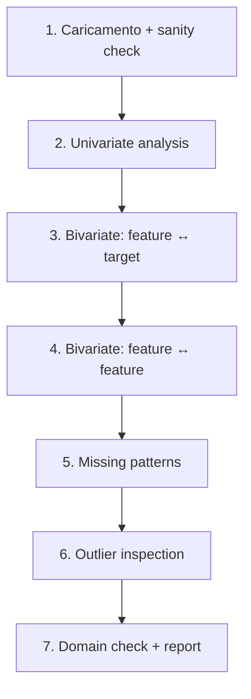

# EDA: Exploratory Data Analysis

## Cos'è

L'EDA è la fase in cui **conosci i dati**. Tukey la inventò negli anni '70 come reazione al modellare in cieco: prima di proporre un modello, lascia i dati parlare. La regola d'oro:

> "Far better an approximate answer to the right question, than an exact answer to the wrong question." — John Tukey

Tutte le scelte successive (feature engineering, modello, validation) dipendono da quanto bene hai capito i dati in questa fase.

## Workflow in 7 step



## Step 1 — Caricamento e sanity check

```python
import pandas as pd
df = pd.read_csv("dataset.csv")

# checklist veloce
print(df.shape)
print(df.dtypes)
print(df.head())
print(df.tail())
df.info()
df.describe(include='all').T
df.isna().sum().sort_values(ascending=False)
df.nunique().sort_values()
df.duplicated().sum()
```

Domande:

- Le **righe** sono quante mi aspetto? (es: 1000 utenti = 1000 righe)
- Le **colonne** hanno i tipi giusti? (date come datetime, non object)
- Esistono righe completamente vuote o duplicate?
- Ci sono colonne con un solo valore (zero varianza, inutili)?

## Step 2 — Analisi univariata

Per ogni colonna, capisci la distribuzione.

```python
# numeriche
df.hist(figsize=(14, 10), bins=40)

# categoriali
for col in df.select_dtypes(include=['object', 'category']):
    print(f"\n=== {col} ===")
    print(df[col].value_counts(normalize=True).head(10))
```

Cosa cercare:

- **Skew**: code lunghe → considera log o Box-Cox.
- **Bimodalità**: due picchi suggeriscono che la popolazione è eterogenea (es: maschio/femmina, prima/dopo un cambio policy).
- **Categorie rare**: < 1% potrebbero essere typo o noise.
- **Range strani**: età = 999, salary = -1 sono codifiche di NaN.

## Step 3 — Bivariate: feature vs target

Il cuore dell'EDA per ML. Per ogni feature, guarda come si relaziona col target.

### Target categoriale

```python
# numerical → target
for col in num_cols:
    sns.boxplot(data=df, x='target', y=col)

# categorical → target
for col in cat_cols:
    pd.crosstab(df[col], df['target'], normalize='index').plot(kind='bar', stacked=True)
```

### Target continuo

```python
# numerical → target
for col in num_cols:
    sns.scatterplot(data=df.sample(2000), x=col, y='target')
    sns.regplot(data=df.sample(2000), x=col, y='target', scatter=False, color='red')

# correlation
df.corr(numeric_only=True)['target'].abs().sort_values(ascending=False)
```

> Correlazioni alte (>0.95) sospette: o sono **leakage** (feature derivata dal target) o sono **proxy** (es: `revenue` per predire `revenue_per_user`).

## Step 4 — Bivariate: feature ↔ feature

Multicollinearità è il diavolo della regressione lineare:

```python
import seaborn as sns
sns.heatmap(df.corr(method='spearman', numeric_only=True),
            annot=True, fmt='.2f', cmap='RdBu_r', center=0)
```

Coppie con $|\rho| > 0.9$: scegline una, scarta l'altra (a meno che entrambe siano importanti per interpretazione).

Per non-linearità, usa **mutual information**:

```python
from sklearn.feature_selection import mutual_info_regression
mi = mutual_info_regression(X, y)
```

## Step 5 — Missing patterns

Sono i missing casuali (MCAR) o pattern? Plotta:

```python
import missingno as msno
msno.matrix(df)
msno.heatmap(df)
msno.dendrogram(df)
```

Se due colonne mancano sempre insieme, indicano lo stesso evento mancato (es: utente non ha completato form). Tratte come una sola feature "form incompleto".

## Step 6 — Outlier inspection

```python
# boxplot per outlier visual
df.select_dtypes(include='number').boxplot(figsize=(15, 6), rot=45)

# isolation forest
from sklearn.ensemble import IsolationForest
iso = IsolationForest(contamination=0.05, random_state=0)
mask = iso.fit_predict(df.select_dtypes(include='number').fillna(0)) == -1
df_outliers = df[mask]
```

Per ogni outlier: **investiga**. È un errore (digitato male)? Un evento eccezionale (frode)? Un caso d'uso non previsto?

## Step 7 — Domain check

Discuti con qualcuno che conosce i dati. **Sempre**. Domande tipo:

- "Vedo che le vendite si dimezzano in agosto. Normale?"
- "Le età di 12 utenti sono > 100. Errore o utenti anziani veri?"
- "Esiste un periodo (es: maggio 2024) dove il dato sembra rotto. Cosa è successo?"

Spesso scopri:
- Cambi di sistema che invalidano dati storici.
- Promozioni che gonfiano metriche.
- Cancellazioni di righe non documentate.

Senza domain check, costruirai modelli sopra leggende.

## Strumenti per EDA automatica

### ydata-profiling (ex pandas-profiling)

```python
from ydata_profiling import ProfileReport
ProfileReport(df, title="EDA").to_file("profile.html")
```

Genera un report HTML completo: distribuzioni, correlazioni, missing pattern, outlier, alert.

> Utile come **prima passata**, ma **non sostituisce** un'EDA mirata. Pensa con la tua testa, non solo coi grafici automatici.

### sweetviz

Confronta due dataset (es: train vs test) automaticamente:

```python
import sweetviz as sv
sv.compare([df_train, "Train"], [df_test, "Test"], target_feat="target").show_html("compare.html")
```

Indispensabile per detect **data drift** tra train e production.

## Pattern frequenti che scoprirai

| Pattern | Cosa significa | Cosa fare |
|---|---|---|
| Bimodalità | popolazione mista | considera segmentare o aggiungere flag |
| Spike a 0 | "non risposta" come 0 | crea flag `was_zero` |
| Picco a -1, 999, -9999 | codifica di NaN | sostituisci con NaN reale |
| Distribuzione log-normal | tipica di redditi, durate | log transform |
| Trend nel tempo | non-stazionarietà | feature temporali, time-series CV |
| Correlazione 0.99 con target | LEAKAGE | indaga, probabilmente rimuovi |
| Categoria "Other" enorme | aggregato di rare | espandi se possibile |

## Esempio completo: Titanic

```python
import seaborn as sns, pandas as pd, matplotlib.pyplot as plt
df = sns.load_dataset('titanic')

# step 1
df.info(); print(df.isna().sum())

# step 2
df['age'].hist(bins=40); plt.show()
df['sex'].value_counts(normalize=True)
df['class'].value_counts(normalize=True)

# step 3 vs survived
sns.barplot(data=df, x='class', y='survived', hue='sex')
sns.kdeplot(data=df, x='age', hue='survived', common_norm=False, fill=True)

# step 4
sns.heatmap(df.corr(numeric_only=True), annot=True, cmap='RdBu_r')

# step 5
import missingno as msno
msno.matrix(df)

# insight chiave:
# - sopravvivenza femmine ~74%, maschi ~19%
# - 1ª classe ~62%, 3ª classe ~24%
# - intersezione: maschio 3ª classe ~14%, femmina 1ª classe ~97%
```

Dato il pattern, **una regola ingenua** "sopravvive se femmina o bambino in 1ª/2ª classe" ottiene ~78% accuracy. È il **baseline da battere** con qualsiasi modello.

## Esercizi

<details>
<summary>Esercizio 1 — EDA su dataset Boston housing alternativo</summary>

```python
from sklearn.datasets import fetch_california_housing
data = fetch_california_housing(as_frame=True).frame

# fai i 7 step
data.info()
data.describe().T
data.hist(figsize=(15,10), bins=40)
data.corr()['MedHouseVal'].sort_values()
```

Quali feature predicono meglio `MedHouseVal`? Cosa è strano in `AveBedrms` o `Population`?
</details>

<details>
<summary>Esercizio 2 — Detect leakage</summary>

Hai un modello che predice "default su prestito" con AUC = 0.99. Domanda: come fai a sospettare un leakage?

**Risposta**: AUC 0.99 su problemi reali è quasi sempre sospetto. Indizi:
- Correlazione di una feature con target > 0.95.
- Feature il cui valore è "noto solo dopo l'evento" (es: `total_late_payments` per predire default — è il risultato!).
- Feature derivata dal target stesso (es: `risk_score` interno).

Cura: rimuovi le feature future, ri-allena, l'AUC scende a ~0.75. Solo allora ti credi al modello.
</details>

<details>
<summary>Esercizio 3 — Profile automatico</summary>

```python
import seaborn as sns
from ydata_profiling import ProfileReport
df = sns.load_dataset('diamonds')
ProfileReport(df, title="Diamonds EDA").to_file("diamonds_profile.html")
```

Apri il report. Quali alert ha trovato? (Tipici: alta cardinalità, skew, correlazioni.)
</details>

## Cosa portarti via

- EDA prima di modellare, sempre.
- 7 step: load → univariate → vs target → between features → missing → outliers → domain.
- Strumenti automatici (ydata, sweetviz) = first pass, **non** sostituto della testa.
- Modello sospetto = leakage. AUC > 0.95 indaga.
- Discuti coi domain expert. Sempre.

Prossimo: machine learning — fondamenti, bias-variance, validazione.
