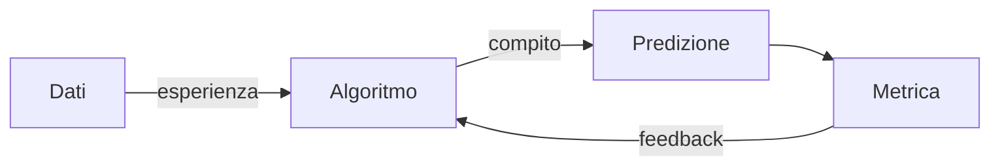
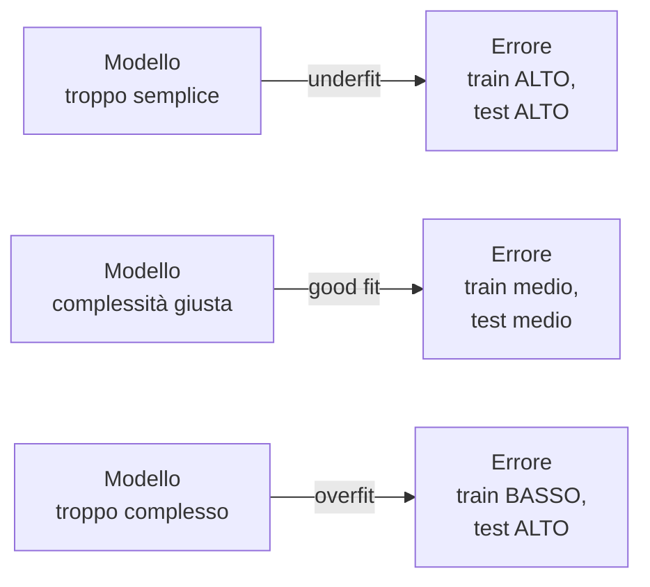
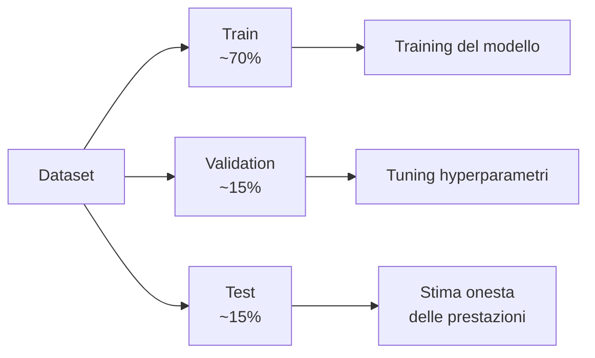
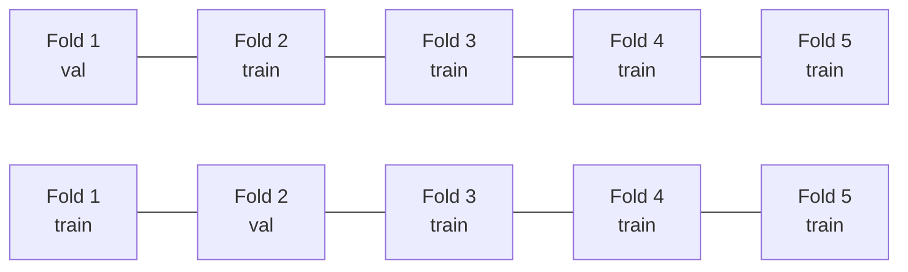
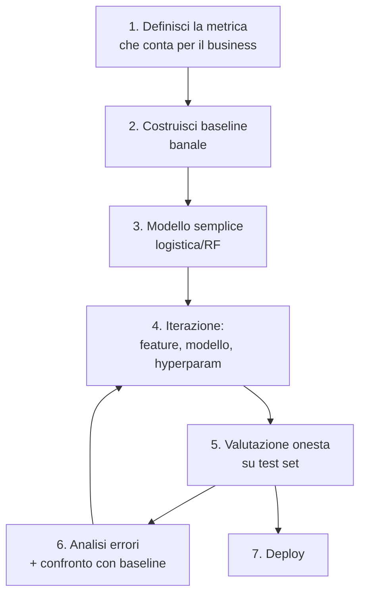

# ML: fondamenti — bias, varianza, validazione

## Cos'è il machine learning

Definizione operativa: **algoritmi che migliorano le proprie prestazioni su un compito con l'esperienza** (dati).

Più formalmente (Tom Mitchell, 1997): un programma "impara" da esperienza E rispetto a un compito T misurato da P se le sue prestazioni su T, misurate da P, migliorano con E.



## Le tre famiglie

### Supervised learning

I dati hanno **target conosciuti**. Si impara $f: X \to y$.

- **Regressione**: $y$ continuo (prezzo casa, temperatura).
- **Classificazione**: $y$ discreto (spam/non-spam, gatto/cane/criceto).

### Unsupervised learning

Solo $X$. Cerchi **struttura nascosta**.

- **Clustering**: raggruppa simili (K-means, DBSCAN).
- **Dim reduction**: riduci dimensioni (PCA, t-SNE).
- **Density estimation**: stima $p(x)$ (GMM, KDE).

### Reinforcement learning

Un agente prende **azioni** in un ambiente, riceve **ricompense**, impara una politica. Diverso dai due sopra: i dati non sono fissi, vengono generati dall'interazione.

## L'errore: bias, varianza, irriducibile

Per un modello $\hat{f}$, l'errore atteso su un punto $x$ si decompone:

$$E[(y - \hat{f}(x))^2] = \underbrace{\text{Bias}^2[\hat{f}(x)]}_{\text{semplificazione errata}} + \underbrace{\text{Var}[\hat{f}(x)]}_{\text{sensibilità ai dati}} + \underbrace{\sigma^2}_{\text{rumore irriducibile}}$$

- **Bias**: errore sistematico. Il modello è troppo semplice per catturare la realtà.
- **Varianza**: il modello cambia molto al cambiare del campione di training.
- **Errore irriducibile**: rumore intrinseco nei dati, nessun modello lo elimina.

<div class="chart"><svg viewBox="0 0 400 220" xmlns="http://www.w3.org/2000/svg">
<line x1="40" y1="200" x2="380" y2="200" stroke="#555"/>
<line x1="40" y1="20" x2="40" y2="200" stroke="#555"/>
<text x="200" y="218" fill="#8b949e" font-size="11" text-anchor="middle">complessità del modello →</text>
<text x="20" y="105" fill="#8b949e" font-size="11" transform="rotate(-90 20 105)">errore →</text>
<path d="M 60 40 C 130 40 230 190 340 190" fill="none" stroke="#7aa2ff" stroke-width="2"/>
<text x="80" y="35" fill="#7aa2ff" font-size="11">bias²</text>
<path d="M 60 190 C 130 190 230 40 340 40" fill="none" stroke="#ffb347" stroke-width="2"/>
<text x="310" y="50" fill="#ffb347" font-size="11">varianza</text>
<path d="M 60 30 Q 200 110 340 30" fill="none" stroke="#5ee2c4" stroke-width="2.5"/>
<text x="120" y="60" fill="#5ee2c4" font-size="11">totale</text>
<circle cx="200" cy="70" r="4" fill="#c084fc"/>
<text x="208" y="68" fill="#c084fc" font-size="11">sweet spot</text>
</svg><div class="chart-caption">Bias-variance tradeoff: troppo semplice → bias alto; troppo complesso → varianza alta. Il minimo totale è in mezzo.</div></div>

## Underfitting vs overfitting



**Diagnosi rapida**:

- $E_\text{train}$ alto, $E_\text{val}$ alto, simili → underfit → aumenta capacità (più feature, modello più ricco).
- $E_\text{train}$ basso, $E_\text{val}$ alto → overfit → regolarizza, più dati, modello più semplice.
- $E_\text{train}$ basso, $E_\text{val}$ basso, simili → tutto OK.
- $E_\text{train}$ alto, $E_\text{val}$ basso → bug (dati mischiati? leakage al contrario?).

## Train/val/test: l'oro del workflow



**Regole**:

1. **Test set toccato UNA SOLA VOLTA**, alla fine, per riportare la metrica finale.
2. **Validation set** per scegliere hyperparametri.
3. **Train set** per addestrare i pesi del modello.

Violare la regola 1 = barare a se stessi. Ogni decisione presa guardando il test set fa "trapelare" il test set nel modello.

### Cross-validation

Per dataset piccoli, train/val/test spreca dati. La **k-fold cross-validation**:



Esegui training 5 volte, ogni volta cambiando il fold di validation. Media le metriche.

```python
from sklearn.model_selection import cross_val_score, KFold
kf = KFold(n_splits=5, shuffle=True, random_state=0)
scores = cross_val_score(model, X, y, cv=kf, scoring='roc_auc')
print(f"AUC: {scores.mean():.3f} ± {scores.std():.3f}")
```

Varianti:
- **StratifiedKFold**: mantiene proporzioni di classe per classificazione.
- **GroupKFold**: gli stessi user_id stanno sempre nello stesso fold (no leak tra utenti).
- **TimeSeriesSplit**: solo passato → futuro, mai il contrario.

## No free lunch theorem (Wolpert, 1996)

> **Mediato su tutti i possibili problemi**, nessun algoritmo è migliore di nessun altro.

Significato: non esiste un "modello migliore in assoluto". Quale modello vince dipende dalla struttura dei dati. Questo è il motivo per cui:

- Provi più modelli.
- I baselines stupidi a volte battono modelli complessi.
- La conoscenza del dominio batte la potenza algoritmica.

## Loss functions standard

| Task | Loss | Note |
|---|---|---|
| Regressione | MSE — Mean Squared Error | sensibile a outlier |
| Regressione | MAE — Mean Absolute Error | robusta |
| Regressione | Huber | mix MSE/MAE |
| Classificazione binaria | Binary Cross-Entropy / Log Loss | derivata MLE |
| Classificazione multi | Categorical Cross-Entropy | softmax + log |
| Classificazione | Hinge | SVM |
| Ranking | Pairwise / Listwise | LTR |

Formula MSE:
$$\text{MSE} = \frac{1}{n} \sum_i (y_i - \hat{y}_i)^2$$

Formula Log Loss (binaria):
$$L = -\frac{1}{n} \sum_i [y_i \log \hat{p}_i + (1 - y_i) \log(1 - \hat{p}_i)]$$

## Regolarizzazione (anteprima)

Aggiunge una penalità sul "tamaño" dei coefficienti, a costo di un po' di bias guadagni in varianza:

- **L2 (Ridge)**: penalità $\lambda \sum \beta_j^2$. Riduce tutti i coefficienti.
- **L1 (Lasso)**: penalità $\lambda \sum |\beta_j|$. Azzera coefficienti irrilevanti.
- **Elastic Net**: mix di L1 + L2.

Vedrai i dettagli nella sezione sulla regressione.

## La pipeline mentale del data scientist



Il baseline banale (es: "predici sempre la classe maggioritaria") è il punto sotto cui non sei accettabile. Spesso si scopre che il modello "complicato" lo batte solo marginalmente — segnale che il problema è hardware al limite, o che le feature non bastano.

## Esercizi

<details>
<summary>Esercizio 1 — Identifica overfitting</summary>

In ognuno dei casi, dì se è underfit, overfit, o OK:

1. Train accuracy 0.95, Val 0.94.
2. Train 0.99, Val 0.72.
3. Train 0.65, Val 0.64.
4. Train 0.70, Val 0.85.

**Risposte**: 1 OK (forse leggero overfit), 2 overfit forte, 3 underfit, 4 sospetto (val > train → leak o split sbilanciato).
</details>

<details>
<summary>Esercizio 2 — Baseline banali</summary>

Per ognuno dei problemi:

1. Predire se domani pioverà a Milano.
2. Stimare il prezzo di una casa.
3. Identificare frodi su carta di credito (0.1% delle transazioni).

Quale è il baseline più stupido? Quale accuracy/MAE ti aspetti?

**Risposte**:

1. "Sempre 'no pioggia'" → in inverno ~70% accuracy a Milano.
2. "Sempre il prezzo mediano" → MAE = MAD. Battibile facilmente.
3. "Sempre 'non frode'" → 99.9% accuracy. **MA**: precision e recall delle frodi = 0. Lezione: accuracy non basta su classi sbilanciate.
</details>

<details>
<summary>Esercizio 3 — Cross-validation manuale</summary>

Implementa 5-fold CV da zero:

```python
import numpy as np
from sklearn.linear_model import LogisticRegression
from sklearn.metrics import accuracy_score
from sklearn.datasets import load_iris

X, y = load_iris(return_X_y=True)
n = len(X)
rng = np.random.default_rng(0)
idx = rng.permutation(n)
folds = np.array_split(idx, 5)

scores = []
for i in range(5):
    val = folds[i]
    tr = np.concatenate(folds[:i] + folds[i+1:])
    m = LogisticRegression(max_iter=500).fit(X[tr], y[tr])
    scores.append(accuracy_score(y[val], m.predict(X[val])))
print(f"{np.mean(scores):.3f} ± {np.std(scores):.3f}")
```
</details>

<details>
<summary>Esercizio 4 — Diagnostica bias/variance</summary>

Plotta una **learning curve**: errore train e val al variare della dimensione del training set.

```python
from sklearn.model_selection import learning_curve
from sklearn.ensemble import RandomForestClassifier
import matplotlib.pyplot as plt
import numpy as np

sizes, train_sc, val_sc = learning_curve(
    RandomForestClassifier(n_estimators=100, random_state=0),
    X, y, cv=5, train_sizes=np.linspace(0.1, 1.0, 10), scoring='accuracy'
)
plt.plot(sizes, train_sc.mean(axis=1), label='train')
plt.plot(sizes, val_sc.mean(axis=1), label='val')
plt.xlabel("training size"); plt.ylabel("accuracy"); plt.legend()
plt.show()
```

Interpretazione: se train e val convergono a lo stesso valore basso → bias alto, modello troppo semplice. Se train resta alto e val basso → variance alta, serve regolarizzazione o più dati.
</details>

## Cosa portarti via

- Bias-variance tradeoff = il concetto chiave di tutto ML.
- Train/val/test: il test si tocca una volta sola. Sempre.
- Cross-validation per dataset piccoli; sample split per dataset grandi.
- No free lunch: prova più modelli, non innamorarti del tuo.
- Baseline stupidi prima di modelli complessi.

Prossimo: regressione lineare in dettaglio.
