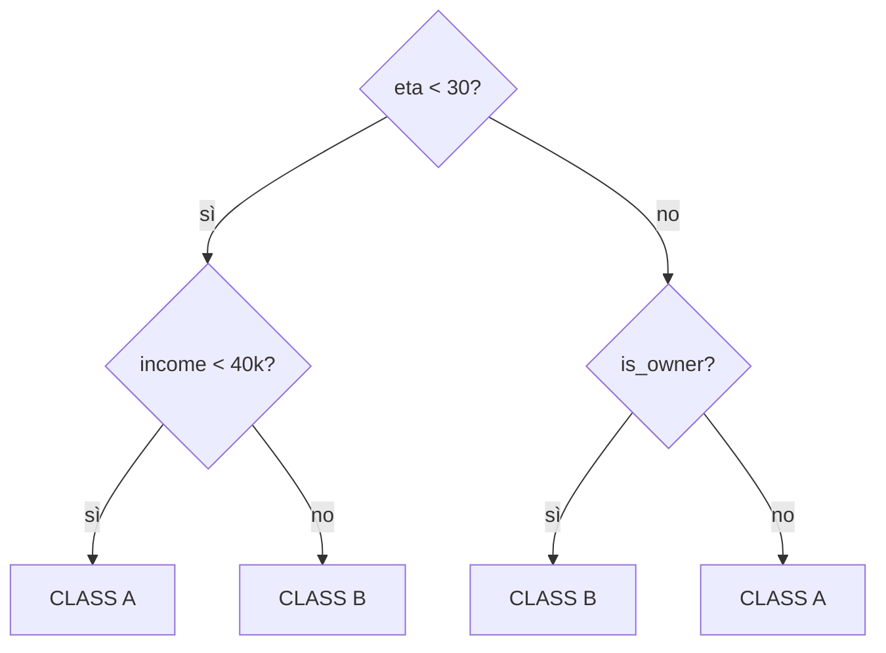

# Alberi decisionali

## L'intuizione

Un albero pone una serie di domande "$x_j \leq t$?" che dividono lo spazio delle feature in regioni rettangolari. In ogni regione, predice la media (regressione) o la classe maggioritaria (classificazione).



Vantaggi: **interpretabile**, gestisce categoriche e numeriche, niente scaling necessario, robusto agli outlier.

### Come "vede" un albero il piano cartesiano

Pensa a un dataset 2D con 2 feature $(x_1, x_2)$ e 2 classi. Un albero traccia **rette parallele agli assi**, dividendo lo spazio in rettangoli, e in ogni rettangolo predice la classe maggioritaria:

<div class="chart"><svg viewBox="0 0 480 260" xmlns="http://www.w3.org/2000/svg">
<rect x="40" y="20" width="400" height="200" fill="none" stroke="#555"/>
<text x="240" y="240" fill="#8b949e" font-size="11" text-anchor="middle">x₁</text>
<text x="22" y="120" fill="#8b949e" font-size="11">x₂</text>

<line x1="200" y1="20" x2="200" y2="220" stroke="#c084fc" stroke-width="2" stroke-dasharray="5,3"/>
<text x="205" y="34" fill="#c084fc" font-size="11">x₁ &lt; 5?</text>

<line x1="40" y1="120" x2="200" y2="120" stroke="#ffb347" stroke-width="2" stroke-dasharray="5,3"/>
<text x="50" y="115" fill="#ffb347" font-size="11">x₂ &lt; 3?</text>

<line x1="200" y1="80" x2="440" y2="80" stroke="#5ee2c4" stroke-width="2" stroke-dasharray="5,3"/>
<text x="280" y="75" fill="#5ee2c4" font-size="11">x₂ &lt; 6?</text>

<rect x="40" y="20" width="160" height="100" fill="rgba(122,162,255,0.10)"/>
<rect x="40" y="120" width="160" height="100" fill="rgba(255,179,71,0.15)"/>
<rect x="200" y="20" width="240" height="60" fill="rgba(255,179,71,0.15)"/>
<rect x="200" y="80" width="240" height="140" fill="rgba(122,162,255,0.10)"/>

<circle cx="90" cy="60" r="4" fill="#7aa2ff"/>
<circle cx="130" cy="90" r="4" fill="#7aa2ff"/>
<circle cx="170" cy="50" r="4" fill="#7aa2ff"/>
<circle cx="80" cy="100" r="4" fill="#7aa2ff"/>

<circle cx="110" cy="180" r="4" fill="#ffb347"/>
<circle cx="150" cy="200" r="4" fill="#ffb347"/>
<circle cx="80" cy="170" r="4" fill="#ffb347"/>

<circle cx="250" cy="50" r="4" fill="#ffb347"/>
<circle cx="320" cy="60" r="4" fill="#ffb347"/>
<circle cx="380" cy="40" r="4" fill="#ffb347"/>

<circle cx="280" cy="130" r="4" fill="#7aa2ff"/>
<circle cx="370" cy="170" r="4" fill="#7aa2ff"/>
<circle cx="240" cy="200" r="4" fill="#7aa2ff"/>
<circle cx="420" cy="100" r="4" fill="#7aa2ff"/>
</svg><div class="chart-caption">Un albero divide il piano in rettangoli. Ogni split aggiunge una linea parallela a un asse — mai oblique come SVM o logistica.</div></div>

Confronta con la regressione logistica, che traccia **una sola retta obliqua**. Un albero può catturare frontiere a "scalini", ma con tanti scalini approssima quasi qualsiasi forma — al prezzo di overfittare se non lo limiti.

## Costruzione: criterio di split

Per ogni nodo:

1. Per ogni feature $j$ e soglia $t$, calcola la "purezza" delle due sotto-regioni risultanti.
2. Scegli $(j, t)$ che massimizza il guadagno di purezza.
3. Ricorri su entrambi i figli.
4. Fermati quando: profondità massima, nodo puro, o min samples.

### Criteri di impurità (classificazione)

**Gini index**:
$$G = \sum_k p_k (1 - p_k) = 1 - \sum_k p_k^2$$

**Entropia**:
$$H = -\sum_k p_k \log_2 p_k$$

Entrambi misurano "quanto è mista" una regione. 0 = pura (un solo classe), max = uniforme.

### Per la regressione

**Varianza residua**:
$$L = \sum_i (y_i - \bar{y}_R)^2$$

dove $\bar{y}_R$ è la media nella regione.

### Information gain

$$IG = L_\text{parent} - \frac{n_L}{n} L_L - \frac{n_R}{n} L_R$$

Quanto la divisione **riduce** l'impurità, pesata dalla taglia dei figli.

## Overfitting e pruning

Un albero senza vincoli **memorizza** il training set: ogni foglia ha un solo esempio, accuracy 100% in train, disastro in test.

**Strategie anti-overfit**:

1. **Pre-pruning** (early stopping):
   - `max_depth`: profondità massima
   - `min_samples_split`: minimo per splittare
   - `min_samples_leaf`: minimo in una foglia
   - `max_leaf_nodes`: numero massimo di foglie
   - `min_impurity_decrease`: gain minimo richiesto

2. **Post-pruning** (cost-complexity pruning):
   $$L_\alpha(T) = L(T) + \alpha |T|$$
   dove $|T|$ è il numero di foglie. Aumentare $\alpha$ rimuove foglie meno utili.

```python
from sklearn.tree import DecisionTreeClassifier
tree = DecisionTreeClassifier(max_depth=5, min_samples_leaf=10, random_state=0)
tree.fit(X_tr, y_tr)
```

### Cost-complexity path

```python
path = tree.cost_complexity_pruning_path(X_tr, y_tr)
alphas = path.ccp_alphas
# allena un albero per ogni alpha, scegli col CV
```

## Visualizzare un albero

```python
from sklearn.tree import plot_tree, export_text
import matplotlib.pyplot as plt

plt.figure(figsize=(15, 8))
plot_tree(tree, feature_names=feature_names, class_names=['no','yes'],
          filled=True, rounded=True, fontsize=8)
plt.show()

print(export_text(tree, feature_names=list(feature_names)))
```

Gli alberi sono il modello **più interpretabile** disponibile. In settori regolamentati (medicina, credito) sono spesso preferiti per questo.

## Limitazioni di un singolo albero

- **Alta varianza**: piccoli cambi nei dati → albero diverso.
- **Frontiere "step-wise"**: solo perpendicolari agli assi.
- **Sbilanciamento**: tendono a favorire feature continue con molti split possibili.
- **Estrapolazione assente** in regressione: prediction limitata al range visto.

Soluzione: **ensemble** (Random Forest, Boosting) — vedremo nelle sezioni successive.

## Esempio completo

```python
from sklearn.datasets import load_breast_cancer
from sklearn.tree import DecisionTreeClassifier
from sklearn.model_selection import train_test_split, cross_val_score
import numpy as np

X, y = load_breast_cancer(return_X_y=True)
X_tr, X_te, y_tr, y_te = train_test_split(X, y, stratify=y, random_state=0)

# CV per scegliere max_depth
depths = range(1, 20)
scores = [cross_val_score(DecisionTreeClassifier(max_depth=d, random_state=0), X_tr, y_tr, cv=5).mean()
          for d in depths]
best_d = depths[np.argmax(scores)]
print(f"miglior max_depth: {best_d}")

tree = DecisionTreeClassifier(max_depth=best_d, random_state=0).fit(X_tr, y_tr)
print(f"Test acc: {tree.score(X_te, y_te):.3f}")
print(f"Top 5 feature: {sorted(zip(tree.feature_importances_, range(30)), reverse=True)[:5]}")
```

## Feature importance

Misurate dall'**impurità totale ridotta** da ogni feature, pesata per la frequenza dei nodi:

$$\text{Imp}_j = \sum_{\text{nodi}: \text{split su } j} \frac{n_{\text{node}}}{n} \cdot \Delta L$$

Limitazioni:
- Favorisce feature continue (più split possibili) e feature con molti valori unici.
- Permutation importance è **più affidabile** (vedi sezione feature engineering).

## Trees per la regressione

Stessa struttura, ma:
- Loss = varianza.
- Predizione = media della foglia.

```python
from sklearn.tree import DecisionTreeRegressor
reg = DecisionTreeRegressor(max_depth=6, min_samples_leaf=20)
```

## Quando usare alberi singoli

In pratica, raramente. Sono utili come:

- **Interpretabilità massima**: regola decisionale visualizzabile.
- **Baseline**: per capire quanto guadagna un ensemble.
- **Componenti** di Random Forest o Boosting.

Per **prestazioni**, vai sempre su RF o XGBoost.

## Esercizi

<details>
<summary>Esercizio 1 — Calcola Gini a mano</summary>

Un nodo contiene 30 esempi: 18 classe A, 12 classe B. Calcola Gini.

**Soluzione**: $p_A = 0.6, p_B = 0.4$. $G = 1 - 0.36 - 0.16 = 0.48$.
</details>

<details>
<summary>Esercizio 2 — Information gain</summary>

Padre: $n=100$, 50/50, Gini=0.5.
Figlio sinistro: $n=40$, 30 A / 10 B, Gini = 1 - 0.5625 - 0.0625 = 0.375.
Figlio destro: $n=60$, 20 A / 40 B, Gini = 1 - 0.111 - 0.444 = 0.444.

IG = $0.5 - (40/100) \cdot 0.375 - (60/100) \cdot 0.444 = 0.5 - 0.15 - 0.267 = 0.083$.
</details>

<details>
<summary>Esercizio 3 — Albero da zero (semplificato)</summary>

```python
import numpy as np

def gini(y):
    p = np.bincount(y) / len(y)
    return 1 - (p**2).sum()

def best_split(X, y):
    best = (None, None, 1.0)  # (feature, threshold, gini)
    for j in range(X.shape[1]):
        vals = np.unique(X[:, j])
        for t in vals[:-1]:
            mask = X[:, j] <= t
            if mask.sum() == 0 or mask.sum() == len(y): continue
            g = (mask.sum() * gini(y[mask]) + (~mask).sum() * gini(y[~mask])) / len(y)
            if g < best[2]: best = (j, t, g)
    return best

from sklearn.datasets import load_iris
X, y = load_iris(return_X_y=True)
print(best_split(X, y))   # (feature, threshold, gini)
```

Confronta con sklearn.
</details>

<details>
<summary>Esercizio 4 — Pruning con cost-complexity</summary>

```python
from sklearn.tree import DecisionTreeClassifier
from sklearn.datasets import load_breast_cancer
from sklearn.model_selection import train_test_split
import matplotlib.pyplot as plt

X, y = load_breast_cancer(return_X_y=True)
X_tr, X_te, y_tr, y_te = train_test_split(X, y, stratify=y, random_state=0)

tree = DecisionTreeClassifier(random_state=0).fit(X_tr, y_tr)
path = tree.cost_complexity_pruning_path(X_tr, y_tr)

trains, tests = [], []
for a in path.ccp_alphas:
    t = DecisionTreeClassifier(random_state=0, ccp_alpha=a).fit(X_tr, y_tr)
    trains.append(t.score(X_tr, y_tr))
    tests.append(t.score(X_te, y_te))

plt.plot(path.ccp_alphas, trains, label='train')
plt.plot(path.ccp_alphas, tests, label='test')
plt.xlabel('alpha'); plt.legend()
```

Vedi: aumentando $\alpha$, l'accuracy in train scende e in test prima sale (riduce overfit) poi scende (underfit).
</details>

## Cosa portarti via

- Alberi: serie di split, regioni rettangolari, super interpretabili.
- Impurità: Gini per classification, varianza per regressione.
- Singolo albero: alta varianza, overfit facile. Limita con `max_depth`, `min_samples_leaf`.
- Quasi mai usati da soli — sono **building block** di RF e Boosting.

Prossimo: Random Forest e ensembles.
