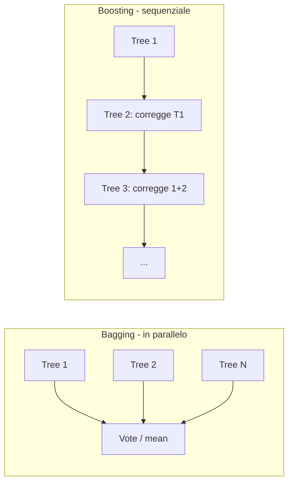

# Random Forest, Gradient Boosting, XGBoost

## Ensemble: due filosofie



- **Bagging** (Bootstrap AGGregating): allena modelli indipendenti su bootstrap del training set, media i risultati. Riduce **varianza**.
- **Boosting**: allena modelli in sequenza, ognuno corregge errori del precedente. Riduce **bias** (e anche varianza, se ben regolarizzato).

## Random Forest

Bagging di alberi, con un twist: ad ogni split, considera solo un **sottoinsieme casuale** delle feature. Decorrelare gli alberi rende la media più potente.

### Algoritmo

```
per b = 1..B:
    campiona n esempi con rimpiazzo (bootstrap)
    fai crescere un albero profondo:
        ad ogni split, considera solo k feature random tra p
predizione = media (regressione) o voto (classificazione) dei B alberi
```

### Iperparametri principali

| Param | Effetto |
|---|---|
| `n_estimators` | numero di alberi. Più = meglio (rendimento decrescente). 200–1000 OK. |
| `max_features` | $k$ per split. Per classification ~$\sqrt{p}$, per regression ~$p/3$. |
| `max_depth` | profondità max. `None` = senza limite. |
| `min_samples_leaf` | foglia minima. 1–5 default; aumenta per regolarizzare. |
| `n_jobs` | parallelismo (multi-core). `-1` = tutti i core. |

### Vantaggi

- Funziona benissimo "out of the box" senza tuning serio.
- Robusto agli outlier.
- Niente scaling necessario.
- Gestisce categoriche con encoding base.
- Stima out-of-bag dell'errore (gratis).

### Quando NON usarlo

- $n$ enorme con tante feature → lento.
- Vuoi probabilità calibrate → mediocre.
- Dati strutturati di immagini, testi, sequenze → NN meglio.

## Gradient Boosting (idea)

Costruisci modello $F(x)$ incrementale:

$$F_m(x) = F_{m-1}(x) + \eta \cdot h_m(x)$$

dove $h_m$ è un **debole** (di solito un albero piccolo) che approssima il gradiente negativo della loss rispetto a $F_{m-1}$. In pratica, $h_m$ predice i **residui**:

$$h_m(x) \approx -\frac{\partial L}{\partial F(x)}\bigg|_{F=F_{m-1}}$$

Per MSE, il gradiente è $-(y - F(x))$ = residuo. Quindi: ogni nuovo albero impara a correggere ciò che il modello finora sbaglia.

### XGBoost, LightGBM, CatBoost

Tre implementazioni moderne, ottimizzate, di gradient boosting su alberi. Battono in genere RF e tutto il resto su dati tabellari.

| | XGBoost | LightGBM | CatBoost |
|---|---|---|---|
| Velocità training | rapido | molto rapido | medio |
| Gestione categoriche | manuale | nativa | nativa (ottima) |
| Default tuning | medio | aggressivo | conservativo |
| Out-of-the-box | ottimo | ottimo | eccellente per cat. |

Codice base, intercambiabile:

```python
import xgboost as xgb
m = xgb.XGBClassifier(
    n_estimators=500, max_depth=6, learning_rate=0.05,
    subsample=0.8, colsample_bytree=0.8,
    reg_alpha=0, reg_lambda=1,
    eval_metric='auc',
    early_stopping_rounds=50,
    random_state=0,
)
m.fit(X_tr, y_tr, eval_set=[(X_val, y_val)])
```

```python
import lightgbm as lgb
m = lgb.LGBMClassifier(
    n_estimators=500, num_leaves=31, learning_rate=0.05,
    feature_fraction=0.8, bagging_fraction=0.8, bagging_freq=5,
    reg_lambda=1, random_state=0,
)
m.fit(X_tr, y_tr, eval_set=[(X_val, y_val)], callbacks=[lgb.early_stopping(50)])
```

```python
from catboost import CatBoostClassifier
m = CatBoostClassifier(
    iterations=500, depth=6, learning_rate=0.05,
    cat_features=['city','plan'],   # nomi colonne categoriche
    eval_metric='AUC', random_seed=0, verbose=0,
)
m.fit(X_tr, y_tr, eval_set=(X_val, y_val), early_stopping_rounds=50)
```

### Hyperparam che contano davvero

In ordine di impatto:

1. **`learning_rate`** (eta): 0.01–0.1. Più piccolo = più alberi, più stabile.
2. **`n_estimators`**: usato con `early_stopping_rounds`. Lascia un numero alto e lascia stop automatico.
3. **`max_depth` / `num_leaves`**: 4–10 tipicamente. Profondo = più espressivo, più overfit.
4. **`subsample` / `colsample_bytree`**: 0.7–1.0. Random subsampling come bagging interno.
5. **`reg_alpha` (L1), `reg_lambda` (L2)**: regolarizzazione su pesi delle foglie.
6. **`min_child_weight` / `min_data_in_leaf`**: come `min_samples_leaf` dei tree.

> **Workflow tipico**: lr=0.05, n_estim=2000 con early stopping a 50. Tuna max_depth e regolarizzazione. Spesso 80% dell'accuratezza viene dai default.

## Early stopping

Cresci alberi finché l'errore di validation migliora. Quando non migliora per $N$ iterazioni di seguito, fermati.

```python
m.fit(X_tr, y_tr, eval_set=[(X_val, y_val)], early_stopping_rounds=50, verbose=False)
print("alberi usati:", m.best_iteration)
```

Pratica essenziale: previene overfit e tara automaticamente `n_estimators`.

## Feature importance (boosting)

Tre metriche:

- **gain**: contributo medio alla riduzione della loss (più affidabile).
- **weight / cover**: numero di split / sample passati.

```python
xgb.plot_importance(m, importance_type='gain')
# o
import shap
explainer = shap.TreeExplainer(m)
shap_values = explainer.shap_values(X_val)
shap.summary_plot(shap_values, X_val)
```

**SHAP values** è lo standard moderno per spiegare modelli a alberi: contributo di ogni feature alla singola predizione. Robusto, teoricamente fondato (Shapley values, teoria dei giochi).

## Categorical handling: CatBoost vs gli altri

CatBoost usa **Ordered Target Statistics**: per ogni categoria, calcola una versione "leak-free" del target encoding. È superbo se hai categoriche con cardinalità media-alta.

LightGBM: usa "Gradient-based One-Side Sampling" e gestisce categoriche nativamente con `categorical_feature` param.

XGBoost: storicamente richiedeva one-hot, dal 2024 supporta categorical (`enable_categorical=True`).

## Quando boosting batte le NN

Su **dati tabellari** (ovvero la maggior parte del mondo aziendale), i boosting su alberi dominano. Vari benchmark (Borisov 2022, Grinsztajn 2022) mostrano che XGBoost/LightGBM/CatBoost battono trasformer e MLP sui dataset tabellari "normali" (n < 1M, feature eterogenee).

> Le NN tabulari (TabNet, FT-Transformer, SAINT) sono attivamente ricercate ma raramente la prima scelta in industria. Ricorda: i Kaggle Grandmaster usano boosting.

## Esempio completo

```python
import pandas as pd, numpy as np
from sklearn.model_selection import train_test_split
from sklearn.metrics import roc_auc_score
import lightgbm as lgb

X, y = load_data()
X_tr, X_val, y_tr, y_val = train_test_split(X, y, test_size=0.2, stratify=y, random_state=0)

m = lgb.LGBMClassifier(
    n_estimators=2000, learning_rate=0.05,
    num_leaves=31, max_depth=-1,
    feature_fraction=0.8, bagging_fraction=0.8, bagging_freq=5,
    reg_lambda=1.0, min_data_in_leaf=20,
    random_state=0, n_jobs=-1,
)
m.fit(X_tr, y_tr, eval_set=[(X_val, y_val)],
      callbacks=[lgb.early_stopping(50), lgb.log_evaluation(100)])

print("AUC:", roc_auc_score(y_val, m.predict_proba(X_val)[:, 1]))

# salva
import joblib; joblib.dump(m, "model.pkl")
```

## Esercizi

<details>
<summary>Esercizio 1 — RF vs LR su Titanic</summary>

Confronta Random Forest e Logistic Regression. Quale vince in AUC? Quale è più interpretabile?

```python
import seaborn as sns
from sklearn.ensemble import RandomForestClassifier
from sklearn.linear_model import LogisticRegression
from sklearn.model_selection import cross_val_score
from sklearn.preprocessing import StandardScaler
from sklearn.pipeline import Pipeline

df = sns.load_dataset('titanic').dropna(subset=['age','embarked'])
y = df.survived
X = pd.get_dummies(df[['pclass','sex','age','sibsp','parch','fare','embarked']], drop_first=True)

rf = RandomForestClassifier(n_estimators=500, random_state=0)
lr = Pipeline([('sc', StandardScaler()), ('lr', LogisticRegression(max_iter=2000))])

print("RF AUC:", cross_val_score(rf, X, y, cv=5, scoring='roc_auc').mean())
print("LR AUC:", cross_val_score(lr, X, y, cv=5, scoring='roc_auc').mean())
```
</details>

<details>
<summary>Esercizio 2 — Tuning XGBoost con Optuna</summary>

```python
import optuna, xgboost as xgb
from sklearn.model_selection import cross_val_score

def obj(trial):
    p = dict(
        n_estimators=trial.suggest_int('n_estimators', 200, 2000),
        max_depth=trial.suggest_int('max_depth', 3, 10),
        learning_rate=trial.suggest_float('lr', 1e-3, 0.3, log=True),
        subsample=trial.suggest_float('subsample', 0.5, 1.0),
        colsample_bytree=trial.suggest_float('cs', 0.5, 1.0),
        reg_lambda=trial.suggest_float('rl', 1e-3, 10, log=True),
    )
    m = xgb.XGBClassifier(**p, eval_metric='auc', random_state=0)
    return cross_val_score(m, X, y, cv=5, scoring='roc_auc', n_jobs=-1).mean()

study = optuna.create_study(direction='maximize')
study.optimize(obj, n_trials=50)
print(study.best_params)
```
</details>

<details>
<summary>Esercizio 3 — SHAP per spiegare un modello</summary>

```python
import shap
explainer = shap.TreeExplainer(m)
shap_values = explainer.shap_values(X_val.sample(500, random_state=0))
shap.summary_plot(shap_values, X_val.sample(500, random_state=0))   # beeswarm
shap.dependence_plot('age', shap_values, X_val.sample(500, random_state=0))
```

Il beeswarm mostra per ogni feature: distribuzione dell'impatto SHAP per ogni osservazione. Una delle visualizzazioni più potenti che esistano.
</details>

<details>
<summary>Esercizio 4 — Early stopping in pratica</summary>

Con `early_stopping_rounds`, plotta la loss di train e validation per ogni boosting iteration:

```python
import lightgbm as lgb
import matplotlib.pyplot as plt
m = lgb.LGBMClassifier(n_estimators=1000, learning_rate=0.05, random_state=0)
m.fit(X_tr, y_tr, eval_set=[(X_tr, y_tr), (X_val, y_val)],
      eval_metric='auc', callbacks=[lgb.early_stopping(50)])
plt.plot(m.evals_result_['training']['auc'], label='train')
plt.plot(m.evals_result_['valid_1']['auc'], label='val')
plt.legend(); plt.xlabel('iteration'); plt.ylabel('AUC')
```

Tipicamente: train continua a salire, val sale poi pareggia. Early stopping ferma all'ultimo "miglioramento" su val.
</details>

## Cosa portarti via

- Bagging riduce varianza, Boosting riduce bias. Random Forest = bagging di tree, XGBoost = boosting di tree.
- Su dati tabellari, gradient boosting batte tutto il resto.
- Early stopping ti tara `n_estimators` automaticamente.
- SHAP per spiegare predictions.
- CatBoost se hai molte categoriche. LightGBM se vuoi velocità. XGBoost se cerchi stabilità ecosystem.

Prossimo: clustering — l'unsupervised più usato.
