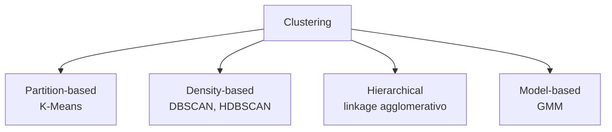
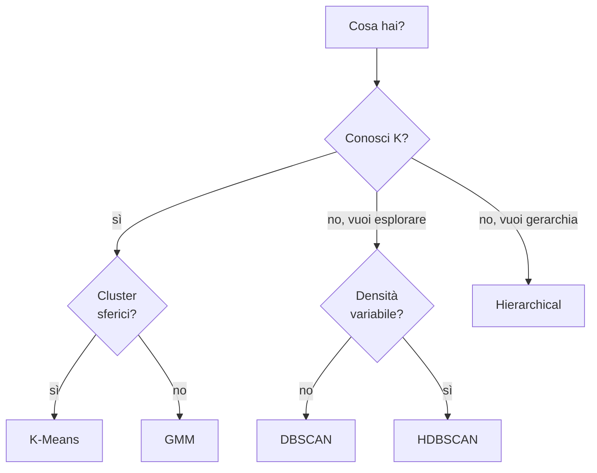

# Clustering: K-Means, DBSCAN, GMM, gerarchico

## Cos'è il clustering

Raggruppare punti **senza** etichette, in modo che punti simili stiano insieme e punti diversi in cluster diversi. Quattro famiglie principali:



## K-Means

L'algoritmo più diffuso. Cerca di dividere $n$ punti in $K$ cluster minimizzando la **somma delle distanze quadrate** dai centri:

$$J = \sum_{k=1}^K \sum_{x \in C_k} \|x - \mu_k\|^2$$

### Algoritmo (Lloyd, 1957)

```
1. Inizializza K centri (random o K-Means++)
2. Ripeti:
   a. Assegna ogni punto al centro più vicino
   b. Ricalcola ogni centro come media dei suoi punti
   finché i centri non cambiano
```

### Visivamente: 3 iterazioni di K-Means in azione

<div class="chart"><svg viewBox="0 0 600 180" xmlns="http://www.w3.org/2000/svg">
<g transform="translate(10,10)">
  <text x="80" y="-2" fill="#7aa2ff" font-size="11" text-anchor="middle">iter 1: centri random</text>
  <rect x="0" y="5" width="160" height="140" fill="none" stroke="#444"/>
  <circle cx="30" cy="30" r="3" fill="#888"/>
  <circle cx="50" cy="40" r="3" fill="#888"/>
  <circle cx="40" cy="60" r="3" fill="#888"/>
  <circle cx="110" cy="100" r="3" fill="#888"/>
  <circle cx="130" cy="110" r="3" fill="#888"/>
  <circle cx="120" cy="130" r="3" fill="#888"/>
  <path d="M 60 80 L 65 70 L 70 80 L 65 90 Z" fill="#ffb347" stroke="#ffb347" stroke-width="2"/>
  <path d="M 100 50 L 105 40 L 110 50 L 105 60 Z" fill="#c084fc" stroke="#c084fc" stroke-width="2"/>
</g>
<g transform="translate(180,10)">
  <text x="80" y="-2" fill="#7aa2ff" font-size="11" text-anchor="middle">iter 2: assegna + sposta</text>
  <rect x="0" y="5" width="160" height="140" fill="none" stroke="#444"/>
  <circle cx="30" cy="30" r="3" fill="#ffb347"/>
  <circle cx="50" cy="40" r="3" fill="#ffb347"/>
  <circle cx="40" cy="60" r="3" fill="#ffb347"/>
  <circle cx="110" cy="100" r="3" fill="#c084fc"/>
  <circle cx="130" cy="110" r="3" fill="#c084fc"/>
  <circle cx="120" cy="130" r="3" fill="#c084fc"/>
  <path d="M 40 43 L 45 33 L 50 43 L 45 53 Z" fill="#ffb347" stroke="#ffb347" stroke-width="2"/>
  <path d="M 120 113 L 125 103 L 130 113 L 125 123 Z" fill="#c084fc" stroke="#c084fc" stroke-width="2"/>
</g>
<g transform="translate(350,10)">
  <text x="80" y="-2" fill="#7aa2ff" font-size="11" text-anchor="middle">iter 3: convergenza</text>
  <rect x="0" y="5" width="160" height="140" fill="none" stroke="#444"/>
  <circle cx="30" cy="30" r="3" fill="#ffb347"/>
  <circle cx="50" cy="40" r="3" fill="#ffb347"/>
  <circle cx="40" cy="60" r="3" fill="#ffb347"/>
  <circle cx="110" cy="100" r="3" fill="#c084fc"/>
  <circle cx="130" cy="110" r="3" fill="#c084fc"/>
  <circle cx="120" cy="130" r="3" fill="#c084fc"/>
  <path d="M 35 43 L 40 33 L 45 43 L 40 53 Z" fill="#ffb347" stroke="#ffb347" stroke-width="2"/>
  <path d="M 115 113 L 120 103 L 125 113 L 120 123 Z" fill="#c084fc" stroke="#c084fc" stroke-width="2"/>
</g>
</svg><div class="chart-caption">Ogni iterazione: i punti scelgono il diamante più vicino, i diamanti si spostano al baricentro del loro gruppo. Converge in pochi step.</div></div>

Convergenza garantita in pochi step (a un minimo locale, non globale).

### K-Means++

Inizializzazione "intelligente" (Arthur & Vassilvitskii, 2007):
- Primo centro: random.
- Successivi: probabilità proporzionale a $D(x)^2$, dove $D$ è la distanza dal centro più vicino esistente.

Riduce notevolmente la dipendenza dal seed. Default in sklearn.

### Limitazioni

- Assume cluster **sferici** e di **dimensioni simili**.
- Sensibile a outlier.
- $K$ deve essere scelto a priori.
- Non scopre cluster di forma non convessa.

### Scegliere K: elbow method e silhouette

**Elbow method**: plotta $J(K)$ per $K = 1, 2, \dots$. Cerca il "gomito" — il punto dove l'aggiunta di un cluster non riduce più di tanto J.

**Silhouette score**: per ogni punto, $(b - a) / \max(a, b)$ dove $a$ = distanza media intra-cluster, $b$ = distanza al cluster più vicino. Range $[-1, 1]$, alto = buon clustering.

```python
from sklearn.cluster import KMeans
from sklearn.metrics import silhouette_score
import matplotlib.pyplot as plt

inertias = []; silhouettes = []
Ks = range(2, 11)
for K in Ks:
    km = KMeans(n_clusters=K, random_state=0, n_init=10).fit(X)
    inertias.append(km.inertia_)
    silhouettes.append(silhouette_score(X, km.labels_))

fig, ax = plt.subplots(1, 2, figsize=(12, 4))
ax[0].plot(Ks, inertias, 'o-'); ax[0].set_title('Elbow')
ax[1].plot(Ks, silhouettes, 'o-'); ax[1].set_title('Silhouette')
```

## DBSCAN

**Density-Based Spatial Clustering of Applications with Noise** (Ester et al, 1996).

Idea: un punto è **core** se ha almeno `min_samples` vicini entro raggio `eps`. Cluster = componenti connesse di core points. Resto = noise.

### Algoritmo

```
per ogni punto p non visitato:
    se p ha >= min_samples vicini entro eps:
        crea cluster, espandi includendo vicini ricorsivamente
    altrimenti:
        marca p come noise
```

### Vantaggi

- **Non serve K** in input.
- Cluster di **forma arbitraria** (anche concentrici).
- Robusto al noise (lo identifica esplicitamente).

### Iperparametri

- **eps**: raggio del neighborhood. Critico.
- **min_samples**: tipicamente $2 \cdot \text{dim}$.

### Limitazioni

- Difficile con cluster di **densità diverse**.
- Sensibile a `eps` (rule of thumb: k-distance plot per sceglierlo).
- Scala male su dati ad alta dimensione (curse of dimensionality).

### HDBSCAN

Estensione gerarchica di DBSCAN che gestisce densità variabili. **Spesso il default moderno** per clustering esplorativo. Installa con `pip install hdbscan`.

```python
import hdbscan
clusterer = hdbscan.HDBSCAN(min_cluster_size=15)
labels = clusterer.fit_predict(X)
```

## Gaussian Mixture Models (GMM)

Modello probabilistico: assume i dati generati da una **miscela** di $K$ gaussiane multivariate:

$$p(x) = \sum_{k=1}^K \pi_k \mathcal{N}(x | \mu_k, \Sigma_k)$$

Allenato con **EM (Expectation-Maximization)**:

1. **E-step**: per ogni punto, calcola la probabilità di appartenenza a ogni cluster.
2. **M-step**: aggiorna $\mu_k, \Sigma_k, \pi_k$ dato l'assegnamento soft.

### Differenze con K-Means

- Soft assignment: ogni punto ha una **probabilità** in ciascun cluster, non una assegnazione hard.
- Cluster di **forma ellittica** (covarianze full), non solo sferiche.
- Output: **densità** modellata, utile per anomaly detection.

### Tipi di covariance

- `'full'`: ogni cluster ha la sua matrice di covarianza piena (più espressivo).
- `'tied'`: tutti i cluster condividono.
- `'diag'`: solo diagonale (più veloce).
- `'spherical'`: come K-Means.

```python
from sklearn.mixture import GaussianMixture
gmm = GaussianMixture(n_components=3, covariance_type='full', random_state=0).fit(X)
labels = gmm.predict(X)
proba = gmm.predict_proba(X)        # soft assignment
log_likelihood = gmm.score_samples(X)  # densità (utile per anomalie)
```

### Selezione di K via BIC / AIC

$$\text{BIC} = -2 \log L + k \log n$$

Più basso = meglio. Penalizza modelli con troppi parametri.

```python
ks = range(1, 11)
bics = [GaussianMixture(K, random_state=0).fit(X).bic(X) for K in ks]
plt.plot(ks, bics, 'o-')
```

## Hierarchical clustering

Costruisce un **dendrogramma** — un albero di fusioni o divisioni.

- **Agglomerativo (bottom-up)**: parte da $n$ cluster di 1 punto, fonde i più vicini.
- **Divisivo (top-down)**: parte da 1 cluster di $n$ punti, divide. Meno comune.

### Linkage criteria

Come si misura la distanza tra cluster?

- **Single**: distanza minima tra due punti dei cluster. Chain-effect, snake-like.
- **Complete**: distanza massima. Cluster compatti, sferici.
- **Average**: media. Compromesso.
- **Ward**: minimizza la varianza dopo fusione. Tende a produrre cluster di taglia simile, spesso il default migliore.

```python
from sklearn.cluster import AgglomerativeClustering
agg = AgglomerativeClustering(n_clusters=5, linkage='ward').fit(X)

from scipy.cluster.hierarchy import linkage, dendrogram
import matplotlib.pyplot as plt
Z = linkage(X, method='ward')
plt.figure(figsize=(12, 5))
dendrogram(Z, truncate_mode='lastp', p=20)
```

## Quale algoritmo scegliere?



## Valutazione SENZA ground truth

- **Silhouette score** (interno): $-1$ a $1$, alto buono.
- **Calinski-Harabasz**: rapporto disp. tra cluster / dispersione interna.
- **Davies-Bouldin**: media rapporto disp.intra/dist.tra. Basso = buono.

Con ground truth (raro):

- **Adjusted Rand Index (ARI)**: -1..1.
- **Normalized Mutual Information (NMI)**: 0..1.

## Pre-processing: obbligatorio

1. **Scaling**: K-Means usa distanza euclidea. Feature in scala diversa = dominata.
2. **Riduzione dim**: in alta dim, distanze diventano "tutte uguali". Considera PCA prima.
3. **Outlier handling**: K-Means è devastato. DBSCAN li gestisce.

## Esempio: customer segmentation

```python
from sklearn.preprocessing import StandardScaler
from sklearn.cluster import KMeans
from sklearn.decomposition import PCA
import matplotlib.pyplot as plt

# RFM features per ogni cliente
X = customers[['recency', 'frequency', 'monetary']].values
X_s = StandardScaler().fit_transform(X)

km = KMeans(n_clusters=4, random_state=0, n_init=10).fit(X_s)
customers['cluster'] = km.labels_

# visualizza in 2D
X_2d = PCA(n_components=2).fit_transform(X_s)
plt.scatter(X_2d[:, 0], X_2d[:, 1], c=km.labels_, cmap='tab10', alpha=0.6)

# descrivi i cluster
customers.groupby('cluster')[['recency','frequency','monetary']].mean()
```

Tipicamente otterrai 4 segmenti tipo "campioni", "fedeli a basso valore", "in fuga", "una tantum". Useful per marketing campaigns differenziati.

## Esercizi

<details>
<summary>Esercizio 1 — Elbow + Silhouette su iris</summary>

```python
from sklearn.cluster import KMeans
from sklearn.metrics import silhouette_score
from sklearn.datasets import load_iris
import matplotlib.pyplot as plt

X = load_iris().data
inert = []; sil = []
for K in range(2, 10):
    km = KMeans(K, random_state=0, n_init=10).fit(X)
    inert.append(km.inertia_); sil.append(silhouette_score(X, km.labels_))

fig, ax = plt.subplots(1, 2, figsize=(10,4))
ax[0].plot(range(2,10), inert, 'o-'); ax[0].set_title('Elbow')
ax[1].plot(range(2,10), sil, 'o-'); ax[1].set_title('Silhouette')
```

L'elbow è ambiguo (3 o 4), silhouette suggerisce 2. Realmente le specie sono 3, ma 2 di esse sono difficilmente separabili senza il target.
</details>

<details>
<summary>Esercizio 2 — DBSCAN su cerchi concentrici</summary>

```python
from sklearn.datasets import make_circles
from sklearn.cluster import DBSCAN, KMeans
import matplotlib.pyplot as plt

X, _ = make_circles(n_samples=500, noise=0.05, factor=0.5, random_state=0)
fig, ax = plt.subplots(1, 2, figsize=(10, 4))

km = KMeans(2, random_state=0, n_init=10).fit(X)
ax[0].scatter(X[:,0], X[:,1], c=km.labels_); ax[0].set_title('K-Means')

db = DBSCAN(eps=0.2, min_samples=5).fit(X)
ax[1].scatter(X[:,0], X[:,1], c=db.labels_); ax[1].set_title('DBSCAN')
```

K-Means fallisce miseramente (taglia in due metà), DBSCAN trova i due cerchi.
</details>

<details>
<summary>Esercizio 3 — GMM per anomaly detection</summary>

Allena un GMM su dati "normali", flagga come anomalie i punti con bassa densità.

```python
from sklearn.mixture import GaussianMixture
import numpy as np
rng = np.random.default_rng(0)
X_normal = rng.standard_normal((1000, 2))
X_test = rng.standard_normal((200, 2))
X_test[:10] = rng.uniform(-5, 5, (10, 2))   # outlier inseriti

gmm = GaussianMixture(n_components=3, random_state=0).fit(X_normal)
scores = gmm.score_samples(X_test)
threshold = np.percentile(scores, 5)
anomalies = scores < threshold
print(f"trovate {anomalies.sum()} anomalie su 200")
```
</details>

<details>
<summary>Esercizio 4 — Customer segmentation completo</summary>

Su un dataset di transazioni, calcola RFM, cluster K-Means a 4, descrivi cluster.

```python
# pseudo: orders DataFrame con user_id, order_date, amount
ref = orders.order_date.max()
rfm = orders.groupby('user_id').agg(
    R=('order_date', lambda s: (ref-s.max()).days),
    F=('amount', 'count'),
    M=('amount', 'sum'),
)
from sklearn.preprocessing import StandardScaler
X = StandardScaler().fit_transform(np.log1p(rfm))
km = KMeans(4, random_state=0, n_init=10).fit(X)
rfm['cluster'] = km.labels_
print(rfm.groupby('cluster').agg(['mean','count']))
```
</details>

## Cosa portarti via

- K-Means = default veloce, ma forma sferica e K noto.
- DBSCAN/HDBSCAN per shape arbitrary e rilevazione noise.
- GMM per soft assignment e modello probabilistico.
- Hierarchical per esplorazione e dendrogramma.
- Senza ground truth: silhouette + senso comune + domain check.
- Scaling sempre obbligatorio. PCA prima del clustering se $d > 20$.

Prossimo: riduzione dimensionale.
