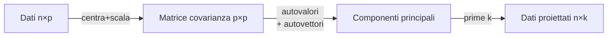
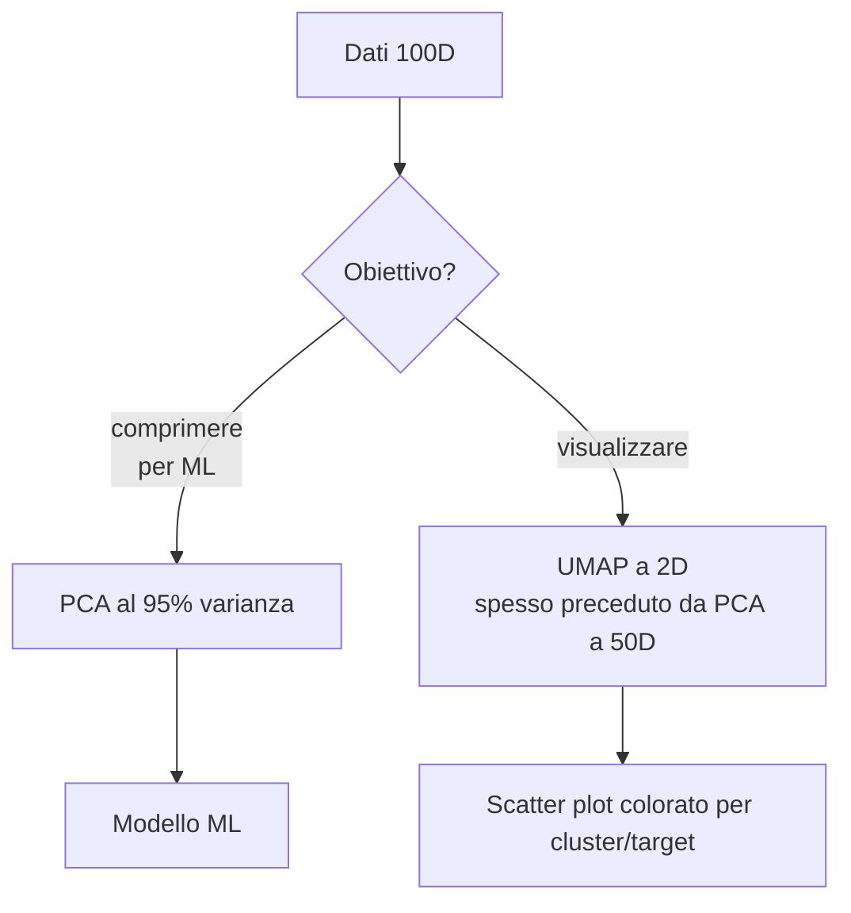

# Riduzione dimensionale: PCA, t-SNE, UMAP

## Perché ridurre dimensione

Tre motivi:

1. **Visualizzazione**: 2D/3D è ciò che vedi su uno schermo.
2. **Compressione**: meno feature = meno RAM, meno tempo di training.
3. **Anti-curse-of-dimensionality**: KNN, K-Means, distanze in genere funzionano meglio in low-dim.
4. **Denoising**: scartare componenti a bassa varianza spesso elimina rumore.

## PCA — Principal Component Analysis

### Idea

Trova le **direzioni lungo cui i dati variano di più**. Queste direzioni sono ortogonali (componenti principali) e ortonormali tra loro.



### Derivazione

1. Centra $X$ (sottrai media). Opzionale: dividi per std (PCA standardizzata).
2. Calcola la **matrice di covarianza** $C = \frac{1}{n-1} X^T X$ (con $X$ centrato).
3. Trova autovalori e autovettori di $C$: $C v_k = \lambda_k v_k$.
4. I $v_k$ ordinati per $\lambda_k$ decrescente sono i **componenti principali**.
5. Proietta i dati: $Z = X V_K$, dove $V_K$ contiene i primi $K$ componenti.

### Equivalenza con SVD

Se $X = U \Sigma V^T$ (SVD), allora $V$ sono i componenti principali e $\Sigma^2 / (n-1)$ sono gli autovalori. Praticamente sempre si usa SVD (più stabile).

### Varianza spiegata

Ogni componente ha una varianza spiegata $\lambda_k$. La frazione cumulativa $\sum \lambda_k / \sum \lambda$ mostra quanto puoi conservare con $K$ componenti.

```python
from sklearn.decomposition import PCA
from sklearn.preprocessing import StandardScaler

X_s = StandardScaler().fit_transform(X)
pca = PCA().fit(X_s)
print(pca.explained_variance_ratio_.cumsum())
# es: [0.42, 0.65, 0.78, 0.86, 0.92, 0.95, ...]
# scegli K dove la cumulativa raggiunge 0.9 o 0.95
```

<div class="chart"><svg viewBox="0 0 360 180" xmlns="http://www.w3.org/2000/svg">
<line x1="40" y1="150" x2="340" y2="150" stroke="#555"/>
<line x1="40" y1="20" x2="40" y2="150" stroke="#555"/>
<path d="M 40 150 L 70 95 L 100 65 L 130 47 L 160 38 L 190 33 L 220 30 L 250 29 L 280 28 L 310 28 L 340 28" fill="none" stroke="#7aa2ff" stroke-width="2.5"/>
<line x1="40" y1="27" x2="340" y2="27" stroke="#5ee2c4" stroke-dasharray="3,3"/>
<text x="345" y="30" fill="#5ee2c4" font-size="10">95%</text>
<text x="180" y="170" fill="#8b949e" font-size="11" text-anchor="middle">numero componenti</text>
<text x="115" y="58" fill="#ffb347" font-size="10">elbow</text>
<circle cx="100" cy="65" r="3" fill="#ffb347"/>
</svg><div class="chart-caption">Scree plot: varianza spiegata cumulativa. Scegli K all'elbow o al 95%.</div></div>

### Esempio

```python
from sklearn.decomposition import PCA
from sklearn.preprocessing import StandardScaler
import matplotlib.pyplot as plt

X_s = StandardScaler().fit_transform(X)
pca = PCA(n_components=2).fit(X_s)
X_2d = pca.transform(X_s)
plt.scatter(X_2d[:, 0], X_2d[:, 1], c=y, cmap='tab10')
```

### Quando funziona

- Dati con **correlazioni lineari** forti.
- Vuoi un metodo **deterministico** e veloce.
- Vuoi che le componenti siano **interpretabili** (sono combinazioni lineari delle feature originali).

### Quando NON funziona

- Strutture **non lineari** (es: spirali, manifold curve).
- Distribuzioni con cluster molto separati ma simmetrici (PCA non li vede).
- Dati estremamente sparsi → usa **TruncatedSVD** (per matrice sparse).

## Kernel PCA

Estensione di PCA via kernel trick (come SVM):

```python
from sklearn.decomposition import KernelPCA
kpca = KernelPCA(n_components=2, kernel='rbf', gamma=0.1).fit(X)
```

Cattura non-linearità ma costoso e meno interpretabile. Spesso scavalcato da t-SNE/UMAP.

## t-SNE — t-distributed Stochastic Neighbor Embedding

van der Maaten & Hinton (2008). **Algoritmo di visualizzazione**, non di compressione generale.

### Idea

Trova un embedding in 2D (o 3D) che **preserva le distanze locali**:

1. In alta dim, costruisci una distribuzione di prob su coppie di punti (vicini = alta prob).
2. In bassa dim, fai lo stesso usando una **t-Student** (code pesanti per evitare crowding).
3. Minimizza divergenza KL tra le due distribuzioni.

### Iperparametri

- **`perplexity`**: ~ numero di vicini considerati. 5–50 tipicamente. 30 default.
- **`learning_rate`**: 200–1000. Spesso `auto`.
- **`n_iter`**: 1000+ per convergenza.

```python
from sklearn.manifold import TSNE
ts = TSNE(n_components=2, perplexity=30, init='pca', random_state=0)
X_2d = ts.fit_transform(X_s)
```

### Caveat IMPORTANTI

1. **Distanze globali NON preservate**: cluster vicini in 2D NON sono necessariamente simili in alta dim. La forma del plot è informativa solo localmente.
2. **Stocastico**: ogni run produce un risultato diverso (set seed).
3. **Lento**: $O(n^2)$ in versione naive. Usa Barnes-Hut o openTSNE per dataset grandi.
4. **Non per applicazioni "supervised"**: non usare t-SNE come feature input per un classifier.

> Distill.pub ha un articolo eccellente ("How to Use t-SNE Effectively") che mostra perché si fraintendono. Leggilo.

## UMAP — Uniform Manifold Approximation and Projection

McInnes et al. (2018). Successore moderno di t-SNE: più veloce, preserva meglio la struttura globale, gestisce dataset più grandi.

### Idea (semplificata)

Costruisce un grafo dei vicini in alta dim, poi cerca un layout in bassa dim che ne preservi la topologia.

```python
import umap
um = umap.UMAP(n_neighbors=15, min_dist=0.1, n_components=2, random_state=0)
X_2d = um.fit_transform(X_s)
```

### Iperparametri

- **`n_neighbors`** (default 15): trade-off locale/globale. Piccolo = focus locale, grande = struttura globale.
- **`min_dist`** (default 0.1): quanto compatti i cluster. Piccolo = cluster compatti, grande = sparso.
- **`metric`**: euclidea (default), coseno, Manhattan, ...

### Quando preferire UMAP a t-SNE

| | t-SNE | UMAP |
|---|---|---|
| Velocità | lento | rapido |
| Dataset grandi | difficile | OK fino a 10⁶ |
| Struttura globale | persa | preservata meglio |
| Determinismo | stocastico | stocastico ma più stabile |
| Standard moderno | sì (storia) | sì (presente) |

UMAP è ora il default per visualizzazioni in molti progetti (es: single-cell biology, embeddings di documenti).

## Altri metodi

- **MDS (Multidimensional Scaling)**: preserva distanze pairwise. Più semplice ma meno efficace di UMAP.
- **Isomap**: preserva distanze geodetiche su manifold.
- **LLE (Locally Linear Embedding)**: preserva relazioni lineari locali.
- **Autoencoder**: NN che impara una rappresentazione compressa. Più potente, ma "blackbox".
- **TruncatedSVD**: PCA per matrici sparse (TF-IDF).

## Workflow consigliato



Pattern usato in single-cell genomics, embeddings di documenti, image embeddings: **PCA a 50–100D + UMAP a 2D**. PCA elimina rumore, UMAP visualizza.

## Esercizi

<details>
<summary>Esercizio 1 — PCA sul digit dataset</summary>

```python
from sklearn.datasets import load_digits
from sklearn.decomposition import PCA
from sklearn.preprocessing import StandardScaler
import matplotlib.pyplot as plt

X, y = load_digits(return_X_y=True)
X_s = StandardScaler().fit_transform(X)
pca = PCA(n_components=2).fit(X_s)
X_2d = pca.transform(X_s)
plt.scatter(X_2d[:,0], X_2d[:,1], c=y, cmap='tab10', s=10)
plt.colorbar()
```

Mostra che già 2 componenti PCA separano molte cifre.
</details>

<details>
<summary>Esercizio 2 — Scegliere K con varianza spiegata</summary>

```python
pca_full = PCA().fit(X_s)
cum = pca_full.explained_variance_ratio_.cumsum()
k95 = (cum < 0.95).sum() + 1
print(f"K per 95% varianza: {k95}")
```
</details>

<details>
<summary>Esercizio 3 — t-SNE vs UMAP sui digits</summary>

```python
from sklearn.manifold import TSNE
import umap
import matplotlib.pyplot as plt

ts = TSNE(n_components=2, random_state=0).fit_transform(X)
um = umap.UMAP(random_state=0).fit_transform(X)

fig, ax = plt.subplots(1, 2, figsize=(12, 5))
ax[0].scatter(ts[:,0], ts[:,1], c=y, cmap='tab10', s=8); ax[0].set_title('t-SNE')
ax[1].scatter(um[:,0], um[:,1], c=y, cmap='tab10', s=8); ax[1].set_title('UMAP')
```

UMAP tipicamente più veloce e con cluster più compatti.
</details>

<details>
<summary>Esercizio 4 — Pipeline PCA + KNN</summary>

```python
from sklearn.pipeline import Pipeline
from sklearn.decomposition import PCA
from sklearn.preprocessing import StandardScaler
from sklearn.neighbors import KNeighborsClassifier
from sklearn.model_selection import cross_val_score

pipe = Pipeline([
    ('sc', StandardScaler()),
    ('pca', PCA(n_components=20)),
    ('knn', KNeighborsClassifier(5)),
])
print(cross_val_score(pipe, X, y, cv=5).mean())
```

Cross-validato, su digits raggiunge ~95% accuracy con solo 20 componenti.
</details>

## Cosa portarti via

- PCA: lineare, deterministica, interpretabile. Per compressione e denoising.
- t-SNE: visualizzazione, locale, stocastico, lento. Solo per plot.
- UMAP: moderno, più veloce, preserva globale meglio. Default di oggi.
- PCA a 50D + UMAP a 2D = pipeline visualizzazione standard.
- Mai usare t-SNE/UMAP come feature per ML supervised.

Prossimo: metriche, cross-validation, leakage — la valutazione fatta bene.
