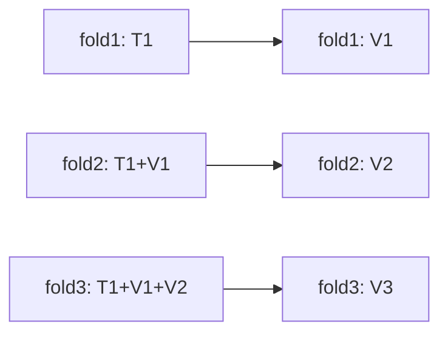
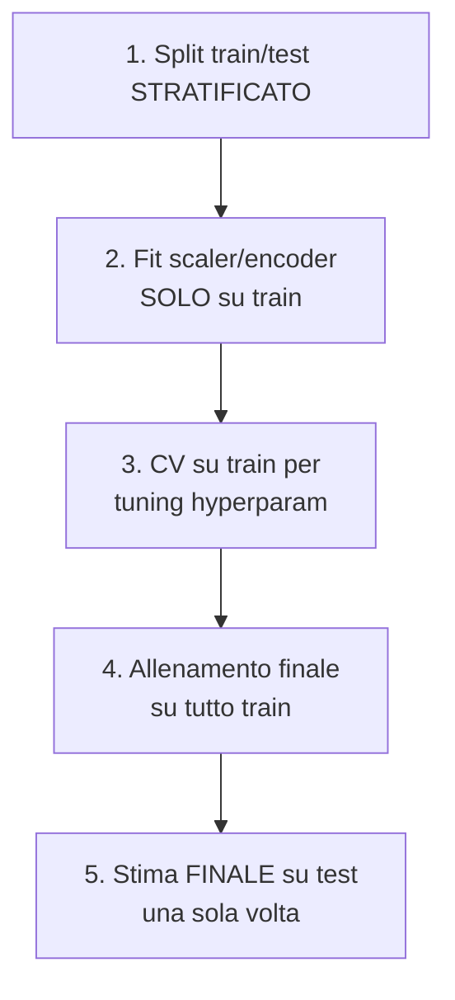

# Metriche, cross-validation, leakage

## Metriche per la regressione

| Metrica | Formula | Pro | Contro |
|---|---|---|---|
| **MSE** | $\frac{1}{n}\sum(y-\hat{y})^2$ | derivabile, MLE per normale | unità al quadrato; sensibile a outlier |
| **RMSE** | $\sqrt{\text{MSE}}$ | stessa unità di $y$ | sensibile a outlier |
| **MAE** | $\frac{1}{n}\sum\|y-\hat{y}\|$ | robusto, interpretabile | non derivabile in 0 |
| **MAPE** | $\frac{1}{n}\sum\|y-\hat{y}\|/\|y\|$ | percentuale | esplode con $y$ piccolo |
| **SMAPE** | versione simmetrica MAPE | gestisce 0 meglio | comunque tricky |
| **R²** | $1 - \text{SS}_\text{res}/\text{SS}_\text{tot}$ | scala invariata | può essere negativa |
| **Adjusted R²** | penalizza per #feature | confronto fra modelli | richiede $n, p$ |
| **Quantile loss** | pinball loss per quantili | per intervalli predittivi | meno standard |

**Quando preferire MAE a MSE**: quando ti aspetti outlier che NON vuoi enfatizzare. MSE dà 4× più peso a un errore di 2 rispetto a 1; MAE 2× soltanto.

**MAPE pitfall**: se $y = 0$ in test, MAPE = ∞. Usa SMAPE o MAE.

## Metriche per la classificazione

### Confusion matrix

Tutto parte da qui:

| | Predetto 0 | Predetto 1 |
|---|---|---|
| **Reale 0** | TN | FP |
| **Reale 1** | FN | TP |

```python
from sklearn.metrics import confusion_matrix, ConfusionMatrixDisplay
cm = confusion_matrix(y_true, y_pred)
ConfusionMatrixDisplay(cm, display_labels=['negative','positive']).plot()
```

### Le 5 metriche base

$$\text{Accuracy} = \frac{TP + TN}{TP + TN + FP + FN}$$

$$\text{Precision} = \frac{TP}{TP + FP}\quad \text{(quanti dei predetti positivi sono veri?)}$$

$$\text{Recall (Sensitivity)} = \frac{TP}{TP + FN}\quad \text{(quanti dei veri positivi catturo?)}$$

$$\text{Specificity} = \frac{TN}{TN + FP}\quad \text{(quanti dei veri negativi predico negativi?)}$$

$$F_1 = 2 \cdot \frac{\text{Precision} \cdot \text{Recall}}{\text{Precision} + \text{Recall}}$$

### F_beta

Generalizza F1 pesando recall:

$$F_\beta = (1 + \beta^2) \frac{P \cdot R}{\beta^2 P + R}$$

$\beta > 1$: recall importa di più. $\beta = 0.5$: precision di più.

### ROC e AUC

**ROC** (Receiver Operating Characteristic): plot TPR vs FPR al variare della soglia.

- TPR = Recall.
- FPR = $FP / (FP + TN)$ = 1 - Specificity.

**AUC** = area sotto la ROC. Interpretazione: probabilità che il modello assegni score più alto a un positivo che a un negativo random. $0.5$ = random, $1$ = perfetto.

> **AUC ingannevole su classi sbilanciate**: con 1% positivi, anche un modello mediocre può avere AUC 0.9 ma precision 0.05. Usa **AUC PR** o F1 in questi casi.

### Precision-Recall curve e AUC-PR

Plot P vs R al variare della soglia. Più informativa di ROC su classi sbilanciate.

```python
from sklearn.metrics import (roc_auc_score, average_precision_score,
                             roc_curve, precision_recall_curve, f1_score)
proba = model.predict_proba(X_te)[:, 1]
print("ROC AUC:", roc_auc_score(y_te, proba))
print("PR AUC:", average_precision_score(y_te, proba))
```

### Log loss

$$L = -\frac{1}{n} \sum_i [y_i \log p_i + (1 - y_i) \log(1 - p_i)]$$

Cattura non solo se la classe è giusta, ma quanto le **probabilità sono calibrate**. Più stretto delle metriche basate su soglia.

### Brier score

$$B = \frac{1}{n} \sum_i (p_i - y_i)^2$$

Anche per calibrazione, ma quadratica. Meno usato in pratica.

## Multi-classe

**Macro avg**: media non pesata delle metriche per classe. Tutte le classi contano uguale.
**Weighted avg**: pesata per supporto.
**Micro avg**: aggrega TP/FP/FN su tutte le classi prima di calcolare.

```python
from sklearn.metrics import classification_report
print(classification_report(y_te, y_pred))
```

> Su classi sbilanciate, **macro F1** è la metrica più informativa: rivela se il modello sta "ignorando" classi piccole.

## Cross-validation: i tipi che servono

### K-Fold

```python
from sklearn.model_selection import KFold
kf = KFold(n_splits=5, shuffle=True, random_state=0)
```

### Stratified K-Fold

Mantiene proporzioni di classe. **Sempre** per classification.

```python
from sklearn.model_selection import StratifiedKFold
skf = StratifiedKFold(n_splits=5, shuffle=True, random_state=0)
```

### Group K-Fold

Quando esempi appartengono a "gruppi" (es: user_id, paziente). Gli stessi gruppi non devono apparire in train e val.

```python
from sklearn.model_selection import GroupKFold
gkf = GroupKFold(n_splits=5)
for tr, va in gkf.split(X, y, groups=user_id):
    ...
```

### Time Series Split

Per dati temporali: train = passato, val = futuro. Mai mescolare.

```python
from sklearn.model_selection import TimeSeriesSplit
tscv = TimeSeriesSplit(n_splits=5, gap=7)   # gap di 7 giorni tra train e val
```



### Repeated K-Fold

Ripeti il K-fold con seed diversi per ridurre varianza della stima.

## Nested cross-validation

Quando devi sia **tuning hyperparametri** che **stima onesta di errore**:

```python
from sklearn.model_selection import GridSearchCV, cross_val_score
outer = StratifiedKFold(5, shuffle=True, random_state=0)
inner = StratifiedKFold(3, shuffle=True, random_state=0)
gs = GridSearchCV(model, param_grid, cv=inner, scoring='roc_auc')
scores = cross_val_score(gs, X, y, cv=outer, scoring='roc_auc')
print(f"AUC: {scores.mean():.3f} ± {scores.std():.3f}")
```

Costoso (5×3=15 fit), ma è la "true" cross-validation.

## Leakage: i modi in cui imbrogli te stesso

Ovvero: il test set "vede" il training set, l'accuracy si gonfia, in produzione il modello fa schifo.

### 1. Target leakage

Una feature è derivata dal target (esplicitamente o implicitamente):

- Prevedi "default su prestito" e usi `times_called_by_collection_dept` — è successo dopo il default!
- Prevedi cancellazione abbonamento e usi `last_login_date` — chi cancella spesso ha last_login = data cancellazione.

**Test**: feature con correlazione > 0.95 con target → indaga.

### 2. Train-test contamination

Scaler/imputer/PCA fittato su **tutto** il dataset prima dello split:

```python
# SBAGLIATO
X_scaled = StandardScaler().fit_transform(X)
X_tr, X_te = train_test_split(X_scaled, ...)

# GIUSTO
X_tr, X_te = train_test_split(X, ...)
sc = StandardScaler().fit(X_tr)
X_tr_s = sc.transform(X_tr); X_te_s = sc.transform(X_te)
```

Pipeline scikit-learn salva da questo bug automaticamente.

### 3. Group leakage

Stesso utente in train e in test (o stesso paziente, stesso documento). Cross-val "normale" non lo previene → usa GroupKFold.

### 4. Time leakage

Per time series: usare feature aggregate sul futuro nel passato. Es: media globale del target → contiene informazione "del futuro" sui campioni di passato.

### 5. Selection bias

Hai filtrato i dati in modo che il train test set non sia rappresentativo. Es: rimuovi righe con NaN — ma chi ha NaN è diverso da chi non li ha.

## Workflow tipo



## Esercizi

<details>
<summary>Esercizio 1 — Calcolo metriche a mano</summary>

Confusion matrix:

|   | Pred 0 | Pred 1 |
|---|---|---|
| Reale 0 | 80 | 5 |
| Reale 1 | 10 | 30 |

Calcola accuracy, precision, recall, F1.

**Soluzioni**:
- Accuracy = (80+30)/125 = 0.88
- Precision = 30/35 = 0.857
- Recall = 30/40 = 0.75
- F1 = 2 · 0.857 · 0.75 / (0.857 + 0.75) = 0.80
</details>

<details>
<summary>Esercizio 2 — AUC su classi sbilanciate</summary>

Genera un dataset con 1% positivi. Allena un modello mediocre, calcola accuracy, AUC, AP.

```python
from sklearn.datasets import make_classification
from sklearn.model_selection import train_test_split
from sklearn.linear_model import LogisticRegression
from sklearn.metrics import accuracy_score, roc_auc_score, average_precision_score

X, y = make_classification(20000, weights=[0.99, 0.01], random_state=0)
X_tr, X_te, y_tr, y_te = train_test_split(X, y, stratify=y, random_state=0)
m = LogisticRegression(max_iter=2000).fit(X_tr, y_tr)
proba = m.predict_proba(X_te)[:, 1]
pred = (proba > 0.5).astype(int)
print(f"Accuracy: {accuracy_score(y_te, pred):.3f}")
print(f"ROC AUC: {roc_auc_score(y_te, proba):.3f}")
print(f"PR AUC: {average_precision_score(y_te, proba):.3f}")
```

Spesso: accuracy 99%, ROC AUC 0.9, PR AUC 0.3. **PR AUC è la verità**.
</details>

<details>
<summary>Esercizio 3 — Trova il leakage</summary>

```python
from sklearn.preprocessing import StandardScaler
from sklearn.model_selection import cross_val_score
from sklearn.linear_model import LogisticRegression

# SBAGLIATO: scaling prima dello split
sc = StandardScaler()
X_s = sc.fit_transform(X)
score_wrong = cross_val_score(LogisticRegression(), X_s, y, cv=5).mean()

# CORRETTO: pipeline
from sklearn.pipeline import Pipeline
pipe = Pipeline([('sc', StandardScaler()), ('lr', LogisticRegression())])
score_right = cross_val_score(pipe, X, y, cv=5).mean()

print(score_wrong, score_right)
```

In pratica per StandardScaler la differenza è piccola, ma per imputer, PCA, target encoding può essere enorme.
</details>

<details>
<summary>Esercizio 4 — TimeSeriesSplit</summary>

```python
import numpy as np
import pandas as pd
from sklearn.model_selection import TimeSeriesSplit, cross_val_score
from sklearn.linear_model import Ridge

ts = pd.date_range('2020-01-01', '2024-12-31', freq='D')
y = np.sin(np.arange(len(ts))/30) + np.random.randn(len(ts))*0.1
X = pd.DataFrame({'t': np.arange(len(ts))})

tscv = TimeSeriesSplit(n_splits=5, gap=30)
scores = cross_val_score(Ridge(), X, y, cv=tscv, scoring='r2')
print(scores)
```

Cross-validation rispettosa del tempo: ogni fold il train è "prima" del val.
</details>

## Cosa portarti via

- Accuracy è ingannevole su classi sbilanciate. Usa F1, PR AUC.
- AUC ROC è soglia-indipendente. F1 è soglia-dipendente.
- Stratified per classi, Group per soggetti ripetuti, TimeSeries per tempo.
- Pipeline scikit-learn = preservazione automatica del separation train/test.
- Leakage = nemico numero 1. AUC > 0.95 sospetto.

Prossimo: bilanciamento classi e sbilanciamento.
