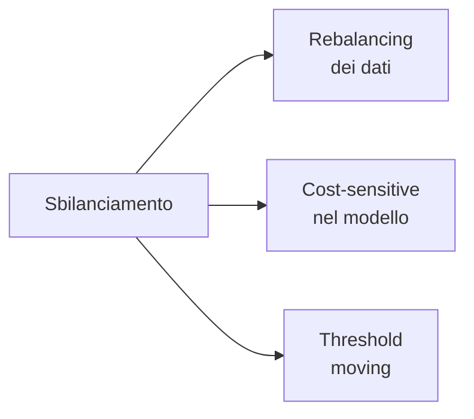

# Sbilanciamento di classi

## Il problema

Frodi: 0.1% delle transazioni. Cancro: 1% degli screening. Click su un ad: 2%. Default sui prestiti: 5%.

In questi casi:

- **Accuracy alta = inutile**: "predici sempre no" raggiunge 99.9%.
- Il modello tende a ignorare la classe minoritaria.
- Le metriche di default (anche AUC ROC) possono ingannare.

Tre famiglie di rimedi:



## 1. Rebalancing dei dati

### Random oversampling

Duplica esempi della classe minoritaria. Semplice ma overfitting (le copie sono identiche).

### Random undersampling

Scarta esempi della classe maggioritaria. Rapido ma perde informazione.

### SMOTE (Synthetic Minority Oversampling Technique)

Genera esempi sintetici nella classe minoritaria interpolando tra punti vicini:

```python
from imblearn.over_sampling import SMOTE
sm = SMOTE(sampling_strategy=0.3, random_state=0)
X_res, y_res = sm.fit_resample(X_tr, y_tr)
```

Variants: **SMOTE-NC** (gestisce categoriche), **ADASYN** (più dense dove la classe è già minoritaria), **BorderlineSMOTE** (focus su frontiere).

### Combinazione

```python
from imblearn.pipeline import Pipeline
from imblearn.over_sampling import SMOTE
from imblearn.under_sampling import RandomUnderSampler

pipe = Pipeline([
    ('smote', SMOTE(sampling_strategy=0.3)),
    ('under', RandomUnderSampler(sampling_strategy=0.5)),
    ('clf', LogisticRegression(max_iter=2000)),
])
```

> **Importante**: SMOTE / undersampling devono essere applicati **dentro la CV**, solo sul training fold. Usare `imblearn.Pipeline` (non `sklearn.Pipeline`) lo gestisce correttamente.

### Cluster-based undersampling (Tomek links, NearMiss)

Rimuove esempi "borderline" della classe maggioritaria, mantenendo solo i più rappresentativi.

```python
from imblearn.under_sampling import TomekLinks, NearMiss
```

## 2. Cost-sensitive learning

Modifica la loss per pesare di più gli errori sulla classe minoritaria.

### Class weight

Quasi tutti i modelli sklearn supportano `class_weight`:

```python
LogisticRegression(class_weight='balanced')
RandomForestClassifier(class_weight='balanced')
SVC(class_weight={0: 1, 1: 10})    # manuale: classe 1 conta 10x
```

`'balanced'` pesa inversamente alle frequenze: $w_k = n / (K \cdot n_k)$.

### Per XGBoost / LightGBM

Usa `scale_pos_weight`:

```python
xgb.XGBClassifier(scale_pos_weight=99)   # 99 negativi per ogni positivo
```

### Per gradient boosting custom

Si modifica direttamente la loss function.

## 3. Threshold moving

Spesso la soluzione **più semplice e più efficace**: invece di bilanciare il dataset, modifica la **soglia decisionale**.

```python
proba = model.predict_proba(X_val)[:, 1]
# scegli soglia che massimizza F1
from sklearn.metrics import precision_recall_curve, f1_score
import numpy as np
prec, rec, thr = precision_recall_curve(y_val, proba)
f1s = 2 * prec * rec / (prec + rec + 1e-9)
best_thr = thr[f1s[:-1].argmax()]
print(f"Soglia ottimale: {best_thr:.3f}")
y_pred = (proba >= best_thr).astype(int)
```

Vantaggi:
- Non cambia il modello.
- Calibrato sulla metrica che ti interessa.
- Veloce.

## Quale strategia funziona meglio?

Verità scomoda: **dipende**. Spesso threshold moving + class weight bastano. SMOTE e simili a volte peggiorano (introducono pattern artificiali).

Linee guida:

| Situazione | Prima cosa da provare |
|---|---|
| Pochi dati, sbilanciamento moderato | class_weight='balanced' |
| Molti dati, sbilanciamento forte | scale_pos_weight (boosting) + threshold |
| Boundary complesso | SMOTE + boosting |
| Costo errori molto asimmetrico | cost-sensitive + threshold |
| Estremo (<0.1%) | anomaly detection invece di classification |

## Quando NON è "sbilanciamento"

A volte ciò che chiami sbilanciamento è in realtà:

- **Classe minoritaria con poca segnale** — nemmeno il bilanciamento ti salva.
- **Etichette errate** sulla minoritaria — pulisci prima.
- **Concept drift** — il pattern positivo cambia nel tempo.

> Lezione: prima capisci **perché** il modello fallisce sulla classe minoritaria. Magari le feature non differenziano. In quel caso, oversampling non serve a niente.

## Cost-sensitive completo

Se conosci i costi reali ($C_{FP}, C_{FN}$), trova la soglia che minimizza il **costo totale atteso**:

$$\text{Costo} = C_{FP} \cdot \text{FP} + C_{FN} \cdot \text{FN}$$

```python
import numpy as np
from sklearn.metrics import confusion_matrix

C_fp, C_fn = 1, 100   # un FN costa 100x un FP
proba = model.predict_proba(X_val)[:, 1]
costs = []
ths = np.linspace(0, 1, 101)
for t in ths:
    tn, fp, fn, tp = confusion_matrix(y_val, (proba > t).astype(int)).ravel()
    costs.append(C_fp*fp + C_fn*fn)
best_t = ths[np.argmin(costs)]
```

Best practice in ambiti dove i costi sono noti (medicina, frodi, manutenzione predittiva).

## Esempio completo: fraud detection

```python
from sklearn.model_selection import train_test_split
from sklearn.metrics import (classification_report, roc_auc_score,
                             average_precision_score, precision_recall_curve)
import lightgbm as lgb
import numpy as np

X_tr, X_te, y_tr, y_te = train_test_split(X, y, test_size=0.2,
                                          stratify=y, random_state=0)
# class proportion: 0.5% fraud
scale_pos_weight = (y_tr == 0).sum() / (y_tr == 1).sum()

m = lgb.LGBMClassifier(
    n_estimators=2000, learning_rate=0.05,
    scale_pos_weight=scale_pos_weight,
    random_state=0
)
m.fit(X_tr, y_tr, eval_set=[(X_te, y_te)],
      callbacks=[lgb.early_stopping(100)])

proba = m.predict_proba(X_te)[:, 1]
print("PR AUC:", average_precision_score(y_te, proba))

# threshold per precision >= 0.5
prec, rec, thr = precision_recall_curve(y_te, proba)
mask = prec >= 0.5
idx = rec[mask].argmax()
best_t = thr[mask[:-1]][idx-1]
y_pred = (proba >= best_t).astype(int)
print(classification_report(y_te, y_pred))
```

## Esercizi

<details>
<summary>Esercizio 1 — Effetto class_weight</summary>

Su un dataset sbilanciato, confronta:
- `LogisticRegression()`
- `LogisticRegression(class_weight='balanced')`

Plotta P, R, F1 al variare della soglia.

```python
from sklearn.datasets import make_classification
from sklearn.linear_model import LogisticRegression
from sklearn.metrics import precision_recall_curve
import matplotlib.pyplot as plt

X, y = make_classification(20000, weights=[0.95, 0.05], random_state=0)
X_tr, X_te, y_tr, y_te = train_test_split(X, y, stratify=y, random_state=0)

for cw in [None, 'balanced']:
    m = LogisticRegression(max_iter=2000, class_weight=cw).fit(X_tr, y_tr)
    proba = m.predict_proba(X_te)[:, 1]
    p, r, _ = precision_recall_curve(y_te, proba)
    plt.plot(r, p, label=f"cw={cw}")
plt.legend(); plt.xlabel('recall'); plt.ylabel('precision')
```
</details>

<details>
<summary>Esercizio 2 — SMOTE dentro cross-validation</summary>

```python
from imblearn.pipeline import Pipeline
from imblearn.over_sampling import SMOTE
from sklearn.linear_model import LogisticRegression
from sklearn.model_selection import cross_val_score

# SBAGLIATO: SMOTE fuori dalla CV
X_res, y_res = SMOTE(random_state=0).fit_resample(X, y)
wrong = cross_val_score(LogisticRegression(), X_res, y_res, cv=5,
                        scoring='average_precision').mean()

# GIUSTO
pipe = Pipeline([('smote', SMOTE(random_state=0)),
                 ('lr', LogisticRegression())])
right = cross_val_score(pipe, X, y, cv=5,
                       scoring='average_precision').mean()

print("wrong:", wrong, "right:", right)
```

`wrong` è ottimisticamente gonfiato.
</details>

<details>
<summary>Esercizio 3 — Cost-aware threshold</summary>

Trova la soglia che minimizza un costo dove un falso negativo costa 100× un falso positivo.

```python
import numpy as np
def find_threshold(y_true, y_proba, c_fp=1, c_fn=100):
    ths = np.linspace(0, 1, 101)
    costs = []
    for t in ths:
        y_pred = (y_proba > t).astype(int)
        fp = ((y_pred==1) & (y_true==0)).sum()
        fn = ((y_pred==0) & (y_true==1)).sum()
        costs.append(c_fp*fp + c_fn*fn)
    return ths[np.argmin(costs)], min(costs)
```
</details>

<details>
<summary>Esercizio 4 — Quando SMOTE NON aiuta</summary>

Crea un dataset dove le classi sono **inseparabili** (feature random). SMOTE peggiorerà o non cambierà nulla.

```python
import numpy as np
from sklearn.linear_model import LogisticRegression
from sklearn.model_selection import cross_val_score
from imblearn.over_sampling import SMOTE
from imblearn.pipeline import Pipeline
rng = np.random.default_rng(0)
X = rng.standard_normal((5000, 5))
y = rng.choice([0, 1], 5000, p=[0.95, 0.05])  # totalmente random

base = LogisticRegression(max_iter=1000)
smt = Pipeline([('s', SMOTE()), ('lr', LogisticRegression(max_iter=1000))])
print(cross_val_score(base, X, y, cv=5, scoring='average_precision').mean())
print(cross_val_score(smt, X, y, cv=5, scoring='average_precision').mean())
```

Vicino al PR AUC = baseline = prevalenza (0.05). Niente da fare con dati senza segnale.
</details>

## Cosa portarti via

- Accuracy è inutile con sbilanciamento. PR AUC e F1 sono le tue metriche.
- class_weight / scale_pos_weight: prima cosa da provare, semplice e potente.
- SMOTE è uno strumento utile ma non magico; usalo dentro CV.
- Threshold moving spesso è la soluzione più efficace.
- Con costi noti, ottimizza per costo, non per F1.

Prossimo: hyperparameter tuning.
