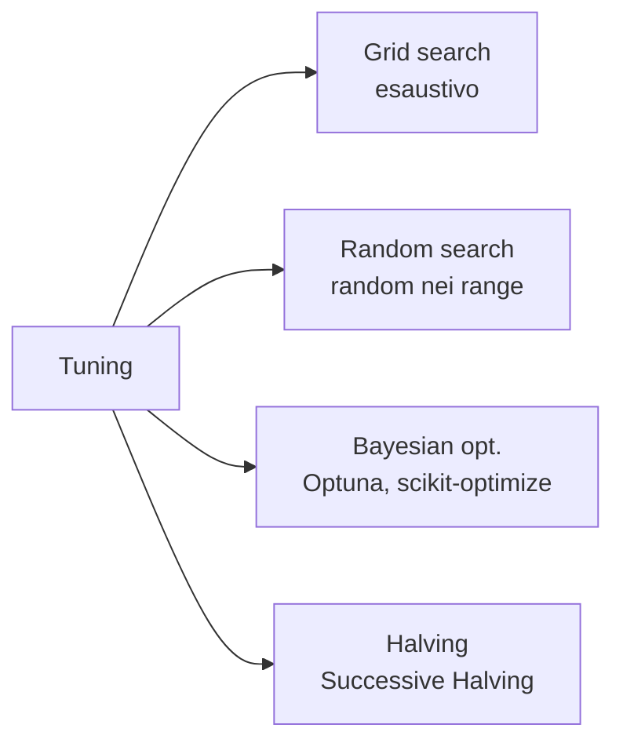
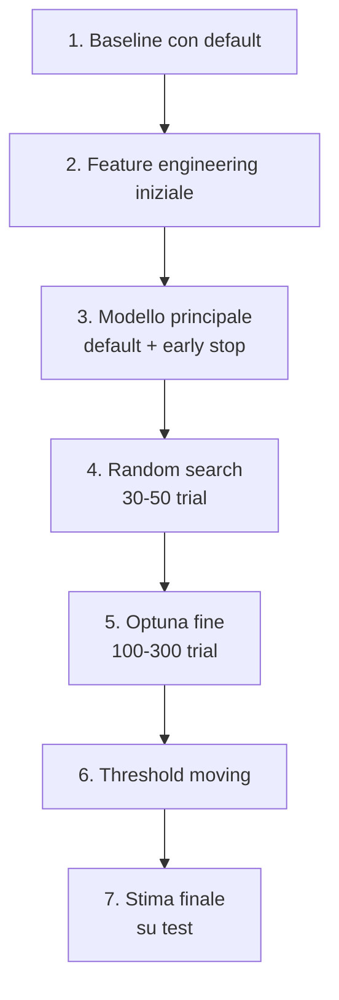

# Hyperparameter tuning

## Cosa sono gli iperparametri

I **parametri** vengono appresi durante il training (coefficienti regressione, pesi NN).
Gli **iperparametri** sono fissati prima del training: regolarizzazione, profondità albero, learning rate, numero di neuroni.

Iperparametri controllano la **capacità** del modello. Mal tarati = under/overfit. Ben tarati = sweet spot.

## Strategie principali



## Grid search

Prova tutte le combinazioni in una griglia.

```python
from sklearn.model_selection import GridSearchCV
param_grid = {
    'n_estimators': [100, 300, 500],
    'max_depth': [3, 5, 7, None],
    'min_samples_leaf': [1, 5, 20],
}
gs = GridSearchCV(RandomForestClassifier(random_state=0), param_grid,
                  cv=5, scoring='roc_auc', n_jobs=-1)
gs.fit(X, y)
print(gs.best_params_, gs.best_score_)
```

**Pro**: deterministico, vedi tutto.
**Contro**: $4 \times 4 \times 3 \times 5\text{-fold} = 240$ fit. Esplode con più parametri.

## Random search

Campiona casualmente dai range. Spesso **più efficiente** di grid:

> Bergstra & Bengio (2012): per la stessa "budget" di trial, random search trova migliori iperparametri di grid search.

Perché: in genere solo pochi iperparametri "contano". Grid spreca trial su varianti ininfluenti.

```python
from sklearn.model_selection import RandomizedSearchCV
from scipy.stats import randint, loguniform
param_distributions = {
    'n_estimators': randint(100, 1000),
    'max_depth': randint(3, 15),
    'min_samples_leaf': randint(1, 50),
    'max_features': loguniform(0.1, 1.0),
}
rs = RandomizedSearchCV(RandomForestClassifier(random_state=0),
                        param_distributions, n_iter=50, cv=5,
                        scoring='roc_auc', random_state=0, n_jobs=-1)
rs.fit(X, y)
```

## Bayesian optimization

Costruisce un **modello surrogato** della funzione "iperparams → metrica", usa quel modello per scegliere il prossimo trial. Convergenza spesso più rapida.

### Optuna (lo standard moderno)

```python
import optuna, lightgbm as lgb
from sklearn.model_selection import cross_val_score

def objective(trial):
    params = dict(
        n_estimators=trial.suggest_int('n_estimators', 100, 2000),
        learning_rate=trial.suggest_float('lr', 1e-3, 0.3, log=True),
        num_leaves=trial.suggest_int('num_leaves', 8, 256),
        max_depth=trial.suggest_int('max_depth', 3, 12),
        min_data_in_leaf=trial.suggest_int('min_data_in_leaf', 5, 100),
        feature_fraction=trial.suggest_float('feature_fraction', 0.4, 1.0),
        bagging_fraction=trial.suggest_float('bagging_fraction', 0.4, 1.0),
        bagging_freq=trial.suggest_int('bagging_freq', 0, 7),
        reg_lambda=trial.suggest_float('reg_lambda', 1e-3, 10, log=True),
        random_state=0, verbose=-1,
    )
    m = lgb.LGBMClassifier(**params)
    return cross_val_score(m, X, y, cv=5, scoring='roc_auc', n_jobs=-1).mean()

study = optuna.create_study(direction='maximize',
                            sampler=optuna.samplers.TPESampler(seed=0))
study.optimize(objective, n_trials=100, n_jobs=4)
print(study.best_params)
print(study.best_value)
```

### Vantaggi di Optuna

- API semplice: `trial.suggest_*` dichiara lo spazio.
- **Pruning**: stoppa trial poco promettenti early.
- Multi-objective optimization.
- Storage su DB per riprendere studi interrotti.
- Visualizzazione integrata.

```python
optuna.visualization.plot_optimization_history(study)
optuna.visualization.plot_param_importances(study)
optuna.visualization.plot_parallel_coordinate(study)
```

## Halving search (sklearn)

Successive Halving: alleno tutti i candidati su pochi dati, scarto i peggiori, raddoppio dati per i sopravvissuti, ripeto.

```python
from sklearn.experimental import enable_halving_search_cv  # noqa
from sklearn.model_selection import HalvingRandomSearchCV
hs = HalvingRandomSearchCV(estimator, param_distributions, factor=3,
                          random_state=0, n_jobs=-1)
hs.fit(X, y)
```

Molto efficiente per grandi dataset o modelli costosi.

## Quanto serve tunare?

Verità non popolare: per molti modelli, **i default + early stopping bastano** per il 90% del miglioramento. Iperparam tuning serio rende un altro 5–10%.

Suggerimento: prima fai **feature engineering**. Poi modelli baseline con default. **Solo dopo** tuning serio.

> Nei Kaggle Grandmaster, il tempo è speso 70% feature, 20% architettura/blending, 10% tuning. Non l'inverso.

## Cosa NON tunare

- **Soglia decisionale**: tunala separatamente in post-processing.
- **Cosa includere nelle feature**: usa feature selection, non grid search sulle colonne.
- **Random seed**: se i tuoi risultati cambiano molto col seed, hai un problema di varianza, non di tuning.

## Pitfall: tuning su test set

Lo dicemmo già ma è il modo più frequente di barare a sé stessi:

```python
# SBAGLIATO
gs.fit(X_train, y_train)
best = gs.best_estimator_
score = best.score(X_test, y_test)
# se ora ritocchi gli iperparam guardando il test set, ti stai contaminando
```

**Regola**: una sola valutazione finale sul test. Se l'AUC è 0.82 e ti sembra "basso", non tornare al tuning con info dal test. Quello diventa il tuo numero.

## Distribuzioni log-uniformi

Per parametri che vivono su scala logaritmica (learning rate, C, alpha):

```python
# corretto
trial.suggest_float('lr', 1e-5, 1, log=True)
# campiona uniformemente in log → equivalente di ampia esplorazione
```

Non:

```python
trial.suggest_float('lr', 1e-5, 1)
# campiona uniformemente in [0,1] → 99% dei trial intorno a 0.5, inutile
```

## Workflow tipo



## Esercizi

<details>
<summary>Esercizio 1 — Grid vs Random vs Optuna</summary>

Misura tempo e best score per i tre metodi con lo stesso budget di 30 trials.

```python
import time, optuna
from sklearn.datasets import load_breast_cancer
from sklearn.model_selection import GridSearchCV, RandomizedSearchCV, cross_val_score
from sklearn.ensemble import RandomForestClassifier
from scipy.stats import randint

X, y = load_breast_cancer(return_X_y=True)
base = RandomForestClassifier(random_state=0)

# grid
t = time.perf_counter()
grid = {'n_estimators': [100, 200, 500], 'max_depth': [3, 5, 7, 10],
        'min_samples_leaf': [1, 5, 20]}
gs = GridSearchCV(base, grid, cv=3, n_jobs=-1).fit(X, y)
print(f"Grid: {time.perf_counter()-t:.1f}s best={gs.best_score_:.3f}")

# random
t = time.perf_counter()
dist = {'n_estimators': randint(50, 500), 'max_depth': randint(2, 12),
        'min_samples_leaf': randint(1, 30)}
rs = RandomizedSearchCV(base, dist, n_iter=30, cv=3, random_state=0,
                        n_jobs=-1).fit(X, y)
print(f"Random: {time.perf_counter()-t:.1f}s best={rs.best_score_:.3f}")

# optuna
t = time.perf_counter()
def obj(tr):
    m = RandomForestClassifier(
        n_estimators=tr.suggest_int('n', 50, 500),
        max_depth=tr.suggest_int('d', 2, 12),
        min_samples_leaf=tr.suggest_int('l', 1, 30),
        random_state=0
    )
    return cross_val_score(m, X, y, cv=3, n_jobs=-1).mean()
study = optuna.create_study(direction='maximize')
optuna.logging.set_verbosity(optuna.logging.WARNING)
study.optimize(obj, n_trials=30)
print(f"Optuna: {time.perf_counter()-t:.1f}s best={study.best_value:.3f}")
```
</details>

<details>
<summary>Esercizio 2 — Iperparametri importanti via Optuna</summary>

```python
import optuna
optuna.visualization.plot_param_importances(study)
```

Il grafico mostra quali iperparam contribuiscono di più al miglioramento. Spesso 2–3 dominano.
</details>

<details>
<summary>Esercizio 3 — Pruning con Optuna</summary>

Per modelli con learning curve (boosting, NN), abbandona trial poco promettenti early:

```python
import optuna, lightgbm as lgb

def obj(trial):
    p = dict(
        n_estimators=2000,
        learning_rate=trial.suggest_float('lr', 1e-3, 0.3, log=True),
        max_depth=trial.suggest_int('d', 3, 10),
    )
    m = lgb.LGBMClassifier(**p, random_state=0, verbose=-1)
    pruning_cb = optuna.integration.LightGBMPruningCallback(trial, 'auc')
    m.fit(X_tr, y_tr, eval_set=[(X_val, y_val)],
          eval_metric='auc', callbacks=[pruning_cb, lgb.early_stopping(50)])
    proba = m.predict_proba(X_val)[:, 1]
    return roc_auc_score(y_val, proba)

study = optuna.create_study(direction='maximize', pruner=optuna.pruners.MedianPruner())
study.optimize(obj, n_trials=100)
```
</details>

## Cosa portarti via

- Random > Grid in genere.
- Optuna > Random in genere.
- Default + early stopping = 90% del miglioramento.
- Log-uniform per parametri di scala log.
- Tunare il test set = barare a sé stessi.
- 70% feature, 20% architettura, 10% tuning.

Prossimo: deep learning — reti neurali da zero.
