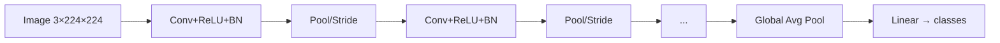
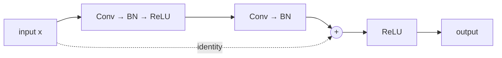

# CNN per computer vision

## Perché non MLP su immagini

Un'immagine 224×224×3 ha 150528 pixel. Un MLP first layer con 1024 neuroni avrebbe 150M parametri solo lì. Inefficiente.

Inoltre l'MLP non sfrutta **due proprietà** delle immagini:

1. **Località**: i pixel vicini sono correlati (un occhio è un cluster di pixel scuri vicini).
2. **Invarianza per traslazione**: un gatto a sinistra è un gatto anche a destra.

Le **CNN** (LeCun, 1989) sfruttano entrambe.

## Convoluzione

Un filtro (kernel) piccolo (es: 3×3 = 9 pesi) scorre sull'immagine producendo una **feature map**:

<div class="chart"><svg viewBox="0 0 400 180" xmlns="http://www.w3.org/2000/svg">
<g transform="translate(20,20)">
  <text x="55" y="-5" fill="#8b949e" font-size="11" text-anchor="middle">input 5×5</text>
  <g font-family="monospace" font-size="11" fill="#c9d1d9">
    <rect x="10" y="10" width="100" height="100" fill="none" stroke="#444"/>
    <line x1="30" y1="10" x2="30" y2="110" stroke="#333"/>
    <line x1="50" y1="10" x2="50" y2="110" stroke="#333"/>
    <line x1="70" y1="10" x2="70" y2="110" stroke="#333"/>
    <line x1="90" y1="10" x2="90" y2="110" stroke="#333"/>
    <line x1="10" y1="30" x2="110" y2="30" stroke="#333"/>
    <line x1="10" y1="50" x2="110" y2="50" stroke="#333"/>
    <line x1="10" y1="70" x2="110" y2="70" stroke="#333"/>
    <line x1="10" y1="90" x2="110" y2="90" stroke="#333"/>
    <rect x="10" y="10" width="60" height="60" fill="rgba(255,179,71,0.18)" stroke="#ffb347" stroke-width="2"/>
  </g>
</g>
<g transform="translate(170,30)">
  <text x="35" y="-5" fill="#8b949e" font-size="11" text-anchor="middle">kernel 3×3</text>
  <rect x="10" y="10" width="60" height="60" fill="rgba(122,162,255,0.15)" stroke="#7aa2ff" stroke-width="2"/>
  <line x1="30" y1="10" x2="30" y2="70" stroke="#333"/>
  <line x1="50" y1="10" x2="50" y2="70" stroke="#333"/>
  <line x1="10" y1="30" x2="70" y2="30" stroke="#333"/>
  <line x1="10" y1="50" x2="70" y2="50" stroke="#333"/>
</g>
<text x="260" y="80" fill="#8b949e" font-size="14">→</text>
<g transform="translate(290,30)">
  <text x="40" y="-5" fill="#8b949e" font-size="11" text-anchor="middle">output 3×3</text>
  <rect x="10" y="10" width="60" height="60" fill="rgba(94,226,196,0.15)" stroke="#5ee2c4" stroke-width="2"/>
  <line x1="30" y1="10" x2="30" y2="70" stroke="#333"/>
  <line x1="50" y1="10" x2="50" y2="70" stroke="#333"/>
  <line x1="10" y1="30" x2="70" y2="30" stroke="#333"/>
  <line x1="10" y1="50" x2="70" y2="50" stroke="#333"/>
</g>
</svg><div class="chart-caption">Kernel 3×3 scorre sull'input 5×5 (stride 1, no padding) producendo output 3×3.</div></div>

Formalmente:

$$y_{i,j} = \sum_{u,v} x_{i+u, j+v} \cdot w_{u,v} + b$$

Vantaggi:
- **Parameter sharing**: lo stesso kernel ovunque (vs MLP fully connected).
- **Local connectivity**: ogni output dipende solo da una piccola finestra.
- **Spatial invariance**: cambiare la posizione di un oggetto non cambia il kernel.

### Parametri di una conv layer

- **kernel_size** (es: 3, 5, 7)
- **stride** (default 1): di quanto scorre il kernel
- **padding** (es: 'same'): per mantenere dimensione output
- **dilation** (default 1): "salti" nel kernel
- **groups**: divisione per canali (group conv, depthwise conv)
- **in_channels / out_channels**: canali input/output

```python
import torch.nn as nn
conv = nn.Conv2d(in_channels=3, out_channels=64, kernel_size=3, padding=1)
# input (B, 3, H, W) → output (B, 64, H, W)
```

### Receptive field

Quanto "vede" un neurone dell'ultimo layer dell'input originale. Cresce stack-by-stack: 2 conv 3×3 = receptive 5×5. ResNet-50 finale ha receptive ~500×500 (più dell'input!).

## Pooling

Riduce la risoluzione spaziale (e quindi i calcoli) e introduce invarianza per piccoli shift.

- **Max pooling**: prende il max in una finestra (es: 2×2).
- **Average pooling**: media.
- **Global average pooling**: media su tutta la mappa.

```python
nn.MaxPool2d(kernel_size=2, stride=2)
nn.AdaptiveAvgPool2d((1, 1))   # global
```

> Le architetture moderne (ResNet, EfficientNet) usano poco pooling esplicito, preferendo strided convolutions.

## Architettura tipica



Mantra: profondità cresce, risoluzione spaziale scende.

## Architetture iconiche

### LeNet-5 (1998, LeCun)

Prima CNN funzionante. 7 layer, MNIST digits.

### AlexNet (2012, Krizhevsky)

Vinse ImageNet con 60M parametri, ReLU, dropout. Il momento "boom" del deep learning.

### VGG (2014)

Standardizza: solo 3×3 conv, blocchi profondi. VGG-16 / VGG-19. Pesante (138M parametri).

### Inception / GoogLeNet (2014)

Moduli inception: convoluzioni in parallelo a varie scale.

### ResNet (2015, He et al.)

Idea chiave: **skip connection**. Permette reti molto profonde (50, 101, 152 layer) senza vanishing gradient.



Il "trucco": $y = F(x) + x$. Se $F(x) \approx 0$, il modello impara l'identità — niente da imparare, niente da rovinare. Layer aggiuntivi possono solo aiutare.

```python
import torchvision.models as models
resnet50 = models.resnet50(weights='IMAGENET1K_V2')
```

### EfficientNet (2019)

Scala width, depth, e resolution insieme con compound scaling. Trade-off accuracy/FLOPs ottimo.

### Vision Transformer (ViT, 2020)

Trasferisce l'architettura Transformer alle immagini. Spezza l'immagine in patch, le tratta come sequenza. Stato dell'arte attuale insieme alle CNN moderne.

### Hybrid / 2024-2026

ConvNeXt (2022), Swin Transformer, EVA-02, DINOv2: convoluzioni e attention si mescolano. La distinzione "CNN vs Transformer" si è sfumata.

## Transfer learning: il superpotere

Allenare una CNN da zero su ImageNet richiede settimane di GPU. **Non lo fai mai**. Invece:

1. Prendi una rete pre-allenata (ResNet, ConvNeXt, ViT).
2. Sostituisci l'ultimo layer con uno per il tuo numero di classi.
3. Fine-tuning: alleni solo l'ultimo layer (rapido) o tutta la rete (più lento, miglior accuracy).

```python
import torchvision.models as models, torch.nn as nn
m = models.resnet50(weights='IMAGENET1K_V2')
# freeze tutto tranne ultimo
for p in m.parameters():
    p.requires_grad = False
m.fc = nn.Linear(m.fc.in_features, num_classes)   # nuovo head trainable
```

Per il fine-tuning completo, abilita tutto e usa learning rate piccolo (1e-4 o 1e-5).

> **timm** (`pip install timm`) è la libreria di Ross Wightman con centinaia di modelli pre-allenati e migliori delle versioni torchvision base.

```python
import timm
m = timm.create_model('convnext_base.fb_in22k_ft_in1k', pretrained=True, num_classes=10)
```

## Data augmentation

Critico per generalizzazione su poche immagini:

```python
from torchvision import transforms

train_tf = transforms.Compose([
    transforms.RandomResizedCrop(224),
    transforms.RandomHorizontalFlip(),
    transforms.ColorJitter(0.2, 0.2, 0.2),
    transforms.RandAugment(),
    transforms.ToTensor(),
    transforms.Normalize(mean=[0.485, 0.456, 0.406],
                         std=[0.229, 0.224, 0.225]),
])
val_tf = transforms.Compose([
    transforms.Resize(256),
    transforms.CenterCrop(224),
    transforms.ToTensor(),
    transforms.Normalize(mean=[0.485, 0.456, 0.406],
                         std=[0.229, 0.224, 0.225]),
])
```

Tecniche avanzate: **Mixup**, **CutMix**, **AugMix**.

## Task tipici

| Task | Loss | Architettura tipica |
|---|---|---|
| Classification | CrossEntropy | ResNet, EfficientNet, ViT |
| Detection | Smooth L1 + Classif. | YOLO, Faster R-CNN, DETR |
| Segmentation | Dice + CE | U-Net, DeepLab, Mask2Former |
| OCR | CTC / sequence | CRNN, Transformer OCR |
| Self-supervised | Contrastive / mask | DINO, MAE, SimCLR |

## Esercizi

<details>
<summary>Esercizio 1 — Conv2d a mano</summary>

Implementa la convoluzione 2D senza PyTorch:

```python
import numpy as np
def conv2d(x, k):
    h, w = x.shape
    kh, kw = k.shape
    out_h, out_w = h - kh + 1, w - kw + 1
    out = np.zeros((out_h, out_w))
    for i in range(out_h):
        for j in range(out_w):
            out[i, j] = (x[i:i+kh, j:j+kw] * k).sum()
    return out

x = np.arange(25).reshape(5, 5).astype(float)
k = np.array([[0, -1, 0], [-1, 4, -1], [0, -1, 0]])   # Laplacian: edge detect
print(conv2d(x, k))
```
</details>

<details>
<summary>Esercizio 2 — CIFAR-10 con ResNet</summary>

```python
import torch, torch.nn as nn
from torchvision import datasets, transforms, models
from torch.utils.data import DataLoader

device = 'cuda' if torch.cuda.is_available() else 'cpu'

tf = transforms.Compose([
    transforms.Resize(64),
    transforms.ToTensor(),
    transforms.Normalize((0.5,)*3, (0.5,)*3),
])
tr = datasets.CIFAR10('.', train=True, download=True, transform=tf)
te = datasets.CIFAR10('.', train=False, transform=tf)
trl = DataLoader(tr, batch_size=128, shuffle=True, num_workers=4)
tel = DataLoader(te, batch_size=256, num_workers=4)

m = models.resnet18(weights=None, num_classes=10).to(device)
opt = torch.optim.AdamW(m.parameters(), lr=1e-3)
loss_fn = nn.CrossEntropyLoss()

for e in range(5):
    m.train()
    for x, y in trl:
        x, y = x.to(device), y.to(device)
        opt.zero_grad()
        loss_fn(m(x), y).backward(); opt.step()
    m.eval()
    with torch.no_grad():
        c = sum((m(x.to(device)).argmax(1) == y.to(device)).sum().item() for x, y in tel)
    print(f"epoch {e+1}: {c/len(te):.3f}")
```
</details>

<details>
<summary>Esercizio 3 — Transfer learning su dataset custom</summary>

Carica un classificatore ResNet pre-allenato, sostituisci l'ultimo layer per N classi del tuo dataset, fine-tuning di tutto con lr basso:

```python
m = models.resnet50(weights='IMAGENET1K_V2')
m.fc = nn.Linear(m.fc.in_features, n_classes)
opt = torch.optim.AdamW([
    {'params': [p for n,p in m.named_parameters() if 'fc' not in n], 'lr': 1e-4},
    {'params': m.fc.parameters(), 'lr': 1e-3},
])
```

Learning rate più alto sull'ultimo layer (deve adattarsi al nuovo task), più basso sui layer pre-allenati.
</details>

<details>
<summary>Esercizio 4 — Visualizza i filtri di un'CNN</summary>

```python
import matplotlib.pyplot as plt
filters = m.conv1.weight.data    # (64, 3, 7, 7) per ResNet
filters = (filters - filters.min()) / (filters.max() - filters.min())
fig, ax = plt.subplots(8, 8, figsize=(8, 8))
for i in range(64):
    ax[i//8][i%8].imshow(filters[i].permute(1, 2, 0))
    ax[i//8][i%8].axis('off')
```

I primi layer imparano filtri "edge detector" e "color blob". I layer profondi sono più astratti.
</details>

## Cosa portarti via

- Conv = filtri locali con parameter sharing → adatti a immagini.
- ResNet con skip connections = base moderna.
- Transfer learning > training from scratch al 99%.
- Augmentation è essenziale.
- timm è il tuo amico.
- Vision Transformer è anche da considerare.

Prossimo: RNN, LSTM, Transformer per sequenze.
