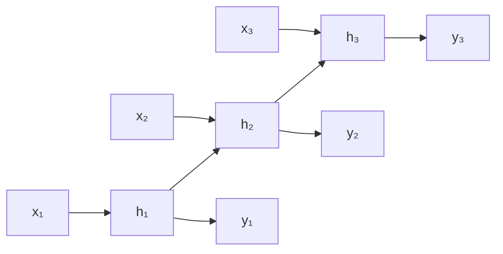

# RNN, LSTM, GRU per sequenze

## Cosa cambia con le sequenze

Testo, audio, time series, DNA: dati dove **l'ordine conta**. Un MLP/CNN non sa ricordare il passato. Le RNN sì.

## RNN base

A ogni passo $t$, prendi input $x_t$ e stato precedente $h_{t-1}$, produci nuovo stato $h_t$ e (opzionalmente) output $y_t$:

$$h_t = \tanh(W_h h_{t-1} + W_x x_t + b)$$
$$y_t = W_y h_t + b_y$$



Pesi $W_h, W_x$ sono condivisi su tutti i timestep (parameter sharing nel tempo).

## Tipi di task con RNN

- **many-to-one**: classificazione frase → categoria.
- **one-to-many**: image captioning, generazione musica.
- **many-to-many same length**: POS tagging.
- **many-to-many encoder-decoder**: traduzione, summarization.

## Il problema del vanishing gradient

Il backprop attraverso T timestep moltiplica T volte i gradienti via chain rule:

$$\frac{\partial L}{\partial h_0} = \prod_{t=1}^T \frac{\partial h_t}{\partial h_{t-1}}$$

Con tanh i derivati sono $\leq 1$ → prodotto vanisce esponenzialmente. RNN base **non impara dipendenze lunghe** (oltre ~10 step).

## LSTM (Long Short-Term Memory, 1997)

Hochreiter & Schmidhuber introducono uno stato di memoria $c_t$ con **gate** che decidono cosa ricordare e cosa scartare.

Le 4 equazioni che ne sono il cuore:

$$f_t = \sigma(W_f [h_{t-1}, x_t] + b_f) \quad \text{forget gate}$$
$$i_t = \sigma(W_i [h_{t-1}, x_t] + b_i) \quad \text{input gate}$$
$$\tilde{c}_t = \tanh(W_c [h_{t-1}, x_t] + b_c) \quad \text{candidato cella}$$
$$o_t = \sigma(W_o [h_{t-1}, x_t] + b_o) \quad \text{output gate}$$

E le 2 aggiornamenti:

$$c_t = f_t \odot c_{t-1} + i_t \odot \tilde{c}_t$$
$$h_t = o_t \odot \tanh(c_t)$$

Il punto chiave: $c_t$ è una **somma**, non un prodotto, della cella precedente. Niente vanishing per la cella di memoria.

```python
import torch.nn as nn
lstm = nn.LSTM(input_size=64, hidden_size=128, num_layers=2,
               batch_first=True, dropout=0.2, bidirectional=False)
x = torch.randn(32, 50, 64)         # (batch, seq, features)
out, (h, c) = lstm(x)
# out: (32, 50, 128)
# h, c: (num_layers, batch, hidden)
```

## GRU (Gated Recurrent Unit, 2014)

Versione più semplice di LSTM, due gate invece di tre:

$$z_t = \sigma(W_z [h_{t-1}, x_t])\quad \text{update gate}$$
$$r_t = \sigma(W_r [h_{t-1}, x_t])\quad \text{reset gate}$$
$$\tilde{h}_t = \tanh(W [r_t \odot h_{t-1}, x_t])$$
$$h_t = (1 - z_t) \odot h_{t-1} + z_t \odot \tilde{h}_t$$

Meno parametri di LSTM, prestazioni spesso simili.

```python
gru = nn.GRU(input_size=64, hidden_size=128, batch_first=True)
```

## Bidirezionali

Processano la sequenza avanti **e** indietro, concatenando gli stati:

```python
bilstm = nn.LSTM(64, 128, bidirectional=True, batch_first=True)
out, _ = bilstm(x)
# out: (32, 50, 256)   # 128 forward + 128 backward
```

Per task non causali (POS tagging, NER) sono migliori. Per generazione (testo, time series) no — il "futuro" non si può guardare.

## Padding e packing

Sequenze hanno lunghezza variabile. Si **paddano** alla stessa lunghezza nel batch, ma si **packano** per non sprecare calcolo:

```python
from torch.nn.utils.rnn import pad_sequence, pack_padded_sequence, pad_packed_sequence

seqs = [torch.randn(l, 64) for l in [10, 20, 15]]
padded = pad_sequence(seqs, batch_first=True)   # (3, 20, 64)
lens = torch.tensor([10, 20, 15])

packed = pack_padded_sequence(padded, lens, batch_first=True, enforce_sorted=False)
out_packed, _ = lstm(packed)
out, _ = pad_packed_sequence(out_packed, batch_first=True)
```

## Esempio: sentiment classification

```python
import torch, torch.nn as nn

class TextClassifier(nn.Module):
    def __init__(self, vocab, emb=128, hidden=256, n_classes=2):
        super().__init__()
        self.emb = nn.Embedding(vocab, emb, padding_idx=0)
        self.rnn = nn.LSTM(emb, hidden, num_layers=2, dropout=0.3,
                           batch_first=True, bidirectional=True)
        self.fc = nn.Linear(hidden*2, n_classes)

    def forward(self, x, lengths):
        # x: (B, T) int
        e = self.emb(x)
        packed = nn.utils.rnn.pack_padded_sequence(
            e, lengths.cpu(), batch_first=True, enforce_sorted=False)
        _, (h, _) = self.rnn(packed)
        # h: (num_layers*2, B, hidden) — prendi gli stati finali bi-direz dell'ultimo layer
        h_final = torch.cat([h[-2], h[-1]], dim=1)  # (B, hidden*2)
        return self.fc(h_final)
```

## Limitazioni intrinseche

- **Calcolo sequenziale**: non parallelizzabile su GPU come CNN/Transformer.
- **Dipendenze lunghissime**: anche LSTM ha difficoltà oltre ~500 timestep.
- **Bottleneck del singolo vector**: in encoder-decoder, tutta la storia entra in un solo $h$.

Queste limitazioni hanno portato all'**attention** e poi al **Transformer**.

## Quando ancora usare RNN/LSTM nel 2026

- **Streaming inference** real-time (1 step alla volta, no batch).
- **Modelli piccoli** su edge devices (Transformer è memory-hungry).
- **Time series tradizionali** dove il pattern è breve.
- **Sequenze biologiche** quando la dimensione è modesta.

Per quasi tutto il resto: Transformer.

## Esercizi

<details>
<summary>Esercizio 1 — RNN da zero in NumPy</summary>

```python
import numpy as np
rng = np.random.default_rng(0)
def relu(x): return np.maximum(0, x)

T, d_in, d_h = 20, 5, 16
W_x = rng.standard_normal((d_in, d_h)) * 0.1
W_h = rng.standard_normal((d_h, d_h)) * 0.1
b = np.zeros(d_h)
x_seq = rng.standard_normal((T, d_in))
h = np.zeros(d_h)
for t in range(T):
    h = np.tanh(x_seq[t] @ W_x + h @ W_h + b)
print(h)
```

Estensione: implementa anche l'output e il backprop manuale (lungo, ma istruttivo).
</details>

<details>
<summary>Esercizio 2 — Sentiment IMDB con LSTM</summary>

Usa torchtext o HuggingFace per IMDB. Modello: embedding 100D + biLSTM 128 + linear. Target: F1 ≥ 0.85.

```python
# pseudo:
from datasets import load_dataset
ds = load_dataset('imdb')
# tokenizza, costruisci vocab, batch, allena
```

Sentiment IMDB è il "Hello World" di NLP.
</details>

<details>
<summary>Esercizio 3 — Forecast time series</summary>

Predici il prossimo valore di una serie temporale (es: passeggeri aerei) usando un LSTM:

```python
import torch
import torch.nn as nn
import numpy as np

# load Airpassengers o simulato
y = np.cos(np.linspace(0, 30, 300)) + np.random.normal(0, 0.1, 300)

# crea (X, y) con finestra
def windows(y, w=12):
    X, t = [], []
    for i in range(len(y)-w):
        X.append(y[i:i+w]); t.append(y[i+w])
    return np.array(X).reshape(-1, w, 1), np.array(t)

X, t = windows(y)
X = torch.tensor(X, dtype=torch.float32)
t = torch.tensor(t, dtype=torch.float32)

class M(nn.Module):
    def __init__(self):
        super().__init__()
        self.lstm = nn.LSTM(1, 32, batch_first=True)
        self.fc = nn.Linear(32, 1)
    def forward(self, x):
        out, _ = self.lstm(x)
        return self.fc(out[:, -1]).squeeze()

m = M()
opt = torch.optim.AdamW(m.parameters(), lr=1e-2)
for e in range(50):
    pred = m(X)
    loss = ((pred - t)**2).mean()
    opt.zero_grad(); loss.backward(); opt.step()
    if e%10==0: print(e, loss.item())
```
</details>

## Cosa portarti via

- RNN base: vanishing gradient, max ~10 step.
- LSTM/GRU: gating risolve il vanishing, gestiscono ~100-500 step.
- Bidirezionali per task non-causali, normali per generazione.
- Padding + packing per batch con sequenze di lunghezza variabile.
- 2026: Transformer ha quasi soppiantato RNN, ma RNN sopravvive per streaming e edge.

Prossimo: Transformer e attention.
