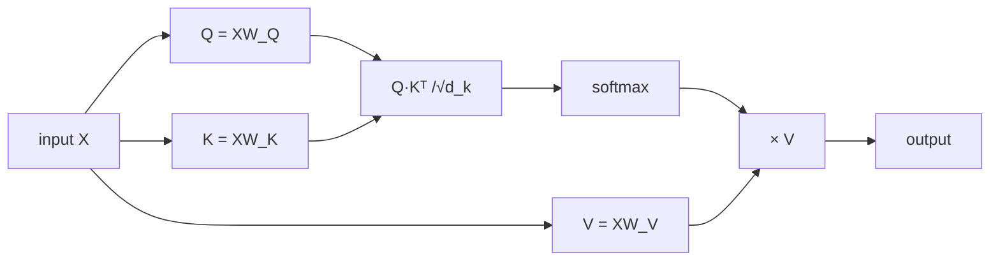
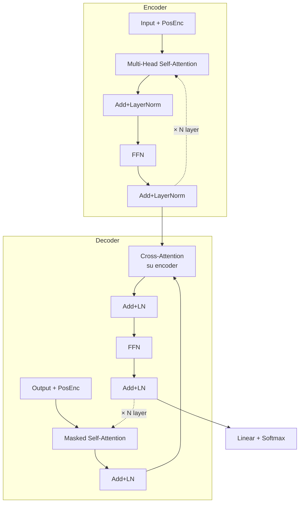

# Transformer e attention

## Il momento "Attention is all you need" (Vaswani et al., 2017)

I Transformer hanno rivoluzionato il deep learning. Tutto ciò che chiamiamo "AI" oggi — ChatGPT, Claude, DALL·E, Stable Diffusion, Whisper — è basato su Transformer.

L'idea centrale: **non serve la ricorrenza**. Con il giusto meccanismo (attention), si può processare una sequenza tutta in parallelo.

## Scaled dot-product attention

Per ogni elemento della sequenza, si chiede: "su quali altri elementi devo concentrarmi?".

Tre proiezioni dell'input:

$$Q = X W_Q \quad K = X W_K \quad V = X W_V$$

dove $X \in \mathbb{R}^{n \times d}$ e $W_Q, W_K, W_V \in \mathbb{R}^{d \times d_k}$.

Attention:

$$\text{Attention}(Q, K, V) = \text{softmax}\left(\frac{Q K^T}{\sqrt{d_k}}\right) V$$

**Interpretazione**:

- $Q K^T \in \mathbb{R}^{n \times n}$: prodotto scalare di ogni query con ogni key → punteggi di "attenzione".
- $\sqrt{d_k}$: normalizzazione che evita che softmax saturi.
- softmax → distribuzione di probabilità su tutti gli elementi.
- moltiplichi per $V$: weighted sum dei valori.



```python
import torch, math
import torch.nn.functional as F

def attention(Q, K, V):
    d_k = Q.size(-1)
    scores = Q @ K.transpose(-2, -1) / math.sqrt(d_k)
    weights = F.softmax(scores, dim=-1)
    return weights @ V
```

### Attention illustrata su una frase

Frase: "il gatto mangia". 3 token. Ogni token guarda gli altri e si chiede "quanto sono rilevante per *me*?". Il risultato è una matrice $3 \times 3$ di **pesi di attenzione** (righe = "chi sta guardando", colonne = "chi viene guardato"):

<div class="chart"><svg viewBox="0 0 460 220" xmlns="http://www.w3.org/2000/svg">
<text x="230" y="14" fill="#7aa2ff" font-size="12" text-anchor="middle">Matrice di attenzione (output di softmax(QKᵀ/√d))</text>

<text x="60" y="50" fill="#8b949e" font-size="11">→ il</text>
<text x="60" y="100" fill="#8b949e" font-size="11">→ gatto</text>
<text x="60" y="150" fill="#8b949e" font-size="11">→ mangia</text>

<text x="130" y="30" fill="#8b949e" font-size="11" text-anchor="middle">il</text>
<text x="220" y="30" fill="#8b949e" font-size="11" text-anchor="middle">gatto</text>
<text x="310" y="30" fill="#8b949e" font-size="11" text-anchor="middle">mangia</text>

<rect x="100" y="40" width="60" height="20" fill="rgba(122,162,255,0.85)"/>
<rect x="190" y="40" width="60" height="20" fill="rgba(122,162,255,0.10)"/>
<rect x="280" y="40" width="60" height="20" fill="rgba(122,162,255,0.05)"/>
<text x="130" y="55" fill="#fff" font-size="10" text-anchor="middle">0.85</text>
<text x="220" y="55" fill="#7aa2ff" font-size="10" text-anchor="middle">0.10</text>
<text x="310" y="55" fill="#7aa2ff" font-size="10" text-anchor="middle">0.05</text>

<rect x="100" y="90" width="60" height="20" fill="rgba(122,162,255,0.15)"/>
<rect x="190" y="90" width="60" height="20" fill="rgba(122,162,255,0.65)"/>
<rect x="280" y="90" width="60" height="20" fill="rgba(122,162,255,0.20)"/>
<text x="130" y="105" fill="#7aa2ff" font-size="10" text-anchor="middle">0.15</text>
<text x="220" y="105" fill="#fff" font-size="10" text-anchor="middle">0.65</text>
<text x="310" y="105" fill="#7aa2ff" font-size="10" text-anchor="middle">0.20</text>

<rect x="100" y="140" width="60" height="20" fill="rgba(122,162,255,0.05)"/>
<rect x="190" y="140" width="60" height="20" fill="rgba(122,162,255,0.45)"/>
<rect x="280" y="140" width="60" height="20" fill="rgba(122,162,255,0.50)"/>
<text x="130" y="155" fill="#7aa2ff" font-size="10" text-anchor="middle">0.05</text>
<text x="220" y="155" fill="#fff" font-size="10" text-anchor="middle">0.45</text>
<text x="310" y="155" fill="#fff" font-size="10" text-anchor="middle">0.50</text>

<text x="230" y="195" fill="#8b949e" font-size="11" text-anchor="middle">ogni riga somma a 1 (softmax)</text>
<text x="230" y="210" fill="#ffb347" font-size="11" text-anchor="middle">"mangia" guarda fortemente "gatto" (chi mangia) e se stesso</text>
</svg><div class="chart-caption">Self-attention: una matrice di pesi che dice "quanto ogni token si interessa a ogni altro".</div></div>

L'output per il token "mangia" sarà:

$$\text{out}_\text{mangia} = 0.05 \cdot V_\text{il} + 0.45 \cdot V_\text{gatto} + 0.50 \cdot V_\text{mangia}$$

dove $V_i$ sono i "value vector" dei token. Il modello impara $W_Q, W_K, W_V$ in modo che queste somme pesate producano rappresentazioni utili per il task finale (classificazione, generation, ecc.).

> **Perché è geniale**: la matrice si calcola in **un'unica moltiplicazione matriciale** $QK^T$, parallelizzabile su GPU. L'RNN doveva farlo in 3 step sequenziali. Da qui la rivoluzione del 2017.

## Multi-head attention

Un singolo attention ha capacità limitata. Si **proietta in più "teste"** indipendenti, ognuna apprende relazioni diverse:

$$\text{MultiHead}(Q,K,V) = \text{Concat}(\text{head}_1, \dots, \text{head}_h) W^O$$

con ogni $\text{head}_i = \text{Attention}(QW_i^Q, KW_i^K, VW_i^V)$.

```python
mha = torch.nn.MultiheadAttention(embed_dim=512, num_heads=8, batch_first=True)
out, attn = mha(query, key, value)
```

## Posizioni: positional encoding

Attention è **permutation-invariant**: senza informazione di posizione, "il cane mangia" e "mangia il cane" sono uguali. Si aggiungono encoding posizionali agli embedding:

**Sinusoidali** (originale Transformer):

$$PE_{pos, 2i} = \sin(pos / 10000^{2i/d}), \quad PE_{pos, 2i+1} = \cos(pos / 10000^{2i/d})$$

**Learned**: una matrice di embedding posizionale appresa.

**RoPE** (Rotary Position Embedding, GPT-NeoX, Llama): ruota Q e K nello spazio in base alla posizione. Diventato lo standard moderno.

## L'architettura completa: Transformer Encoder/Decoder



Block del Transformer "encoder":

```python
class TransformerBlock(nn.Module):
    def __init__(self, d=512, h=8, ff=2048, drop=0.1):
        super().__init__()
        self.attn = nn.MultiheadAttention(d, h, dropout=drop, batch_first=True)
        self.norm1 = nn.LayerNorm(d)
        self.ffn = nn.Sequential(nn.Linear(d, ff), nn.GELU(), nn.Linear(ff, d))
        self.norm2 = nn.LayerNorm(d)
        self.drop = nn.Dropout(drop)

    def forward(self, x, mask=None):
        a, _ = self.attn(x, x, x, attn_mask=mask)
        x = self.norm1(x + self.drop(a))           # residual + LN
        f = self.ffn(x)
        x = self.norm2(x + self.drop(f))
        return x
```

> Nota: **residual connection** + **LayerNorm** ovunque. Stesso pattern delle ResNet.

## Varianti famose

| Modello | Tipo | Anno | Note |
|---|---|---|---|
| **BERT** | Encoder only | 2018 | Masked LM, bidirezionale, embedding |
| **GPT-2 / GPT-3** | Decoder only | 2019/2020 | Autoregressive, generation |
| **T5** | Encoder-Decoder | 2019 | Tutto come text-to-text |
| **ViT** | Encoder only | 2020 | Per immagini (patch tokens) |
| **GPT-4 / Claude / Gemini** | Decoder only scaled | 2023+ | Stato dell'arte LLM |
| **Whisper** | Encoder-Decoder | 2022 | Speech-to-text |

## Encoder-only (BERT-like)

Usato per: classificazione, embedding, NER, sentence similarity.

Pre-training: **Masked Language Modeling** — mascherare 15% dei token, prevederli.

## Decoder-only (GPT-like)

Usato per: generazione, completamento, instruction-following.

Pre-training: **Next Token Prediction** — autoregressive.

L'attention è "masked" per non guardare i token futuri durante il training.

## Encoder-Decoder (T5, BART)

Usato per: traduzione, summarization, question answering.

## Complessità computazionale

Attention è $O(n^2 d)$ dove $n$ è la lunghezza della sequenza. Quadratica → con sequenze lunghe esplode.

Soluzioni moderne (2024-2026):
- **Flash Attention**: ottimizzazione di memoria e speed.
- **Sparse / Local Attention**: solo finestre locali.
- **Linear Attention**: approssimazioni con complessità $O(n)$.
- **State Space Models** (Mamba, S4, S6): alternativa ai Transformer, lineare in $n$.

## HuggingFace transformers

Il modo pratico per usare i Transformer pre-allenati:

```bash
pip install transformers datasets
```

```python
from transformers import AutoTokenizer, AutoModel
tok = AutoTokenizer.from_pretrained("bert-base-multilingual-cased")
model = AutoModel.from_pretrained("bert-base-multilingual-cased")

inputs = tok("Il cane mangia.", return_tensors='pt')
out = model(**inputs)
emb = out.last_hidden_state    # (1, n_tokens, 768)
```

### Pipeline per task comuni

```python
from transformers import pipeline
sentiment = pipeline('sentiment-analysis')
sentiment("La data science è bellissima.")
# [{'label': 'POSITIVE', 'score': 0.9994}]

translator = pipeline('translation', model='Helsinki-NLP/opus-mt-it-en')
translator("Buongiorno, come stai?")
```

### Fine-tuning su un task

```python
from transformers import AutoTokenizer, AutoModelForSequenceClassification, Trainer, TrainingArguments
from datasets import load_dataset

ds = load_dataset('imdb').shuffle(seed=0)
tok = AutoTokenizer.from_pretrained("distilbert-base-uncased")
def tokenize(b): return tok(b['text'], truncation=True, max_length=256)
ds = ds.map(tokenize, batched=True)
ds.set_format('torch', columns=['input_ids','attention_mask','label'])

model = AutoModelForSequenceClassification.from_pretrained("distilbert-base-uncased", num_labels=2)

args = TrainingArguments(
    output_dir='./out', evaluation_strategy='epoch',
    per_device_train_batch_size=16, num_train_epochs=2,
    learning_rate=2e-5, fp16=True,
)
trainer = Trainer(model=model, args=args,
                  train_dataset=ds['train'].select(range(5000)),
                  eval_dataset=ds['test'].select(range(1000)))
trainer.train()
```

## Esercizi

<details>
<summary>Esercizio 1 — Attention manuale</summary>

```python
import torch
import torch.nn.functional as F

# 3 token, dimensione 4
X = torch.tensor([[1.,0,1,0],[0,1,0,1],[1,1,0,0]])
W_q = torch.eye(4); W_k = torch.eye(4); W_v = torch.eye(4)

Q = X @ W_q; K = X @ W_k; V = X @ W_v
scores = Q @ K.T / 2.0    # √4 = 2
weights = F.softmax(scores, dim=-1)
print(weights)
output = weights @ V
print(output)
```

Esercizio: per quali coppie l'attention è massima? Verifica intuitivamente.
</details>

<details>
<summary>Esercizio 2 — Embedding di frasi</summary>

```python
from sentence_transformers import SentenceTransformer
model = SentenceTransformer('paraphrase-multilingual-MiniLM-L12-v2')
sents = ["Il gatto dorme.", "Un felino riposa.", "Mangio una mela."]
emb = model.encode(sents)
# similarità coseno
import numpy as np
def cos(a, b): return a @ b / (np.linalg.norm(a)*np.linalg.norm(b))
print(cos(emb[0], emb[1]))   # alto
print(cos(emb[0], emb[2]))   # basso
```
</details>

<details>
<summary>Esercizio 3 — Mini-GPT da zero</summary>

Implementa un piccolo Transformer decoder-only per char-level LM su un testo qualsiasi. Karpathy ha un video "Let's build GPT" (1h, su YouTube, gratis) — è l'esercizio definitivo. ~200 righe.

Codice di riferimento: github.com/karpathy/nanoGPT.
</details>

<details>
<summary>Esercizio 4 — Q&A con Transformer pre-allenato</summary>

```python
from transformers import pipeline
qa = pipeline('question-answering', model='deepset/xlm-roberta-large-squad2')
context = "I Transformer sono un'architettura di deep learning introdotta nel 2017 da Vaswani et al."
qa(question="Quando sono stati introdotti i Transformer?", context=context)
# {'answer': '2017', 'score': 0.9...}
```
</details>

## Cosa portarti via

- Attention = "ogni token guarda ogni altro", weighted sum.
- Multi-head = più "lenti" di attention in parallelo.
- Positional encoding necessario (l'attention è permutation-invariant).
- Encoder-only (BERT), decoder-only (GPT), encoder-decoder (T5).
- HuggingFace è il go-to.
- Sequenze lunghe → Flash Attention, modelli sparsi, state-space alternatives.

Prossimo: NLP applicato — LLM, retrieval, fine-tuning moderno.
