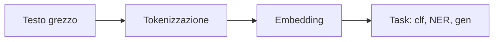
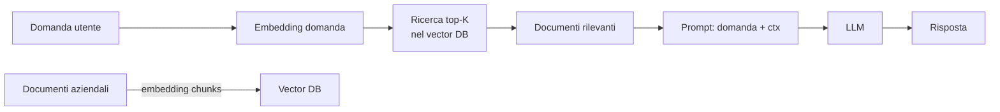

# NLP: dal text mining ai LLM

## Pipeline NLP classica → moderna



Nel 2010 facevi: TF-IDF + SVM. Nel 2018: BERT fine-tuned. Nel 2026: LLM con prompt o RAG, oppure embedding semantici + classifier piccolo.

## Tokenizzazione

Trasformare testo in **token** (parole, sub-parole, caratteri):

| Tipo | Esempio "tokenization" | Note |
|---|---|---|
| Word | ["tokenization"] | semplice, vocab grande, OOV |
| Char | ["t","o","k",...] | vocab minuscolo, sequenze lunghe |
| **BPE** (Byte Pair Encoding) | ["token","ization"] | usato in GPT |
| **WordPiece** | ["token","##ization"] | BERT |
| **SentencePiece** | unicode-aware | T5, LLama |

```python
from transformers import AutoTokenizer
tok = AutoTokenizer.from_pretrained("bert-base-multilingual-cased")
print(tok.tokenize("Tokenizzazione"))
# ['Token', '##izza', '##zione']
```

I sub-word tokenizer risolvono il problema **OOV** (out-of-vocabulary).

## Stato dell'arte 2026: cosa usare per cosa

| Task | Approccio raccomandato |
|---|---|
| Sentiment | LLM zero-shot o fine-tune small BERT |
| NER | spaCy + fine-tune transformer (XLM-RoBERTa) |
| Topic modeling | BERTopic (embedding + UMAP + HDBSCAN) |
| Text classification | embedding + logistic, oppure LLM con few-shot |
| Semantic search | sentence-transformers + vector DB |
| Q&A su documenti | RAG con LLM + vector store |
| Generation/Summarization | LLM (Claude, GPT, Llama, Mistral) |
| Translation | NLLB, M2M-100, o LLM |

## Embedding semantici

Modelli che mappano frasi → vettori dense in cui frasi simili stanno vicine. La libreria di riferimento:

```python
from sentence_transformers import SentenceTransformer
m = SentenceTransformer('paraphrase-multilingual-MiniLM-L12-v2')
emb = m.encode([
    "Il gatto dorme sul divano",
    "Un felino riposa sul sofà",
    "Il treno arriva alle 7"
])
# (3, 384) — similarità(0, 1) alta, (0, 2) bassa
```

Modelli più potenti (2024-2026): `BAAI/bge-large`, `intfloat/multilingual-e5-large`, `Alibaba-NLP/gte-large`.

## Vector database

Per cercare embedding tra milioni di documenti, serve un **vector DB**:

- **FAISS** (Meta): in-memory, super veloce. Default per progetti piccoli/medi.
- **Chroma**: facile, locale.
- **Qdrant**: open source, scalabile.
- **Pinecone, Weaviate, Milvus**: managed/cloud.
- **pgvector**: estensione Postgres se hai già Postgres.

```python
import faiss
import numpy as np
index = faiss.IndexFlatIP(384)         # inner product (= coseno se normalizzato)
index.add(emb.astype('float32'))
D, I = index.search(query_emb.astype('float32'), k=5)
```

## RAG — Retrieval Augmented Generation

Lo schema più importante del 2024-2026 per applicazioni LLM su dati propri:



Codice base (pseudocodice):

```python
chunks = chunk_documents(docs, size=500, overlap=50)
chunk_embeddings = embedder.encode(chunks)
index.add(chunk_embeddings)

def rag_query(question):
    q_emb = embedder.encode([question])
    _, idx = index.search(q_emb, k=5)
    context = "\n".join(chunks[i] for i in idx[0])
    prompt = f"Contesto:\n{context}\n\nDomanda: {question}\nRisposta:"
    return llm(prompt)
```

> Variazioni: hybrid search (combina vector + BM25 keyword), reranker (cross-encoder per riordinare top-K), query rewriting (riformula la domanda prima del retrieval).

## Prompt engineering

Per LLM, "scrivere bene" la richiesta è metà del lavoro:

### Tecniche essenziali

1. **Sii specifico**: "Riassumi questo testo in 3 punti" > "Riassumi".
2. **Esempi (few-shot)**: mostra 2-3 esempi prima.
3. **Chain-of-thought (CoT)**: "Pensa passo per passo".
4. **Output strutturato**: chiedi JSON, YAML, markdown.
5. **Ruoli**: "Sei un esperto di X. Rispondi come tale."

### Esempio few-shot

```
Classifica il sentiment:

Testo: "Adoro questo prodotto!"
Sentiment: positivo

Testo: "Non funziona affatto."
Sentiment: negativo

Testo: "{nuovo testo}"
Sentiment:
```

## LLM in produzione: due famiglie

### API commerciali

- **OpenAI** (GPT-4o, o1)
- **Anthropic** (Claude 4.X)
- **Google** (Gemini)
- **Mistral** (La Plateforme)

Pro: zero infrastruttura, prestazioni top.
Contro: costo, latenza, dipendenza, dati che lasciano il tuo perimetro.

```python
import anthropic
client = anthropic.Anthropic(api_key=...)
m = client.messages.create(
    model="claude-opus-4-7",
    max_tokens=500,
    messages=[{"role":"user","content":"Spiega cos'è il transfer learning."}]
)
print(m.content[0].text)
```

### Modelli open / locali

- **Llama 3.x / Llama 4** (Meta)
- **Mistral / Mixtral**
- **Qwen** (Alibaba)
- **Phi** (Microsoft, piccoli ma forti)
- **Gemma** (Google)

Servirli con: **vLLM**, **Ollama**, **llama.cpp**, **Text Generation Inference**.

```bash
ollama pull llama3.1:8b
ollama run llama3.1:8b
```

## Fine-tuning di LLM

Quando un LLM generico non basta:

- **Full fine-tuning**: aggiorna tutti i pesi. Costoso, raro per modelli grandi.
- **LoRA (Low-Rank Adaptation)**: aggiorna solo matrici a basso rango aggiunte. Riduce parametri trainable di 100-1000×.
- **QLoRA**: LoRA + quantizzazione a 4-bit. Permette di fine-tunare modelli da 7B su una GPU consumer.

```python
from peft import LoraConfig, get_peft_model
config = LoraConfig(
    r=8, lora_alpha=16, target_modules=["q_proj","v_proj"],
    lora_dropout=0.1, bias="none", task_type="CAUSAL_LM"
)
model = get_peft_model(base_model, config)
# ora alleni: model.print_trainable_parameters() → solo ~0.5% del totale
```

## NER (Named Entity Recognition)

Estrarre persone, luoghi, organizzazioni dai testi:

```python
import spacy
nlp = spacy.load("it_core_news_lg")
doc = nlp("Mario Rossi vive a Roma e lavora per Pirelli.")
for ent in doc.ents:
    print(ent.text, ent.label_)
# Mario Rossi PER
# Roma LOC
# Pirelli ORG
```

Per accuracy migliore: fine-tune **XLM-RoBERTa** su dati annotati con `transformers`.

## Topic modeling moderno

Vecchio approccio: LDA. Nuovo: **BERTopic** (embedding + UMAP + HDBSCAN + c-TF-IDF):

```python
from bertopic import BERTopic
docs = [...]
topic_model = BERTopic(language='italian')
topics, probs = topic_model.fit_transform(docs)
topic_model.get_topic_info()
topic_model.visualize_topics()
```

## Esercizi

<details>
<summary>Esercizio 1 — Semantic search base</summary>

```python
from sentence_transformers import SentenceTransformer
import numpy as np
m = SentenceTransformer('paraphrase-multilingual-MiniLM-L12-v2')

docs = ["Python è un linguaggio di programmazione",
        "Il caffè italiano è famoso nel mondo",
        "JavaScript gira nei browser",
        "L'espresso si beve in piedi al bar"]
emb = m.encode(docs)
emb = emb / np.linalg.norm(emb, axis=1, keepdims=True)

q = m.encode(["bevande tipiche"])
q = q / np.linalg.norm(q)
print(emb @ q.T)   # similarità
```
</details>

<details>
<summary>Esercizio 2 — RAG su PDF</summary>

Crea un RAG su un PDF (es: un manuale). Step:
1. Estrai testo (PyPDF, pdfplumber).
2. Chunka in pezzi di 500 token con overlap.
3. Embeddi con sentence-transformers.
4. Indicizza in FAISS.
5. Per ogni query: retrieve top-5 + chiama LLM.
</details>

<details>
<summary>Esercizio 3 — Zero-shot classification</summary>

```python
from transformers import pipeline
clf = pipeline('zero-shot-classification', model='facebook/bart-large-mnli')
result = clf("La banca centrale ha alzato i tassi.",
             candidate_labels=['finanza', 'sport', 'cucina'])
print(result['labels'][0], result['scores'][0])
# finanza, 0.96
```

Zero-shot = nessun fine-tuning, pronto all'uso.
</details>

<details>
<summary>Esercizio 4 — Fine-tune LoRA su un piccolo dataset</summary>

```python
# pseudo-codice, complex setup
from peft import LoraConfig, get_peft_model, TaskType
from transformers import AutoModelForCausalLM, AutoTokenizer

model_id = "microsoft/phi-3-mini-4k-instruct"
tok = AutoTokenizer.from_pretrained(model_id)
model = AutoModelForCausalLM.from_pretrained(model_id, device_map='auto')

lora = LoraConfig(r=8, lora_alpha=16, target_modules=["q_proj","v_proj"], task_type=TaskType.CAUSAL_LM)
model = get_peft_model(model, lora)
# poi: prepara dataset (instruction → output), Trainer di transformers, training loop
```
</details>

## Cosa portarti via

- 2026: LLM + retrieval coprono il 70% dei task NLP che facevi a mano nel 2018.
- Embedding semantici → search, classification, clustering.
- RAG è lo schema standard per LLM su dati propri.
- LoRA / QLoRA per fine-tuning economico.
- Per task specifici (NER, classificazione precisa), fine-tune un BERT/XLM-RoBERTa è ancora competitivo.

Prossimo: time series e forecasting.
