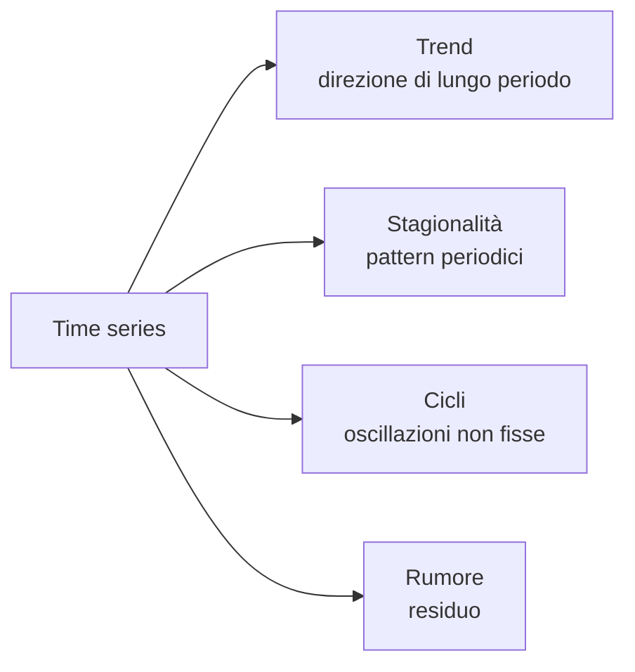
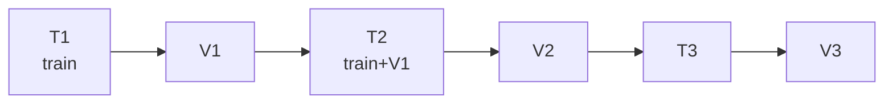

# Time series e forecasting

## Cos'è una time series

Una sequenza di osservazioni nel tempo: $y_1, y_2, \dots, y_T$. La struttura temporale rompe l'ipotesi iid → richiede tool dedicati.



## Decomposizione

$$y_t = T_t + S_t + C_t + \epsilon_t$$

Additiva (sopra) o moltiplicativa ($y_t = T_t \cdot S_t \cdot C_t \cdot \epsilon_t$, per varianza crescente).

```python
from statsmodels.tsa.seasonal import seasonal_decompose, STL
dec = STL(y, period=12).fit()
dec.plot()
```

STL è la decomposizione moderna preferita (robusta, gestisce trend non lineari).

## Stazionarietà

Una serie è **stazionaria** se media, varianza, autocovarianza non dipendono dal tempo. Quasi tutti i modelli classici (ARIMA) assumono stazionarietà.

**Test di stazionarietà**:

- **Augmented Dickey-Fuller (ADF)**: H0 = "non stazionaria". p<0.05 → stazionaria.
- **KPSS**: H0 = "stazionaria". Inverso.

Usa entrambi:

```python
from statsmodels.tsa.stattools import adfuller, kpss
print(adfuller(y)[1])      # p-value ADF
print(kpss(y)[1])           # p-value KPSS
```

**Come rendere stazionaria**:

1. **Differenziazione**: $y_t - y_{t-1}$.
2. **Differenziazione stagionale**: $y_t - y_{t-12}$ (per dati mensili annuali).
3. **Logaritmo**: stabilizza varianza moltiplicativa.

## Autocorrelazione: ACF e PACF

L'**autocorrelazione** misura quanto la serie è correlata con se stessa lag $k$ indietro:

$$r_k = \text{Corr}(y_t, y_{t-k})$$

ACF = correlazione totale. PACF = correlazione "pura" eliminando l'effetto dei lag intermedi.

```python
from statsmodels.graphics.tsaplots import plot_acf, plot_pacf
plot_acf(y, lags=40); plot_pacf(y, lags=40)
```

Interpretazione (per scegliere ARIMA):

- ACF tail-off, PACF cuts off a lag $p$ → AR($p$).
- ACF cuts off a lag $q$, PACF tail-off → MA($q$).
- Entrambe tail-off → ARMA.

## ARIMA

**ARIMA(p, d, q)** = AR(p) + differenziazione di ordine d + MA(q).

$$\phi(B)(1-B)^d y_t = \theta(B) \epsilon_t$$

dove $B$ è l'operatore shift, $\phi, \theta$ polinomi.

```python
from statsmodels.tsa.arima.model import ARIMA
m = ARIMA(y, order=(2, 1, 2)).fit()
print(m.summary())
fc = m.forecast(steps=12)
```

## SARIMAX

ARIMA + stagionalità + variabili esogene:

$$\text{SARIMAX}(p,d,q)(P,D,Q)_s$$

```python
from statsmodels.tsa.statespace.sarimax import SARIMAX
m = SARIMAX(y, order=(1,1,1), seasonal_order=(1,1,1,12), exog=X).fit()
```

> Usa `pmdarima.auto_arima(y)` per identificare automaticamente ordini.

## Prophet (Facebook, 2017)

Modello "tipo additivo" con trend + stagionalità multiple + holiday. Pensato per analisti business:

$$y(t) = g(t) + s(t) + h(t) + \epsilon$$

```python
from prophet import Prophet
df = pd.DataFrame({'ds': dates, 'y': values})
m = Prophet(yearly_seasonality=True, weekly_seasonality=True)
m.fit(df)
future = m.make_future_dataframe(periods=365)
forecast = m.predict(future)
m.plot(forecast); m.plot_components(forecast)
```

Pro: robusto, intervalli predittivi, gestisce missing e holidays.
Contro: meno preciso di modelli moderni per pattern complessi.

## Approccio moderno: gradient boosting

Spesso il **più efficace** per business forecasting: trasforma il problema in tabellare aggiungendo feature temporali.

```python
import pandas as pd
df['lag1'] = df['y'].shift(1)
df['lag7'] = df['y'].shift(7)
df['ma7'] = df['y'].rolling(7).mean().shift(1)
df['dow'] = df['ds'].dt.dayofweek
df['month'] = df['ds'].dt.month
df['is_holiday'] = ...

# allena LightGBM
import lightgbm as lgb
X = df.drop(['y','ds'], axis=1); y = df['y']
m = lgb.LGBMRegressor(n_estimators=1000, learning_rate=0.05).fit(X, y)
```

**M5 Competition** (Kaggle 2020): le soluzioni vincenti erano LightGBM con feature engineering temporale, non modelli "neural fancy".

## Modelli deep per time series

| Modello | Note |
|---|---|
| **DeepAR** (Amazon) | RNN autoregressivo, probabilistico |
| **N-BEATS** (Element AI) | Backward-forward residual blocks |
| **N-HiTS** | N-BEATS con multi-scale |
| **Temporal Fusion Transformer (TFT)** | Transformer + interpretabilità |
| **PatchTST** | Patch-based Transformer (come ViT) |
| **TimesFM, Chronos, Moirai** | Foundation models pre-allenati su miliardi di serie |

```python
from neuralforecast import NeuralForecast
from neuralforecast.models import NBEATS, NHITS, TFT
nf = NeuralForecast(models=[NBEATS(input_size=24, h=12)], freq='M')
nf.fit(df)
preds = nf.predict()
```

## Cross-validation temporale

Mai random K-fold. Usa:

- **Forward chaining** (expanding window).
- **Sliding window** (rolling).

```python
from sklearn.model_selection import TimeSeriesSplit
tscv = TimeSeriesSplit(n_splits=5, gap=7)
```



## Metriche per forecasting

- **MAE** / **RMSE**: scala-dipendenti, su una serie OK.
- **MAPE**: percentuale, ma esplode con $y$ vicino a 0.
- **sMAPE**: variante simmetrica.
- **MASE** (Mean Absolute Scaled Error): scala-indipendente, confrontabile tra serie.

```python
def mase(y_true, y_pred, y_train, period=1):
    naive = np.mean(np.abs(np.diff(y_train, period)))
    return np.mean(np.abs(y_true - y_pred)) / naive
```

## Baseline da non sottovalutare

- **Naive**: $\hat{y}_{t+1} = y_t$.
- **Seasonal naive**: $\hat{y}_{t+1} = y_{t+1-s}$.
- **Moving average**: media degli ultimi $k$.
- **Exponential smoothing (Holt-Winters)**: trend + stagionalità con decay.

Spesso i baseline battono modelli complessi.

```python
from statsmodels.tsa.holtwinters import ExponentialSmoothing
m = ExponentialSmoothing(y, trend='add', seasonal='add', seasonal_periods=12).fit()
```

## Intervalli predittivi

Una previsione puntuale è quasi sempre **insufficiente**. Vuoi un intervallo:

- ARIMA / Prophet: forniscono naturalmente.
- Gradient boosting: usa **quantile regression** (LightGBM `objective='quantile'`).
- Deep models: Monte Carlo dropout, ensemble, output probabilistico.

## Esercizi

<details>
<summary>Esercizio 1 — Decomposizione</summary>

```python
import pandas as pd
import seaborn as sns
from statsmodels.tsa.seasonal import STL
df = sns.load_dataset('flights')
y = df.set_index('year')['passengers']     # ahimè annuale, prova con freq mensile reale
# meglio: scarica AirPassengers
```
</details>

<details>
<summary>Esercizio 2 — ARIMA vs Prophet vs LightGBM</summary>

Su una serie giornaliera di traffico web di un anno:

1. Suddividi in train/test (ultimo mese = test).
2. Fitta ARIMA(auto), Prophet, LightGBM con lag features.
3. Confronta MAE, MAPE.

Tipicamente: LightGBM > Prophet > ARIMA per pattern complessi. ARIMA può vincere su serie molto regolari.
</details>

<details>
<summary>Esercizio 3 — Quantile forecasting</summary>

```python
import lightgbm as lgb
# allena 3 modelli per quantili 0.1, 0.5, 0.9
preds = {}
for q in [0.1, 0.5, 0.9]:
    m = lgb.LGBMRegressor(objective='quantile', alpha=q, n_estimators=500)
    m.fit(X_tr, y_tr)
    preds[q] = m.predict(X_te)

# plot intervals
import matplotlib.pyplot as plt
plt.plot(y_te.index, y_te, label='actual')
plt.plot(y_te.index, preds[0.5], label='median')
plt.fill_between(y_te.index, preds[0.1], preds[0.9], alpha=0.3, label='80% band')
plt.legend()
```
</details>

## Cosa portarti via

- Stazionarietà è il primo check (ADF + KPSS).
- ACF/PACF guidano la scelta di ARIMA.
- Gradient boosting + feature temporali batte spesso ARIMA in problemi business.
- Prophet è un buon compromesso semplicità/qualità per analisti.
- TimeSeriesSplit per CV, mai random K-fold.
- Intervalli predittivi > previsione puntuale.
- Foundation models 2024+ (Chronos, TimesFM) — guardali ma non sono ancora silver bullet.

Prossimo: MLOps — deployment, monitoring, drift.
