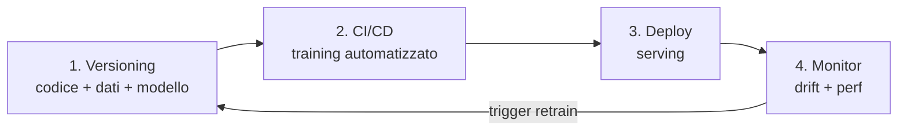
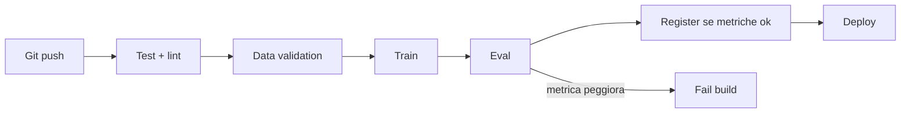
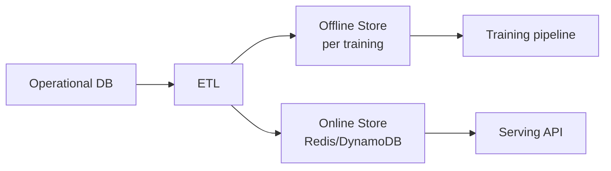

# MLOps: deployment, monitoring, drift

## Cosa cambia in produzione

Un modello in Jupyter è un esperimento. In produzione:

- Deve essere **chiamato** da altri sistemi (API).
- Deve essere **riproducibile** (chi sa quale versione gira?).
- Deve essere **monitorato** (le predizioni stanno ancora andando bene?).
- Deve essere **aggiornabile** (retraining, rollback).
- Deve **scalare** (1 request o 10000/sec).

Il 90% dei modelli "data science" non arriva mai in produzione. Quelli che ci arrivano spesso senza framework solido.

## Le 4 fasi MLOps



## 1. Versioning

### Codice

Git. Niente di nuovo. Ogni modello = un commit hash.

### Dati

I dati sono troppo grossi per git. Soluzioni:

- **DVC** (Data Version Control): metadati in git, dati in storage (S3/GCS).
- **LakeFS**: git-like per object storage.
- **MLflow** ha versioning dei dataset.

```bash
dvc init
dvc add data/raw/transactions.csv
git add data/raw/transactions.csv.dvc .gitignore
git commit -m "track raw data v1"
dvc push    # carica sullo storage
```

### Modelli

- **MLflow Model Registry**: versioni, stage (Staging, Production, Archived).
- **Weights & Biases (W&B)**: tracking experiment + registry.
- **Neptune.ai, ClearML**: alternative.

```python
import mlflow
mlflow.set_experiment("churn_model")
with mlflow.start_run():
    mlflow.log_params({'C': 0.5, 'penalty': 'l2'})
    mlflow.log_metric('auc', 0.83)
    mlflow.sklearn.log_model(model, "model")
```

## 2. CI/CD per ML

Una pipeline ML è:



Strumenti:
- **GitHub Actions / GitLab CI** per orchestrazione.
- **Kubeflow / Argo / Airflow** per pipeline complesse.
- **DAG-orchestrated training** in produzione (es: dbt + Airflow).

## 3. Deploy: servire un modello

### Caso 1 — Batch prediction

Esegui il modello ogni notte/ora su un batch di righe, salva risultati in DB. Usato per: scoring customer base, recommender refresh.

```python
# script Python schedulato (Airflow / cron)
model = joblib.load("model.pkl")
preds = model.predict(load_customers())
save_to_db(preds)
```

Semplice e robusto. **Quando puoi, batch**.

### Caso 2 — Online / API

Real-time: ricevi una richiesta, predici al volo, rispondi.

```python
# server FastAPI
from fastapi import FastAPI
from pydantic import BaseModel
import joblib

app = FastAPI()
model = joblib.load("model.pkl")

class Request(BaseModel):
    age: int
    income: float
    n_orders: int

@app.post("/predict")
def predict(req: Request):
    X = [[req.age, req.income, req.n_orders]]
    proba = model.predict_proba(X)[0, 1]
    return {"probability": float(proba)}
```

Run: `uvicorn main:app --host 0.0.0.0 --port 8000`.

### Containerizzazione

Docker per riproducibilità:

```dockerfile
FROM python:3.11-slim
WORKDIR /app
COPY requirements.txt .
RUN pip install --no-cache-dir -r requirements.txt
COPY . .
CMD ["uvicorn", "main:app", "--host", "0.0.0.0", "--port", "8000"]
```

### Orchestrazione

Per produzioni serie: **Kubernetes** + Helm chart, oppure servizi managed:

- **AWS SageMaker / GCP Vertex AI / Azure ML**: training + serving + monitoring.
- **Modal, Replicate, BentoML**: serverless per ML.
- **TorchServe, Triton**: serving ottimizzato per NN.

## 4. Monitoring

Il pezzo più trascurato. Tre cose da monitorare:

### Performance del modello

L'AUC scende? Le richieste falliscono? Latency esplode? Logging + Prometheus + Grafana.

### Data drift

Le distribuzioni delle feature di input sono cambiate rispetto a quelle di training?

- **Drift univariata**: PSI (Population Stability Index), KS test.
- **Drift multivariata**: classifier-based (alleno un modello che distingue train da prod).

```python
from evidently.report import Report
from evidently.metric_preset import DataDriftPreset
report = Report(metrics=[DataDriftPreset()])
report.run(reference_data=train_df, current_data=prod_df)
report.show()
```

### Concept drift

Anche se le feature non cambiano, la **relazione** feature→target può cambiare. Es: prima del COVID, "tempo passato online" predice un certo comportamento; dopo, no.

Rilevazione: monitora metriche **online** (richiede label, anche differita).

## Feature store

Per modelli complessi, si centralizzano le feature in un **feature store**: definizione unificata, online (low-latency) + offline (batch), garantisce **train-serve consistency**.

Strumenti: **Feast** (open), **Tecton, Hopsworks** (managed).

Pattern:


## A/B testing e shadow deployment

Quando aggiorni un modello, **non** lo metti subito al 100% del traffico:

- **Shadow mode**: il nuovo modello riceve traffico ma le predizioni NON vengono usate, solo loggate. Confronto offline.
- **A/B test**: 10% traffico al nuovo modello, 90% al vecchio. Confronta metriche business.
- **Canary**: 1% iniziale, scala se OK.
- **Bandit**: alloca dinamicamente in base alle performance.

## Riproducibilità

Per ricostruire un modello esatto:

- **Codice**: git commit.
- **Dipendenze**: requirements freezed / poetry.lock.
- **Dati**: DVC commit hash.
- **Random seed**: fissato (NumPy, torch).
- **Hardware**: anche le GPU possono produrre differenze tra A100 e V100.

```python
import random, numpy as np, torch
def seed_all(s=42):
    random.seed(s); np.random.seed(s); torch.manual_seed(s)
    torch.cuda.manual_seed_all(s)
    torch.backends.cudnn.deterministic = True
```

## Linee guida

1. **Inizia con batch**, passa a online solo se serve.
2. **Logga predizioni e input** sempre (privacy compatibili).
3. **Versiona modelli e dati** dal giorno 1.
4. **Monitora drift** prima che gli SLA degradino.
5. **Riproducibilità > perfezione**: meglio un modello mediocre riproducibile di uno super preciso che hai perso.

## Esercizi

<details>
<summary>Esercizio 1 — FastAPI + Docker</summary>

1. Allena un modello sklearn semplice (es: iris classifier).
2. Salva con joblib.
3. Crea un'API FastAPI con endpoint `/predict`.
4. Containerizza con Docker.
5. Run: `docker run -p 8000:8000 my-model`.
6. Chiama: `curl -X POST http://localhost:8000/predict -d '{"sepal_length":5.1,...}'`.
</details>

<details>
<summary>Esercizio 2 — MLflow tracking</summary>

```python
import mlflow
from sklearn.ensemble import RandomForestClassifier
from sklearn.metrics import roc_auc_score

mlflow.set_experiment("rf_tuning")
for n in [50, 100, 300, 500]:
    with mlflow.start_run():
        m = RandomForestClassifier(n_estimators=n).fit(X_tr, y_tr)
        auc = roc_auc_score(y_val, m.predict_proba(X_val)[:, 1])
        mlflow.log_param("n_estimators", n)
        mlflow.log_metric("auc", auc)
        mlflow.sklearn.log_model(m, "model")
```

Apri `mlflow ui` → vedi tutti gli esperimenti.
</details>

<details>
<summary>Esercizio 3 — Drift detection con Evidently</summary>

```python
import pandas as pd
from evidently.report import Report
from evidently.metric_preset import DataDriftPreset, RegressionPreset
reference = train_df
current = prod_df
report = Report(metrics=[DataDriftPreset()])
report.run(reference_data=reference, current_data=current)
report.save_html("drift.html")
```

Apri l'HTML: per ogni feature, vedi p-value del test di drift.
</details>

## Cosa portarti via

- Batch > online quando possibile.
- Versiona codice + dati + modelli.
- Monitora data drift + model drift continuamente.
- Shadow + A/B test per aggiornamenti.
- MLflow / W&B per tracking, FastAPI + Docker per servire, Evidently per drift.

Prossimo: bayesian methods e causal inference.
